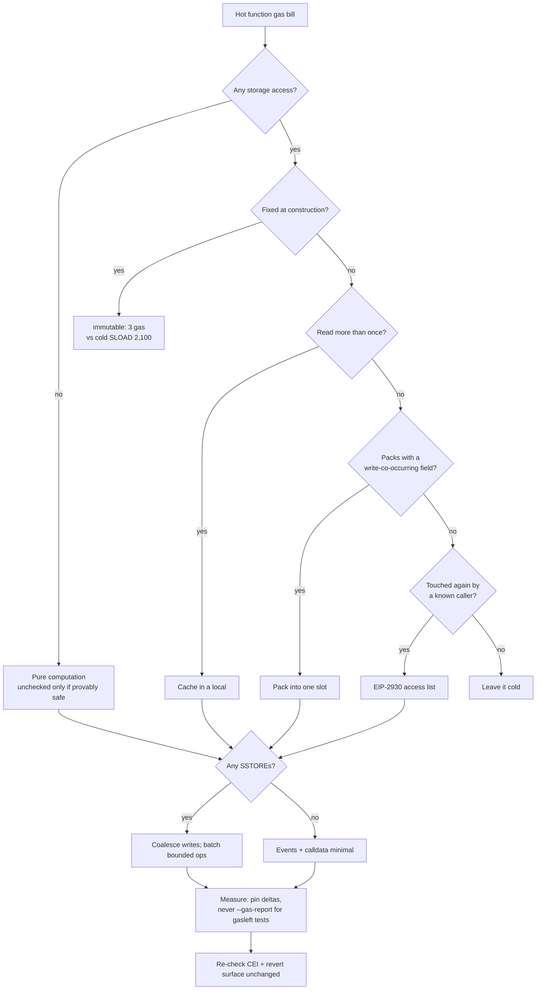

# 8. Gas Optimization Patterns

## Learning Objectives

By the end of this chapter you will be able to:

1. Apply the optimization hierarchy — **remove** a state access before **cheapening** it — and justify every pattern with before/after gas numbers from the published EIP-2929/EIP-3529/EIP-3860 schedule.
2. Decide when an **`immutable`** replaces a storage read and compute its breakeven in reads against the one-time code-deposit cost.
3. Cache storage reads correctly (local variables, never `SLOAD` inside a loop) without creating **stale-cache** state — the difference between an optimization and a vulnerability.
4. Use the Ch 6/7 vocabulary quantitatively: packing (4× on cold touches), EIP-2930 access lists (net-of-cost), calldata discipline, custom errors, `unchecked` where provably safe.
5. Coalesce and batch writes so N warm `SSTORE`s become fewer — and never structure logic to "earn" refunds (EIP-3529 cap `gas_used/5`).
6. Read a production hot path (Solmate's ERC20, Uniswap V3's `Pool.sol`, Aave V3's accrual cache) and *count* where the gas goes — the skill Ch 20's `MeridianVault` and Ch 13's `forge snapshot` gate demand.

## Prerequisites

- **Chapter 6** (Storage Layout & Packing) — slot packing, derived slots, "dynamic arrays and mappings never pack"; the layout model every pack-before-you-optimize argument builds on.
- **Chapter 7** (Gas Mechanics) — the EIP-2929 cold/warm ladder (2,100/100, 2,600/100), the SSTORE state machine (20,000/22,100 set, 2,900/5,000 reset/clear, 4,800 refund capped at `gas_used/5`), EIP-2930 access-list pricing (2,400/address + 1,900/key). This chapter is Ch 7 *applied*.

Supporting references (not prerequisites): **Ch 2** (custom errors), **Ch 3** (calldata vs memory), **Ch 4** (`unchecked`). All their locked conventions remain in force.

## Theory

### The hierarchy: remove, then cheapen, then measure

**Gas is dominated by state access — cold `SLOAD`/`SSTORE` surcharges and the intrinsic/calldata floor — so the best optimization is the one that never touches state at all.** The order of attack:

1. **Remove** the access. A construction-fixed value read as `immutable` is not a cheaper storage read — it is *no* storage read.
2. **Cheapen** what remains. Pack a `uint64[4]` group into one slot; list a slot in an EIP-2930 access list so a cold touch is warm; read calldata instead of copying it to memory.
3. **Measure.** Never ship a "savings" without a baseline and a delta (locked Ch 1/2/7): loop-amplified `gasleft()` min-deltas, **never** `--gas-report` for `gasleft()`-based tests, deltas-not-absolutes.

Reference table (published schedule; deltas lab-pinned via `GasOptProbeTest`):

| Meter | Cold | Warm |
|---|---|---|
| `SLOAD` | 2,100 | 100 |
| Account `CALL`/`BALANCE` | 2,600 | 100 |
| `SSTORE` set (`0 → nonzero`) | 22,100 | 20,000 |
| `SSTORE` reset/clear | 5,000 | 2,900 |
| Clear refund | +4,800, capped at `gas_used/5` | same |
| `PUSH32` (an `immutable`) | 3 | 3 |
| Access list | 2,400/address + 1,900/key | — |

**Scoping rule for everything below:** warm/cold is a per-transaction property of the *slot itself*, not of the call site or loop iteration — only the first touch of a given slot in a transaction is cold (2,100); every later touch of that *same* slot is warm (100), loop or no loop, list or no list. Patterns 3 and 6 below both follow from this rule; check every example against it.

### Pattern 1 — Immutables over storage

A construction-fixed value — an oracle address, an underlying token — belongs in an **`immutable`**, not storage (locked since Ch 2). The compiler inlines it as a `PUSH32`: reading costs **3 gas, no state-trie touch** vs storage's 2,100 cold / 100 warm.

- **Before/after:** cold **2,100 → 3** (−2,097); warm **100 → 3** (−97).
- **One-time cost:** the inlined 32 bytes are runtime code at **200 gas/byte code deposit (`G_codedeposit`, Yellow Paper — EIP-170 only adds the 24,576-byte size cap)** = **6,400 gas**; **breakeven ≈ 4 cold reads** (`6,400 / 2,097 ≈ 3.05`).
- **Nuance:** all-warm reads would need ~66 to break even — immutables are a *cross-transaction* bet. A market's `ORACLE`/`UNDERLYING` are read in a different transaction than the deploy, so every borrow call pays cold: 2,097 pure profit, and two fewer access-list keys.

### Pattern 2 — Packing (Ch 6 recap, in gas)

Four `uint64`s declared consecutively occupy **one** slot; interleaved with `uint256`s, **four**.

- **Before/after:** cold read **8,400 → 2,100** (−6,300); fresh write **88,400 → 22,100** (−66,300); warm update **11,600 → 2,900** (−8,700) (4 × warm `SSTORE` reset 2,900 → 1).

Caveat: packing couples fields — writing one member dirties the whole slot (2,900) and can forfeit a 4,800 clear refund on a sibling. Rule: **pack fields that change together, segregate fields that change apart.**

### Pattern 3 — Cache reads; never `SLOAD` in a loop

The accessed-set makes the second read of a slot in a transaction warm (100), but the compiler will not turn a storage read into a memory read across an external call. Caching is yours:

- **Before/after:** three reads of the same slot (first cold, rest warm) → 2,100 + 2 × 100 = **2,300**; one `SLOAD` + locals → **~2,106** (−194). The gap compounds with loop iterations — that is where the pattern earns its keep.

The loop form is the audit find. A loop reading a storage flag each iteration:

```solidity
// Before: n iterations × warm SLOAD = 100n (cold-slot worst case: 2,100 + 100(n-1))
for (uint256 i; i < n; ++i) if (flagsEnabled[i]) ...

// After: 1 SLOAD + n local reads ≈ 2,100 + 3n
bool enabled = flagsEnabled;
for (uint256 i; i < n; ++i) if (enabled) ...
```

- **Before/after (50 iters):** warm **5,000 → 2,250** (−2,750); cold **7,000 → 2,250** (−4,750) (first touch 2,100, then 49 × 100 warm). The Ch 1 bounded-loop convention stays in force — this optimizes the body, not the bound.

### Pattern 4 — Calldata discipline (Ch 3 recap)

`external` functions with read-only dynamic args take `calldata`, never `memory`: the decoder reads calldata in place; a `memory` parameter copies it. Ch 3 measured the copy at **+559 gas** on a 64-word sum (17,619 vs 18,178).

### Pattern 5 — Custom errors over `require` strings (Ch 2 recap)

`require(x, "Not authorized")` reverts with `Error(string)`: selector `0x08c379a0` (4) + offset (32) + length (32) + padded data (32) = **100 bytes** ≈ **~13 gas** at the reverting frame, plus **52 gas** code deposit for the literal. A custom `error NotAuthorized(address caller)` reverts with selector + one 32-byte param = **36 bytes** ≈ **~6 gas**. Bubbling through a caller's wrapper, the calldata difference costs **~1,024 gas** at 16 gas/byte. Small per-revert — the typed payload is the real reason the convention exists.

### Pattern 6 — EIP-2930 access lists (Ch 7 recap, net-of-cost)

Recap: a slot read once is +100 gas net; written once, +200 (single touch). There is **no repeat-touch bonus** — a second touch of the same key is warm (100) whether or not it is listed, so the list's only job is converting the *first* touch from cold. The curated Meridian borrow list (3 addresses; 15 keys: oracle 4, ERC20 reads 3, ERC20 writes 2, vault reads 6) nets **~2,000 gas** over the no-list path — the decisive property being *determinism*, not the gas.

### Pattern 7 — Batch amortization

Cold surcharges and the 21,000 intrinsic are paid *per transaction*; folding N operations into one pays them once and repeats everything warm. For 10 ERC20 `transfer`s:

- **Before/after:** 10 txs ≈ 10 × (21,000 + 2,600 + 2×2,100 + 2×22,100 + event) ≈ **~735,000**; one batch ≈ 73,500 + 9 × (2×100 + 2×2,900) ≈ **~127,500**. Saving **~607,500 (~83%)**.

The hard constraint: the batch must be **bounded** (Ch 1) — one that loops until the block gas limit is the 2016 DoS all over again.

### Pattern 8 — Write coalescing

Warm `SSTORE` = 2,900. Coalescing computes in memory and writes once per slot: a borrow updating `debt`, `utilization`, `lastUpdated` in separate steps pays 3 × 2,900 = **8,700**; the CEI-clean flow folding `lastUpdated` into the accrual write pays **5,800** (−2,900 per op) — the difference between an L1-viable borrow and one needing an L2 (Ch 29–31).

### Pattern 9 — `unchecked` where provably safe (Ch 4 recap)

Ch 4 measured checked vs unchecked at **17,582 vs 13,506** for a 64-element sum — **~63 gas per element**. The pattern: where surrounding invariants *prove* no overflow — `x + 1` inside `x < max − 1` branches, loop counters bounded by a length — the check is dead weight. Where the proof is not airtight, the check is the *security* (Security Analysis).

### What the optimizer does (and does not)

`solc` with `optimizer_runs = 200` (repo-locked) inlines, CSEs, and constant-folds — it does **not** reorder storage, turn storage reads into memory reads across external calls, or remove your unnecessary writes. Higher runs shrink runtime gas at the cost of deploy gas and code size (EIP-170 cap). Optimize the *source*, not the flag.

## Mathematical Foundations

### The total-cost model

```
C_tx = C_intrinsic + Σ_opcode + Σ_cold_surcharge + C_calldata − R(SSTORE clears)
```

with `C_intrinsic = 21,000 + 4·zero_bytes + 16·nonzero_bytes` (floor `21,000 + 10·len` post-EIP-7623), `Σ_cold_surcharge = 2,600·(new addresses) + 2,100·(new slots) + 2,100·(first-write slots)`, and `R` capped at `gas_used/5`. Each pattern attacks one term: immutables delete `2,100` per address-slot; packing divides the surcharge by 4; access lists move it into the list's fixed 1,900/key; batching divides `C_intrinsic` + surcharges by N; coalescing shrinks the `SSTORE` count.

### Immutable breakeven, solved

For `r` separate-transaction reads: immutable ≈ `6,400 + 3r`; storage ≈ `2,100r`. Breakeven: `6,400 + 3r = 2,100r → r ≈ 3.05`. **Any value read ≥ 4 times across transactions pays for its inlining.** If all reads are warm, breakeven jumps to `6,400/97 ≈ 66`.

### Access-list arithmetic, net of cost

For `A` addresses, `K_r` read-only keys, and `K_w` written keys (`K = K_r + K_w`): list cost = `2,400A + 1,900K`; gross cold-surcharge eliminated = `2,500A + 2,000K_r + 2,100K_w` (each touched key still pays its warm 100, so the surcharge removed is the cold part only); net = `100A + 100K_r + 200K_w`. Reads pay +100 for determinism; writes pay +200 because the `SSTORE` cold surcharge (2,100) is the larger prey. A slot touched `m` times nets the same +100/+200 — touches after the first are warm with or without the list, so there is no repeat-touch term.

### Batch amortization, generalized

Separate ≈ `N·(C_intrinsic + Σ_cold)`; batch ≈ `C_intrinsic + Σ_cold + (N−1)·Σ_warm`. Saving ratio → `1 − Σ_warm/Σ_cold` as N grows — ~83% for a transfer whose cold bill dwarfs its warm bill. The model assumes the batch is bounded and fits in one block.

## Engineering Perspective

### Optimize the hot path, measure everything

Meridian has exactly one hot path — borrow/repay (Production Example below) — plus warm paths (liquidations, claims). **Gas optimization is budget work for the hot path only.** A read path a user visits once a month is not worth an assembly dance; an oracle read every user pays on every borrow is. Discipline (Ch 7): know the cold touches per hot path, list the repeats, write the writes, pin deltas on a forge host.

### Optimization is a security review in disguise

Every pattern deletes a safety property unless checked twice: `unchecked` deletes an overflow check, caching deletes a re-read, batching deletes per-operation atomicity. Working rule, locked here: **an optimization must not change the function's CEI order, revert surface, or per-call state reads.** The 2026 threat landscape (bridge failures, compromised admin/multisig, social engineering of privileged operators) sharpens this: an "optimization" that adds a privileged rescue path, or caches a value so an admin can no longer correct it, is the shape of the 2026 losses — gas saved never justifies widening the trust surface.

### When NOT to optimize

- **Read paths** that are stateless and rare — a getter's 2,100 cold read is the whole bill and it is fine.
- **Non-hot protocol ops** — governance parameter sets, oracle feed updates: separate transaction, room to spare; clarity beats 3,000 gas.
- **Anything that trades a check** (above).
- **Before a baseline exists.** No delta, no change — the Ch 2/7 methodology, promoted to engineering policy.

## Mermaid Diagram



## Code Walkthrough

Meridian's lab is `GasOptProbe.sol` — pedagogical, **NOT** protocol (standing convention). It exposes the four phenomena worth *seeing* in code: immutable vs storage reads, cached vs repeated `SLOAD`, the in-loop `SLOAD` trap, and `unchecked` arithmetic:

```solidity
// SPDX-License-Identifier: MIT
pragma solidity ^0.8.24;

/// @title GasOptProbe
/// @notice Lab contract for gas optimization patterns: immutables, cached
///         storage reads, no-SLOAD-in-loop, unchecked arithmetic.
/// @dev Pedagogical only — NOT part of the Meridian protocol.
contract GasOptProbe {
    address public immutable ORACLE;   // 3 gas/read, never a storage read
    address public oracleStorage;      // the "before": cold SLOAD 2,100

    uint256 public lastUpdate;         // storage scalar, read via cache below
    uint256 public counter;            // write target for coalescing demo
    mapping(uint256 => bool) public flagEnabled;

    /// @notice Constructor fixes the immutable; `oracleStorage` is the slow twin.
    constructor(address oracle) {
        ORACLE = oracle;
        oracleStorage = oracle;
    }

    /// @notice Read the immutable — a PUSH32, ~3 gas, no state trie touch.
    function readImmutable() external view returns (address) { return ORACLE; }

    /// @notice Read the storage twin — cold 2,100 on a fresh account.
    function readStorageOracle() external view returns (address) {
        return oracleStorage;
    }

    /// @notice Cache a storage scalar: 1 SLOAD + local reads, never N SLOADs.
    function cachedReads(uint256 n) external view returns (uint256 acc) {
        uint256 lu = lastUpdate;                // 1 SLOAD
        for (uint256 i; i < n; ++i) acc += lu;  // local reads, ~3 gas each
    }

    /// @notice The anti-pattern: SLOAD inside the loop, one per iteration.
    function sloadInLoop(uint256 n) external view returns (uint256 acc) {
        for (uint256 i; i < n; ++i) acc += lastUpdate;  // 1 SLOAD per iter
    }

    /// @notice Coalesced write: one SLOAD, one SSTORE.
    function coalescedWrite(uint256 newVal) external {
        uint256 prev = counter;                 // 1 SLOAD
        counter = prev + newVal;                // 1 SSTORE
    }

    /// @notice unchecked, safe because the sum of 0..n-1 overflows only beyond
    ///         n ~ 2^255 — the proof sits next to the unchecked (Ch 4 lock).
    function uncheckedSum(uint256 n) external pure returns (uint256 acc) {
        unchecked { for (uint256 i; i < n; ++i) acc += i; }
    }
}
```

Three details. First, `readImmutable` vs `readStorageOracle` are the same logical operation — one compiles to a `PUSH32`, the other to an `SLOAD`; the test pins the delta. Second, `cachedReads` and `sloadInLoop` are *observationally identical* but differ by one `SLOAD` per iteration — the loop trap every audit scans for. Third, `uncheckedSum` is correct only because the sum of `0..n−1` overflows beyond `n ≈ 2^255` — the safety proof must live next to the `unchecked`, in the `@dev`.

## Production Example

**The Meridian borrow path, optimized** (the vault lands in Ch 20; this is the budget Ch 7's `docs/gas-budget.md` set and Ch 13's `forge snapshot` will enforce). A first borrow by a fresh account — the coldest possible case — with every pattern above applied. Numbers **derived from the published EIP-2929/EIP-3529 schedule**; the access-list row follows Ch 7's net-of-cost framing.

| Line | Naive (cold) | Optimized | Saved | Pattern |
|---|---|---|---|---|
| Intrinsic gas | 21,000 | 21,000 | 0 | — |
| Address reads (oracle, token) | 2 × 2,100 = 4,200 | 2 × 3 = 6 | 4,194 | `immutable` |
| Calls (vault, oracle, token) | 3 × 2,600 = 7,800 | 3 × 100 = 300 | 7,500 | access list |
| Oracle reads (4 slots) | 4 × 2,100 = 8,400 | 4 × 100 = 400 | 8,000 | access list |
| ERC20 reads (allowance, 2 balances) | 3 × 2,100 = 6,300 | 3 × 100 = 300 | 6,000 | access list |
| ERC20 writes (allowance, balance) | 2 × 22,100 = 44,200 | 2 × 20,000 = 40,000 | 4,200 | access list |
| Vault reads (6 slots) | 6 × 2,100 = 12,600 | 6 × 100 = 600 | 12,000 | access list + packing |
| Writes (vault + accrual, 6 → 4) | 6 × 2,900 = 17,400 | 4 × 2,900 = 11,600 | 5,800 | write coalescing |
| Events + calldata + checks | ~3,000 | ~3,000 | 0 | — |
| **Subtotal** | **~124,900** | **~77,200** | **~47,700** | |
| Access-list cost (3 addr + 15 keys: 4 oracle + 3 ERC20 read + 2 ERC20 write + 6 vault; vault packing per Ch 6 not assumed) | — | 3×2,400 + 15×1,900 = 35,700 | — | — |
| **Net total** | **~124,900** | **~112,900** | **~12,000 (~9.6%)** | |

Two properties matter more than the 9.6%. **Determinism:** with the list, the borrow costs the same whether the user traded recently or not — estimation for ERC-4337 bundlers (Ch 33) and wallets becomes a constant. **Pattern mix:** immutables and write-coalescing (~10,000 gas) are *pure* wins with no list cost; the access list's ~2,000 net is the determinism purchase. The *deltas* are the durable numbers; absolutes can be re-measured with `forge snapshot` (Ch 13).

## Foundry Lab

`meridian/test/GasOptProbe.t.sol` — unit + fuzz coverage for the four phenomena, each pinning a delta with the Ch 2 methodology (loop-amplified `gasleft()` min-deltas; **never** `--gas-report`):

```solidity
// SPDX-License-Identifier: MIT
pragma solidity ^0.8.24;

import {Test} from "forge-std/Test.sol";
import {GasOptProbe} from "../src/GasOptProbe.sol";

contract GasOptProbeTest is Test {
    GasOptProbe internal probe;

    function setUp() public { probe = new GasOptProbe(address(0x1234)); }

    /// @dev Immutable read must be meaningfully cheaper than the storage twin.
    function testImmutableCheaperThanStorage() public {
        uint256 g0 = gasleft();
        probe.readImmutable();
        uint256 imm = g0 - gasleft();

        uint256 g1 = gasleft();
        probe.readStorageOracle();
        uint256 sto = g1 - gasleft();

        assertGt(sto, imm + 1500); // the ~2,097 cold delta dominates overhead
    }

    /// @dev Cached reads must beat SLOAD-in-loop for any n >= 2.
    function testCacheBeatsSloadInLoop(uint256 n) public {
        n = bound(n, 2, 50);
        uint256 g0 = gasleft();
        probe.cachedReads(n);
        uint256 cached = g0 - gasleft();

        uint256 g1 = gasleft();
        probe.sloadInLoop(n);
        uint256 sload = g1 - gasleft();

        assertGt(sload, cached); // grows with n: ~97 gas per iteration
    }

    /// @dev unchecked sum is a pure function of n; fuzz checks the result.
    function testUncheckedSum(uint256 n) public view {
        n = bound(n, 0, 1000);
        uint256 acc = probe.uncheckedSum(n);
        assertEq(acc, n * (n - 1) / 2);
    }
}
```

Gas numbers are **derived from the published EIP-2929/EIP-3529/EIP-3860 schedule**; the tests pin *deltas*, which survive compiler drift — green on forge 1.7.1 (`GasOptProbeTest`).

## Security Analysis

### `unchecked` where the proof leaks — the batchOverflow lineage

The 2018 `batchOverflow` incidents (BeautyChain BEC, SmartMesh SMT — the motivation Ch 2/4 locked for checked math) were exactly this: a "gas optimization" (batching without overflow checks) that made balances wrap. The audit question is not "is the block small?" but "can any input reach an arithmetic boundary *inside* it?" — and the proof must live in the `@dev`, adjacent to the code.

### The stale-cache bug class

Caching a value in a local is only safe if no call between the read and the use can change it. The failure mode is an **optimistic cache**: cache an oracle price, make an external call, act on the cached price as if fresh — a manipulation vector in lending, and the same shape as the uninitialized-storage class Ch 6 named after Nomad (Aug 2022, ~$190M). Rule: **cache only what is provably unchanged; re-read anything an external call can invalidate.**

### Refund farming — EIP-3529

Restructuring to "earn" the 4,800 clear refund is a logic bug disguised as a pattern. The cap (`gas_used/5`) means the refund never fully lands in small transactions, is invisible to `gasleft()`, and is the security parameter that killed the gas-token era (GasToken.io, CHI — Ch 7). Reaffirmed: **no logic depends on refunds.**

### Gas-bomb loops — the 2016 DoS lineage

Batching and loop caching optimize the *body* of a loop; they must never turn its *bound* attacker-controlled and unbounded. The 2016 Shanghai/state-bloat DoS lineage (EIP-150, EIP-158/161) is the standing proof that a "batch everything" instinct is the same instinct that stalled the network for two weeks. Bounded loops (Ch 1) are a gas-safety convention before an optimization.

### 2026 grounding: optimization must not widen the trust surface

The ledger's grounding — bridge failures, compromised admin/multisig, social engineering of privileged operators — changes what counts as an acceptable optimization. A "gas rescue function" that skips a check, or a cache that makes a corrective write ineffective, is the 2026 loss shape (Kelp DAO/LayerZero and Drift Protocol admin-key incidents, ~$285–292M, Apr 2026). Optimization happens *inside* the existing trust boundaries, never by widening them.

## Common Mistakes

1. **Optimizing before measuring.** No baseline, no delta — Ch 2/7 methodology is policy.
2. **`unchecked` without an adjacent proof.** The overflow-reachability argument must be written next to the block.
3. **Caching across an external call.** A cached price/flag/balance used after a call that can change it is a stale-cache vulnerability.
4. **Restructuring logic to farm refunds.** Capped, invisible to `gasleft()`, schedule-fragile — never part of the model.
5. **Unbounded batch loops.** Batching 10 transfers is an optimization; looping to the block gas limit is a 2016 DoS.
6. **`immutable` for something that changes.** An upgradeable market's oracle address is *not* construction-fixed — an `immutable` there bricks the upgrade (Ch 38's proxy reads it from storage/namespace, by design).
7. **Over-packing coupled fields.** Fields that change at different rates in one slot dirty both on every update — pack by write-co-occurrence (Ch 6).
8. **Hand-rolled selector strings / `abi.encodePacked` shortcuts** (Ch 3 lock): a "gas optimization" that breaks refactor-safety is a correctness bug.
9. **`--gas-report` on `gasleft()`-based tests.** It distorts the measurement it is supposed to take.

## Gas Optimization

The consolidated playbook — all numbers **derived from the published EIP-2929/EIP-3529/EIP-3860 schedule**; deltas pinned by `GasOptProbeTest`.

| Pattern | Before | After | Delta | Rule of thumb |
|---|---|---|---|---|
| `immutable` vs storage read | 2,100 cold / 100 warm | 3 | −2,097 / −97 | construction-fixed, read-often; breakeven ~4 cold reads |
| Packing 4× `uint64` | 8,400 read / 88,400 write / 11,600 update | 2,100 / 22,100 / 2,900 | −6,300 / −66,300 / −8,700 | pack fields that change together |
| Cache a slot read 3× | 2,300 | ~2,106 | −194 | read once into a local, reuse (compounds in loops) |
| No `SLOAD` in loop (50 iters, warm) | 5,000 | 2,250 | −2,750 | hoist the read out of the loop |
| No `SLOAD` in loop (50 iters, cold) | 7,000 | 2,250 | −4,750 | the auditor's find |
| `calldata` vs `memory` arg (64-word sum) | 18,178 | 17,619 | −559 | Ch 3 lock: keep `calldata` |
| Custom error vs `require("Not authorized")` | ~13 gas + 100 B revert + 52 code | ~6 gas + 36 B revert | ~7 gas/frame, ~1,024 bubbled | typed errors, always |
| EIP-2930 list, net of cost | — | +100 read / +200 write (single touch) | ~2,000 on borrow path (3 addr + 15 keys, 2 written) | lists pay on writes, not repeats |
| Batch 10 `transfer`s | ~735,000 | ~127,500 | −~607,500 (~83%) | amortize cold + intrinsic once; bounded |
| Coalesce 6 warm writes → 4 | 17,400 | 11,600 | −5,800 | compute in locals, write once per slot |
| `unchecked` (Ch 4, 64-elem sum) | 17,582 | 13,506 | −~4,076 (~63/elem) | only where overflow is provably impossible |

## Reading Production Source Code

Read, in this order:

1. **Solmate's `ERC20.sol`** — constructor-set `name`/`symbol`/`decimals` (zero `SLOAD`s to read metadata), `unchecked` balance math with an adjacent safety argument, a fixed `SSTORE` count per transfer. Count the state touches in `transfer`.
2. **Uniswap V3 `Pool.sol`** — `slot0` packed into one 248-bit slot, every `slot0.` access in `swap` deliberate, `unlocked` bit set and cleared in the same packed write. Production proof that Ch 6's packing rules are a gas *and* reentrancy design.
3. **Aave V3's `Pool`/`AToken`** — the **accrual cache**: `supplyIndex`/`borrowIndex` and timestamp cached, updated only on interaction, so a user who deposits, withdraws, and deposits in one transaction does not re-derive state three times. Production form of Patterns 3/8.
4. **Compound's `cToken`** — `accrualBlockNumber` + `exchangeRateStored`: the original on-chain accrual cache.
5. **Solady** — assembly-heavy, memory-safe utilities pushing patterns 1–4 to their floor; the place to learn *when* assembly is justified, which Ch 9 formalizes.

Ask of each: *which state is read once and reused, which is read per loop iteration, which could be an `immutable`, and what happens to that value if an external call happens between the read and the use?* That is the gas audit in four questions.

## Exercises

1. Compute the breakeven read-count for making a construction-fixed `address` an `immutable` (code deposit 200 gas/byte, cold `SLOAD` 2,100, `PUSH32` 3). Redo it assuming every read is warm — explain the two answers.
2. An EIP-2930 list covers 2 addresses and 6 storage keys, 2 of which are written. Compute list cost, gross cold-surcharge eliminated, and net win.
3. Rewrite `sloadInLoop` from the lab to cache the read, and compute the delta for 25 iterations assuming warm reads.
4. A batch flow does 5 ERC20 transfers in one transaction. Derive gas before and after, and state the bounded-loop condition it must satisfy.
5. Identify the stale-cache hazard: a function reads `oracle.latestRoundData()`, calls `token.transferFrom(...)`, then prices collateral with the cached answer. Why is the cached price unsafe, and where does the re-read belong?

## Weekly Project

**Meridian's optimization playbook — the budget every hot path inherits.** Three deliverables:

1. `meridian/src/GasOptProbe.sol` + `meridian/test/GasOptProbe.t.sol` — the lab above; deltas pinned and green (forge 1.7.1).
2. `docs/gas-optimization-playbook.md` — the consolidated table, the hierarchy, "when NOT to optimize", and the security checklist (no check traded, no stale cache, no refund reliance, bounded batches, no privileged shortcut).
3. Extend `docs/gas-budget.md` (Ch 7 deliverable) with the **optimized borrow-path anatomy** (the Production Example table) so Ch 20's `MeridianVault` inherits both a budget and the pattern list that meets it.

## Deliverables

1. `meridian/src/GasOptProbe.sol` + `meridian/test/GasOptProbe.t.sol` — the optimization lab (deltas only; methodology from Ch 2/7).
2. `docs/gas-optimization-playbook.md` — pattern table, hierarchy, when-not-to, security checklist.
3. `docs/gas-budget.md` extension — the optimized borrow-path anatomy feeding Ch 20.
4. Locked conventions extended: optimize-only-the-hot-path; no check may be traded; stale-cache prohibition; `unchecked` requires an adjacent proof; no privileged gas shortcuts (2026 trust-surface grounding).
5. Reference gas table (published schedule; deltas lab-pinned).

## Quiz

1. Why is an `immutable` cheaper than a storage read, and what one-time cost must it pay back? Give the breakeven read count for a cold-read world.
2. Three reads of the same slot (first cold, rest warm) cost 2,300 gas. What does caching change that number to, and why can the compiler not do it for you across an external call? Where does the pattern actually earn its keep?
3. Under what condition is an EIP-2930 access list a net win *per slot*, and what is the decisive property beyond gas?
4. A borrow writes `debt`, `utilization`, and `lastUpdated`. What does write-coalescing change about the bill, and why does it never involve relying on a refund?
5. Give one way a "gas optimization" becomes a vulnerability, and the Meridian rule that prevents it.

**Answers:** (1) An `immutable` is inlined as a `PUSH32` (3 gas) and never touches the state trie; the one-time cost is the ~6,400 gas code deposit (32 bytes × 200/byte) plus a constructor copy. In a cold-read world it pays back at ≈ 3.05 reads, i.e. ~4 reads. (2) One `SLOAD` (2,100) plus two local reads (~6) ≈ 2,106, saving ~194 — the gap compounds per loop iteration, which is where the pattern earns its keep. The compiler cannot prove state is unchanged across an external call, so the cache must be explicit. (3) A listed slot nets +100 on a read, +200 on a write (single touch — later touches are warm with or without the list, so there is no repeat-touch bonus). The decisive property is determinism — a fixed gas number for estimation. (4) It collapses N warm `SSTORE`s into fewer by computing in locals and writing once per slot (6 → 4 saves 5,800); refunds are capped at `gas_used/5`, invisible to `gasleft()`, and never part of the model. (5) Stale cache: a cached value an external call can change → re-read after the call; `unchecked`: reachable overflow → require an adjacent proof; batch loop: unbounded = 2016-style gas bomb → keep batches bounded. Each is prevented by the "no check traded" rule.

## Further Reading

- EIP-2929, EIP-2930, EIP-3529, EIP-3860, EIP-7623 — the schedule every number here derives from; EIP-170 (code-size cap) for the immutable breakeven.
- Solmate `ERC20.sol`, Uniswap V3 `Pool.sol`, Aave V3 `Pool`/`AToken`, Compound `cToken.sol`, Solady — production sources for the patterns.
- Solidity docs — "Storage Layout and State Variables" and the optimizer docs (`optimizer_runs` semantics).
- Ch 6 and Ch 7 of this curriculum — the packing and metering base this chapter prices.
- 2018 `batchOverflow` writeups (BEC/SMT); Ch 7's gas-token post-mortems for the refund-farming lesson.
- 2026 security grounding: Kelp DAO/LayerZero and Drift Protocol admin-key incidents (~$285–292M, Apr 2026).

## Ledger Update

**Ch 8 — Gas Optimization Patterns (2026-08-12)** — full entry appended to `ledger/CONTINUITY_LEDGER.md`.

- Locked optimization conventions (canon): **remove, then cheapen, then measure** — optimize the hot path (borrow/repay) only; **no check may be traded** (CEI order, revert surface, per-call state reads unchanged); **stale-cache prohibition** — re-read anything an external call can invalidate; `unchecked` requires an adjacent overflow-proof in `@dev`; **no refund-dependent logic** (reaffirmed, EIP-3529 cap); batch loops stay bounded (Ch 1); **no privileged gas shortcuts** (2026 trust-surface grounding); measurement = loop-amplified min-deltas only, never `--gas-report` for `gasleft()`-based tests (Ch 2/7 reaffirmed).
- Numbers locked (published EIP-2929/EIP-3529/EIP-3860 schedule; deltas pinned by `GasOptProbeTest`): immutable breakeven ≈ 3.05 cold reads (6,400 code deposit / 2,097 per-read delta; 3 gas vs 2,100/100); cache 3 reads of one slot 2,300 → ~2,106 (−194, compounds in loops); no-`SLOAD`-in-loop 50 iters 5,000→2,250 warm / 7,000→2,250 cold; custom error vs string revert 36 B vs 100 B (~6 vs ~13 gas frame, ~1,024 bubbled); access-list net +100 read/+200 write (single touch, no repeat-touch bonus), curated borrow list net ~2,000 (3 addr + 15 keys, 2 written) + determinism (Ch 7 framing); batch 10 transfers ~735,000 → ~127,500 (−~83%); coalesce 6→4 warm writes −5,800; `unchecked` 17,582→13,506 (~63/elem, Ch 4).
- Production Example locked: **optimized borrow-path anatomy** — naive ≈ 124,900 vs net ≈ 112,900 (−~12,000, ~9.6%) with the access-list net-of-cost row (3 addr + 15 keys = 35,700 list cost; vault packing per Ch 6 not assumed) and immutables/coalescing as pure wins (~10,000 gas, no list cost). Feeds Ch 20's `MeridianVault` budget and Ch 13's `forge snapshot` gate.
- Repo artifacts (lab, NOT protocol): `meridian/src/GasOptProbe.sol` + `meridian/test/GasOptProbe.t.sol` — materialized and green (forge 1.7.1).
- Weekly-project artifacts (in chapter, not yet on disk): `docs/gas-optimization-playbook.md` + extension of `docs/gas-budget.md`.
- Glossary additions: optimization hierarchy, stale-cache, write coalescing, batch amortization, immutable breakeven.
- Grounding incidents: 2018 batchOverflow (BEC/SMT); gas tokens / EIP-3529 (Ch 7 recap); 2016 DoS lineage for bounded batches; 2026 trust-surface grounding (Kelp DAO/Drift admin-key, ~$285–292M, Apr 2026).
- Drift: none. Module boundary: none (M2 ends Ch 9 — next boundary audit at Ch 9).
- **ERRATA APPLIED (2026-08-14, review `errata/08_Gas_Optimization_Patterns_ERRATA.md`):** warm/cold scoping fixes — SLOAD-in-loop cold case 105,000 → 7,000 (2,100 + 49×100; delta −4,750); 3-read cache 6,300 → 2,300 (delta −194); EIP-2930 repeat-touch bonus removed (net +100 read/+200 write single-touch; borrow-list net ~11,300 → ~2,000; list cost 3 addr + 15 keys = 35,700; net total 101,500 → 112,900, ~9.6%); packing warm update 12,000 → 11,600 (delta −8,700); EIP-170 tag → G_codedeposit (Yellow Paper; EIP-170 = size cap); Theory opens with the per-transaction slot-scoping rule.
