# 9. Yul & Inline Assembly

## Learning Objectives

By the end of this chapter you will be able to:

1. Decide **when inline assembly is justified** against five locked criteria — and defend the decision with gas deltas from the published EIP-2929/EIP-3529/EIP-3860 schedule.
2. Read and write **memory-safe Yul**: the `assembly ("memory-safe")` annotation, the four memory-safety rules, and what the annotation actually promises the optimizer.
3. Implement the canonical low-level idioms correctly: single-slot packed reads, scratch-space `keccak256`, `MCOPY` copies, and returndata capture over `STATICCALL`/`CALL`.
4. Name and recognize the **five assembly bug classes** — memory-safety violations, scratch-space clobbering, free-memory-pointer corruption, returndata-buffer pitfalls, selector clobbering — and state the guard for each.
5. Measure assembly vs Solidity honestly: where the delta is real (packing, returndata, MCOPY), where it is ~0 (a single packed read), and why the *stability* argument often justifies assembly where gas does not.
6. Audit a production assembly block against the memory-safety checklist — the skill Ch 20's `MeridianVault`, Ch 28's mini-audit, and Ch 38's upgrade work will demand.

## Prerequisites

- **Chapter 6** (Storage Layout & Packing) — slot layout, packing, derived slots; the layout every "read the whole slot once" assembly idiom assumes. The packed market header in this chapter's lab is a Ch 6 struct.
- **Chapter 7** (Gas Mechanics) — the EIP-2929 cold/warm ladder (2,100/100 `SLOAD`, 2,600/100 account), the `SSTORE` state machine, EIP-3860 initcode metering; the schedule every number here derives from.

Supporting references (not prerequisites): **Ch 1** (memory model, expansion cost `3w + w²/512`), **Ch 3** (calldata/ABI, selector mechanics — the collision/squatting class), **Ch 8** (optimization hierarchy — assembly is Pattern 0, "remove the access"; the `--gas-report` measurement ban). All locked conventions remain in force.

## Theory

### Yul is not "raw EVM"

Yul is Solidity's intermediate representation, exposed as inline `assembly` blocks. It is not a thin macro layer over opcodes: it has stack variables (`let x := ...`), `if`/`switch`/`for` control flow, and user-defined functions. But it sits one layer above opcodes and two layers below Solidity's type system, with two consequences:

- **You can express what Solidity cannot.** `returndatasize()`, `returndatacopy`, `mcopy` (EIP-5656), raw `create2`, `tload`/`tstore` (EIP-1153), returning raw bytes from a `fallback` — none have a Solidity-level equivalent with the same semantics.
- **You lose every safety net Solidity gives you.** No type checks, no bounds checks, no memory management, no free-memory-pointer protocol. The compiler will faithfully execute your one-line mistake into a silent, fund-draining corruption.

The mental model: **assembly marshals data, Solidity decides policy.** An assembly block is justified as a small, stable, bounded data-marshalling idiom — decode a slot, hash two words, copy a buffer, capture returndata — and never for business logic a Solidity line could express instead.

### When assembly is justified — the five criteria

Solidity's optimizer emits competent code for the overwhelming majority of what you write; treating assembly as a universal gas discount is how bug classes 1–5 below become production incidents. The criteria, locked here:

1. **The opcode has no Solidity-level equivalent** with the needed semantics — returndata handling, MCOPY, TLOAD/TSTORE, raw CREATE2, raw bytes from a `fallback`.
2. **The idiom is stable and bounded** — a small, well-known pattern (single-slot decode, canonical returndata capture) whose exact encoding you want to survive compiler versions.
3. **The block is memory-safe**, annotated `assembly ("memory-safe")`, and reviewed as such — every block must pass the four rules below.
4. **The gas delta is material and measurable** — pinned by loop-amplified `gasleft()` min-deltas (Ch 2/7/8 methodology); **never** `--gas-report` for `gasleft()`-based tests.
5. **It marshals data, not policy** — assembly at the edges, never in the core interest/liquidation/governance logic.

A block that fails criterion 2 or 5 is a code smell regardless of gas saved: the review cost of a large or policy-bearing assembly block exceeds any 2,000-gas delta, and the 2026 trust-surface grounding (below) says privileged-path complexity is an attacker-magnet. The five criteria are not a strict AND: the *justification* comes from criterion 1 (no Solidity equivalent), a material gas win, or an encoding-stability argument; criteria 2 and 4 bound and demonstrate it; criteria 3 and 5 are hard gates every block must clear.

### The memory model assembly must obey

The Solidity memory layout (docs, "Layout in Memory") is the ground truth every memory-safe block operates on:

| Region | Address | Status |
|---|---|---|
| Scratch space | `0x00–0x3f` | **Volatile** — two words; any compiler operation, external-call return handling, or event ABI copy may clobber it |
| Free memory pointer | `0x40` | The next allocation starts at `mload(0x40)`; you advance it with `mstore(0x40, ...)` |
| Zero slot | `0x60–0x7f` | Must remain zero — Solidity reads it as the default value for dynamic memory references; never write to it |
| Allocated data | `0x80…` | Everything the compiler or your blocks have allocated, growing upward |

**The four memory-safety rules** — the Meridian review checklist. They are a conservative reading of the regions Solidity's documentation actually permits a `("memory-safe")` block to access: (1) memory allocated by Solidity; (2) memory allocated by the assembly block itself; (3) the scratch space `0x00–0x3f`; and (4) temporary memory starting at the free-memory-pointer value observed at block entry, used without bumping the pointer, under the documented conditions. A block that cannot pass the four rules below does not ship:

1. **Allocate by protocol.** Read `mload(0x40)`, use the region, then **bump-and-commit** `mstore(0x40, ...)` for any memory that must survive the block or be visible to later allocations. Or touch nothing beyond scratch / the zero slot / memory already allocated at block entry. Using the region at/above the entry free-memory-pointer as temporary scratch *without* bumping is legal in a memory-safe block as long as nothing after the block relies on that region persisting.
2. **Scratch is volatile.** Never hold a value in `0x00–0x3f` across an external call, another assembly block, or any Solidity expression that can allocate.
3. **Never read unallocated memory.** Access beyond the currently allocated region must satisfy Solidity's documented memory-safety conditions; arbitrary reads or writes outside those regions are not safe. (The zero slot at `0x60` is not scratch — it must remain zero.)
4. **Gate `returndatacopy` on `returndatasize()`.** Copying *more bytes than the callee returned* reverts the whole call, so every fixed-length copy must be preceded by a size check (a zero-length copy is harmless).

`assembly ("memory-safe")` — the annotation, added in Solidity **0.8.13** — is an *assertion to the optimizer* that the block stays within those regions, and the compiler **trusts it rather than proving it**: `memory-safe` is a programmer promise, not a static proof, and violating the assumptions yields undefined behavior that may never surface in testing. With the promise, the compiler may reorder memory operations around the block, keep stack values in memory across it, and apply optimizations it otherwise must skip. With a **false** promise — a block that writes outside its contract — the optimizer's assumptions are wrong, and the resulting bug is attributed to the optimizer, not to the block that lied to it. This is why the annotation is both a performance feature and a correctness promise.

### The gas schedule assembly actually spends

Published schedule (repo EVM is `cancun`, so EIP-5656 and EIP-1153 apply; every number derives from the EIPs listed in Further Reading):

| Operation | Gas |
|---|---|
| `SLOAD` cold / warm | 2,100 / 100 (EIP-2929) |
| `SSTORE` set / reset / clear | 22,100 / 5,000 / 2,900 (EIP-2929) |
| `MLOAD` / `MSTORE` | 3 + memory expansion |
| Memory expansion | cumulative `C_mem(w) = 3w + ⌊w²/512⌋`; an op pays `C_mem(w_new) − C_mem(w_old)` |
| `KECCAK256` | 30 + 6/word + expansion |
| `MCOPY` (EIP-5656) | 3 + 3/word + expansion |
| `RETURNDATACOPY` | 3 + 3/word + expansion |
| `RETURNDATASIZE` | 2 |
| `STATICCALL` / `CALL` cold / warm | 2,600 / 100 |
| Initcode meter (EIP-3860) | 2/word, cap 49,152 bytes |

Two numbers deserve weight. First, the **quadratic memory term**: expanding from zero allocated memory to 1 MiB (32,768 words) costs ≈ `98,304 + 2,097,152` ≈ **2.2M gas** cumulative — a one-time charge at the running maximum, so deliberately-sized single allocations beat "grow a little at a time" whenever you control the size. Second, **`RETURNDATASIZE` costs 2 gas**: the entire returndata-check discipline costs less than a warm `SLOAD`, so there is no performance excuse to skip it — ever.

## Mathematical Foundations

### Memory expansion and the copy-method breakeven

Active memory of `w` words makes the cumulative expansion cost `C_mem(w) = 3w + ⌊w²/512⌋`, charged on the **running maximum**; an operation that grows active memory from `w_old` to `w_new` words pays only the **delta** `ΔC_mem = C_mem(w_new) − C_mem(w_old)`. Because expansion is charged on the running maximum, the total bill to reach `w` words is identical whether you arrive in one `MCOPY` or 32 `mload/mstore` steps — the copy method only changes the per-operation cost. For an `n`-word copy:

- **`MCOPY`**: `3 + 3n + ΔC_mem` (EIP-5656: base 3 + 3 per 32-byte chunk — `3 + 3·⌈len/32⌉` for `len` bytes — plus expansion).
- **`mload/mstore` loop**: `2·3n + loop overhead + ΔC_mem = 6n + overhead + ΔC_mem` — the `6n` figure is the *ideal* per-word bill; a realistic loop adds per-iteration arithmetic, comparison, and jump overhead.

Breakeven: MCOPY wins for every `n ≥ 2` (a tie at `n = 1`), by ≈ `3n − 3` on the ideal bill — a 4 KiB = 128-word copy saves ≈ **381 gas** before expansion, the delta the lab pins (the real margin is wider once loop overhead counts, which is why the lab measurement — not the arithmetic — is the authority). EIP-5656 also gives `MCOPY` **memmove semantics**: the copy behaves as if through an intermediate buffer, so overlapping source and destination ranges are safe in either direction, unlike a naive forward `mload`/`mstore` loop that corrupts the source tail when `dst > src`. This is the arithmetic behind EIP-5656 landing in Cancun: every encoding library had paid the 6n-per-word bill since 2015, and a `3 + 3n` opcode replaced it.

### The scratch-space keccak

`KECCAK256(0x00, 0x40)` hashes two scratch words. Cost: `30 + 6·2 = 42` gas, zero expansion (scratch is already words 0–1), and **no free-memory-pointer traffic**. The Solidity alternative allocates two words and copies — `MLOAD` FMP (3), expansion for 2 words (`3·2 + 4/512 ≈ 6`), `MSTORE` FMP (3) — ≈ 12 gas on top of the same 42. The savings are small; the real property is that the idiom **never touches the free-memory-pointer**, so it cannot corrupt a subsequent allocation.

### Single-slot decode arithmetic

A packed slot holding four `uint64`s decodes as `f0 = v`, `f1 = v >> 64`, `f2 = v >> 128`, `f3 = v >> 192`. Reading all four:

- **One packed slot**: 1 `SLOAD` + 3 shift/mask pairs ≈ `2,100 + ~20` cold / `100 + ~20` warm.
- **Four full-width slots** (the Ch 6 "before" world): 4 × 2,100 = **8,400 cold / 400 warm**.

Delta: **−6,300 cold / −300 warm** — the packing win from Ch 6, now made explicit at the instruction level. The honesty point: a Solidity struct access on the same packed slot compiles to ≈ the same ~2,120 gas. Here the assembly win is **stability** (the encoding is fixed in source, immune to compiler version changes), not gas — and the `@dev` must say so.

### Returndata-capture cost

The canonical 32-byte capture (FMP read, `returndatacopy`, FMP bump, `mload`) costs ≈ **~15–20 gas** total including expansion for one word, plus **2 gas** for the `returndatasize` gate. The alternative — a naive `abi.decode(returndata, (bool))` — is not slower; it *reverts* on any token that returns nothing. The math here is not gas; it is correctness, priced at less than a warm `SLOAD`.

## Engineering Perspective

### Assembly at the edges, never at the core

Meridian's rule: **assembly marshals data — a packed header read, a returndata guard, a `MCOPY` copy — and policy stays in Solidity**, where the type system and the compiler's checks still apply. The engineering reason is the asymmetry of being wrong: a Solidity bug reverts loudly where the type system says it happened; an assembly bug corrupts memory and the accounting keeps running, surfacing days later in an invariant nobody checked. Every assembly block is therefore a review hotspot that bypasses the compiler's safety nets — *you* become the compiler's check.

### The stability argument

Where gas is a tie, assembly can still be justified by **stability**: pinning an encoding in source so a `solc` upgrade cannot silently change it. Meridian's `MeridianVault` (Ch 20) will read market headers — a packed `collateralFactor / reserveFactor / lastAccrualTs / flags` slot exactly like the lab's — in assembly for this reason. Not because Solidity is slower, but because the slot layout is a *contract with storage* (Ch 6): a compiler version that reorders or re-masks a struct access is a silent protocol change, while the explicit `sload + shift` encoding is fixed forever in the source you reviewed.

### Review discipline

- Every assembly block carries `("memory-safe")` and a `@dev` line naming the bug class it guards against. An unannotated block is an unreviewed promise.
- The four memory-safety rules are the review checklist. A block that cannot be checked against them does not ship, no matter the delta.
- **2026 trust-surface grounding:** an assembly block inside a privileged path — an admin rescue, a governor proxy, an upgrade initializer — doubles the surface the attacker must subvert, and the Apr 2026 admin-key incidents (Kelp DAO/LayerZero and Drift Protocol, ~$285–292M combined) are the standing reminder that privileged complexity is the attacker's first target. Convention: **no assembly in a privileged path without a dedicated review pass**, and only the marshalling idioms above.

### On L2s

Assembly gas behavior is identical across L1 and L2 — same opcode schedule, same memory model. What differs is the *cost of settling* those calls on L2: post-Fusaka, PeerDAS (EIP-7594) is live and blob-parameter-only scaling governs L2 DA pricing, while Glamsterdam remains a roadmap item and must not be presented as shipped. The returndata and memory-safety discipline in this chapter is chain-agnostic; Meridian's L2 deploy plan (Ch 29–31) inherits the same lab and the same rules unchanged.

## Mermaid Diagram

```mermaid
flowchart TD
    A[Do I want inline assembly?] --> B{Opcode or convention<br/>with no Solidity equivalent?}
    B -- no --> C[Write Solidity — type checks,<br/>bounds checks, optimizer all on]
    B -- yes --> D{Pattern stable and bounded?}
    D -- no --> E[Reconsider — a large or evolving<br/>assembly block is a review hotspot]
    D -- yes --> F{Passes the four<br/>memory-safety rules?}
    F -- no --> G[Rewrite until it does: no FMP clobber,<br/>scratch volatile, returndatasize checked]
    F -- yes --> H[Write assembly &#40;&quot;memory-safe&quot;&#41;]
    H --> I{Business logic or<br/>data marshalling?}
    I -- policy --> J[Stop — policy stays in Solidity.<br/>Assembly is for edges only]
    I -- data --> K[Measure: loop-amplified deltas,<br/>never --gas-report for gasleft tests]
    K --> L{Delta material?}
    L -- no --> M[Keep only if stability justifies it —<br/>say so in @dev]
    L -- yes --> N[Ship, and document the bug class<br/>each block guards against]
```



## Code Walkthrough

The lab is `meridian/src/YulProbe.sol` — pedagogical, **NOT** protocol (standing convention). It exists in the repo, materialized and green in this run. It covers four idioms: packed-slot reads, scratch-space hashing, MCOPY vs loop copies, and canonical returndata capture. Walk through it with the rules in hand.

**Packed-slot read.** `readHeaderAssembly()` does exactly one `SLOAD` and decodes on the stack:

```solidity
uint256 packed;
assembly ("memory-safe") {
    packed := sload(header.slot)
}
cf = uint64(packed);
rf = uint64(packed >> 64);
ts = uint64(packed >> 128);
fl = uint64(packed >> 192);
```

The block reads only the slot the Solidity struct owns (`header.slot`) and writes nothing to memory — trivially memory-safe by rule 1 (it touches no memory at all). The masks live in Solidity, keeping the dangerous part (raw memory) inside the checked language. Two caveats. First, **stability is conditional**: the encoding is only stable because the struct layout is deliberately locked — `header` is slot 0 and the four `uint64`s pack exactly; an inheritance, declaration, packing, or upgrade change that moves a field silently breaks the decode. Assembly slot encoding is not independent of storage layout (Ch 6). Second, **partial-width discipline**: the `uint64(...)` truncations above are safe because they run in typed Solidity; consuming a sub-256-bit value *inside* assembly is different — assembly values narrower than 256 bits do not guarantee their upper bits are zero, so mask or sign-extend before using them where the upper bits matter. Note the gas story: the test pins the *four-slot* delta (one `SLOAD` vs four), not a delta against Solidity struct access — because there is none. The `@dev` says so.

**Scratch-space keccak.** `hashPair(a, b)`:

```solidity
assembly ("memory-safe") {
    mstore(0x00, a)
    mstore(0x20, b)
    h := keccak256(0x00, 0x40)
}
```

Both words land in scratch, are hashed immediately, and are consumed by the return — no FMP bump, no allocation. Rule 2 satisfied because the scratch values never outlive the block: they are written and hashed within the same `assembly` statement.

**MCOPY vs loop.** `copyMcopy` and `copyLoop` return byte-identical `bytes`; one uses `mcopy(dst, src, len)` (EIP-5656), the other an `mload/mstore` loop over whole words. Both operate on memory already allocated by `new bytes(len)`, so rule 1 holds; the test pins the `3 + 3n` vs `6n + loop overhead` delta on a 4 KiB copy.

**Canonical returndata capture.** `staticRead(target)` is the assembly every Meridian token adapter will use when calling non-standard tokens. The name is deliberately scoped: the helper hardcodes an *empty* payload (no selector, no arguments — `0x00, 0x00` in, `0x00, 0x00` out) because the lab mocks return raw bytes from `fallback`; a production adapter passes a calldata buffer and applies the same capture discipline to whatever shape its interface defines:

```solidity
bool ok;
uint256 rds;
assembly ("memory-safe") {
    ok := staticcall(gas(), target, 0x00, 0x00, 0x00, 0x00)
    rds := returndatasize()
}
if (!ok) revert StaticCallFailed(target);
if (rds == 0) return bytes32(0);               // USDT-style empty return
if (rds != 0x20) revert BadReturndata(target, rds);
assembly ("memory-safe") {
    let ptr := mload(0x40)
    returndatacopy(ptr, 0, 0x20)
    mstore(0x40, add(ptr, 0x20))               // bump-and-commit
    result := mload(ptr)
}
```

Three decisions make it correct. The **`returndatasize` check** (rule 4) comes before any copy — copying 32 bytes when the callee returned 0 reverts the whole call. The **length gate** (`rds != 0x20`) rejects unexpectedly sized returns instead of silently truncating a result the integration expects to be exactly 32 bytes. The **FMP discipline** (rule 1) reads the pointer, copies into it, then bumps-and-commits — never allocating over unallocated memory, never leaking a bump without a use. A fourth choice is deliberate: forwarding `gas()` passes the caller's remaining gas subject to EIP-150's 63/64 rule, not literally "all gas" — a production wrapper decides explicitly whether unrestricted forwarding is appropriate for its call surface.

## Production Example

**Non-standard-token transfer with canonical returndata capture** — the pattern Meridian's ERC20 layer (Ch 14) and the vault's collateral path (Ch 20) inherit. For a SafeERC20-style token call, a `transferFrom` that returns nothing — the Tether/USDT convention — is treated as success; a return of any other length must revert; a failed call must revert with the *reason*. This is a *chosen integration policy* for ERC-20-shaped calls, not a universal rule: for arbitrary calls the expected return shape must be defined by the interface, never inferred from emptiness.

| Line | Naive (`abi.decode(returndata,(bool))`) | Canonical capture |
|---|---|---|
| Empty return (USDT) | **reverts** — a real `transferFrom` is untradeable | success, `returndatasize()==0` → `true` (2 gas) |
| One-word return | 0x20 bytes, decodes | decode after `rds == 0x20` gate |
| Oversized return (valid for another ABI) | decodes first word — silent corruption | rejects unless exactly 32 bytes — `BadReturndata` (~13 gas) |
| Reverted callee | bubble, empty revert data | bubble with reason (`StaticCallFailed`) |
| **Happy-path overhead** | ~0 (but broken) | **~20 gas + 2** — ~0.001% of a ~50k transfer bill |

The alternative production shape is Solmate's `SafeTransferLib` — one widely copied implementation of the same two-gate compatibility principle (`t == 0` empty / `t == 0x20` one word, otherwise revert), with OpenZeppelin's `SafeERC20` as the Solidity-oriented twin. This is the single most-copied assembly idiom in DeFi, and its correct form is a direct product of memory-safety rules 1 and 4. The gas cost of correctness here is less than a warm `SLOAD`; there is no trade-off to weigh.

## Foundry Lab

`meridian/test/YulProbe.t.sol` — **8 tests, green in this run**. The full repo suite is **72/72 across 12 suites** (forge 1.7.1, solc 0.8.24, cancun, optimizer 200). Coverage:

- `testHeaderAssemblyMatchesSolidity` — assembly decode ≡ Solidity struct decode (correctness, not gas).
- `testHashPairMatchesAbiEncodePacked(uint256,uint256)` — scratch keccak ≡ `abi.encodePacked` (fuzz, 1,000 runs).
- `testMcopyMatchesLoop(uint256)` — byte-identical copies for every length 0–8,192 (fuzz).
- `testStaticReadBytes32` / `testStaticReadEmptyReturnsZero` / `testStaticReadRejectsLongReturn` — the three returndata gates.
- `testAssemblyPackedReadCheaperThanFourSlots` — loop-amplified delta: one `SLOAD` + masks < four `SLOAD`s; **the probe address is warmed before `gasleft()` deltas** (the Ch 8 standing rule — a first call pays cold `CALL` 2,600 and pollutes the delta).
- `testMcopyCheaperThanLoop` — 4 KiB copy; `mc + 200 < lp` asserts the `3 + 3n` vs `6n + loop overhead` margin with headroom for allocation overhead.

The mocks (`ReturnBytes32Mock`, `ReturnEmptyMock`, `ReturnLongMock`) use Yul `fallback` blocks that `return` raw bytes — a reminder that arbitrary return types are illegal in Solidity `fallback` declarations, so raw returndata is the *only* way to return bytes from one. That is itself a miniature version of this chapter's thesis: assembly exists precisely where Solidity's type system cannot express the needed behavior.

## Security Analysis

Assembly is where a silent bug lives — no revert, no type error, just memory that no longer holds what the next instruction expects. The five named bug classes, with the guard for each:

**1. Memory-safety violations.** Writing to memory outside the regions the `memory-safe` contract permits — scratch, Solidity/assembly-allocated memory, and temporary memory at/above the entry free-memory-pointer — or accessing beyond them without satisfying Solidity's documented conditions. Guard: the four rules, enforced by review — no tool catches a *wrong but annotation-clean* block. The `("memory-safe")` annotation (Solidity 0.8.13+) makes the optimizer *trust* the block and optimize around it; a false annotation converts a contained bug into an optimizer bug that also corrupts unrelated code.

**2. Scratch-space clobbering.** Holding a value in `0x00–0x3f` across a call or another block: the callee's return-path copy, an event's ABI copy, or any compiler allocation overwrites scratch. Guard: scratch is consumed inside the block that wrote it; anything that must survive goes to a stack `let` or allocated memory. This is why the keccak idiom writes-then-hashes-then-leaves — and why the lab's `staticRead` copies the call result out of scratch into allocated memory before doing anything else.

**3. Free-memory-pointer corruption.** Writing a return value to `mload(0x40)` without bumping the pointer: the *next* `new bytes` or struct allocation silently overwrites your data. The classic failure is data that looks correct at return time, then decays when the caller allocates. Guard: the bump-and-commit protocol, exactly as `staticRead` shows. (The storage cousin of this discipline failure is the uninitialized-storage class Ch 6 named after the Nomad bridge, ~$190M, Aug 2022 — same "state left in a state no one validated" shape, different memory space.)

**4. Returndata-buffer pitfalls.** Copying without a `returndatasize` check reverts on empty returns — the pre-`SafeERC20` world, where a USDT `transferFrom` reverted on mainnet; copying with a wrong offset reads the wrong words; trusting a callee's declared length lets a malicious callee return a huge buffer that wastes gas. Guard: size check before copy, length gate (`rds == 0x20` or Solmate's `t == 0x20`), never decode past the buffer. This is the highest-frequency class in production: every token with a missing bool return is a live instance waiting for a naive caller.

**5. Selector clobbering.** The hand-built-calldata pattern `mstore(0x00, selector)` leaves the upper 28 bytes of the word as leftover scratch garbage — `mload(0x00)` returns `selector‖garbage`, and any later keccak, `abi.decode`, or comparison over that word includes the garbage. Guard: mask (`and(selector, 0xffffffff)`) or `shl(224, selector)`, and never reuse a scratch word across a call (overlaps class 2). The selector-collision/squatting class from Ch 3 is the ABI-level sibling of this byte-level trap.

**2026 grounding.** The ledger's trust-surface posture applies with force here. Privileged-path assembly — an admin rescue, a governor proxy, an upgrade initializer — is where a missed `returndatasize` or a clobbered scratch word becomes a $100M-class loss, and it is the shape the Apr 2026 admin-key incidents (~$285–292M, Kelp DAO/LayerZero and Drift Protocol, per ledger grounding) warn about: complexity in privileged code is an attacker-magnet. The locked convention: assembly blocks in privileged paths get a dedicated review pass, stay limited to the marshalling idioms, and carry the bug class they guard in `@dev`.

## Common Mistakes

1. **Assembly for assembly's sake.** If Solidity expresses the intent, Solidity should express it — the type checker and optimizer stay on.
2. **A bare `assembly {}` without `("memory-safe")`.** The annotation is the contract that keeps the optimizer honest; an unannotated block disables optimizations around it *and* signals an unreviewed promise.
3. **Treating un-bumped free-memory-pointer memory as persistent** — writing at/above `mload(0x40)` without bump-and-commit, then relying on it after the next allocation; bump-and-commit any memory that must survive the block.
4. **Holding scratch across a call** — scratch-space clobbering; the value silently changes.
5. **Fixed-length `returndatacopy` without a `returndatasize` gate** — copying more bytes than the callee returned reverts the whole call (a zero-length copy is harmless); the highest-frequency production bug in this chapter.
6. **Silently truncating returndata** — decoding the first word of an unexpectedly sized return instead of gating on `rds == 0x20` when the integration expects an exact 32-byte ABI result.
7. **Unmasked selector words** — `mstore(0x00, selector)` then using the whole word as a `bytes32`.
8. **Business logic in assembly** — a policy branch the type system cannot see and every reviewer must re-derive by hand.
9. **Unbounded assembly loops over calldata/returndata** — the 2016 DoS lineage (Ch 7) applies to Yul loops exactly as to Solidity loops.
10. **`--gas-report` on `gasleft()`-based tests** — the Ch 2/7/8 standing rule, doubly true for assembly deltas that differ by tens of gas.

## Gas Optimization

Consolidated — all numbers from the published EIP-2929/EIP-3529/EIP-3860/EIP-5656 schedule; the two deltas marked "(lab)" are pinned by `YulProbeTest` in this run:

| Pattern | Before | After | Delta | Note |
|---|---|---|---|---|
| Read one packed slot (4× `uint64`) vs four slots | 8,400 cold / 400 warm | 2,100 / 100 | −6,300 / −300 | the Ch 6 packing win, now explicit at the opcode level |
| Same packed read, Solidity struct vs assembly | ~2,110 | ~2,120 | ~0 | stability, not gas — the `@dev` must say so |
| Scratch `keccak256(0, 64)` vs alloc + copy | ~54 | 42 | −~12 | never touches the FMP, cannot corrupt allocations |
| `MCOPY` 128-word copy vs `mload/mstore` loop (lab) | ~768 + expansion | ~387 + expansion | −~381 | EIP-5656, Cancun; the lab's `testMcopyCheaperThanLoop` |
| One-slot assembly read vs four-slot Solidity read (lab) | 4 SLOADs | 1 SLOAD | −6,300 cold | the lab's `testAssemblyPackedReadCheaperThanFourSlots` |
| Returndata capture with check vs naive decode | reverts on USDT | ~20 gas | ∞ (correctness) | the `SafeERC20` fix, priced at 2 gas of `returndatasize` |

The honest summary: assembly's *gas* wins on Meridian's actual needs are the single-slot read and `MCOPY`; its *correctness* win is returndata handling; its *stability* win is pinning encodings across compiler versions. Any claim of a larger assembly gas win on a Meridian path should be treated as suspicious until pinned with the Ch 2/7/8 methodology.

## Reading Production Source Code

Read, in this order:

1. **WETH9.sol** — the original minimal assembly: `deposit`/`withdraw` with raw balance handling and a `fallback` that stores `msg.value`. The canonical "why assembly exists" artifact.
2. **Solmate's `SafeTransferLib`** — the two-gate returndata check (`t == 0` / `t == 0x20`) in production; the pattern every Meridian token adapter inherits (Ch 14).
3. **OpenZeppelin `Address.functionCall` / `SafeERC20`** — the Solidity-flavored twin: `_verifyCallResult` with returndata-size-aware decode and `catch` on empty revert data. Compare its shape to the assembly version and note where the logic is identical.
4. **Uniswap V3 `TickBitmap` / `SqrtPriceMath`** — assembly used for *exactness* (512-bit `mulDiv` intermediates), not just speed; the strongest justification for Yul in math-heavy code, and a preview of Ch 19's tick math.
5. **Solady** — modern memory-safe Yul libraries (copies, keccak, returndata utilities). Take any block and run it through the four rules — it should pass every one.

Ask of each block: *does it pass the four memory-safety rules? which bug class does its `returndatasize`/FMP discipline guard against? could the Solidity equivalent be measurably worse, or is this a stability/expressiveness play?* That is the assembly audit in three questions.

## Exercises

1. Write the assembly for a packed read of `uint128 a; uint64 b; uint64 c;` in one slot. How many `SLOAD`s? What shift widths? (Hint: `a` needs no shift.)
2. A contract does `mstore(0x00, selector); mstore(0x04, arg)` then `call(...)`, then `mload(0x00)`s the arg back. Why is this unsafe, and what is the fix? Name the bug class.
3. Compute the expansion cost of a 1 MiB allocation and of 1,024 sequential 1 KiB copies. Why are they identical, and what does that mean for the "copy in chunks to save gas" instinct?
4. Why does `returndatasize()` cost 2 gas yet is the most important line in a token adapter? What happens to a naive `abi.decode(returndata, (bool))` on a USDT-style `transferFrom`?
5. Given `MCOPY` at `3 + 3n` and an `mload/mstore` loop at an ideal `6n` per word (plus per-iteration loop overhead in practice), at what `n` does MCOPY first beat the loop, and how much cheaper is it at `n = 128`? Why did the copy loop persist for years anyway?
6. Run the four memory-safety rules over the lab's `staticRead` and state which rule each decision (order of checks, FMP bump, length gate) implements.

## Weekly Project

**Meridian's assembly playbook — the edges Ch 20's vault will use.** Three deliverables:

1. `meridian/src/YulProbe.sol` + `meridian/test/YulProbe.t.sol` — the lab above, **materialized and green in this run** (8/8 tests; repo 72/72).
2. `docs/assembly-playbook.md` — the five justification criteria, the four memory-safety rules (the Meridian review checklist), the five bug classes with guards, the gas table, and the "assembly at the edges" policy.
3. A short design note in `docs/gas-budget.md` (Ch 7 deliverable): where the vault and token layer will use assembly — packed market-header read, returndata-guarded token adapter, `MCOPY` in batch decode — and where it explicitly will not (interest math, liquidation policy, governance).

## Deliverables

1. `meridian/src/YulProbe.sol` + `meridian/test/YulProbe.t.sol` — the memory-safe Yul lab, 8/8 tests green (repo suite 72/72, forge 1.7.1).
2. `docs/assembly-playbook.md` — criteria, rules, bug-class catalog, gas table.
3. Locked conventions extended: assembly only at the edges; every block `("memory-safe")` with a `@dev` naming the guarded bug class; no privileged-path assembly without dedicated review (2026 trust-surface grounding); the four memory-safety rules as the review checklist.
4. Gas table (published EIP schedule; single-slot and MCOPY deltas lab-pinned).

## Quiz

1. State the five criteria for justified inline assembly. Give one Meridian path where gas justifies it and one where only stability does.
2. What does `assembly ("memory-safe")` promise the optimizer, and what breaks if the promise is false?
3. Name the five assembly bug classes and the guard for each.
4. Why must `returndatasize` come before `returndatacopy`, and what happens in the naive order on a USDT-style token?
5. Compute the gas delta between a 128-word `MCOPY` and an `mload/mstore` loop, and explain what EIP-5656 changed about the bill.

**Answers:** (1) No-Solidity-equivalent opcode; stable bounded idiom; memory-safe and annotated; material measurable delta; data marshalling not policy. Gas: the single-slot market-header read (−6,300 cold vs four slots). Stability: pinning that slot encoding across compiler versions — the Solidity struct read is ~2,110 gas, the difference is ~0. (2) That the block's memory access stays within Solidity's documented memory-safe regions — scratch, memory allocated by Solidity or the block, and temporary use of the entry free-memory-pointer — letting the optimizer move memory ops and stack values across it. The compiler trusts the annotation rather than proving it; a false promise makes the optimizer's assumptions wrong and turns a contained bug into an optimizer bug. (3) Memory-safety violation → the four rules; scratch clobbering → consume scratch in-block; FMP corruption → bump-and-commit; returndata pitfalls → size check before copy + length gate; selector clobbering → mask the word. (4) Copying 32 bytes when `returndatasize()==0` reverts the whole call; the naive decode makes a real USDT `transferFrom` revert. (5) MCOPY ≈ `3 + 3·128 = 387` vs loop ≈ `6·128 = 768` — ≈ 2× cheaper on the ideal bill (MCOPY ties the loop at `n = 1` and wins from `n = 2`), a wider margin once loop overhead counts; EIP-5656 (Cancun, Mar 2024) added the opcode at `3 + 3/word`, replacing the 6n-per-word bill every encoding library had paid.

## Further Reading

- EIP-2929, EIP-3529, EIP-3860, EIP-5656 (MCOPY), EIP-1153 (TLOAD/TSTORE), EIP-7623 — the schedule and opcodes this chapter prices; EIP-170 for the code-size cap that bounds inlined assembly.
- Solidity docs — "Solidity Assembly", "Layout in Memory", "Memory Safety" (`assembly ("memory-safe")`, added 0.8.13).
- WETH9, Solmate `SafeTransferLib`, OpenZeppelin `Address`/`SafeERC20`, Uniswap V3 `SqrtPriceMath`/`TickBitmap`, Solady — production assembly to audit against the four rules.
- Ch 6 (storage layout — the slots assembly reads) and Ch 7 (gas schedule — the numbers assembly spends) of this curriculum.
- 2026 security grounding: Kelp DAO/LayerZero and Drift Protocol admin-key incidents (~$285–292M, Apr 2026) — privileged-path complexity as attacker-magnet; Nomad (Aug 2022, ~$190M) recap for the state-discipline family.

## Ledger Update

**Ch 09 — Yul & Inline Assembly (2026-08-12)** — full entry appended to `ledger/CONTINUITY_LEDGER.md`.

- Locked assembly conventions (canon): **assembly at the edges, never at the core** — marshals data (packed reads, returndata guards, MCOPY copies), policy stays in Solidity; every block carries `("memory-safe")` (Solidity 0.8.13+) with a `@dev` naming the guarded bug class; the **four memory-safety rules** are the review checklist (allocate by FMP bump-and-commit; scratch is volatile; never read unallocated memory; check `returndatasize()` before `returndatacopy`); **no privileged-path assembly without dedicated review** (2026 trust-surface grounding); measurement = loop-amplified min-deltas, never `--gas-report` for `gasleft()`-based tests (Ch 2/7/8 reaffirmed); the probe address is warmed before `gasleft()` deltas (Ch 8 standing rule).
- Numbers locked (published EIP-2929/EIP-3529/EIP-3860/EIP-5656 schedule; two deltas lab-pinned in this run): packed 4× `uint64` read 8,400→2,100 cold / 400→100 warm (−6,300/−300); Solidity-struct vs assembly packed read ~2,110 vs ~2,120 (~0 — stability, not gas); scratch `keccak256(0,64)` 42 gas, no FMP traffic; MCOPY `3+3/word` vs mload/mstore loop `6n` — 128-word copy ≈ −381 (lab-pinned `testMcopyCheaperThanLoop`); canonical returndata capture ~20 gas incl. 2-gas `returndatasize` gate (the `SafeERC20` fix, priced under a warm `SLOAD`).
- Production Example locked: **non-standard-token transfer with canonical returndata capture** — the USDT/empty-return convention handled by `returndatasize()==0` → success, `rds != 0x20` → revert, else decode; Solmate `SafeTransferLib` shape (two gates `t==0` / `t==0x20`); the adapter pattern Ch 14's token layer and Ch 20's vault inherit.
- Repo artifacts (lab, NOT protocol): `meridian/src/YulProbe.sol` + `meridian/test/YulProbe.t.sol` — materialized and **compile-verified IN THIS RUN** (forge 1.7.1, solc 0.8.24, cancun, optimizer 200): **72/72 tests green across 12 suites; YulProbe 8/8**. Ch 8's "forge absent" note fully resolved by the 2026-08-12 toolchain resolution; no new bugs surfaced in this pass.
- Weekly-project artifacts (in chapter, not yet on disk): `docs/assembly-playbook.md` + `docs/gas-budget.md` extension (vault/token assembly sites + explicit non-sites).
- Glossary additions: memory-safe assembly (`assembly ("memory-safe")`), free-memory-pointer protocol (bump-and-commit), scratch space (`0x00–0x3f`, volatile), zero slot (`0x60`), memory-expansion cost `3w + w²/512`, returndata gates, selector clobbering.
- Grounding incidents: USDT/empty-return convention (~2018) → `SafeERC20` returndata gates; Nomad (Aug 2022, ~$190M) recap as the storage cousin of FMP-corruption discipline; 2026 trust-surface grounding (Kelp DAO/Drift admin-key, ~$285–292M, Apr 2026) for the no-privileged-assembly rule.
- Module boundary: **M2 (Storage, Gas & Assembly) COMPLETE** — full boundary audit appended to the ledger's MODULE BOUNDARY AUDIT section.
- Drift: none.
- **ERRATA APPLIED (2026-08-15, review `errata/09_Yul_and_Inline_Assembly_REVIEW.md`):** reframed the four memory-safety rules as the Meridian review checklist over Solidity's actual `memory-safe` contract (compiler trusts the annotation, not a proof; zero slot must remain zero; temporary memory at/above the entry free-memory-pointer permitted under documented conditions); corrected MCOPY to `3 + 3·⌈len/32⌉` + delta-costed `C_mem(w) = 3w + ⌊w²/512⌋` with memmove overlap semantics and fixed the savings arithmetic (128-word copy ≈ −381; ≈ 2× cheaper, not 3×); scoped the returndata gate to "copying more bytes than available"; added storage-layout-stability and partial-width masking warnings.
