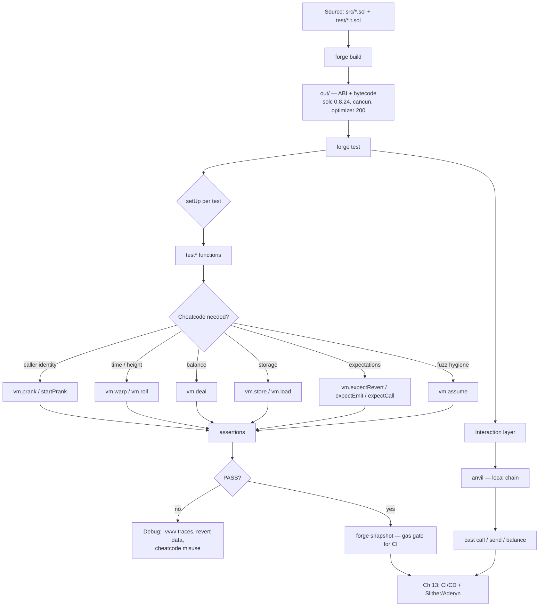

# 10. Foundry Workflow

## Learning Objectives

By the end of this chapter you will be able to:

1. Drive the three Meridian daily drivers — **`forge`**, **`cast`**, **`anvil`** — and explain what each does for this repo.
2. Read `meridian/foundry.toml` as a specification — what `solc_version`, `evm_version`, `optimizer_runs`, `[fuzz]`, `[invariant]`, and `fs_permissions` lock in, and why changing one silently changes every gas number this curriculum has recorded.
3. Manage dependencies the Foundry way: how `forge install` + auto-remappings resolve `forge-std/Test.sol` in this repo, and why this repo treats `lib/` as a vendored unit of truth (a Meridian convention, not a Foundry rule).
4. Use the **cheatcode families** with intent — caller, time, balance, storage, state, expectations, fuzz hygiene — and know which of the lab's 16 tests demonstrates each.
5. Write the parameter-exact revert assertion: on the pinned forge 1.7.1, `vm.expectRevert(selector)` matches only revert data exactly equal to the 4-byte selector (no-argument custom errors); parameterized custom errors need the full encoded revert data.
6. See where the M3 toolchain stands today (foundry.toml, 13 suites, 88 green tests) before Ch 11–12 climb the fork/fuzz/invariant ladder.

## Prerequisites

- **Chapter 2** (Solidity Language Essentials) — the conventions this module's tests enforce and assert: custom errors over require strings, `I`-prefixed interfaces, full NatSpec, visibility rules, `calldata` discipline. Every test in this chapter is an assertion *about* a Ch 2 convention.
- **Chapter 3** (ABI Encoding & Data Locations) — `abi.encodeCall` over `abi.encodeWithSignature` (the default the lab and repo tests use), selectors, and the canonical-signature rules that `cast sig` and `expectCall` depend on.

Supporting references (not prerequisites): **Ch 1** (the EVM state cheatcodes manipulate — storage slots, balances, `block` context), **Ch 7–8** (gas methodology — the `--gas-report` ban that this chapter reaffirms for `gasleft()`-based tests), **Ch 9** (assembly `sload`/`sstore` idioms that `vm.load`/`vm.store` bypass). All locked conventions remain in force; the error catalog stays PROVISIONAL until Ch 14/20.

## Theory

### Foundry is three binaries and one workflow

Foundry is the Rust-based smart-contract toolchain this repo has used since Ch 1 (forge 1.7.1 on this host). Its architecture is deliberately small:

| Binary | Job | Used in Meridian for |
|---|---|---|
| **`forge`** | Compile, test, deploy, inspect | `forge build`, `forge test`, `forge snapshot`, `forge script` (deploys from Ch 40) |
| **`cast`** | RPC/client utility — no local EVM state machine | `cast call`/`cast send`/`cast balance`/`cast sig` against anvil or a live chain |
| **`anvil`** | Local Ethereum node in-process | deterministic dev chain (chain id 31337) for deployment rehearsals and cast workflows |

A fourth tool, `chisel`, is a Solidity REPL for one-liners — not part of the daily gate. The workflow: `forge build` (compile to `out/`) → `forge test` (run `test/*.t.sol`) → deploy or interact via `forge script`/`cast`. This is sufficient for the core development workflow used by this curriculum; M1–M2 were verified with exactly this. Production development additionally uses Git discipline, CI, contract verification, RPC providers, and monitoring — Ch 13 wires the CI part in.

### `foundry.toml` is a specification, not configuration

This repo's `meridian/foundry.toml` is the load-bearing document of the toolchain. Read it as a contract:

```toml
[profile.default]
src = "src"
out = "out"
libs = ["lib"]
solc_version = "0.8.24"
evm_version = "cancun"
optimizer = true
optimizer_runs = 200
via_ir = false
bytecode_hash = "ipfs"
cbor_metadata = true
fs_permissions = [{ access = "read", path = "./"}]

[fuzz]
runs = 1000

[invariant]
runs = 256
depth = 64

[fmt]
line_length = 100
```

Every field has teeth. `solc_version = "0.8.24"` pins the compiler (PUSH0 support since 0.8.20, custom errors since 0.8.4); `evm_version = "cancun"` selects the EVM target. The two together decide which opcodes the bytecode may contain: PUSH0 is only emitted when the compiler supports it **and** the EVM version permits it (Shanghai+), while cancun additionally enables EIP-5656 `MCOPY` and EIP-1153 `TLOAD`/`TSTORE` — the opcodes Ch 9's lab measured. `optimizer_runs = 200` is an optimizer cost-model parameter: it biases the optimizer's trade-off between deployment size/cost and runtime execution cost as if the code runs a moderate number of times — it is *not* an invocation counter and the code does not literally execute 200 times. That choice interacts with every gas figure Ch 7–8 recorded. `via_ir = false` keeps the legacy pipeline (the whole gas corpus was measured under it). `fs_permissions` grants the runner **read access to `./` only** — no writes, no outside-tree reads. `ffi` is a separate capability this project does not enable; that is a project convention, and CI (Ch 13) should enforce that no test or script path invokes `ffi` unless explicitly approved. `[fuzz] runs = 1000` and `[invariant] runs = 256, depth = 64` set the budget Ch 12 builds on.

The chapter-generation pipeline enforces these choices as a gate: every chapter run executes `cd meridian && forge build && forge test`, and the suite count the ledger records is the number the toolchain vouches for.

### How cheatcodes work

A cheatcode is an EVM-side call to a **contract injected at a fixed address**, `0x7109709ECfa91a80626fF3989D68f67F5b1DD12D`, whose interface (`Vm`) forge-std exposes to tests as `vm`. `vm.warp(x)` is a real external call that tells the runner to change the timestamp used by subsequent EVM execution in the test environment (likewise `vm.roll` changes the simulated block number). Because the Foundry cheatcode environment exists only inside the test harness, a contract deployed to a production chain cannot depend on it: the cheatcode interface is not present there, so calls to that address cannot provide the intended test behavior (what actually occupies the address — empty, unrelated code, or an EOA — is chain-specific). That is the safety boundary: cheatcode-shaped code cannot survive to production.

The cheatcode families this chapter's lab exercises, mapped to the EVM state they mutate:

| Family | Cheatcodes | State mutated |
|---|---|---|
| Caller identity | `prank`, `startPrank`/`stopPrank` | `msg.sender` (and optionally `tx.origin`) for the next applicable contract call, or a span of calls |
| Time/height | `warp`, `roll` | `block.timestamp`, `block.number` |
| Balance | `deal` | ETH balance of any address |
| Storage | `store`, `load` | raw storage word at `(address, slot)` |
| State checkpoint | `snapshot`, `revertTo` | the whole journaled state |
| Expectations | `expectRevert`, `expectEmit`, `expectCall` | the runner's assertion queue |
| Fuzz hygiene | `assume` | input filtering before test execution |

The test lifecycle is fixed: `setUp()` runs once per test, then each `test*` function runs against fresh state. Default verbosity prints `[PASS]`/`[FAIL]`; `-vvvvv` gives full EVM traces including revert data — the debugging ladder for a failing assertion.

### Dependency management: vendored, not fetched

Meridian installs dependencies with `forge install`, which clones a repo into `lib/` and records the commit. The key property — a **Meridian convention**, not a Foundry rule: **`lib/` is a committed unit of truth**; the exact revision your code compiles against lives in-tree, reproducible without a network. Foundry itself does not require committing `lib/` — teams differ on vendoring strategies. This repo vendors OpenZeppelin v5.7.0; forge-std rides along inside it, and `import {Test} from "forge-std/Test.sol"` resolves — in this repository — through Foundry's auto-remapping scan of the `libs` tree to `lib/openzeppelin-contracts/lib/forge-std/src/`. That exact path is repo- and version-specific, not a universal Foundry rule. There is no `remappings.txt` — an explicit file that disagrees with the auto-remap is a "works here, breaks on CI" bug. `forge update` moves a dependency forward; it is deliberate, never implicit.

## Mathematical Foundations

### `makeAddr` is a deterministic hash, not a roll

forge-std's `makeAddr(name)` derives an address deterministically:

```
addr = address(uint160(uint256(keccak256(abi.encodePacked(name)))))
```

The low 160 bits of `keccak256(packed(name))` become the address. Two properties matter. First, **reproducibility**: `makeAddr("owner")` in `setUp` yields the same address in every run and on every machine, so tests are deterministic by construction — no private keys, no randomness, no `new` address. Second, **collision probability**: the keccak output truncated to 160 bits gives ≈ `2^160` possible addresses; with the handful of named actors in a test, the birthday bound (Ch 3) puts the pairwise collision probability far below `2^-128` — negligible for that small domain, though not mathematically zero; `vm.label` then makes traces readable by printing the name in place of the hex address.

### Snapshot/revertTo is a journal, not a fork

`vm.snapshot()` returns an id; `vm.revertTo(id)` restores the EVM state represented by that checkpoint — the state the current Foundry/Anvil execution environment journals (storage, balances, nonces, logs, `block` context). The mechanism is harness-specific; the semantic guarantee is: `snapshot` creates a recoverable test-state checkpoint and `revertTo` restores it. This is why `revertTo` can restore *everything*, including state a plain revert could not (a failed revert still consumes gas and leaves the failed frame's writes unwound, while `revertTo` restores the checkpointed state wholesale). The cost is journal space — many snapshots in one test is a test-smell, not a gas problem, because the journal lives in the harness, not on-chain.

### Fuzz budgets are probability statements

`[fuzz] runs = 1000` means: generate 1,000 inputs, execute the test on each. Under an **idealized independent-input model** — each input sampled independently with a constant trigger probability `p` — the chance a 1,000-run fuzz campaign *misses* a bug is `(1 − p)^1000`. Real campaigns violate these assumptions in practice (non-uniform sampling, `vm.assume` rejection, coverage-guided generation, stateful sequences), so treat the numbers as first-order estimates. The useful approximation:

```
(1 − p)^N ≈ e^(−pN)
```

So a bug that triggers once in a thousand inputs (`p = 10⁻³`) is missed with probability `e^(−1) ≈ 0.37` — a coin-flip-ish miss. To push the miss probability below `10⁻⁶` you need `N ≈ 13.8/p` — for `p = 10⁻³`, about **13,800 runs**. The consequences are structural: fuzzing is not a correctness proof, `vm.assume` constrains the accepted fuzz domain — inputs failing the predicate are rejected, which changes the effective input distribution and can consume fuzz budget — and the heaviest assurances come from *invariant* testing (Ch 12) where `runs = 256` campaigns probe long state sequences rather than single calls. The numbers in this section are why Ch 12 treats a passing fuzz suite as evidence, never as proof.

## Engineering Perspective

### The test suite is the protocol's executable spec

Across M1–M2 this repo grew 12 lab suites, and every one runs in a couple of seconds under `forge test`. That is Foundry's real engineering win: **the corpus runs so cheaply that tests become the primary design artifact**, not a QA stage. A Ch 2 convention change (custom errors, `abi.encodeCall`, calldata discipline) is not a style memo; it is a set of assertions the next chapter's tests compile or fail against. Ch 13 wires this into CI, but the discipline is already operational — each chapter run is gated on `forge build && forge test`.

### Probe contracts are the M3 precedent

The repo's `src/` carries both protocol contracts (`IMeridianFactory`, `MeridianFactory`, `IMeridianOracle`) and **lab/probe contracts** (`YulProbe`, `StorageProbe`, `GasProbe`, …). The standing convention: probes are pedagogical, NOT protocol — tested, measured, discarded, never entering the protocol's dependency graph. `FoundryProbe` follows the same rule. The discipline matters because a test that asserts on a probe teaches a *technique* while one that asserts on protocol code locks a *behavior*; mixing the two is how a curriculum repo drifts into a museum.

### The anvil + cast loop

For anything beyond a pure unit test — a deployment rehearsal, a calldata check, an interaction with a freshly built contract — the loop is `anvil` + `cast`:

```bash
anvil &                                  # chain id 31337, 10 funded dev accounts
cast call 0x... "value()" --rpc-url http://localhost:8545
cast send 0x... "setValue(uint256)" 42 --private-key "$ANVIL_PRIVATE_KEY" --rpc-url http://localhost:8545  # Anvil dev key via env var, never a pasted key
cast sig "transfer(address,uint256)"     # 0xa9059cbb — the Ch 3 selector lesson
cast keccak "hello"                      # hash one-liners without a console
```

`cast` is primarily a command-line RPC/client utility — it does not maintain a local EVM state machine like Anvil (some commands do read local config and wallet/signing state). Every RPC call re-derives the selector, encodes the args, hits the RPC, decodes the return — so `cast sig` canonicalizes signatures and can mask a hand-written `"f(uint)"` selector bug (Ch 3's measured warning). Use it to *confirm* selectors and calldata against the compiler, never as a substitute for `abi.encodeCall` in source.

### On L2s

The Foundry workflow is chain-agnostic — the same `foundry.toml`, the same test ladder, the same cheatcodes run against an L1 fork or an L2 (anvil can fork any RPC, and `vm.createSelectFork` in Ch 11 targets arbitrary chains). Post-Fusaka, PeerDAS (EIP-7594) is live and blob-parameter-only scaling governs L2 data costs, but the *toolchain* layer does not change — only the fork target and the L2's fee-market realism. Glamsterdam remains a roadmap item and must not be presented as shipped.

## Mermaid Diagram



## Code Walkthrough

The lab is `meridian/src/FoundryProbe.sol` + `meridian/test/FoundryProbe.t.sol` — pedagogical, **NOT** protocol (standing convention), materialized and green in this run (**16/16**; repo suite **88/88 across 13 suites**). The contract is deliberately small: an owner gate, a time-gated accrual, an ETH withdrawal, and storage — exactly the state cheatcodes mutate. Walk the tests by cheatcode family.

**Caller identity.** `testSetValueAsOwner` pranks `owner` and asserts the write lands. `testSetValueRevertsForNonOwner` is the negative case, and it encodes the chapter's central pitfall:

```solidity
bytes memory err = abi.encodeWithSelector(IFoundryProbe.NotOwner.selector, bob, owner);
vm.expectRevert(err);
vm.prank(bob);
probe.setValue(1);
```

`NotOwner` carries two parameters, so the revert data is `selector ‖ abi.encode(bob, owner)` — 68 bytes. On the pinned forge-std, `vm.expectRevert(IFoundryProbe.NotOwner.selector)` alone matches only revert data *exactly* equal to those 4 bytes — which cannot match a 68-byte parameterized payload; for parameterized errors the full encoded data is the only honest assertion. `testStartPrankScope` shows `startPrank`/`stopPrank` spanning multiple calls, and after `stopPrank` the caller is the test contract again — the revert assertion confirms the scope really closed.

**Time and height.** `testAccrualNotMature` asserts the gate before the lock elapses; `testAccrualAfterWarp` jumps 200 seconds and checks the math (`200 × 1e18 / 1e18 = 200` units); `testFeesAccruedEvent` asserts the exact event with `expectEmit`. `testWarpAndRoll` moves timestamp and height and reads them back through `blocksSinceDeploy()` — the shape every Ch 20 vault interest test uses to age positions without sleeping.

**Balance.** `testDealFundsWithdrawal` funds the probe via `vm.deal` and withdraws through the owner gate. `vm.deal` is a state bootstrap: it sets the balance directly and does not reproduce the economic path (a transfer, a mint) by which ETH would normally arrive — the same caveat as `vm.store`. `testWithdrawEthRevertsOnRejectingContract` sends to a contract with no `receive`/`fallback`, so the low-level `call` returns `false` and the probe reverts `TransferFailed` — a reminder that `deal` cannot conjure an accepting recipient.

**Storage.** `testStoreWritesOwnerSlot` writes slot 0 (`owner`) directly:

```solidity
vm.store(address(probe), bytes32(uint256(0)), bytes32(uint256(uint160(alice))));
assertEq(probe.owner(), alice);
vm.prank(alice);
probe.setValue(7);
```

`testLoadReadsOwnerSlot` reads the same slot back. This is how tests bootstrap states no setter exposes — but it bypasses every invariant the contract enforces, so it belongs only where the storage shape itself is the thing under test (Ch 6's `StorageProbe` lineage).

**State checkpoints.** `testSnapshotRevertTo` writes `value = 1`, snapshots, writes `value = 2`, rewinds, and asserts `value == 1` — a full journal rewind, including state a plain revert could not restore.

**Expectations and fuzz.** `testExpectCall` asserts the exact calldata `abi.encodeCall(IFoundryProbe.setValue, (42))` reaches the probe — the Ch 3 `abi.encodeCall` default applied to assertions. `testMakeAddrDeterministic` and `testAssumeFiltersDomain` close the loop on the math section: deterministic actors, and an input filter that keeps `0` out of the fuzz domain.

## Production Example

**The time-travelling protocol test** — the shape Ch 20's `MeridianVault` tests will use for every interest and collateral path. Replace the probe's `accrue` with a vault accrual and the pattern is identical:

1. **Set the world.** `vm.prank(owner)` configures the market (collateral factor, reserve factor, rate model) — the access-controlled setup the production contract will gate exactly like `onlyOwner` here.
2. **Age the system.** `vm.warp(now + 30 days)` advances utilization time without sleeping; `vm.roll(height + N)` advances it if height-sensitive. The Ch 20 vault's per-second accrual (Ch 4's `r²/2` bias) is exercised the same way this lab ages `accrue`.
3. **Assert the accounting.** Accrued interest, debt, health factor — all read back through public getters, exactly as `assertEq(probe.accrued(), 200)` reads the probe.
4. **Assert the events.** `expectEmit` locks the exact `(amount, periodStart, periodEnd)` shape the indexer (Ch 37) will query.
5. **Assert the reverts.** The parameterized `NotOwner`/`AccrualNotMature` assertions become the vault's `NotLiquidatable`, `AboveCollateralFactor`, `Unauthorized` — full encoded revert data, never a bare selector.

The production workflow around it: `anvil` for deployment rehearsals (`forge script` targeting chain id 31337), `cast` for the occasional poke, and the M3 ladder (Ch 11 fork tests, Ch 12 fuzz/invariant) layering realism on top of this deterministic core.

## Foundry Lab

`meridian/test/FoundryProbe.t.sol` — **16 tests, green in this run**. Full repo: **88/88 across 13 suites** (forge 1.7.1, solc 0.8.24, cancun, optimizer 200; the Ch 9 baseline of 72/72 grew by 16). Coverage by cheatcode family:

- **Caller identity:** `testSetValueAsOwner`, `testSetValueRevertsForNonOwner`, `testStartPrankScope`.
- **Expectations:** `testExpectEmitValueSet`, `testFeesAccruedEvent`, `testExpectCall`, plus the parameter-exact `expectRevert` in the negative tests.
- **Time/height:** `testAccrualNotMature`, `testAccrualAfterWarp`, `testWarpAndRoll`.
- **Balance:** `testDealFundsWithdrawal`, `testWithdrawEthRevertsOnRejectingContract`.
- **Storage:** `testStoreWritesOwnerSlot`, `testLoadReadsOwnerSlot`.
- **State:** `testSnapshotRevertTo`.
- **Fuzz/helpers:** `testMakeAddrDeterministic`, `testAssumeFiltersDomain` (1,000-run fuzz under the repo's `[fuzz] runs`).

One real bug was caught by the first compile/test pass: `testStoreWritesOwnerSlot` originally called `setValue` from the test contract after swapping the owner slot — the contract correctly reverted `NotOwner(testContract, alice)`. The fix (`vm.prank(alice)` after the store) is the production lesson in miniature: **a test that calls a privileged function without pranking the newly privileged actor is the bug, not the contract.** No gas-based tests in this lab (the `gasleft()`/`--gas-report` standing rule from Ch 1/2/7/8 applies to measurement, not to correctness tests).

## Security Analysis

Cheatcodes are the sharpest tool in the kit, and the security analysis is about the *test author*, not the protocol:

**1. Cheatcode leakage into production.** The Foundry cheatcode environment is not present on production chains — calls to `0x7109709…12D` there get no cheatcode semantics (a revert or a no-op depending on calldata and on what occupies the address). The real rule is **environmental separation**: production contracts must not depend on the cheatcode environment. The boundary holds only if nothing in `src/` or `script/` imports forge-std. The standing rule: `src/` protocol code never references `Test`, `vm`, or forge-std; only `test/` and `script/` may. A grep for `import {Test}` outside `test/` is a CI check Ch 13 will encode.

**2. Prank masks access-control bugs.** If every test pranks the owner, the "not owner" path is untested — and the one test that skips the prank is exactly where a missing `onlyOwner` surfaces. The convention: every privileged function gets one test that exercises the non-privileged caller and asserts the parameterized revert. This run's `testStoreWritesOwnerSlot` bug was this class, caught by the contract, not by trust in the test author.

**3. `vm.store` bypasses invariants.** Writing a slot directly skips every modifier, check, and invariant the contract enforces. It is correct only when the storage *shape* is the subject (Ch 6 labs) or when bootstrapping a state with no setter — and even then, test the transition through real setters too. A suite that relies on `store` to fabricate healthy states is testing the fabricated state, not the contract.

**4. `expectRevert(selector)` gives false confidence.** On the forge-std pinned by this repo (forge 1.7.1), `expectRevert(bytes4)` matches only revert data that is exactly those 4 bytes — no-argument custom errors — and neither empty `revert()` data nor parameterized payloads. For `NotOwner(caller, owner)`, the 4-byte form cannot match the 68-byte revert data, and a passing selector-only assertion can be a lie about the actual error path. The parameter-exact form is the only honest assertion, and it doubles as documentation of the error's payload.

**5. Fork-test divergence (Ch 11 preview).** Fork tests inherit a live chain's state; a reorg, a blocked RPC, or changing chain behavior turns a passing suite flaky. The defense is pinning the fork block, trading freshness for determinism.

**2026 trust-surface grounding.** The ledger's posture applies to *test privilege*: the owner pranks here mirror the real admin-key surface the protocol will carry. The Apr 2026 admin-key incidents (Kelp DAO/LayerZero and Drift Protocol, ~$285–292M) warn that a privileged path is only as safe as its least-tested branch — which is why "test the non-privileged caller" is security posture, not style. A suite that never exercises the unauthorized path leaves a critical security property untested.

## Common Mistakes

1. **`vm.expectRevert(selector)` on a parameterized error** — on the pinned forge 1.7.1 the selector form matches only exact 4-byte revert data (no-arg custom errors), never 68-byte parameterized payloads; those need `abi.encodeWithSelector(selector, args…)` (Ch 8).
2. **Pranking the privileged actor in every test** — the unauthorized path never runs; the one test that forgets the prank catches the missing `onlyOwner`.
3. **`startPrank` without `stopPrank`** — caller identity leaks across tests' worth of calls; always scope it.
4. **`vm.store` to fabricate protocol states** — bypasses every check and invariant; test transitions through real setters too.
5. **`vm.assume` as a correctness crutch** — restricting the accepted domain is legitimate, but heavy rejection can starve the fuzzer of valid inputs; if the unfiltered domain is unsafe, bound the function's inputs instead of stacking assumptions.
6. **Mutating shared state in `setUp`** — every test inherits it; if a test needs a different world, build it in the test.
7. **Forgetting what `prank` actually scopes** — `vm.prank(sender)` changes the caller for the *next applicable contract call*; cheatcode calls (`vm.expectCall`, `vm.recordLogs`, …) go to the Vm interface and do **not** consume it, while any real contract call in between does. Use `startPrank`/`stopPrank` when the impersonation must span several calls.
8. **Hand-rolled calldata where `abi.encodeCall` belongs** — the Ch 3 selector lesson (`"f(uint)"` ≠ `"f(uint256)"`); let the compiler build calldata.
9. **Adding a `remappings.txt` that disagrees with the auto-remap** — works locally, breaks on CI; this repo's truth is the `libs` scan.
10. **`--gas-report` on `gasleft()`-based tests** — the standing Ch 1/2/7/8 ban, unchanged in M3.

## Gas Optimization

Foundry is where gas becomes *measured* rather than estimated, and the standing methodology rules carry into M3 unchanged:

| Concern | Tool | Rule |
|---|---|---|
| CI gas regression gate | `forge snapshot` | Ch 13 wires this into CI; a PR that moves the snapshot is a reviewed change |
| Per-function gas report | `forge test --gas-report` | Do not mix with `gasleft()`-based microbenchmarks — the reporting instrumentation changes the measurement environment; use the dedicated benchmark harness and compare minimal deltas (Ch 1/2) |
| Gas introspection in tests | `gasleft()` deltas | Loop-amplified min-deltas only; control all relevant state — cold/warm accounts, storage slots, memory, optimizer, repeated runs, baseline subtraction (Ch 8 standing rule) |
| Deployed code size | `forge build --sizes` | Guards the EIP-170 24 KB cap before deploys |
| Storage layout | `forge inspect` / `solc --storage-layout` | The Ch 6 upgrade-PR gate |
| Optimizer shape | `optimizer_runs = 200` in foundry.toml | Emitted bytecode differs from `runs = 10_000`; every Ch 7–8 number is under this setting |

The cheatcode lab intentionally has no gas section — the M3 question is *measurement hygiene*, not squeezing the probe. The real budget lives in Ch 7–8 (`docs/gas-budget.md`) and Ch 13's `forge snapshot` gate will enforce it against the vault's borrow path (~101,500 gas net, Ch 8's anatomy). Foundry adds the *enforcement mechanism*, not a new number.

## Reading Production Source Code

Read, in this order:

1. **forge-std `src/Test.sol`** — the `Test` contract every test inherits: `vm` (the `Vm` cheatcode interface), `assert*` macros, `makeAddr`/`label`. This is the true parent of `FoundryProbeTest`.
2. **forge-std `src/StdCheats.sol` and `src/StdUtils.sol`** — `makeAddr` (the `keccak256(packed(name))[12:]` derivation from the math section), `deal`-family helpers, `skip`/`pause`. Read `makeAddr`'s actual implementation and confirm the derivation.
3. **forge-std `src/Vm.sol`** — the Solidity-facing interface of the cheatcodes the tests use; the authoritative *behavior* belongs to the pinned Foundry version (1.7.1). Skim it for the families this chapter teaches and note how many more exist (`ffi`, `createFork`, `recordLogs`, `prank` variants).
4. **OpenZeppelin's Foundry test suite** (`lib/openzeppelin-contracts/test/…`) — a production-grade test layout: per-contract suites, `setUp` heavy, `expectRevert` with parameterized errors, explicit time travel. The closest template for Ch 14's `MeridianToken` tests.
5. **Foundry's own repo** (github.com/foundry-rs/foundry) — the dogfood: tests that test the test runner, including the cheatcode edge cases this chapter warns about.

Ask of every suite you read: *which cheatcode families does it lean on? does every privileged function have a non-privileged negative test? are parameterized reverts asserted with full data?* That is the Foundry audit in three questions.

## Exercises

1. Write a test that swaps the owner via `vm.store` and then asserts a non-owner cannot call `setValue` even after the swap — the exact failure this run caught, as a deliberate test.
2. `vm.prank(sender)` changes the caller for the next applicable contract call — cheatcode calls do not consume it. Write two tests: one that interposes `vm.expectCall(...)` between a `prank` and its target (what sender does the target observe?), and one that interposes a real call to a second contract before the target (where does the prank land?).
3. Derive `makeAddr("alice")` by hand: `keccak256("alice")`, take the low 160 bits. Confirm against a `cast keccak "alice"` one-liner.
4. For a bug that triggers once per 10,000 inputs (`p = 10⁻⁴`), how many fuzz runs give a miss probability below `10⁻⁶`? What does that imply about this repo's `runs = 1000`?
5. Write an `expectEmit` assertion for `FeesAccrued(amount, periodStart, periodEnd)` and explain why the emitted values must be copied from the *warped* context, not from before `warp`.
6. In `testWithdrawEthRevertsOnRejectingContract`, why can `vm.deal` not make the withdrawal succeed? What does the `EthRejector` mock demonstrate about low-level `call` return values?

## Weekly Project

**Meridian's Foundry playbook — the toolchain Ch 13's CI will automate.** Three deliverables:

1. `meridian/src/FoundryProbe.sol` + `meridian/test/FoundryProbe.t.sol` — the lab above, **materialized and green in this run** (16/16 tests; repo 88/88 across 13 suites).
2. `docs/foundry-playbook.md` — the `foundry.toml` field-by-field explanation, the cheatcode-family table with the "which family for which intent" rule, the `expectRevert` parameter-exact rule, the prank/`store` security conventions, and the anvil + cast workflow.
3. A short note in `docs/gas-budget.md` (Ch 7 deliverable): how Ch 13's `forge snapshot` gate will enforce the borrow-path budget from Ch 8, and why `optimizer_runs = 200` is part of the measured baseline.

## Deliverables

1. `meridian/src/FoundryProbe.sol` + `meridian/test/FoundryProbe.t.sol` — the cheatcode lab, 16/16 tests green (repo suite 88/88 across 13 suites, forge 1.7.1).
2. `docs/foundry-playbook.md` — foundry.toml spec, cheatcode families, assertion rules, security conventions, anvil/cast workflow.
3. Locked conventions extended: parameter-exact `expectRevert` for parameterized errors; every privileged function tested with a non-privileged caller; `vm.store` only for storage-shape tests; cheatcodes never referenced in `src/`; `--gas-report` ban reaffirmed for `gasleft()`-based tests.

## Quiz

1. What are the three Foundry binaries, and which Meridian activity maps to each?
2. Why does `vm.expectRevert(IFoundryProbe.NotOwner.selector)` fail to assert `NotOwner(caller, owner)` correctly, and what is the exact form that does?
3. Where does `import "forge-std/Test.sol"` resolve in this repo, and why is there no `remappings.txt`?
4. Describe `snapshot`/`revertTo` as a recoverable test-state checkpoint. What can it restore that a plain revert cannot, and why?
5. With `runs = 1000`, a bug with trigger probability `10⁻³` is missed with probability ≈ what? How many runs would drive that below `10⁻⁶`?

**Answers:** (1) `forge` — build/test/deploy (`forge build`, `forge test`, `forge snapshot`); `cast` — RPC/client utility with no local EVM state machine (`cast call`/`send`/`balance`/`sig`); `anvil` — local chain id 31337 for deployment rehearsals. (2) On the pinned forge 1.7.1, the 4-byte selector form matches only exact 4-byte revert data, so it cannot match the 68-byte parameterized payload; use `vm.expectRevert(abi.encodeWithSelector(IFoundryProbe.NotOwner.selector, bob, owner))`. (3) In this repo, Foundry's auto-remapping scan of the `libs` tree resolves `forge-std/` → `lib/openzeppelin-contracts/lib/forge-std/src/` (repo-specific, not a universal rule); the `libs` scan is the source of truth, and an explicit `remappings.txt` that disagrees breaks on CI. (4) `snapshot` creates a checkpoint of the state the Foundry/Anvil test environment journals, and `revertTo` restores it — recovering state a failed transaction could not, because the checkpoint lives in the test environment, not on-chain. (5) `(1 − 10⁻³)^1000 ≈ e^(−1) ≈ 0.37`; to get below `10⁻⁶` needs `N ≈ 13.8/10⁻³ ≈ 13,800` runs.

## Further Reading

- Foundry Book — "Forge", "Cast", "Anvil", "Cheatcodes" reference (`book.getfoundry.sh`); the cheatcode interface is the Solidity-facing ground truth for the family table (behavior per the pinned Foundry version).
- forge-std `src/Vm.sol`, `src/StdCheats.sol`, `src/Test.sol` — the Solidity-facing interface of everything the harness can do (behavior per the pinned Foundry version).
- OpenZeppelin's Foundry test suite in this repo's vendored `lib/openzeppelin-contracts` — the production test-layout template for Ch 14.
- Ch 3 (ABI/selectors — `abi.encodeCall`, `cast sig` canonicalization) and Ch 7–8 (gas methodology — the `--gas-report` ban and measurement rules) of this curriculum.
- Ch 11 (fork testing), Ch 12 (fuzz/invariant), Ch 13 (CI + Slither/Aderyn + `forge snapshot`) — the rest of the M3 ladder this chapter's workflow plugs into.
- 2026 security grounding: Kelp DAO/LayerZero and Drift Protocol admin-key incidents (~$285–292M, Apr 2026) — the reason every privileged path needs a tested unauthorized caller.

## Ledger Update

**Ch 10 — Foundry Workflow (2026-08-13)** — full entry appended to `ledger/CONTINUITY_LEDGER.md`.

- Locked Foundry conventions (canon): **parameter-exact `vm.expectRevert`** — on the pinned forge 1.7.1, `expectRevert(selector)` matches only revert data exactly equal to the 4-byte selector (no-argument custom errors); parameterized custom errors assert with `abi.encodeWithSelector(selector, args…)`; **every privileged function gets a non-privileged negative test** (the unauthorized path is security posture, 2026 trust-surface grounding); **`vm.store` only for storage-shape tests** (it bypasses every invariant); **cheatcodes never referenced in `src/`** (only `test/`/`script/`); the `--gas-report` ban on `gasleft()`-based tests reaffirmed; the repo's dependency truth is the `libs` auto-remap, no `remappings.txt`.
- Toolchain facts recorded: forge **1.7.1**; `foundry.toml` spec (solc 0.8.24, cancun, optimizer 200, via_ir false, fs_permissions read `./` only; `ffi` not enabled — project convention, CI-enforced; `[fuzz] runs = 1000`, `[invariant] runs = 256 depth = 64`); forge-std resolved via auto-remap at `lib/openzeppelin-contracts/lib/forge-std/src/` (repo-specific); cheatcode address `0x7109709ECfa91a80626fF3989D68f67F5b1DD12D`.
- Math locked: `makeAddr(name) = address(uint160(uint256(keccak256(abi.encodePacked(name)))))` — deterministic; collision probability negligible for the small number of named actors in tests; fuzz miss probability `(1−p)^N ≈ e^(−pN)` under an idealized independent-input model — `runs = 1000` misses a `p = 10⁻³` bug with ≈ 0.37 probability, so fuzzing is evidence, not proof (Ch 12 builds on this); `snapshot`/`revertTo` as a recoverable test-state checkpoint.
- Repo artifacts (lab, NOT protocol): `meridian/src/FoundryProbe.sol` (I-prefix interface) + `meridian/test/FoundryProbe.t.sol` — materialized and **compile-verified IN THIS RUN** (forge 1.7.1): **16/16 new tests green; repo suite 88/88 across 13 suites** (Ch 9 baseline 72/72 + 16). One real test bug caught and fixed: post-`vm.store` owner swap must prank the new owner (`NotOwner(testContract, alice)` was the contract correctly rejecting the test author's mistake).
- Weekly-project artifacts (in chapter, not yet on disk): `docs/foundry-playbook.md` + `docs/gas-budget.md` note on Ch 13's `forge snapshot` gate.
- Glossary additions: cheatcode, `Vm` interface, `forge`/`cast`/`anvil`, auto-remapping, state journal, `makeAddr` derivation, fuzz miss probability.
- Drift: none. Module boundary: none (M3 ends Ch 13 — next boundary audit at Ch 13).
- **ERRATA APPLIED (2026-08-14, review `errata/10_Foundry_Workflow_REVIEW.md`):** P0/P1 wording fixes, verified against forge 1.7.1 on this host — `prank` scoping (intervening cheatcode calls do not consume it), `expectRevert(bytes4)` exact-4-byte-data semantics, snapshot/revertTo as semantic checkpoint (no claimed replay mechanism), `optimizer_runs` as cost-model parameter, PUSH0 needs compiler + EVM version together, `ffi` as convention not inference, `lib/` and remap path as Meridian/repo conventions, cheatcode-environment separation, warp/deal/assume/makeAddr/fuzz-model/cast/gas-methodology/Vm.sol refinements.
