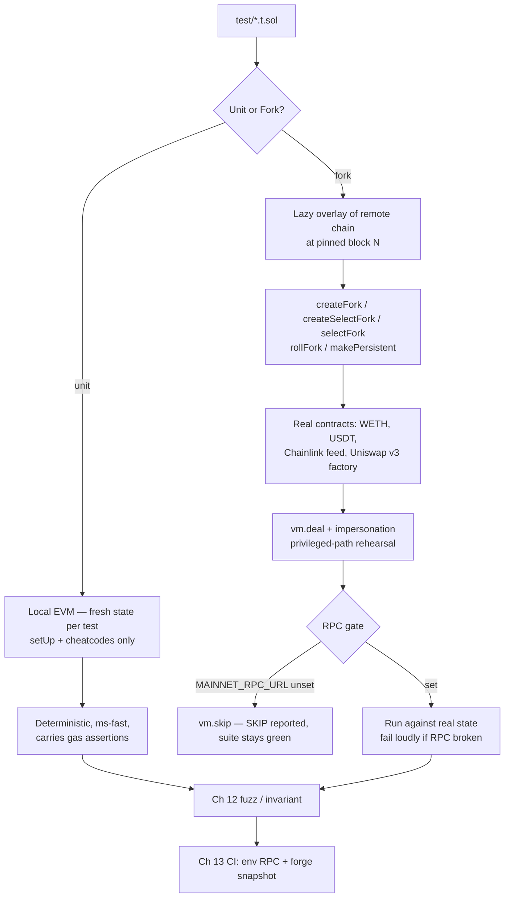

# 11. Unit Testing & Fork Testing

## Learning Objectives

By the end of this chapter you will be able to:

1. Explain what makes a test a *unit* test in Foundry — fresh state per test, `setUp` as the only shared setup — and why isolation makes a suite deterministic.
2. Describe what a mainnet fork *is* — a lazy state overlay of a remote chain at a pinned block — and name the cheatcode family and CLI flags that drive it.
3. Pin or accept flakiness: a pinned fork is reproducible and cache-warm; an unpinned fork makes a passing suite non-deterministic — the only acceptable choice in CI is pinned.
4. Write RPC-gated fork tests that skip cleanly when no RPC is configured (`vm.skip`) and fail loudly when the RPC is set but broken — the CI pattern Ch 13 automates.
5. Use impersonation and `vm.deal` on a fork to rehearse privileged paths against *real* contracts — the fork-safe way to test admin-key surfaces.
6. Know where fork testing stops: fork tests are integration contracts with the world at block N, not proofs of mainnet safety — unit, fuzz/invariant (Ch 12), and CI (Ch 13) each answer a different question.

## Prerequisites

- **Chapter 10** (Foundry Workflow) — the toolchain this chapter climbs: cheatcode families, parameter-exact `vm.expectRevert`, `makeAddr`, the state journal. Every convention locked there is in force; this chapter adds the fork family and the isolation discipline.
- **Chapter 2** (Solidity Language Essentials) and **Chapter 3** (ABI Encoding) — the custom-error/`abi.encodeCall` conventions every test here asserts.

Supporting references (not prerequisites): **Ch 6** (storage slots — the fork-isolation test writes WETH's `balanceOf` slot by hand), **Ch 8** (gas methodology — why gas assertions never live in fork tests), **Ch 9** (returndata gates — the USDT empty-return pin is that pattern measured against the real contract). Locked conventions remain in force; the error catalog stays PROVISIONAL until Ch 14/20.

## Theory

### Unit testing is the deterministic core

A unit test in Foundry runs against exactly one environment: a **fresh copy of EVM state per test function**. `setUp()` runs once before each test; anything it mutates is invisible to the next test, and whatever a test leaves behind is discarded. This is the runner's state model, not a convention — and it is what makes a suite deterministic: test *n*'s result depends only on (test code, world as `setUp` built it), never on earlier tests' side effects.

The discipline that follows is Arrange–Act–Assert: **Arrange** — `setUp` deploys the world (or the test does; mutating shared state in `setUp` is a test-smell, Ch 10 CM #6); **Act** — exactly the call under test with caller identity in place (`vm.prank`); **Assert** — the state transition (`assertEq`), the event (`expectEmit`), or the revert (parameter-exact `expectRevert`). The lab's `testIsolation_A_mutates` / `testIsolation_B_seesCleanState` pair demonstrates the guarantee directly: A calls `poke()` (value 0 → 1); B asserts `value == 0` and passes *only if* the runner gave it a fresh world. If state ever leaked between tests, B is the canary that fails.

### What a fork actually is

`vm.createSelectFork(rpcUrl, blockNumber)` does not download a chain. It creates a **lazy state overlay**: the EVM starts with empty local state, and every time it touches an account, slot, or code not yet in the overlay, the runner fetches that piece from the RPC and caches it. Everything after the first touch is served warm from the overlay — and the overlay *is* the state the test runs against. Writes land in the overlay, never on mainnet; no transaction is ever broadcast.

Three properties follow. **Laziness means cost is proportional to touch:** the first cold read of an account or slot is one JSON-RPC round-trip (tens to low hundreds of milliseconds). Foundry caches fetched state on disk (`~/.foundry/cache`, keyed by RPC URL and block), so re-running the same pinned fork is nearly free. **Fork state is per-fork and per-test:** each `createFork` returns an independent overlay; each test gets a fresh fork overlay, exactly like unit isolation. `selectFork` switches the active overlay, `activeFork` reports it, `rollFork` moves it to another block, `makePersistent` marks an address whose state survives a fork switch. **The fork serves state, not trust:** a remote node can answer wrongly, which is why the lab's real addresses are hardcoded constants and every fork test asserts sanity bounds on what it reads. A malicious or misconfigured RPC can serve any bytes it likes — hardcoded addresses and sanity assertions are the only fence between the test and a lying endpoint.

### The fork cheatcode family and CLI

| Mechanism | Purpose |
|---|---|
| `vm.createFork(url[, block])` | Create a new overlay, return its id; does not switch to it |
| `vm.createSelectFork(url[, block])` | Create *and* switch in one call |
| `vm.selectFork(id)` / `vm.activeFork()` | Switch between overlays / report the live one |
| `vm.rollFork(block)` | Move the active fork to another block |
| `vm.makePersistent(addr)` | Keep an address's state across fork switches |
| `forge test --fork-url <url>` | Run the *whole* suite against a fork (fresh overlay per test) |
| `forge test --fork-url <url> --fork-block-number <N>` | …pinned to block N |
| `[rpc_endpoints]` in `foundry.toml` | Name RPC URLs (`mainnet = "https://…"`), then `--fork-url mainnet` |

> Both `createFork` and `createSelectFork` accept an optional `blockNumber`; omitting it forks at the chain head (ad-hoc exploration only — Meridian's convention requires pinning in tests).

The CLI form and the in-test form answer different questions. `--fork-url` runs everything against a live-ish world — "does the whole protocol behave on mainnet state". In-test forks give per-test control: two forks of the same block to prove isolation, a pinned historical block for determinism, a different chain for cross-chain work (Ch 31–32). Meridian's convention, locked here: **the daily `forge test` gate is RPC-free**, and fork tests live behind an explicit gate.

### Block pinning: determinism versus freshness

A fork at block N is a function of a *fixed* snapshot: the same test against the same pinned block passes or fails identically every run, on every machine, and the disk cache makes reruns cheap. An unpinned fork tracks the chain head — balances drift, liquidity moves, a governance proposal lands mid-run, a reorg rewrites history. That is the freshness/determinism tradeoff, and its failure mode is the flaky suite: a test that passes "usually" is not green.

Meridian's rule: **CI pins a block; ad-hoc exploration may track head.** Pin in the test itself (the lab's `PINNED_BLOCK` constant) so the pin travels with the code. The cost of pinning is staleness — fork tests answer *integration* questions (does my code interoperate with these real contracts?), never *live-safety* questions (is this still true right now?). Operational caveat: historical blocks require an archive-capable RPC — a CI configuration fact, not a code fact.

### RPC-gated tests: skip cleanly, fail loudly

The lab's fork tests open with the same two lines:

```solidity
string memory rpc = _rpc();
if (bytes(rpc).length == 0) { vm.skip(true); return; }
```

`vm.skip(true)` (top level of the test body only) marks the test skipped — reported `[SKIP]`, counted neither pass nor fail. The gate reads `MAINNET_RPC_URL`: unset → skip, set → run. The asymmetry is deliberate: **skipping is for "no RPC configured", never for "RPC broken"** — a gate that swallowed connection errors would let CI pass against a dead endpoint, the one outcome worse than a red suite. Verified in-run: with the variable pointed at an unreachable host, all six fork tests failed with `could not instantiate forked environment` — the honest failure.

## Mathematical Foundations

### Determinism is a compositional property

A suite is deterministic when every test's result is a function of only (a) the test's own code and (b) the world as `setUp` built it. Unit tests achieve this by construction; fork tests only when the world is pinned: `R(test) = f(test, S_N)` for a pinned fork versus `R(test) = f(test, S_head(t))` for an unpinned one — the second depends on wall-clock time and on whatever the chain did before `t`. That substitution is the entire mathematical content of "pin your forks": it converts a time-dependent function into a constant one. `testForkPinnedBlock` asserts `block.number == PINNED_BLOCK` precisely to prove it happened.

### The economics of a fork run

Every cold `(address, slot)` or `(address, code)` touch is one RPC round-trip; warm touches are overlay-local. A test touching `c` accounts and `s` slots costs on the order of `c + s` round-trips; at ~100 ms each, a 50-touch test costs seconds of wall-clock versus milliseconds for an equivalent unit test. Two consequences: fork tests are *expensive enough to be few* (the pyramid below), and the disk cache is what makes pinned forks tolerable in CI. The asymmetry with gas is worth stating once: a unit test costs milliseconds and metered gas; a fork test costs seconds and no on-chain gas at all — the constraint is latency, not gas.

### Why mocks lie: the integration gap

A mock encodes what *you* believe a counterparty does; the real counterparty encodes what it *actually* does. The gap is where integration bugs live, and the incidents below are all gap-shaped: each exploit path crossed a real token, oracle, or governance surface no mock would have reproduced. Fork testing shrinks the gap by replacing the mock with the thing itself — at a pinned block. It cannot close it entirely: a snapshot asserts "my code interoperates with these contracts as they were at block N", never "as they will be". Hence fork tests are *necessary but not sufficient* — they complement, not replace, Ch 12's invariant campaigns.

## Engineering Perspective

### The protocol test pyramid

Meridian's test strategy across M3 is a three-layer pyramid plus a gate: **(1) Unit** (Ch 10–11) — fast, deterministic, RPC-free; every external function, both access paths, parameter-exact reverts; the only layer carrying gas assertions. **(2) Fork integration** (this chapter) — few, slow, pinned; real tokens, feeds, pools; impersonation for privileged paths. **(3) Fuzz/invariant** (Ch 12) — long random sequences against declared invariants. **(4) CI gate** (Ch 13) — everything per PR, `forge snapshot` guarding gas, Slither/Aderyn guarding static posture. The ordering is deliberate: a fork failure tells you *interoperability* broke, not *logic* broke — if the unit layer is green, debugging starts at the real contract's behavior, not in your math.

### Fork tests are integration contracts with the real world

For Meridian, the counterparties that matter are concrete and mainnet-shaped:

- **Tokens with quirks.** Tether's USDT `approve()` famously returns no data (`returndatasize == 0`) — the exact quirk `SafeERC20._callOptionalReturn` handles and the Ch 9 bug class. The lab pins the real behavior: low-level `approve` on real USDT (0xdAC1…1ec7), asserting `ok == true` and `ret.length == 0` — a measured fact about a real contract, and exactly the shape Ch 14's token layer and Ch 20's vault must satisfy.
- **Oracles.** The canonical Chainlink ETH/USD aggregator (0x5f4e…8419) is the primary feed Ch 22's `OracleRegistry` wraps. The lab's sanity test reads `latestRoundData` on the fork and asserts a wide band ($100–$100,000); Ch 22's tests will assert the registry's staleness and deviation checks against the same real round data.
- **Pools for TWAP.** Ch 22's TWAP fallback will `consult()` real Uniswap v3 pools (e.g. the WETH/USDC 0.3% pool, 0x88e6…5640). A fork test can read the pool's real observations and assert the accumulator math against data that was actually accumulated.
- **Deployers and owners.** The Uniswap v3 factory (0x1F98…F984) has an owner who can `setOwner`. The lab reads whoever `owner()` returns at the pinned block, impersonates them, and flips ownership — the general pattern for rehearsing any privileged path against a real contract.

### The incidents: what fork tests would have exercised

- **Euler Finance (Mar 2023, ~$197M)** — a lending protocol, Meridian's closest cousin. A flash loan donated tokens into a market, inflating its share price, and liquidations ran against the distorted accounting — the exact surface a pinned fork test with real balances exercises. Lesson: share-accounting invariants (Ch 16's inflation/donation attack, Ch 23's `sMER`) need *populated* collateral states, not empty mocks.
- **Mango Markets (Oct 2022, ~$114M)** — oracle manipulation: a large position pumped a low-liquidity price feed and borrowed against the inflated collateral. A fork test against the real oracle path would have shown the price diverging from every sane band — why the lab's feed test asserts a band at all.
- **Beanstalk (Apr 2022, ~$182M)** — a governance flash loan passed a malicious proposal that drained the treasury. The privileged path was the attack surface; fork impersonation is the rehearsal technique for exactly that class.
- **2026 trust surface (Kelp DAO/LayerZero, Drift Protocol, ~$285–292M, Apr 2026)** — admin-key compromise, the ledger's standing grounding. Fork impersonation tests an admin-key path *without* holding the key: read who the contract believes is privileged, act as them, assert the transition. The lab's factory-owner test is the template Ch 25's multisig/governor tests will follow.

The honest caveat, stated once: fork tests run *after* a world exists to fork. Euler, Mango, and Beanstalk were all live, forkable systems when exploited — their suites simply did not exercise the exploited surface *with real state*.

### Fork tests are necessary, not sufficient

A green fork suite means: at block N, with these real contracts, my code behaved. It does not mean: my code is safe on mainnet. The fork's state is a snapshot; the future is not — reorgs, upgrades, new pools, feed changes are all uncovered. That is why the M3 ladder ends in invariant testing (Ch 12) and auditing (M6), and why the ledger treats fork tests as integration evidence, never proof.

## Mermaid Diagram



## Code Walkthrough

The lab is `meridian/src/ForkProbe.sol` + `IForkProbe.sol` + `meridian/test/ForkProbe.t.sol` — pedagogical, **NOT** protocol (standing convention): a small owner-gated, time-gated state machine — `setValue` (owner-gated), `poke` (unrestricted — the isolation demo), `accrue` (time-gated view, 7-day lock). Walk the tests by family.

**Unit isolation.** `testIsolation_A_mutates` calls `poke()` (value 0 → 1); `testIsolation_B_seesCleanState` asserts `value == 0`. Read together they pin the runner's guarantee: if the harness leaked state between tests, B fails — the cheapest demonstration of the property every protocol suite depends on.

**Caller identity.** `testSetValueAsOwner` pranks `owner`; `testSetValueRevertsForNonOwner` applies the Ch 10 negative-test convention: parameter-exact revert data (`abi.encodeWithSelector(IForkProbe.NotOwner.selector, bob, owner)`), never a bare selector.

**Time travel.** `testAccrualNotMature` asserts the time-gated revert with full parameters; `testAccrualAfterWarp` jumps past the lock and checks the math (`200 × 1e18`). The Ch 20 vault ages interest the same way.

**State journal.** `testSnapshotRevertTo` uses `vm.snapshotState()`/`vm.revertToState()` — the `*State` forms — because `snapshot`/`revertTo` are deprecated aliases (Ch 11 convention).

**Fork state model.** `testForkStateIsolation` creates two forks of the same pinned block, writes `balanceOf[alice] = 1e18` on fork A by hand (`vm.store` at the derived slot — WETH9's `balanceOf` is a mapping at slot 3, Ch 6 storage shape), then asserts fork B still reads 0 and fork A still reads 1e18 after switching back. Per-fork independence, proven with real storage layout.

**Block pinning.** `testForkPinnedBlock` asserts `block.number == PINNED_BLOCK` (20,000,000) and reads a real WETH balance — the overlay really is that block.

**Real-token integration.** `testRealWethWrap` funds `alice` via `vm.deal`, then calls the *real* WETH9 `deposit{value: 100 ether}()` and asserts `balanceOf(alice) == 100 ether` — no whale hunting, no slot heuristics; the pattern Ch 20's vault tests use to put real collateral into positions.

**Real oracle integration.** `testRealChainlinkFeedSanity` reads the real ETH/USD aggregator and asserts a deliberately wide band — outside `[100, 100_000]` USD, the feed is broken or the fork served wrong state; both are failures worth surfacing.

**Non-standard token quirk.** `testUsdtApproveReturnsNoData` low-level-calls the real USDT `approve` and asserts `ok == true` and `ret.length == 0` — the empty-return convention (Ch 9) measured against the real contract. The 0 → non-zero direction is deliberate: USDT rejects non-zero → non-zero transitions.

**Impersonation.** `testImpersonateUniswapFactoryOwner` reads the real factory's `owner()` at the pinned block, pranks it, calls `setOwner(alice)`, and asserts the handover. No hardcoded key needed — the fork serves whoever the contract believes is privileged — and if the real ABI ever changes, the test is *supposed* to fail: that is an integration finding.

## Production Example

**The Ch 22 `OracleRegistry` fork test** — the shape every Meridian integration test will follow once protocol contracts exist:

1. **Pin the world.** `vm.createSelectFork(rpc, PINNED_BLOCK)` — the lab's block, so CI reruns are cache-warm.
2. **Deploy against real state.** Deploy `OracleRegistry` (Ch 22) into the fork overlay; register the real Chainlink feed as primary.
3. **Assert the wrapping.** `latestRoundData` through the registry: price inside the band, `updatedAt` fresh relative to the pinned block, staleness window enforced.
4. **Assert the fallback.** Register the real Uniswap v3 WETH/USDC pool as the TWAP source; warp past the TWAP window (fork `block.timestamp` is local, so `vm.warp` works); assert `consult` returns the pool's real accumulated price.
5. **Assert the manipulation surface.** Impersonate a real large holder, move real WETH against the pool, assert the TWAP does not move with spot — the Mango lesson, as a test.

The same recipe serves Ch 20's vault (real WETH as collateral, real USDT as the quirky debt token), Ch 23's `sMER` (real revenue tokens), and Ch 25's governor (impersonate the multisig to rehearse the emergency path — the 2026 grounding, as a test).

## Foundry Lab

`meridian/test/ForkProbe.t.sol` — **13 tests; 7 unit tests green in this run, 6 fork tests RPC-gated** (`vm.skip` without `MAINNET_RPC_URL`). Full repo: **95 passed / 0 failed / 6 skipped (101 total) across 14 suites** (forge 1.7.1, solc 0.8.24, cancun, optimizer 200; Ch 10 baseline 88/88 + 13). Two real findings from the compile/test pass:

- `vm.envOr("MAINNET_RPC_URL", "")` is ambiguous under argument-dependent lookup (two viable overloads) — compile error 6675; the gate uses `vm.envExists` + `vm.envString`.
- `vm.snapshot()`/`vm.revertTo()` are deprecated in this forge-std; the lab uses `snapshotState`/`revertToState`, a convention new Meridian test code follows.

Fork tests are **skipped, not run**, on this host: the daily gate is RPC-free by design. They execute when CI (Ch 13) sets `MAINNET_RPC_URL`; pinning block 20,000,000 requires archive-capable RPC state, a CI configuration fact recorded in the ledger.

## Security Analysis

**1. The RPC is a trust anchor.** A fork test reads whatever the endpoint serves; a malicious or buggy RPC can serve poisoned state. Defenses: hardcode the real addresses (never resolve them through the RPC), assert sanity bounds on every value that matters (the feed band, the pinned `block.number`), pin blocks so the cache makes the endpoint's history irrelevant after the first run.

**2. Impersonation fabricates authority.** `vm.prank(realOwner)` lets a test act as anyone — the point, and the trap. A suite that impersonates the privileged actor in every setup never tests the unauthorized path, and the one un-pranked call is where a missing access control surfaces (Ch 10's prank-masks-bugs class, now with real contracts).

**3. `vm.deal` and `vm.store` fabricate state.** Funding ETH or writing slots can construct worlds that cannot exist on mainnet — a position healthy only because the test wrote its slots by hand. Fabricate *realistic* states (wrap real WETH, borrow through real paths); reserve `store` for storage-shape assertions.

**4. Unpinned forks are a flakiness generator.** Head-tracking forks break CI for reasons unrelated to code. Pin in the test, not just in the CI invocation, so the pin travels with the code.

**5. Fork green ≠ mainnet safe.** The fork is a snapshot; the future is not. The Apr 2026 admin-key incidents (~$285–292M) were not preventable by any fork test — only by tested, least-privilege privileged paths.

**6. Never deploy from a fork test.** A fork overlay is local; `forge script` broadcasts. A test that "deploys" and assumes mainnet state is how a rehearsal becomes a real transaction. Deployments live in `script/`, tests in `test/`; the boundary is a review checklist item.

## Common Mistakes

1. **Unpinned forks in CI** — head-tracking state is flaky by construction; pin the block in the test so the pin travels with the code.
2. **`vm.skip` as an error swallower** — skip is for "no RPC configured", never for "RPC broken"; a dead endpoint must fail loudly (verified in-run).
3. **Fork tests with gas assertions** — fork execution is latency-bound, not gas-representative; gas lives in local unit tests (Ch 8), forks answer integration questions.
4. **Whale-hunting via hardcoded balances** — a whale's balance at block N is gone at block N+k; `vm.deal` + real wrapping is deterministic, whales are not.
5. **Trusting the RPC for addresses** — resolving counterparties through the endpoint lets the endpoint choose them; hardcode the canonical addresses.
6. **Impersonating the privileged actor everywhere** — the unauthorized path never runs; every privileged path still needs its negative test.
7. **`vm.store` for health, not shape** — writing slots directly to manufacture a "healthy" position bypasses every path-enforced invariant. Use `vm.deal` + real protocol calls to arrive at realistic state; reserve `vm.store` for storage-shape assertions (e.g., proving a slot mapping matches the spec).
8. **Mutating a fork you don't own** — `selectFork` switches the active overlay; forgetting which fork is active lands writes in the wrong world. `vm.activeFork()` is the debugger.
9. **Forgetting the archive requirement** — pinning a historical block needs archive-capable RPC state; a node serving only recent state fails on old pins. Configuration fact, not code fact — but it bites in CI.
10. **`snapshot()`/`revertTo()` in new code** — deprecated aliases; use `snapshotState()`/`revertToState()` (lab finding, Ch 11 convention).

## Gas Optimization

Forks are where gas reporting goes to die, and the standing methodology rules carry into M3 unchanged:

| Concern | Rule |
|---|---|
| Gas *assertions* | Local unit tests only — never fork tests (latency, not gas, is the fork's constraint) |
| CI gas regression gate | `forge snapshot` (Ch 13), run on the local, RPC-free suite |
| `--gas-report` on `gasleft()`-based tests | Still banned (Ch 1/2/7/8) |
| Fork wall-clock | Pin blocks → disk cache (`~/.foundry/cache`) makes reruns near-free; touch fewer slots, not fewer assertions |
| Deployed code size | `forge build --sizes` — fork state has no bearing on the EIP-170 cap |

The vault's borrow-path budget (~101,500 gas net, Ch 8) is enforced by the unit layer's gas tests and Ch 13's snapshot gate. Fork tests add integration truth at the cost of wall-clock — the correct trade, as long as the two layers never swap jobs.

## Reading Production Source Code

1. **forge-std `src/Vm.sol`** — the fork cheatcode interface: `createFork`, `createSelectFork`, `selectFork`, `activeFork`, `rollFork`, `makePersistent`, `skip`, `envExists`/`envString`.
2. **forge-std `src/StdCheats.sol`** — `deal`'s token-balance heuristics: how it guesses storage slots for non-standard tokens, and why the lab wraps real WETH instead.
3. **Aave v3-core's Foundry suite** (`github.com/aave/aave-v3-core`) — the reference for protocol-scale fork testing: a `MainnetForkTest` base that forks mainnet and impersonates real actors (guardians, multisigs, whales) to rehearse a lending protocol's privileged paths. Meridian's Ch 20–25 suites will look like this.
4. **Foundry's own repo** (github.com/foundry-rs/foundry) — the dogfood: fork-mode tests that test the overlay's correctness.
5. **The real contracts themselves** — WETH9 (0xC02a…6Cc2), USDT (0xdAC1…1ec7), the Chainlink aggregator (0x5f4e…8419), the Uniswap v3 factory (0x1F98…F984), read on a fork or an explorer — the lab's tests are assertions about these specific contracts.

Ask of every fork test you read: *is the block pinned, in the test? are the addresses hardcoded, not resolved? is the skip gate for configuration, not for errors? does every impersonated path have its unauthorized negative test?* That is the fork-test audit in four questions.

## Exercises

1. Remove `vm.skip` from one fork test and run the suite without `MAINNET_RPC_URL` — observe the failure, restore it: the "skip cleanly, fail loudly" boundary, felt by hand.
2. In `testForkStateIsolation`, add a third fork, write a value on fork C, assert it is invisible on A and B; call `vm.activeFork()` after each `selectFork` and explain what it reports.
3. Rewrite `testRealWethWrap` using forge-std's token `deal` instead of wrap-by-deposit: what must the heuristic guess about WETH's storage, and why is the wrap version more robust?
4. Impersonate USDT's current owner — read `owner()` on the fork (don't hardcode a role: Tether's deployer 0x3692…7D57 may no longer hold it), prank it, and call `pause()`. Which incidents does this rehearsal address, and what does it *not* protect against?
5. Take `testUsdtApproveReturnsNoData` and change the allowance direction to non-zero → non-zero. What does USDT do, and why is that a real constraint (the "approve race" class, Ch 17 preview)?
6. Run a fork test twice against `--fork-block-number latest`, then twice against a fixed block: which run is reproducible, and what does the disk cache do for the second pinned run?

## Weekly Project

**Meridian's fork-testing playbook — the integration layer Ch 13's CI will automate:**

1. `meridian/src/ForkProbe.sol` + `IForkProbe.sol` + `meridian/test/ForkProbe.t.sol` — the lab above, **materialized and verified in this run** (7 unit green; 6 fork RPC-gated; repo 95 passed / 6 skipped across 14 suites).
2. `docs/fork-testing-playbook.md` — the overlay state model, cheatcode/CLI table, pin-vs-freshness rule, the RPC-gate pattern, the archive-node requirement, the four-question audit.
3. A note in `docs/gas-budget.md` (Ch 7 deliverable): gas assertions stay in the unit layer; Ch 13's CI sets `MAINNET_RPC_URL` for the fork layer without touching the RPC-free daily gate.

## Deliverables

1. The lab (`ForkProbe` + `IForkProbe` + `ForkProbe.t.sol`): 7/7 unit green in-run; 6 fork tests RPC-gated; repo 95/0/6 skipped across 14 suites (forge 1.7.1).
2. `docs/fork-testing-playbook.md` (weekly project, above).
3. Conventions locked: RPC-gated fork tests (skip for config, fail loudly for errors); blocks pinned in the test; real addresses hardcoded; `snapshotState`/`revertToState` over deprecated aliases; gas assertions never in fork tests.

## Quiz

1. What exactly does `vm.createSelectFork(url, block)` create, and why does the lab assert `block.number == PINNED_BLOCK`?
2. Two tests: one calls `poke()`, the other asserts `value == 0`. What property of the Foundry runner makes the second test meaningful, and what would it mean if it failed?
3. Why must the RPC gate skip on "no RPC configured" but fail loudly on "RPC broken"? What was observed in-run with a dead endpoint?
4. Name the four real contracts the fork tests touch and one assertion each test makes about them.
5. Why do gas assertions never belong in fork tests, and where does the vault's borrow-path gas budget get enforced instead?

**Answers:** (1) A lazy state overlay of the remote chain at that block — state fetched per touch and cached; asserting `block.number` proves the overlay really is the pinned block. (2) Fresh state per test function — if B failed, state leaked from A. (3) Skipping on a missing RPC keeps the RPC-free gate green; swallowing connection errors would let CI pass against a dead endpoint — the in-run experiment produced six honest failures: `could not instantiate forked environment`. (4) WETH9 (wrap 100 ETH via real `deposit`), USDT (real `approve` returns no data), Chainlink ETH/USD (round data inside the sanity band), Uniswap v3 factory (impersonate the real owner, `setOwner`). (5) Fork execution is latency-bound and not gas-representative; the borrow-path budget (~101,500 gas, Ch 8) is enforced by unit-layer gas tests and Ch 13's `forge snapshot` gate.

## Further Reading

- Foundry Book — "Fork Testing" chapter and cheatcode reference (`book.getfoundry.sh`): the overlay model, `--fork-url`/`--fork-block-number`, `[rpc_endpoints]`.
- forge-std `src/Vm.sol` and `src/StdCheats.sol` — the fork cheatcode interface and `deal`'s slot heuristics.
- Aave v3-core's Foundry suite — the reference for protocol-scale mainnet-fork integration testing (impersonation of guardians/multisigs).
- Incident write-ups: Euler (Mar 2023, ~$197M, donate-to-self on lending share accounting); Mango (Oct 2022, ~$114M, oracle manipulation); Beanstalk (Apr 2022, ~$182M, governance flash loan) — each an integration-gap failure this chapter's techniques address.
- 2026 security grounding: Kelp DAO/LayerZero and Drift admin-key incidents (~$285–292M, Apr 2026) — why privileged paths are rehearsed on forks, and why rehearsal never replaces least privilege.
- Ch 12 (fuzz/invariant) and Ch 13 (CI + static analysis + `forge snapshot`) — the rest of the M3 ladder.

## Ledger Update

**Ch 11 — Unit Testing & Fork Testing (2026-08-13)** — full entry appended to `ledger/CONTINUITY_LEDGER.md`.

- Locked conventions (canon): **fork tests are RPC-gated** — `MAINNET_RPC_URL` unset → `vm.skip(true)` (skip for "no RPC configured", NEVER for "RPC broken"; dead endpoint must fail loudly — verified in-run); **blocks pinned in the test** (`PINNED_BLOCK = 20_000_000`, archive-capable RPC required — CI config fact for Ch 13); **real mainnet addresses hardcoded** (WETH 0xC02aA39b223FE8D0A0e5C4F27eAD9083C756Cc2, USDT 0xdAC17F958D2ee523a2206206994597C13D831ec7, Chainlink ETH/USD 0x5f4eC3Df9cbd43714FE2740f5E3616155c5b8419, Uniswap v3 factory 0x1F98431c8aD98523631AE4a59f267346ea31F984 — never resolved through the RPC); **gas assertions never in fork tests** (Ch 8 methodology reaffirmed); **`snapshotState`/`revertToState` over deprecated aliases** (lab finding); per-fork state isolation asserted directly.
- Repo artifacts (lab, NOT protocol): `meridian/src/ForkProbe.sol` + `IForkProbe.sol` + `meridian/test/ForkProbe.t.sol` — materialized and **compile-verified IN THIS RUN** (forge 1.7.1): **7/7 unit tests green; 6 fork tests defined, RPC-gated (skipped on this host)**; repo suite **95 passed / 0 failed / 6 skipped (101 total) across 14 suites** (Ch 10 baseline 88/88 + 13). Real findings fixed in-run: `vm.envOr` ambiguous under ADL (compile error 6675 → `envExists`+`envString`); deprecated snapshot cheatcodes → `*State` forms.
- Weekly-project artifacts (in chapter, not yet on disk): `docs/fork-testing-playbook.md` + `docs/gas-budget.md` note (fork layer in CI, RPC-free daily gate intact).
- Glossary additions: fork overlay, block pinning, RPC-gated test, impersonation, `makePersistent`, archive-capable RPC.
- Grounding incidents: **Euler Finance (Mar 2023, ~$197M, donate-to-self on lending share accounting)**; **Mango Markets (Oct 2022, ~$114M, oracle manipulation)**; **Beanstalk (Apr 2022, ~$182M, governance flash loan)**; 2026 trust surface (Kelp DAO/Drift, ~$285–292M) — impersonation as privileged-path rehearsal, never a substitute for least privilege.
- Drift: none. Module boundary: none (M3 ends Ch 13 — next boundary audit at Ch 13).
- **ERRATA APPLIED (2026-08-14, review `errata/11_Unit_Testing_and_Fork_Testing_REVIEW.md`):** USDT deployer/owner address corrected (0x36928500Bc1dCd7af6a2B4008875CC336b927D57) and Exercise 4 rewritten to read `owner()` dynamically instead of hardcoding a role; broken `*State` sentence repaired; Euler Finance date corrected to Mar 2023 (all occurrences); `createFork`/`createSelectFork` `blockNumber` documented as optional (forks at head when omitted); address convention locked — full addresses in code blocks and the ledger, truncated `0xAAAA…ZZZZ` in prose.
