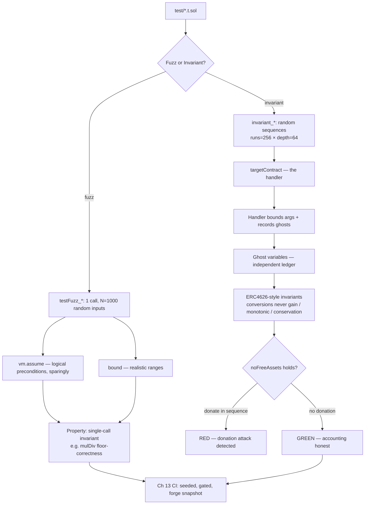

# 12. Fuzzing & Invariant Testing

## Learning Objectives

By the end of this chapter you will be able to:

1. Explain what Foundry fuzzing actually is — `testFuzz_*` functions re-run against thousands of randomly generated inputs — and why `runs = 1000` is evidence, not proof (the miss-probability math, carried from Ch 10).
2. Shape fuzz input domains correctly: `vm.assume` for logical preconditions (sparingly), `bound` for realistic ranges — and why over-assuming is how fuzz suites get faked green.
3. Describe invariant testing as a different beast from fuzzing: not random inputs to one call, but random *sequences* of calls against accumulating state, checked after every call (`[invariant] runs = 256, depth = 64`).
4. Write the handler pattern: a contract wrapping the protocol's surface that bounds arguments, tracks ghost variables, and encodes the call distribution *including the adversarial calls* — the difference between an invariant suite that tests and one that performs.
5. Write the canonical ERC4626-style invariant set — conversions never gain, `convertToShares` is monotonic, assets are always accounted for — and know why the *no-free-assets* invariant is the detector for the inflation/donation attack class (Ch 16 preview, `sMER`).
6. Know the honest limits: fuzz/invariant green proves properties over the executed sequences, never over all of state space, and never over operator trust — the 2026 admin-key incidents are outside what any invariant can express.

## Prerequisites

- **Chapter 10** (Foundry Workflow) — the toolchain and the math this chapter stands on: `[fuzz] runs = 1000`, `[invariant] runs = 256 depth = 64`, parameter-exact `expectRevert`, `makeAddr`, and the locked miss-probability formula `(1−p)^N ≈ e^(−pN)` that this chapter turns into confidence tables.
- **Chapter 11** (Unit Testing & Fork Testing) — the isolation model and the test pyramid; fuzz/invariant is layer 3 of that pyramid, and the fork-test conventions (RPC gates, pinning) stay in force.

Supporting references (not prerequisites): **Ch 4** (integer arithmetic — every fuzz property here is a claim about overflow and rounding direction), **Ch 6** (storage — `vm.store` appears only in storage-shape tests), **Ch 8** (gas methodology — invariant runs carry no gas assertions), **Ch 9** (assembly discipline — no assembly in this lab). Locked conventions remain in force; the error catalog stays PROVISIONAL until Ch 14/20.

## Theory

### Fuzzing: random inputs, statistical coverage

A `testFuzz_foo(uint256 x)` function is not a unit test with an argument — it is a *property* that the runner checks against `runs` (default 1000) randomly generated values of `x`. Each run is an independent execution: fresh state, one call, one assertion. The generator samples the whole `uint256` domain (2²⁵⁶ values) from a deterministic PRNG, so the same seed produces the same input sequence — the property that makes a failure reproducible.

The mental model that matters: fuzzing does not search the domain, it *samples* it. 1000 points out of 2²⁵⁶ is a statistically meaningless fraction of the space — the value is that the samples are pseudo-random, so they land on edges a hand-written test never reaches (values near 2²⁵⁶−1, adversarial bit patterns). A fuzz test is a bet: "if the property is broken on a non-trivial fraction of inputs, the sampler will find it." The math of that bet is in Mathematical Foundations.

### `vm.assume` and `bound`: shaping the domain

Raw `uint256` inputs are mostly useless for a function that expects a nonzero denominator or an amount below a cap. Two tools shape the domain:

- `vm.assume(cond)` — if `cond` is false, the runner *rejects* the input and draws another. Rejection is not failure, up to `maxTestRejects` (default 65,536). The cost is efficiency, and worse, it can *hide* the bug: if the buggy region is exactly what your `assume` excludes, the suite is green by construction.
- `bound(x, lo, hi)` — maps the input into `[lo, hi]` deterministically (fold modulo the range). No rejection, no wasted draws, uniform enough for property testing.

The hygiene rule locked here: **`bound` ranges to realistic domains, `assume` only for logical preconditions, and never an `assume` so tight that the interesting (buggy) region is excluded.** The lab demonstrates the failure mode: a `sum` fuzz test that `assume`s every element `< 2^250` will never see the overflow that lives at the top of the range.

### Invariant testing: properties over sequences

An invariant test (`invariant_*` function, no arguments) asserts a property that must hold *after every call in a random sequence of calls* against a target contract. The runner's model: pick a target, pick a random caller and function with random arguments, execute, check every `invariant_*` predicate, repeat up to `depth` times (64), then start a fresh sequence — `runs` times (256). Total: up to 16,384 executed calls per invariant function per test run, against *accumulating* state.

The distinction from fuzzing is the whole point: a fuzz test proves a property of one call; an invariant proves a property of *state evolution*. Reentrancy-shaped bugs, share-accounting drift, rounding attacks, and donation attacks are all *multi-call* properties — they need a sequence (deposit, donate, deposit, redeem), which is exactly the shape the invariant runner generates. Fuzz finds single-call bugs; invariants find state-machine bugs. The boundary is not perfectly sharp — a fuzz test on a *view* that reads accumulated state can surface sequencing effects — but as a mental model for where to write the test, it holds.

### Handlers: encoding reality into the sequence

Raw invariant runs call the target's functions with uniformly random arguments from random senders — which mostly means reverts and no-ops. The **handler** pattern fixes this: a contract that wraps the protocol's external surface, one function per operation, that (a) bounds arguments to realistic values, (b) encodes the call distribution you care about (deposits more often than withdrawals, the adversarial `donate` deliberately included), and (c) tracks **ghost variables** — public state accumulating a parallel accounting of what happened, for conservation assertions. You register it with `targetContract(address(handler))` and optionally constrain callers with `targetSender`, so the runner's random sequences become *meaningful* sequences.

The trap inside the pattern: a handler that only ever makes "reasonable" calls is a suite that performs. The adversarial calls — donation, flash-borrow-shaped value injections, emergency paths — must be *in* the handler, or the invariants are checking a world that cannot break. The lab's `donate` wrapper exists precisely because the no-free-assets invariant is only a detector if the sequence can attack.

### Ghost variables: making conservation observable

An invariant like "total assets are always accounted for" cannot be written against the contract's own state alone — it needs an independent record of what *should* be true. Ghost variables provide it: the handler increments `ghost_totalDeposited` on every deposit and decrements it on every redemption, and the invariant asserts `vault.totalAssets() == ghost_totalDeposited`. The ghost is the test's ledger, independent of the contract's; when they diverge, the contract lost track of value. Ghost discipline: each ghost has exactly one writer — the handler function that models the operation — and invariants only read them. A ghost written in two places (or mutated by the invariant itself) stops being an independent witness.

### ERC4626-style invariants (the TOC's target)

The canonical invariant set for a share-based vault — the set Ch 16's `sMER` and Ch 20's `MeridianVault` will run — is small and specific:

1. **Conversions never gain.** With floor rounding in both directions, `convertToAssets(convertToShares(x)) <= x` and the mirror must hold for every `x`. A rounding-direction bug (ceil where floor is specified) breaks this within a handful of runs — the cheapest possible detector of the bug class that took down Balancer V2's ComposableStablePool (~$128M, Nov 2025, full treatment Ch 26).
2. **Monotonicity.** `x1 <= x2` implies `convertToShares(x1) <= convertToShares(x2)`. Non-monotonic conversion math is arbitrage — a user can deposit, convert, withdraw, and profit from the price function itself.
3. **Conservation / no free assets.** `totalAssets() == ghost_totalDeposited` — every asset is accounted for, and *no asset enters without minting shares*. In the lab's green suite — where `donate` is excluded from the target set, so `ghost_donated` stays zero — the conservation and no-free-assets checks are intentionally the same predicate (`invariant_totalAccountedFor` ≡ `invariant_noFreeAssets`), and only become distinct when donation joins the target set. The second half is the inflation/donation attack detector: the moment a donation inflates the share price without a share mint, `totalAssets() > ghost_totalDeposited` and the invariant flips red. This is the class that broke Euler (Mar 2023, ~$197M) and the class t11s documented for ERC4626 vaults in 2022 — the lab below demonstrates it end to end.
4. **Round-trip honesty.** Deposit-then-full-redeem never returns more than deposited, and the loss is bounded by the rounding analysis in Mathematical Foundations — never by surprise.

## Mathematical Foundations

### Fuzzing is evidence, not proof

Ch 10 locked the miss probability: if a bug triggers on fraction `p` of inputs, `N` runs miss it with probability `(1−p)^N ≈ e^(−pN)`. Inverting for confidence `c = 1 − (1−p)^N` gives the runs needed: `N = ln(1−c) / ln(1−p) ≈ −ln(1−c) / p`.

| Bug triggers with probability p | Runs for 95% confidence | Runs for 99% confidence |
|---|---|---|
| 1 in 10 (p = 0.1) | 29 | 44 |
| 1 in 1,000 (p = 10⁻³) | ≈ 2,995 | ≈ 4,603 |
| 1 in 10,000 (p = 10⁻⁴) | ≈ 29,957 | ≈ 46,050 |
| 1 in 1,000,000 (p = 10⁻⁶) | ≈ 3,000,000 | ≈ 4,600,000 |

Inverting the miss-probability equation makes this concrete: `(1−p)^1000 = 0.05` gives `p = 1 − 0.05^(1/1000) ≈ 0.003` — a bug must trigger on at least ~1 in 334 inputs for 1000 runs to catch it with 95% confidence.

Two readings. First: with the locked `runs = 1000`, you are 95%-confident only against bugs that trigger on at least ~1 in 334 inputs; anything rarer is likely missed — which is why fuzzing complements, never replaces, unit tests (which pin exact cases) and invariants (which multiply the effective sequence space). Second: the *shape* of the table — linear in `1/p` — is why cranking `runs` to 100,000 is rarely the right spend: the wall-clock cost is linear while the confidence gain is logarithmic. Spend the runs on *better distributions and handlers*, not on a bigger number.

### Sequence coverage: patterns in runs × depth

For invariant runs, the unit of coverage is the sequence, and the question is: how likely is a specific ordered pattern of `k` calls? With `runs = 256, depth = 64`, each invariant function sees ~16,384 executed calls, i.e. ~16,384 − k + 1 windows of length `k`. With `h` handler functions chosen roughly uniformly, a specific `k`-call pattern occurs with expectation ≈ `16,384 / h^k`.

| Handler functions h | 3-call pattern | 4-call pattern | 5-call pattern |
|---|---|---|---|
| 2 | ≈ 2,048 | ≈ 1,024 | ≈ 512 |
| 3 | ≈ 607 | ≈ 202 | ≈ 67 |
| 4 | ≈ 256 | ≈ 64 | ≈ 16 |

> **Uniformity assumption.** This table assumes uniform random selection among handler functions. If Foundry's selector sampling is non-uniform in practice (weighted by function signature bytes or other factors), the actual pattern frequency may differ; treat the table as an order-of-magnitude guide, not a precision calculation.

The reading: a 4-call attack (deposit → donate → deposit → redeem) against a 3-function handler is exercised ~202 times per run — the attack *will* be seen. But a 7-call pattern against a 5-function handler has expectation ≈ 16,384/78,125 ≈ 0.2 — it may never occur. This is the mathematical argument for small handlers (fewer, well-chosen operations) and for *directed* sequences (the deterministic attack demo in the lab) alongside the random ones. Invariant runs explore; directed tests prove.

### Rounding bounds: what floor/floor costs

The lab's vault converts with floor division in both directions: `shares = ⌊x·S/A⌋`, `assetsOut = ⌊shares·A/S⌋`, where `S` = share supply, `A` = tracked assets. The full round trip (deposit `x`, redeem everything):

```
shares    ≥ x·S/A − 1            (floor loses < 1)
assetsOut ≥ shares·A/S − 1       (floor loses < 1)
          ≥ x − A/S − 1
loss = x − assetsOut ≤ A/S + 1, i.e. ≤ ⌊A/S⌋ + 1 wei
```

Substituting the shares lower bound, `assetsOut ≥ x − A/S − 1`; since prices are integers, `A/S` is at most `⌊A/S⌋`, giving loss ≤ `⌊A/S⌋ + 1 wei`.

Two consequences. First, at a fair price (`A = S`) a full round trip loses at most 1 wei; at a 1:1-seeded vault with only deposits, `A/S` stays exactly 1 and the round trip is lossless. Second — the point — `A/S` *is* the share price, and donation is what inflates it: at `A/S = 3.33` the same round trip can cost 3+ wei. The tolerance-based invariant (`assetsOut + ⌊A/S⌋ + 1 >= x`) is therefore *not* the security property — the security property is keeping `A/S` honest, which is exactly `invariant_noFreeAssets`. Rounding tolerance tells you how much the design *costs*; conservation tells you whether it is *broken*.

## Engineering Perspective

### The M3 ladder completes

Ch 10 gave the toolchain, Ch 11 the fork layer, this chapter the fuzz/invariant layer, Ch 13 the CI gate. The division of labor is complete: **unit tests** pin exact behavior and carry gas assertions; **fork tests** prove interoperability with real contracts at a pinned block; **fuzz tests** sample the input space for single-call property violations; **invariant tests** walk random sequences against accumulating state to find state-machine and accounting drift. A finding's *layer* tells you where the bug lives: a fuzz failure is a pure-function bug, an invariant failure is an accounting or sequencing bug, a fork failure is an integration bug.

### What the incidents teach

- **Euler Finance (Mar 2023, ~$197M)** — donate-to-self on lending share accounting. The exploit is a sequence: donate assets to a market, then liquidate against the distorted accounting. It is the exact shape `invariant_noFreeAssets` exists to catch — assets in the protocol that no deposit accounted for.
- **Balancer V2 ComposableStablePool (Nov 2025, ~$128M)** — a rounding/arithmetic invariant failure in the pool's rate math (full derivation Ch 26). The class is the one `conversions never gain` pins: if any conversion path can mint value from rounding, the invariant sees `convertToAssets(convertToShares(x)) > x` within a handful of random runs.
- **The ERC4626 inflation attack class (t11s, 2022; OZ docs)** — deposit a dust amount, donate to inflate the share price, let the next depositor buy shares at the inflated price, redeem for their value. The lab below *is* this attack, reduced to 60 lines, with the invariant that detects it. Ch 16 fixes it properly for `sMER` (virtual offset / dead shares); the point here is the *detector*, which is portable regardless of the fix.
- **2026 trust surface (Kelp DAO/LayerZero, Drift, ~$285–292M, Apr 2026)** — the honest limit, stated once: invariants express properties of *code*. An admin-key compromise does not violate any invariant you can write against the deployed bytecode — the calls it makes are legal calls. Operator trust is Ch 25's domain (multisig, timelock, least privilege); the 2026 incidents are why Meridian's privileged paths get *tested* (Ch 10 negative tests, Ch 11 impersonation) but never *proven* safe by any suite.

### The honest limit of the whole layer

A green fuzz/invariant suite means: over the executed sequences, with these handlers, these properties held. It does not mean the properties hold over all sequences, and it does not mean they are the right properties. The invariant you forgot to write is the one the attacker will find — derive the invariant set from the *threat model* (what value could leave?), not from the functions you happen to have.

## Mermaid Diagram



## Code Walkthrough

The lab is four pieces: `meridian/src/Mini4626.sol` (the deliberately vulnerable mini-vault), `meridian/src/MiniToken.sol` (its lab-only mintable asset), `meridian/src/FuzzProbe.sol` (pure-function fuzz targets), and the test layer — `meridian/test/FuzzProbe.t.sol`, `meridian/test/Mini4626Handler.sol`, `meridian/test/InvariantProbe.t.sol`. All pedagogical, **NOT** protocol (standing convention).

**`Mini4626`** is the attack surface in miniature: `deposit(assets)` mints `shares = convertToShares(assets)` and reverts `ZeroShares` if floor rounding mints zero; `redeem(shares)` burns and pays `convertToAssets(shares)`; `donate(assets)` pulls assets in and credits `totalAssets_` **without minting shares** — the attack primitive. `convertToShares`/`convertToAssets` are the naive floor forms: no virtual offset, no dead shares, donation reachable — deliberately the vault the t11s report describes. Ch 16's `sMER` is the fixed, production version.

**`FuzzProbe`** gives clean single-call properties. `mulDivFloor(a, b, d)` pins floor correctness: `q = mulDivFloor(a,b,d)` is the largest `q` with `q·d <= a·b` (and `(q+1)·d > a·b`), fuzzed over a `bound`-ed domain where `a·b` cannot overflow; `test_mulDiv_naiveOverflows` pins the Panic 0x11 the naive form throws outside it — the reason production uses full-precision mulDiv (Ch 4/20). `sumChecked`/`sumUnchecked` pin checked-vs-unchecked semantics: the checked sum either equals the unchecked sum or reverts with Panic 0x11 — no third outcome (the BEC/SMT batchOverflow class, Ch 2/4). `toUint8` pins narrowing-cast truncation: `uint8(x) == x % 256`.

> ⚠ Import note: `stdError` is not re-exported by `forge-std/Test.sol`. Add `import { stdError } from "forge-std/StdError.sol";` explicitly whenever you assert `vm.expectRevert(stdError.arithmeticError)` — the Panic 0x11 checks in `FuzzProbe.t.sol` depend on it.

**`Mini4626Handler`** wraps the vault with three functions — `deposit(uint256)`, `redeem(uint256)`, `donate(uint256)` — each `bound`-ing its argument, funding itself by minting `MiniToken` (lab-only open `mint`), and updating the ghosts `ghost_totalDeposited` (net of redemptions) and `ghost_donated`. Every vault revert edge (`ZeroShares` at skewed prices, `InsufficientBalance`) is pre-checked so sequences stay valid — which is what lets the lab lock `fail_on_revert = true`: a reverting sequence is a failed run, so handlers must not revert.

**`InvariantProbe.t.sol`** targets the handler — `targetContract(address(handler))` plus a `targetSelector` whitelist of exactly `deposit` and `redeem`, with the test contract itself `excludeContract`-ed — and asserts the ERC4626-style set: `invariant_totalAccountedFor` (`totalAssets == ghost_totalDeposited`), `invariant_noFreeAssets` (`totalAssets == ghost_totalDeposited`), `invariant_conversionsNeverGain`, `invariant_monotonicShares`, plus `testFuzz_conversionsNeverGain_atSkewedPrice` (a donation-skewed vault where floor/floor actually loses wei, fuzzed over 1000 runs) and the deterministic attack demo. Because `donate` is excluded from the `targetSelector` whitelist, `ghost_donated` is never written in the green suite and the two checks are intentionally the same predicate — they become distinct only when donation joins the target set (the `ZzDonationBreaks` variant).

`test_donationAttack_stealsFromLateDepositor` is the directed proof — run against a **fresh, young vault** (see the finding below): victim deposits 100,000,000 at the inflated price (~1,001,000×) and mints **99 dust shares** — a smaller deposit would mint 0 and hit `ZeroShares`, the capture edge — and the victim's full redemption recovers less than the deposit. The attacker then redeems their 1,000 shares for 1,000,910,829 against a total contribution of 1,000,001,000: the profit *is* the victim's loss. The test asserts the loss; `invariant_noFreeAssets` is the property that flags the *condition* (free assets) rather than the *symptom* (a specific victim).

## Production Example

**The Ch 16 `sMER` / Ch 20 `MeridianVault` invariant suite** — the shape this lab generalizes to:

1. **Handlers per surface, small.** One handler for the vault (deposit/borrow/repay/withdraw), one for liquidation (Ch 24–25), one for the oracle registry (Ch 22). Three functions each, not ten — the `h^k` math above is the reason.
2. **The conservation set.** `totalAssets == Σ user assets + debt` ghosts; `Σ collateral == Σ liabilities` per market; `totalSupply == Σ shares`. The Euler lesson, as invariants.
3. **The conversion set.** `previewRedeem(previewDeposit(x)) <= x`; share price monotonic; no free assets — the Balancer V2 lesson and the inflation-attack detector, run against `sMER` from genesis.
4. **The health-factor set.** Every actor's health factor `>= 1` after every non-liquidation call; liquidations restore health `>= 1` — the invariant that makes the liquidation engine (Ch 24–25) safe by construction.
5. **The governance set (Ch 25).** Timelock delay never decreases; only whitelisted targets are callable; no proposal can move `sMER` without the full delay — the Beanstalk lesson as an invariant.
6. **Seeded and pinned.** `[fuzz] seed` locked in CI so any red run replays byte-identically — the Ch 13 gate runs the whole thing per PR.

## Foundry Lab

Materialized and **compile-verified in this run** (forge 1.7.1, solc 0.8.24, cancun, optimizer 200):

- `meridian/src/FuzzProbe.sol`, `meridian/src/Mini4626.sol`, `meridian/src/MiniToken.sol`, `meridian/test/FuzzProbe.t.sol`, `meridian/test/Mini4626Handler.sol`, `meridian/test/InvariantProbe.t.sol`.
- `foundry.toml`: `[invariant]` gains `fail_on_revert = true` (handlers pre-check so sequences never revert; a reverting sequence now fails the run instead of silently no-op'ing).
- Full repo suite after this chapter: **106 passed / 0 failed / 6 skipped (112 total) across 16 suites** (Ch 11 baseline 95 passed / 6 skipped across 14 suites, +11 new tests). The four invariants ran 256 sequences × 64 depth each — 16,384 calls per invariant — with **0 reverts** against the handler (the `fail_on_revert` contract holding).
- **Detector verified, not assumed:** a one-off `ZzDonationBreaks` variant that adds `donate` to the handler's target set was run and observed to fail — `invariant_noFreeAssets` flipped red with `totalAssets != ghost_totalDeposited`, the delta being **exactly the donation amount (427 wei for a donate(427))**, with the donation calls in the failing sequence. The variant was then removed and the suite re-verified green.
- **Two real findings from the experiment, both kept:** (1) the attack demo initially ran against the setUp-seeded vault (1e24 seed) and the donation was diluted to zero profit (`A/S ≈ 1` at redemption) — the inflation attack only bites when donation ≫ existing supply, so the demo now builds a fresh vault; the invariant detector is *seed-independent* because it tracks the ghost ledger. (2) With `donate` in the sequence, `invariant_totalAccountedFor` hit a **ghost-underflow**: `ghost_totalDeposited -= assetsOut` goes negative (Panic 0x11) because redemptions pay out donated value the ghost never recorded — the ghost-drift class from Security Analysis #4, observed for real, and the reason donate stays out of the green suite's target set.
- **Seed replay verified in-run:** the failing `ZzDonationBreaks` run reproduced a byte-identical failing sequence under the same `FOUNDRY_FUZZ_SEED` (1234) and a different sequence under a different seed (999).
- Standing methodology holds: no gas assertions in fuzz/invariant code (Ch 8); `vm.assume` used only for logical preconditions (`d != 0`); no `vm.store` anywhere in this lab (Ch 10); cheatcodes confined to `test/`.

Fork tests remain skipped on this host (no `MAINNET_RPC_URL`, per Ch 11); this chapter adds no fork dependency.

## Security Analysis

**1. Fuzz green is not proof.** The confidence table is the honest summary: 1000 runs is 95%-confident only against bugs triggering on ≥ 1/334 of inputs. A green fuzz suite is evidence about the sampled region — nothing more.

**2. `assume`-hygiene is a security property.** Over-assuming excludes the buggy region by construction. Audit every `assume`: could the bug live exactly where the assume filters? If so, `bound` the range instead, or write a directed test.

**3. Handlers can encode the attack away.** The most common way an invariant suite fakes green is a handler that never makes the harmful call. The adversarial operations — donation, price manipulation inputs, emergency paths — must be in the handler, or the invariants check a world that cannot break.

**4. Ghost drift.** If the handler's ghosts drift from the contract's actual state (a missed decrement, a wrong conversion), the conservation invariants silently test the wrong equation. The lab's experiment hit this for real: with donation in the sequence, `ghost_totalDeposited -= assetsOut` underflowed because redemptions paid out value the ghost never recorded. Ghosts are written in exactly one place per operation and reviewed like production code.

**5. Invariants cannot see operator trust.** The Apr 2026 admin-key incidents (~$285–292M) executed *legal* calls through *legitimate* keys. No invariant expresses that; Ch 25's multisig/timelock work is the control surface, and this honest limit is part of Meridian's security posture, not an omission.

**6. Unseeded runs are a debugging tax.** Without a pinned seed, a red run may not reproduce. CI pins `[fuzz] seed`; ad-hoc runs print the seed on failure and honor `FOUNDRY_FUZZ_SEED` for replay (verified in-run).

**7. `fail_on_revert = false` (the default) can mask.** A sequence that reverts every call tests nothing; the lab locks `fail_on_revert = true` so handlers must produce valid sequences — reverts become failures instead of silence.

## Common Mistakes

1. **Treating fuzz as exhaustive** — 1000 samples of 2²⁵⁶ is a bet, not a search; read the confidence table before claiming a property is "fuzzed".
2. **`vm.assume` as a bug filter** — excluding the domain where the bug lives; prefer `bound`, and audit every `assume` for what it hides.
3. **Fuzzing only pure functions** — the interesting bugs are in state evolution; that is what invariants are for.
4. **A handler that only makes polite calls** — no donation, no manipulation inputs; the suite performs instead of tests.
5. **Huge handlers** — 10+ functions collapse the `h^k` pattern coverage; three well-chosen operations beat ten random ones.
6. **Ghosts written in two places** — a ghost updated in the handler *and* the test drifts; one writer per ghost.
7. **`vm.assume` inside invariant functions** — rejection inside a sequence is not bounding; handlers bound, they never assume.
8. **Unseeded invariant runs in CI** — red runs that cannot be replayed; pin the seed.
9. **`fail_on_revert = false` left on** — reverting sequences silently no-op; lock `true` and make handlers valid.
10. **Asserting gas in invariant code** — the runner's call overhead is not protocol gas (Ch 8); gas lives in the unit layer.

## Gas Optimization

Invariant runs are the most expensive thing the test suite does — up to 16,384 calls per invariant function — but they run on a local EVM and burn no real gas, so the constraint is *wall-clock*, and the optimization is *sequence economy*: fewer handler functions (the `h^k` math again), tighter `bound` ranges, `fail_on_revert = true` so wasted reverts fail instead of silently consuming depth. Two gas-relevant notes for the protocol itself: the conversion invariants are the guardrail that keeps future "gas optimizations" honest — an `unchecked` block inside `convertToShares` that can overflow is a gas saving that flips `conversionsNeverGain` red, which is exactly what should happen; and the borrow-path budget (~101,500 gas net, Ch 8) is enforced in the unit layer and by Ch 13's `forge snapshot` gate — fuzz/invariant code carries no gas assertions (Ch 8 reaffirmed).

## Reading Production Source Code

1. **forge-std `src/StdInvariant.sol`** — `targetContract`, `targetSelector`, `targetSender`, `excludeContract`, `excludeSender`, and the `FuzzSelector`/`FuzzArtifactSelector` types — the exact API the lab uses.
2. **OpenZeppelin `contracts/token/ERC20/extensions/ERC4626.sol` + its test suite** — the reference for both the vault math and the fuzz/invariant patterns Ch 16's `sMER` suite will mirror (round-trip and conversion properties, donation-attack tests).
3. **Balancer's monorepo** — after the V2 incidents, the team's invariant testing around pool math is the production-scale example of the rounding/conservation set this chapter teaches; Ch 26 reads the exploit, this chapter reads the testing response.
4. **Euler's post-mortem** (Mar 2023) — the donate-to-self sequence, step by step; map each step to the invariant that would have flagged it.
5. **t11s "The Inflation Attack" (2022)** — the canonical ERC4626 donation-attack write-up; the lab's `donate` is its minimal reproduction.

Ask of every invariant suite you read: *what is the handler allowed to do — and what is it not? is the adversarial call present? are the ghosts written in exactly one place? is the seed pinned? would a free-asset injection flip any predicate red?* That is the invariant-suite audit in five questions.

## Exercises

1. Add `donate` to the handler's target set (the `ZzDonationBreaks` experiment) and watch `invariant_noFreeAssets` flip red; then remove it. Explain why the *condition* (free assets) is the right thing to detect rather than the specific victim.
2. Change `convertToShares` to round up (`+ 1`) and re-run the suite: which invariant fails first, and why is that the economically dangerous direction?
3. Compute the runs needed for 99% confidence against a `p = 10⁻⁵` bug; argue whether raising `runs` or improving the handler is the better spend.
4. Write a `testFuzz` for `toUint8` that uses `vm.assume(x < 256)` — then delete the assume and explain what the fuzz suite was hiding.
5. Trace the donation attack demo by hand using the lab's numbers: attacker deposits 1,000 → donates 1,000,000,000 → victim deposits 100,000,000. Compute (a) the share price after donation, (b) the victim's minted shares, (c) the attacker's redemption proceeds after the victim deposits. Confirm the victim recovers less than their deposit.
6. Pin `[fuzz] seed` in a throwaway run, force a red invariant, and confirm the failing sequence replays byte-identically with the same seed and differently with another.

## Weekly Project

**Meridian's invariant-testing playbook — the layer Ch 13's CI gates and Ch 39's capstone audit reuses:**

1. `meridian/src/Mini4626.sol` + `MiniToken.sol` + `FuzzProbe.sol` + `meridian/test/Mini4626Handler.sol` + `InvariantProbe.t.sol` + `FuzzProbe.t.sol` — the lab above, **materialized and verified in this run** (forge 1.7.1; suite counts in Foundry Lab; detector verified red-then-green).
2. `docs/invariant-testing-playbook.md` — the fuzz/invariant distinction, the confidence table, the `h^k` sequence math, handler and ghost discipline, the five-question audit, the ERC4626-style invariant set as the template for `sMER` (Ch 16) and `MeridianVault` (Ch 20–25).
3. A note in `docs/gas-budget.md` (Ch 7 deliverable): the borrow-path gas budget stays enforced in the unit layer and by Ch 13's `forge snapshot`; fuzz/invariant suites carry no gas assertions and are wall-clock-budgeted via handler size.

## Deliverables

1. The lab (`Mini4626`, `MiniToken`, `FuzzProbe`, `Mini4626Handler`, `InvariantProbe.t.sol`, `FuzzProbe.t.sol`): materialized and compile-verified in-run (forge 1.7.1); full repo green — **106 passed / 6 skipped across 16 suites**; `invariant_noFreeAssets` detector verified red under donation targeting, green without.
2. `foundry.toml`: `[invariant] fail_on_revert = true` locked (handler validity becomes a run requirement).
3. Conventions locked: `bound` over `assume` (assume only for logical preconditions); handlers small and adversarial-complete; ghosts single-writer; seeds pinned in CI; invariant runs carry no gas assertions.

## Quiz

1. `testFuzz` vs `invariant_`: what exactly is different about what the runner does, and what class of bug does each find?
2. With `runs = 1000`, what is the smallest bug-trigger probability you are 95%-confident of catching, and where does that number come from?
3. Why does a handler with 10 functions weaken an invariant suite, mathematically?
4. Write the no-free-assets invariant in words; what exploit class does it detect, and which two real incidents does it map to?
5. Why can no invariant detect an admin-key compromise, and where does Meridian's control for that surface live?

**Answers:** (1) Fuzz re-runs one call against N random inputs — single-call property violations; invariant runs random *sequences* against accumulating state, checking after every call — state-machine, accounting, and sequencing bugs. (2) ≈ 1/334 (`1 − 0.05^(1/1000)`); below that, the miss probability `(1−p)^N` exceeds 5%. (3) Expected occurrences of a `k`-call pattern ≈ `16,384/h^k`; 10 functions collapse a 4-call attack to ~16 expected hits, a 7-call attack to ~0.2. (4) "No asset enters the vault without minting shares" — `totalAssets() == ghost_totalDeposited`; the donation/inflation attack class: Euler (Mar 2023, ~$197M) and the ERC4626 inflation attack (t11s 2022; lab's `donate`). (5) Admin-key calls are legal calls; invariants express code properties, not operator trust — the control surface is Ch 25's multisig/timelock/least-privilege design (2026 Kelp/Drift grounding).

## Further Reading

- Foundry Book — "Fuzzing" and "Invariant Testing" chapters (`book.getfoundry.sh`): `vm.assume`, `bound`, `targetContract`/`targetSelector`/`targetSender`, `fail_on_revert`, seeds.
- forge-std `src/StdInvariant.sol` — the target-selection API the handler pattern builds on.
- OpenZeppelin ERC4626 + its test suite — the production reference for the conversion/conservation invariant set.
- t11s (Tincho), "The Inflation Attack" (2022) — the donation-attack write-up the lab reproduces; Ch 16 fixes it for `sMER`.
- Incident write-ups: Euler (Mar 2023, ~$197M, donate-to-self); Balancer V2 ComposableStablePool (Nov 2025, ~$128M, rounding — full treatment Ch 26); Beanstalk (Apr 2022, ~$182M, governance flash loan — the Ch 25 invariant set's target).
- 2026 security grounding: Kelp DAO/LayerZero and Drift admin-key incidents (~$285–292M, Apr 2026) — the honest limit of what invariants can express.
- Ch 13 (CI + static analysis + `forge snapshot`) and Ch 39 (capstone full-system audit) — where this chapter's playbook becomes a gate and then a deliverable.

## Ledger Update

**Ch 12 — Fuzzing & Invariant Testing (2026-08-13)** — full entry appended to `ledger/CONTINUITY_LEDGER.md`.

- Locked conventions (canon): **`bound` over `vm.assume`** (assume only for logical preconditions like `d != 0`; never an assume that excludes the buggy region); **handlers small and adversarial-complete** (3 ops ≫ 10 ops, `h^k` math; the calls the threat model names MUST be in the handler — donate included); **ghosts single-writer** (handler writes, invariants read); **`[invariant] fail_on_revert = true` locked in foundry.toml** (handlers pre-check so sequences never revert; a reverting sequence fails the run); **seeds pinned in CI** (`[fuzz] seed` / `FOUNDRY_FUZZ_SEED` — replay verified in-run); **no gas assertions in fuzz/invariant code** (Ch 8 reaffirmed).
- Numbers locked: confidence table (runs=1000 → 95% confidence only for p ≥ ~1/334; 99% needs N ≈ −ln(0.01)/p); sequence coverage ≈ `16,384/h^k` expected pattern hits; floor/floor round-trip loss ≤ ⌊A/S⌋+1 wei (lossless at A = S).
- Repo artifacts (lab, NOT protocol): `meridian/src/Mini4626.sol` (deliberately vulnerable 4626-flavored vault — floor/floor, public `donate`, the t11s attack shape; Ch 16's `sMER` is the fixed production version), `meridian/src/MiniToken.sol` (lab-only mintable asset), `meridian/src/FuzzProbe.sol` (mulDiv floor-correctness, checked/unchecked sum overflow surface, uint8 truncation), `meridian/test/Mini4626Handler.sol` (bounding + ghosts `ghost_totalDeposited`/`ghost_donated`), `meridian/test/InvariantProbe.t.sol` (`invariant_totalAccountedFor` — intentionally ≡ `invariant_noFreeAssets` in the green suite; `invariant_noFreeAssets`, `invariant_conversionsNeverGain`, `invariant_monotonicShares`, skewed-price fuzz, deterministic `test_donationAttack_stealsFromLateDepositor`), `meridian/test/FuzzProbe.t.sol` (mulDiv/sum/toUint8/bound properties; `stdError` needs an explicit `forge-std/StdError.sol` import — Test does not re-export it). **Materialized and compile-verified IN THIS RUN** (forge 1.7.1): **106 passed / 0 failed / 6 skipped (112 total) across 16 suites** (Ch 11 baseline 95/0/6 across 14). **Detector verified red-then-green** — `ZzDonationBreaks` (donate targeted) failed `invariant_noFreeAssets` with delta == donation amount exactly (427 wei), plus a real ghost-underflow finding (`ghost_totalDeposited -= assetsOut` underflows when redemptions pay donated value — ghost-drift class); variant removed, suite re-verified green. Seed replay verified: `FOUNDRY_FUZZ_SEED=1234` twice → identical failing sequence; seed 999 → different. Real demo finding: attack needs donation ≫ existing supply — against the 1e24 setUp seed the donation diluted to zero profit; demo uses a fresh vault; detector is seed-independent (ghost ledger).
- Weekly-project artifacts (in chapter, not yet on disk): `docs/invariant-testing-playbook.md` + `docs/gas-budget.md` note (invariant suites wall-clock-budgeted via handler size; gas stays in unit layer + Ch 13 snapshot gate).
- Glossary additions: fuzz miss probability, `bound` vs `vm.assume`, handler, ghost variable, invariant target set, `fail_on_revert`, inflation/donation attack, ERC4626-style invariant set.
- Grounding incidents: **Euler (Mar 2023, ~$197M, donate-to-self — the noFreeAssets shape)**; **Balancer V2 ComposableStablePool (Nov 2025, ~$128M, rounding — the conversionsNeverGain shape; full treatment Ch 26)**; **ERC4626 inflation attack class (t11s 2022 — the lab's `donate`)**; **2026 trust surface (Kelp DAO/Drift, ~$285–292M) — honest limit: invariants cannot express operator trust; control surface is Ch 25**.
- Drift: none. Module boundary: none (M3 ends Ch 13 — next boundary audit at Ch 13).
- **ERRATA APPLIED (2026-08-14, review `errata/12_Fuzzing_and_Invariant_Testing_REVIEW.md`):** E-1 Euler date corrected to Mar 2023 (all occurrences incl. Quiz + Ledger); E-3 `invariant_conservation` renamed `invariant_totalAccountedFor`, `ghost_donated` dropped from the green suite, intentional equivalence with `invariant_noFreeAssets` documented; E-5 `stdError` import surfaced as a Code Walkthrough callout; P-1..P-5 + S-1 applied; E-4 skipped (locked TOC grounding — Balancer V2 Nov 2025 canon); S-2 skipped (structural mermaid rework).
