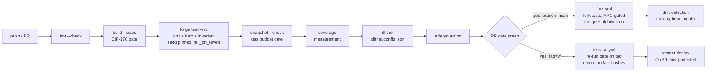

# 13. CI/CD & Static Analysis

## Learning Objectives

By the end of this chapter you will be able to:

1. Explain why CI is a *security control* for a protocol, not hygiene: the deploy pipeline is the last gate between "tests pass on my machine" and "irreversible state on a settlement chain" — and a compromised pipeline is a compromised protocol.
2. Design the gate chain — the ordered set of automated checks every PR must pass — and reason about its probability math under a *stated independence assumption*: each gate multiplies the chance of catching a given bug class; in practice detectors correlate, so the design objective is *diverse coverage* — coverage is dominated by uncovered bug classes and correlated blind spots, not by any single detector.
3. Wire Foundry into GitHub Actions correctly: `foundry-rs/foundry-toolchain`, the `[profile.ci]` config with a pinned fuzz seed, `forge fmt --check`, `forge build --sizes` (the EIP-170 gate), and `forge snapshot --check` as the gas-regression gate — a *percentage* tolerance (Ch 7/8 absolute budgets enforced by a dedicated script).
4. Run and triage static analyzers: Slither's detector/severity model and `slither.config.json`, Aderyn's fast Rust-based detection, the difference between a finding and a bug, and why mass-`--exclude` is how SAST gets faked green.
5. Harden the supply chain: actions pinned by commit SHA, scoped `GITHUB_TOKEN` permissions, secrets never in the repo, OIDC over static keys — grounded in the Ledger Connect Kit, tj-actions/changed-files, Codecov, and SolarWinds incidents, plus the 2026 admin-key lesson (a CI deploy key *is* an admin key).
6. Structure the release pipeline: tagged commits only, gate re-run on the tag, artifact hashes recorded — the delivery mechanism for the per-module milestone (tagged release + testnet deployment with verified source).

## Prerequisites

- **Chapter 10** (Foundry Workflow) — the toolchain this pipeline automates: `forge`/`cast`/`anvil`, cheatcode discipline, `[fuzz] runs = 1000`, parameter-exact `expectRevert`, `makeAddr`, the miss-probability math.
- **Chapter 11** (Unit Testing & Fork Testing) — the test pyramid and the fork conventions this chapter gates: RPC-gated `vm.skip`, pinned blocks, fork layer separated from the daily PR gate.
- **Chapter 12** (Fuzzing & Invariant Testing) — the seeded, `fail_on_revert = true` invariant suite this pipeline runs, and the confidence-table math that explains why *no single gate is proof*.

Supporting references: **Ch 7** (gas schedule + access-list budget), **Ch 8** (optimization hierarchy + the ~101,500-gas net borrow path this chapter's snapshot gate enforces), **Ch 9** (the returndata gate the lab's `withdrawChecked` uses). Locked conventions remain in force; the error catalog stays PROVISIONAL until Ch 14/20.

## Theory

### Why a protocol needs CI (and why it's a security control)

A deployed contract is a settlement surface: no patch, no rollback, no "hotfix to prod" without a governance dance that itself takes days (Ch 25's timelock). The CI pipeline is therefore not a developer convenience — it is the *last deterministic gate* between a commit and irreversible state. Three properties make it a security control rather than hygiene:

1. **It makes the suite the source of truth.** The M3 thesis (Ch 10–12) is that the test suite is the protocol's specification. CI is what makes that thesis enforceable: a PR that breaks a test *cannot* land, regardless of who approves it.
2. **It compresses the review surface.** Every check the pipeline does automatically is a check a human auditor does not have to remember. The TOC's grading weights (correctness 40%, security posture 25%, gas 15%, clarity 20%) are only measurable because CI produces the artifacts: test results, SAST findings, gas deltas.
3. **It is itself an attack surface.** The pipeline holds secrets, executes third-party code (actions, analyzers), and can move tokens on testnets. A compromised pipeline is a compromised protocol — the supply-chain incidents below are the evidence, and the 2026 admin-key incidents (~$285–292M, Apr 2026) are the same trust surface wearing a different hat — **Drift's administrative-control takeover specifically; a CI runner holding a deploy key is an admin key.** (Kelp DAO's April 2026 compromise — cross-chain RPC/message-verification infrastructure — is a distinct failure mode, not an admin-key incident; see Security Analysis.) Meridian treats the pipeline as a privileged operator — least privilege, not trust by default.

### The gate chain

The pipeline is an ordered list of gates, cheapest and fastest first, each with a distinct bug class it is good at catching:

| Layer | Command | Catches | Fails on |
|---|---|---|---|
| Format | `forge fmt --check` | style drift, merge noise | any unformatted file |
| Build | `forge build --sizes` | compile errors, EIP-170 24 KB violations | build failure, oversize contract |
| Unit + fuzz | `forge test` | behavior regressions, edge values | any failing test |
| Invariant | `forge test` (same run) | state-machine/accounting drift (Ch 12) | any violated invariant |
| Gas | `forge snapshot --check` | gas regressions vs committed baseline | delta beyond tolerance |
| Coverage | `forge coverage` | untested branches (measurement step, see Math) | never fails by itself — a threshold must be enforced by a separate step |
| SAST | Slither + Aderyn | known vulnerable *patterns* | exit code / SARIF findings |
| Fork (merge/nightly) | `forge test --match-path "*Fork*"` | integration with mainnet state — pinned-block regression tests; moving-head nightly for drift | any failing fork test |

Two design rules. First, *order is cost*: `forge fmt` runs in seconds; the invariant suite runs in minutes; fork tests cost real RPC money. The cheap gates reject before the expensive ones run. Second, *independence is strength*: unit tests pin exact behavior, fuzzing samples the input domain, invariants explore sequences, SAST reads patterns. They catch *different* bug classes — which is what makes the chain's probability math multiplicative under the *toy-model* independence assumption (see Math). Real suites are not statistically independent: tests share assertions, harnesses, and assumptions, so treat multiplication as an upper bound on real-world benefit, not a measurement.

### Foundry in CI

The canonical wiring, all real and current as of forge 1.7.1:

- `actions/checkout@v4` with `persist-credentials: false` — the checkout token must never survive inside `.git` for later steps to exfiltrate.
- `foundry-rs/foundry-toolchain@v1` — the official Foundry installer action; `version: stable` pins to the latest release. **Teaching shortcut:** the `@v1`-style references in this chapter's YAML are for readability — production CI must replace every action reference with the verified full commit SHA (see Security Analysis), with dependabot proposing updates.
- `FOUNDRY_PROFILE=ci` selecting a `[profile.ci]` section in `foundry.toml` — this chapter adds `[profile.ci.fuzz] seed = "0x…04d2"` so every fuzz/invariant run in CI is byte-reproducible (the Ch 12 seed-replay convention, now enforced by configuration instead of discipline). Real gotcha, verified in this run: **the seed must be a 32-byte hex string** — `seed = 1234` fails with `invalid type: found signed int 1234, expected a 32 byte hex string`; 1234 = `0x4d2`, padded to 32 bytes. The workflow also sets `FOUNDRY_FUZZ_SEED: "1234"` (the env var wins over config) as belt-and-suspenders.
- `forge fmt --check`, `forge build --sizes`, `forge test -vvv`, `forge snapshot --check --tolerance 20` (a 20% deviation threshold — see the gas snapshot section), `forge coverage --report summary`.

### The gas snapshot gate

`forge snapshot` executes the suite and writes one line per test into `.gas-snapshot`:

```
StaticProbeTest:test_withdraw_paysOut() (gas: 37459)
```

The file is committed. `forge snapshot --check` re-runs the suite and fails if any test's gas moved beyond the tolerance; the check reports the failing rows on failure. **Foundry's `--tolerance` is a percentage of the committed value, not a gas budget: `--tolerance 20` allows up to 20% deviation, not 20 gas.** Because the tolerance is relative, the snapshot gate is the wrong tool to enforce an *absolute* protocol budget — 20% of the ~101,500-gas borrow path is ~20,300 gas, so a 20% gate would let a multi-thousand-gas regression through. Absolute budgets get a dedicated assertion or CI script that compares measured gas to a hard cap: the borrow-path budget (net ≈ 101,500 gas vs naive ≈ 124,900, Ch 8), the access-list determinism work (Ch 7), the `unchecked`-block overflow proofs. When Ch 20's `MeridianVault` lands, its borrow/repay tests enter the snapshot (catching *percentage* drift on named tests), and the dedicated budget script keeps the absolute protocol number honest. The snapshot still makes gas a reviewed diff, not a vibe: reviewers see `−23,400` or `+679` per test with the exact test named.

The tolerance is a real design decision, not a constant: too tight and runner noise produces flaky reds (see Math for the noise floor); too loose and percentage-scale regressions slip through. With solc pinned (`0.8.24`) and a fixed runner image, bytecode is deterministic and noise is near zero — but a percentage gate is structurally blind to small absolute regressions on large functions: 20% of 101,500 is 2,030 gas, roughly a cold SLOAD (2,100, Ch 7). That is precisely why Meridian pairs the snapshot gate with a dedicated absolute-budget check rather than relying on the tolerance alone.

### Static analysis: Slither

Slither (Trail of Bits) compiles the contracts, builds the AST + internal representation (including a dataflow and taint model), and runs *detectors* — pattern checks with a severity classification:

- **High/Medium** — e.g. `reentrancy-eth` (ether reentrancy), `unchecked-transfer` (ERC20 `transfer`/`transferFrom` return ignored), `tx-origin` (`tx.origin` authorization), `controlled-delegatecall`, `arbitrary-send-eth`, `suicidal`.
- **Low** — e.g. `missing-zero-check` (address parameter never checked against zero), `incorrect-equality` (strict `==` on balances/allowances), `assembly` (any use of assembly).
- **Informational/Optimization** — `pragma` (floating pragma), `solc-version`, `naming-convention`, `constable-states` (state that could be `constant`), `external-function`.

Two properties matter more than the detector list. First, **a finding is not a bug**: detectors fire on *patterns*, and the pattern is sometimes exactly right (a setter that should reject `address(0)`) and sometimes a false positive (a check performed elsewhere, an invariant that makes the pattern safe). Second, **severity is a triage input, not a verdict**: `tx-origin` is Medium, but for a protocol that locked "authorize with `msg.sender`, never `tx.origin`" in Ch 1, it is a blocker. The lab below makes the distinction concrete: `StaticProbe`'s tests are green while Slither correctly flags the file — *tests prove behavior, SAST flags patterns, and both are needed*.

Configuration is `slither.config.json` (strict JSON — comments are invalid, verified in-run) with `filter_paths` for lab/dependency code, `detectors_to_exclude` for noise detectors, `compile_force_framework: "foundry"` and `foundry_out_directory: "out"`. The severity gate is chosen with `--fail-high` / `--fail-medium` / `--fail-pedantic`; Meridian's workflow ships with the plain exit-code gate and tightens to `--fail-medium` once the protocol surface exists (Ch 14+), with every finding triaged in the PR — the exit code is the gate, the triage log is the evidence.

### Static analysis: Aderyn (and CodeQL)

Aderyn (Cyfrin) is the 2024-generation entry: a Rust-based analyzer that markets seconds-to-minutes scans where Python tools take minutes-to-hours, with detections shaped by the 2023–2025 audit corpus — `centralization-risk` (owner-only functions that can move funds), `unsafe-erc20-operation` (unchecked/unvalidated ERC20 calls), `unprotected-initializer`, `arbitrary-transfer-from`, `divide-before-multiply`, `zero-address-check`. It ships a GitHub Action (`Cyfrin/aderyn-action`) and SARIF output for the Security tab. **CodeQL does not support Solidity in current CodeQL language support** — it is *not* a native Solidity analyzer, so it cannot serve as a third opinion on the protocol itself. It remains useful as an adjacent control for the languages around the protocol stack (GitHub Actions workflows, JS/TS, Python tooling), while Slither and Aderyn stay the Solidity SAST pair. The posture: **run more than one analyzer, treat them as peers with different blind spots, and never let one tool's silence certify anything** — the confidence-table lesson from Ch 12 applies to SAST too: a green Slither run is evidence about Slither's detector set, nothing more.

### Secrets, supply chain, and the pipeline as a privileged operator

The incident set that defines 2026-era CI security:

- **Ledger Connect Kit (Dec 2023, ~$610K)** — the web3-native case: an attacker compromised a former employee's npm account and published a malicious `@ledgerhq/connect-kit` version that injected a drainer into hundreds of dApps' frontends for ~5 hours. The lesson for Meridian: *anything the pipeline ships — frontend JS included (M9) — is a distribution channel*, and third-party distribution credentials are privileged assets.
- **tj-actions/changed-files (Mar 2025, CVE-2025-30066)** — a malicious commit to a popular GitHub Action exfiltrated CI secrets (including cloud keys) from tens of thousands of repositories that referenced it by tag. GitHub revoked exposed tokens and the ecosystem's response was **full-SHA action pinning**. This is why Meridian's workflows pin actions (see below) and why `dependabot` (`.github/dependabot.yml`, configured in this chapter) proposes pin updates as reviewable PRs instead of letting tags float.
- **Codecov (Apr 2021)** — the bash uploader script itself was modified; every customer running it in CI had environment secrets exfiltrated. The pattern: a *trusted, widely-used helper* became the exfil channel.
- **SolarWinds (Dec 2020)** — the build pipeline was compromised and the *signed* updates were trojanized; ~18,000 customers received them. The lesson: **signing proves provenance of the artifact, not the integrity of the pipeline that built it.**
- **event-stream / flatmap-stream (Nov 2018)** — a maintainer's npm access was hijacked and a malicious dependency stole bitcoin from Copay wallets (~$1.5M). The dependency tree is the attack surface.
- **Drift (Apr 2026)** — the administrative-control takeover: the admin keys the attackers exploited and the deploy keys a CI pipeline holds are the *same trust surface*. A runner with `MAINNET_RPC_URL` + a deployer key *is* an admin.
- **Kelp DAO / LayerZero (Apr 2026)** — a *different* failure mode: compromised cross-chain RPC/message-verification infrastructure, not admin-key takeover. Together with Drift these make up the ~$285–292M April 2026 grounding, but each is its own causal story — Drift is the privileged-admin lesson; Kelp is the message-layer trust lesson. Do not merge them into one category.

Concrete hardening, all applied in the shipped workflows: **explicit `permissions:` blocks with the minimum each job needs** — never rely on repository/org defaults, which vary (a CI job uses `contents: read`; a deploy job adds only what it requires, e.g. `id-token: write` for OIDC); `persist-credentials: false`; actions pinned to full commit SHAs (with `dependabot` updating them); secrets only via GitHub Secrets, never in the repo; OIDC (`id-token: write` + a cloud workload identity) preferred over static keys for any deployment step; `concurrency` groups so stale runs are cancelled instead of racing; and the release job scoped to `v*` tags with an environment-protected deploy step (Ch 39 wires the actual deploy).

### The fork layer and the release pipeline

Fork tests (Ch 11) are the most expensive layer — real RPC state, archive-capable node, wall-clock seconds per test — so they are *not* on the PR path. Meridian's `fork.yml` runs them on merge to main and on a nightly schedule (`cron: "0 6 * * *"`). The distinction matters: a **pinned-block regression test** (fixed fork block/tag, byte-identical runs) cannot detect *new* live-state drift — a pinned fork block is frozen history. A **moving-head drift test** (fork block refreshed each run) is what catches mainnet drift — an oracle answer changing shape, a token contract behaving differently — that no PR gate can see. Use both intentionally: pinned blocks for reproducible regression gates, a refreshed moving head in the nightly job for drift detection. The Ch 11 skip convention (`MAINNET_RPC_URL` unset → `vm.skip(true)`) keeps the job safe before the secret is provisioned, and the secret-scoped env keeps the RPC URL out of the daily gate.

Releases are tag-scoped (`release.yml`, `on: push: tags: ["v*"]`): the job re-runs the full gate *on the tagged commit* and records artifact hashes (`cast keccak` of creation code) so deployed bytecode is traceable to the tag. This is the delivery mechanism for the TOC's per-module milestone — tagged GitHub release + testnet deployment with verified source. The deploy step stays commented until Ch 39 wires `script/Deploy.s.sol`: **a deploy key should not exist before there is something to deploy and a human-approved environment to deploy it through.**

## Mathematical Foundations

### Gate-chain miss probability: defense in depth is multiplication

As an **illustrative independence model** (not measured reliability): suppose a bug class exists in a PR, and each gate would catch it with probability `p_i` (the gate's *sensitivity* to that class), *independently of the other gates*. Then the probability the bug ships is the probability *every* gate misses it:

```
P(ship | bug) = Π (1 − p_i)
```

The chain's power is that gates with *different* blind spots multiply: if unit tests catch the class with p = 0.5, fuzz with p = 0.6, invariants with p = 0.7, and Slither with p = 0.3, then `P(ship) = 0.5 × 0.4 × 0.3 × 0.7 = 0.042` — about 1 in 24, versus 1 in 2 for unit tests alone. Two corollaries hold *within this toy model*. First, *redundant gates add little*: two detectors with identical blind spots multiply to almost nothing. Second, *a single weak gate does not sink the chain*: if one gate has `p ≈ 0` for the class (say, SAST for a rounding bug), it contributes a factor of 1 and the remaining gates carry it — the real risk is a bug class *no* gate covers. In production the independence assumption is false: unit tests, fuzzing, and invariants share assertions, harnesses, and reachable state, so real detectors are correlated and the multiplication overstates the benefit. Coverage is therefore dominated by **uncovered bug classes and correlated blind spots**, and the design objective is *diverse coverage*, not merely more gates — which is exactly why Ch 26's rounding class needs the *invariant* set (conversionsNeverGain), not Slither.

### Flaky-run probability: why determinism beats retries

A flaky test with per-run failure probability `q` turns every run into a lottery. With `N` tests each flaky at `q`, the probability at least one flakes in a run is ≈ `N·q` (union bound, small `q`), and over `R` runs the probability of at least one spurious red is `1 − (1 − Nq)^R`. With `N = 117` tests at `q = 10⁻⁴` — one-in-ten-thousand flakiness — every run has a ~1.2% chance of a spurious red, and a 100-run month has a ~70% chance of at least one. The standard band-aid is "retry on failure", which is a *sensitivity cut*: a retried run is a run whose red was not believed. Meridian's fix is the one the Ch 10–12 conventions already built: seeded fuzz (`[profile.ci.fuzz] seed` + `FOUNDRY_FUZZ_SEED`), pinned fork blocks, warm-up calls before `gasleft()` deltas, no gas assertions in fuzz/invariant code. Determinism is a CI property; retries are an admission.

### Snapshot tolerance: a percentage, not a gas budget

The snapshot gate is a threshold test: fail when a test's gas deviates from the committed snapshot by more than the tolerance. **Foundry's `--tolerance` is a percentage of the committed value (0–100), not an absolute gas delta** — so `--tolerance 20` means up to 20% deviation, and the gate fails a test only if its gas grows (or shrinks) by more than a fifth of its baseline. The null hypothesis — "no regression, runner noise only" — has near-zero variance here because solc is pinned and the runner image fixed (bytecode deterministic, warm-up conventions locked), so even a tight percentage is usable. But a percentage gate is blind to *absolute* regressions on large functions: 20% of the ~101,500-gas borrow path is ~20,300 gas — about ten cold `SLOAD`s (2,100 each, Ch 7). Absolute budgets are therefore enforced separately, by a dedicated assertion or CI script comparing measured gas to a hard cap (e.g. the ~101,500 net borrow path, Ch 8). The trap is the reverse direction: raising the tolerance to "stop the noise" is how percentage-scale regressions start shipping — the metric that the grading weight (gas vs reference benchmark, 15%) depends on.

## Mermaid Diagram



## Code Walkthrough

**`meridian/.github/workflows/ci.yml`** — the main gate, one job, ordered steps. The `permissions: contents: read` block explicitly sets the minimum this build job needs (never rely on defaults — see Common Pitfalls); `concurrency: group: ci-${{ github.ref }}` cancels stale runs; `env` sets `FOUNDRY_PROFILE: ci` and `FOUNDRY_FUZZ_SEED: "1234"`. Steps: checkout (with `persist-credentials: false`), `foundry-rs/foundry-toolchain@v1`, `setup-python` + `pip install slither-analyzer`, then the gate chain — `forge fmt --check`; `forge build --sizes`; `forge test -vvv` (seeded, `fail_on_revert` in config, fork tests self-skipping per Ch 11); `forge snapshot --check --tolerance 20` (20% deviation, not 20 gas — the percentage caveat above); `forge coverage --report summary` (measurement, not a threshold gate); `slither . --config-file slither.config.json`; `Cyfrin/aderyn-action@v1`. The `@v1`-style references are a **teaching shortcut**: production CI replaces every action reference with the verified full commit SHA (Security Analysis), updated by dependabot. Each failing step stops the job: the PR is red, and red is the point.

**`meridian/.github/workflows/fork.yml`** — merge-to-main + nightly cron; `MAINNET_RPC_URL` from secrets; `--match-path "test/*Fork*"`.

**`meridian/.github/workflows/release.yml`** — tag-scoped (`v*`); re-runs build + full gate on the tag; records the creation-code hash; the deploy job is a commented template with an `environment:` approval gate.

**`meridian/slither.config.json`** — `filter_paths: "(lib/|test/|script/|Probe|Mini|EvmMiniature|StorageLab)"` keeps lab/probe contracts (documented deliberate findings) out of the protocol gate; `detectors_to_exclude` drops the pure-noise detectors; `compile_force_framework: "foundry"` + `foundry_out_directory: "out"` for the Foundry layout.

**`meridian/src/StaticProbe.sol` + `test/StaticProbe.t.sol`** — the lab: four deliberately flaggable patterns, each with a fixed twin so the detector's hit/no-hit boundary is observable. `setOwner` (no zero check → Slither `missing-zero-check`, Aderyn `zero-address-check`) vs `setOwnerChecked` (rejects zero); `withdraw`/`deposit` (unchecked ERC20 return → `unchecked-transfer`, `unsafe-erc20-operation`) vs `withdrawChecked` (the Ch 9 canonical returndata gate: `rds == 0` is success, `rds != 32` reverts, else decode the bool); `sweepByOrigin` (`tx.origin` authorization → `tx-origin`). The tests pin behavior — 11 tests, all green — including the negative tests Ch 10 locked (`test_setOwner_revertsForNonOwner`) and two real findings documented below.

## Production Example

**Meridian's actual pipeline, end to end** — the configs shipped in this chapter are the pipeline, not a diagram of one:

1. Every PR: the `ci.yml` gate (fmt → build/sizes → seeded unit/fuzz/invariant → snapshot → coverage → Slither → Aderyn). A red gate blocks merge; branch protection makes the check *required*, not advisory.
2. Merge to main: `fork.yml` runs the Ch 11 fork suite against pinned mainnet blocks (a reproducible regression gate), then nightly — with the fork block refreshed — as the moving-head drift test (oracle answer shape, token behavior) without spending RPC budget on every commit.
3. Tag `v0.2.0` (end of M4, per the TOC milestone): `release.yml` re-runs the gate on the tag, records artifact hashes, and — from Ch 39 — deploys to testnet through an environment-protected, OIDC-authenticated step with source verification.
4. The gas discipline from Ch 7/8 becomes mechanical: the snapshot gate catches *percentage* drift on named tests the day Ch 20's vault lands, while the dedicated budget script (see the gas snapshot section) enforces the ~101,500-gas net borrow-path absolute cap; `StaticProbeTest:test_withdrawChecked…` (38,138 gas, +679 over the unchecked twin) is the permanent receipt for the Ch 9 returndata-gate cost.
5. The M6 mini-audit (Ch 28) and the Ch 39 capstone audit consume the pipeline's daily artifacts — test history, SAST findings with triage notes, gas deltas — the "security posture (checklist + SAST findings resolved)" grading input, 25%.

## Foundry Lab

Materialized and **compile-verified in this run** (forge 1.7.1, solc 0.8.24, cancun, optimizer 200):

- **New artifacts:** `meridian/.github/workflows/ci.yml`, `fork.yml`, `release.yml`, `meridian/.github/dependabot.yml`, `meridian/slither.config.json`, `meridian/src/StaticProbe.sol` + `meridian/test/StaticProbe.t.sol` (lab probe, NOT protocol), `meridian/.gas-snapshot` (123 rows, generated in-run under the pinned CI seed), `docs/ci-cd-playbook.md`. `foundry.toml` gains `[profile.ci.fuzz] seed`.
- **Full repo suite after this chapter: 117 passed / 0 failed / 6 skipped (123 total) across 17 suites** (Ch 12 baseline 106/0/6 across 16; +11 tests, +1 suite). The 6 skips are the Ch 11 fork tests, RPC-gated as designed. `forge snapshot --check` passes against the committed snapshot **when generated and checked under the pinned CI seed** (see finding 3).
- **Real findings, all three kept:** (1) *The 32-byte seed gotcha* — `[profile.ci.fuzz] seed = 1234` fails config parsing (`expected a 32 byte hex string`); 1234 = `0x4d2` padded to 32 bytes, and `forge config --profile ci` is not a valid invocation in 1.7.1 — use `FOUNDRY_PROFILE=ci forge config`. (2) *`tx.origin` in forge is the default sender, not the test contract* — forge-std's `Base.sol` declares `DEFAULT_SENDER = 0x1804c8AB…`; every call in a test has `tx.origin == DEFAULT_SENDER`. That makes the `sweepByOrigin` anti-pattern *demonstrable*: a probe owned by the default sender is sweepable by any caller (`test_sweepByOrigin_succeeds_whenTxOriginIsOwner` — msg.sender pranked to alice, transfer still authorized) — the phishing shape that got the pattern banned in Ch 1, reproduced in 11 lines. (3) *Fuzz-test gas rows are seed-dependent* — `.gas-snapshot` records fuzz tests as `(runs: 1000, μ: …, ~: …)` stats, and those stats move with the PRNG: `YulProbeTest::testMcopyMatchesLoop` measured μ 1,056,092 under one seed and 1,044,575 under another (~1.1% swing, not a regression). The snapshot must be generated *and* checked under the pinned CI seed (`FOUNDRY_PROFILE=ci forge snapshot`), which is exactly what `ci.yml` does via `[profile.ci.fuzz] seed` + `FOUNDRY_FUZZ_SEED`; an unpinned local `--check` can flake on fuzz rows by construction.
- **Lab gas numbers (from `.gas-snapshot`):** `test_withdraw_paysOut` **37,459** vs `test_withdrawChecked_paysOut_withReturndataGate` **38,138** — the Ch 9 returndata gate costs **+679 gas** end-to-end on the happy path; `test_setOwner_byOwner` 20,396; `test_setOwner_acceptsZero_documentedFinding` 13,389. Contract sizes: `StaticProbe` 2,213 B runtime / 22,363 B margin; `MeridianFactory` (Ch 5) 1,478 B / 23,098 B — both comfortably under EIP-170, and the `--sizes` gate is now watching.
- Standing methodology holds: no gas assertions in fuzz/invariant code (Ch 8); seeds pinned; `vm.expectRevert` parameter-exact (Ch 10); cheatcodes confined to `test/`.

## Security Analysis

**1. The pipeline is a privileged operator.** A runner with a deploy key is an admin key — the Apr 2026 Drift administrative-control takeover (~$285–292M grounding) with a different name. Least privilege applies to CI like it applies to the multisig: scoped tokens, environment-protected deploys, OIDC over static keys, secrets that exist only in the secret store. (Kelp DAO's April 2026 compromise is a *separate* failure mode — compromised cross-chain RPC/message-verification infrastructure — and belongs to the message-layer trust lesson, not the admin-key one.)

**2. Supply chain is the pipeline's soft underbelly.** Ledger Connect Kit (Dec 2023, ~$610K) showed the *distribution* channel; tj-actions/changed-files (Mar 2025, CVE-2025-30066) showed the *action* channel — tens of thousands of repos exfiltrated through a tag reference; event-stream (Nov 2018) showed the *dependency* channel. Countermeasures: full-SHA action pins + dependabot, lockfiles, `forge install` pinned to commits (a commit hash or lockfile, not a tag — git tags can be moved), and the standing rule that a dependency is code you have reviewed, not code you have downloaded.

**3. Signing proves provenance, not safety.** SolarWinds shipped *signed* trojanized builds to ~18,000 customers; Codecov's *trusted* bash uploader exfiltrated customer CI secrets. Bytecode verification (Ch 5) and code signing verify *what* an artifact is — never *how* it was built.

**4. Mass-exclusion is how SAST gets faked green.** `detectors_to_exclude` and `filter_paths` are precision tools; used to silence findings instead of triage them, they turn the SAST gate into theater. The discipline: every exclusion carries a written reason (the config's comments), every finding is triaged in the PR, and the triage log is a review artifact.

**5. Green CI is not an audit.** The pipeline proves the suite is green; the suite proves properties over executed inputs (Ch 12's honest limit). The Ch 28 mini-audit and Ch 39 capstone audit read *between* the gates — design, trust boundaries, the invariants that CI cannot express. Green CI is the floor the audit stands on, not the ceiling that replaces it.

## Common Pitfalls

1. **Unpinned actions** — `uses: owner/action@v1` floats; the tag can be repointed (tj-actions 2025). Pin the full commit SHA; let dependabot propose updates.
2. **Default `GITHUB_TOKEN` permissions** — defaults vary by repository and org settings, so never rely on them: explicitly set least-privilege `permissions:` per job (a CI job: `contents: read`; a deploy job: only what it needs, e.g. `id-token: write` for OIDC).
3. **Secrets in the repo** — `.env` committed, keys in workflow `env`, RPC URLs in plaintext. Secrets live in the secret store, period.
4. **`--exclude` everything** — SAST gate green by deletion. Exclude with a written reason or not at all.
5. **Snapshot without `--check`** — `.gas-snapshot` regenerated and committed on every run is a diary, not a gate.
6. **Unseeded fuzz in CI** — red runs that cannot be replayed. Pin the seed in config *and* env.
7. **Fork tests on every PR commit** — the expensive layer on the hot path; merge/nightly only (Ch 11).
8. **Retries as flakiness policy** — a retried run is a run whose red was not believed; fix determinism instead.
9. **`seed = 1234`** — the 32-byte-hex requirement (verified in-run) bites everyone once.
10. **Comments in `slither.config.json`** — strict JSON; the file fails to parse (verified in-run).
11. **Snapshot generated and checked under different seeds** — fuzz-test rows in `.gas-snapshot` are `(runs, μ, ~)` stats that move with the PRNG (verified in-run: ~1.1% μ swing across seeds). Generate *and* check under the pinned CI seed; an unpinned local `--check` flakes on fuzz rows by construction.

## Gas Optimization

The snapshot gate makes gas a *reviewed diff*: every optimization and every regression shows up as a named delta on the PR. The lab's pair is the template: `withdrawChecked` (+679 gas over `withdraw`) is the *price of the Ch 9 returndata gate*, paid once per transfer on the happy path — and the snapshot is the receipt proving the price didn't drift when Ch 20's vault inherits the pattern. On the CI side, the gas optimization is *runner economy*: cheap gates first (a fmt failure never burns RPC minutes), `concurrency` cancelling stale runs, fork tests off the PR path, and the invariant suite wall-clock-budgeted via handler size (Ch 12). The chain itself has a gas budget: 117 tests × ~20–550K gas each on a local EVM — microseconds of real cost, which is exactly why the *protocol's* gas stays the only gas that matters.

## Reading Production Source Code

1. **`foundry-rs/foundry` (`.github/workflows/`)** — the reference for Foundry-in-CI: how the tool's own project gates its builds.
2. **OpenZeppelin contracts CI** — a production protocol repo's gate: unit + fuzz + coverage + static analysis, and how they triage analyzer noise.
3. **Trail of Bits Slither docs (detectors page)** — the detector catalog with severity and exploitability notes; the triage table for Meridian's SAST workflow.
4. **Cyfrin Aderyn docs** — detection list and the GitHub Action/SARIF integration.
5. **GitHub's "Security hardening for GitHub Actions" guide** — the official source for SHA pinning, token scoping, and OIDC; the direct response to CVE-2025-30066.
6. **Incident write-ups:** Ledger Connect Kit (Dec 2023), Codecov (Apr 2021), SolarWinds (Dec 2020), event-stream (Nov 2018) — each one is a different pipeline layer as the attack channel.

Ask of every pipeline you read: *what is pinned, what is scoped, what secrets exist and where, what would a compromised action or runner be able to do, and which gate would catch a regression in the protocol's most expensive path?* That is the CI audit in five questions.

## Exercises

1. Trace the gate-chain math: unit p=0.5, fuzz p=0.6, invariant p=0.7, SAST p=0.3 — compute `P(ship | bug)` under the stated independence assumption (state what happens if the gates are correlated); then argue which *replacement* (a second analyzer with p=0.3, or raising invariant sensitivity to 0.9) buys more.
2. Run `FOUNDRY_FUZZ_SEED` replay on this repo: force a red invariant (Ch 12's `ZzDonationBreaks` variant) and confirm byte-identical replay under the pinned seed — now via the CI profile.
3. Add a deliberately flaggable function to `StaticProbe` (e.g. a `delegatecall` wrapper) and predict the detector + severity before running Slither; then run `slither src/StaticProbe.sol --compile-force-framework foundry` and compare.
4. Raise `--tolerance` to 50 (50%) in the snapshot gate and argue, with numbers, which regressions now ship silently — and why the percentage gate still cannot enforce an absolute budget like the ~101,500-gas borrow path.
5. Rewrite `ci.yml` to add a fork-test step on every PR commit; estimate the wall-clock and RPC cost and explain why the Ch 11 skip convention would mask the problem.
6. Pin `actions/checkout` to a full SHA in the workflow and configure dependabot to update it; verify the pin format against GitHub's hardening guide.
7. Design the release job's artifact-provenance step: which hashes (`cast keccak` of creation code, source bundle hash) make the deployed bytecode traceable to the tag?

## Weekly Project

**Meridian's CI/CD & static-analysis pipeline — materialized in this run:**

1. `.github/workflows/ci.yml`, `fork.yml`, `release.yml`, `.github/dependabot.yml`, `slither.config.json`, `src/StaticProbe.sol` + `test/StaticProbe.t.sol`, `.gas-snapshot` (123 rows) — the gate chain, the fork layer, the tag-scoped release, the supply-chain updater, the SAST config, and the lab. **Verified in-run:** 117 passed / 0 failed / 6 skipped across 17 suites; `forge snapshot --check` green under the pinned CI seed.
2. `foundry.toml`: `[profile.ci.fuzz] seed` locked (32-byte hex — the in-run gotcha documented in the lab).
3. `docs/ci-cd-playbook.md` — the playbook: gate-chain design, seeds, snapshot-tolerance math, Slither/Aderyn triage tables, the five-question CI audit, and the supply-chain hardening checklist. **First weekly-project doc materialized to disk** (the remaining pending docs stay pending; recorded in the ledger).
4. A note in the playbook: Ch 20's `MeridianVault` enters the snapshot the day it lands; the borrow-path budget (~101,500 net) becomes a CI-enforced number (dedicated budget script + percentage snapshot gate), not a doc claim.

## Deliverables

1. The pipeline artifacts above: materialized and compile-verified in-run (forge 1.7.1); full repo green — **117 passed / 6 skipped across 17 suites**; `.gas-snapshot` committed with `--check` passing.
2. Conventions locked: gate chain ordered cheap-first; actions SHA-pinned + dependabot (the `@v1`-style references in examples are teaching shortcuts — production pins full SHAs); explicit least-privilege `permissions:` per job (`contents: read` for CI; `id-token: write` only for OIDC deploys); fork layer RPC-gated off the PR path; tags-only releases; SAST findings triaged, never mass-excluded.
3. `StaticProbe` lab: 4 flaggable patterns with fixed twins; 11 green tests; 2 real findings (32-byte seed, forge `tx.origin` == `DEFAULT_SENDER`).

## Quiz

1. Why is the deploy pipeline a *security control* for a protocol, and what does "a CI runner holding a deploy key is an admin key" mean concretely?
2. Compute `P(ship | bug)` for gates with sensitivities 0.5 / 0.6 / 0.7 / 0.3; what does the result imply about adding a second analyzer with identical blind spots?
3. What exactly does `forge snapshot --check --tolerance 20` fail on, and why is raising the tolerance a security decision?
4. `setOwner` in the lab is flagged `missing-zero-check` while its tests are green: resolve the apparent contradiction.
5. Name the five supply-chain incidents in this chapter and the pipeline layer each one compromised.

**Answers:** (1) Deployed contracts are irreversible settlement surfaces, so the automated gate between commit and deploy is the last deterministic control; a compromised runner can move funds/state exactly like a compromised multisig key — the Drift (Apr 2026) administrative-control takeover. Kelp DAO's April 2026 compromise (cross-chain RPC/message-verification infrastructure) is a distinct failure mode; together they are the ~$285–292M grounding. (2) `0.5×0.4×0.3×0.7 = 0.042` (~1 in 24) under the stated independence assumption; a redundant detector multiplies a factor close to 1 — better to raise the sensitivity of an independent detector (e.g. invariants for rounding) than to stack peers with the same blind spots. (3) Any test whose gas deviates from the committed `.gas-snapshot` by more than the percentage tolerance — `--tolerance 20` means 20%, not 20 gas. Because the tolerance is relative, absolute budgets (the ~101,500-gas borrow path, Ch 7/8) are enforced by a dedicated assertion or CI script; raising the percentage tolerance lets percentage-scale regressions ship silently. (4) Tests prove behavior (the function works as designed); SAST flags patterns (an owner setter accepting `address(0)` is a known low-severity class). Both are true; triage decides whether the pattern is acceptable. (5) Ledger Connect Kit — third-party distribution credentials; tj-actions/changed-files — the action channel; Codecov — the trusted helper script; SolarWinds — the build pipeline behind signing; event-stream — the dependency tree.

## Further Reading

- Foundry Book — "Gas Snapshots" (`forge snapshot`, `--check`, `--diff`, `--tolerance`) and "Config" (`[profile.ci]`, seed).
- Trail of Bits — Slither detector docs and the `--fail-high/--fail-medium/--fail-pedantic` severity gate.
- Cyfrin — Aderyn docs (detections, GitHub Action, SARIF).
- GitHub — "Security hardening for GitHub Actions" (SHA pinning, token scoping, OIDC).
- Incident write-ups: Ledger Connect Kit (Dec 2023, ~$610K); tj-actions/changed-files (Mar 2025, CVE-2025-30066); Codecov (Apr 2021); SolarWinds (Dec 2020); event-stream/flatmap-stream (Nov 2018, Copay).
- 2026 security grounding: Drift (Apr 2026) administrative-control takeover and Kelp DAO/LayerZero (Apr 2026) cross-chain RPC/message-verification compromise (~$285–292M combined) — two distinct failure modes on the trust surface the pipeline must not expand.
- Ch 14 (ERC20 — `MeridianToken.sol` enters the gate) and Ch 39 (capstone — full-system audit consuming the pipeline's artifacts).

## Ledger Update

**Ch 13 — CI/CD & Static Analysis (2026-08-13)** — full entry appended to `ledger/CONTINUITY_LEDGER.md`.

- Locked conventions (canon): **gate chain ordered cheap-first** (fmt → build/`--sizes` → seeded unit+fuzz+invariant → `snapshot --check` → coverage → Slither → Aderyn); **fork layer off the PR path** (merge-to-main + nightly cron, RPC-gated per Ch 11; pinned-block regression tests vs moving-head nightly drift test); **tags-only releases** (`v*`, gate re-run on the tag, artifact hashes recorded, deploy env-protected at Ch 39); **actions SHA-pinned + dependabot** (`@v1`-style examples are teaching shortcuts); **explicit least-privilege `permissions:` per job** (CI `contents: read`; OIDC deploy adds only `id-token: write`); **`persist-credentials: false`**; **SAST findings triaged, never mass-excluded**; **snapshot tolerance is a percentage** (`--tolerance 20` = 20% deviation, not 20 gas — absolute budgets enforced by dedicated script); **no retries as flakiness policy** (determinism instead).
- Repo artifacts (materialized + compile-verified IN THIS RUN, forge 1.7.1): `.github/workflows/ci.yml` + `fork.yml` + `release.yml`, `.github/dependabot.yml`, `slither.config.json` (strict JSON — comments invalid, verified), `src/StaticProbe.sol` + `test/StaticProbe.t.sol` (lab probe with 4 flaggable patterns + fixed twins; NOT protocol), `.gas-snapshot` (123 rows, generated in-run under the pinned CI seed, `--check` passing), `docs/ci-cd-playbook.md` (**first weekly-project doc materialized to disk**). `foundry.toml` gains `[profile.ci.fuzz] seed`.
- Suite: **117 passed / 0 failed / 6 skipped (123 total) across 17 suites** (Ch 12 baseline 106/0/6 across 16; +11 tests, +1 suite).
- Lab gas numbers (`.gas-snapshot`): `withdraw` 37,459 vs `withdrawChecked` 38,138 → **returndata gate (Ch 9) = +679 gas** happy-path; `setOwner_byOwner` 20,396. Sizes: `StaticProbe` 2,213 B runtime; `MeridianFactory` 1,478 B — EIP-170 margins healthy, gate now watching.
- Real findings, both kept: **(1) seed must be a 32-byte hex string** in foundry config (`seed = 1234` → config error; `0x…04d2` for 1234; `forge config --profile` is not a valid 1.7.1 invocation — use `FOUNDRY_PROFILE=ci forge config`); **(2) forge `tx.origin` is `DEFAULT_SENDER` (0x1804c8AB…, declared in forge-std `Base.sol`), not the test contract** — makes the `tx-origin` phishing shape directly demonstrable (`test_sweepByOrigin_succeeds_whenTxOriginIsOwner`).
- Glossary additions: CI gate, gas snapshot (`.gas-snapshot`), SAST detector/severity/triage, false positive, SARIF, OIDC, SHA pinning, RPC-gated job, tag gate.
- Grounding incidents: **Ledger Connect Kit (Dec 2023, ~$610K)**; **tj-actions/changed-files (Mar 2025, CVE-2025-30066, ~tens of thousands of repos)**; **Codecov (Apr 2021)**; **SolarWinds (Dec 2020, ~18,000 customers)**; **event-stream/flatmap-stream (Nov 2018, Copay ~$1.5M)**; **2026 grounding (Apr 2026, ~$285–292M combined): Drift administrative-control takeover — a CI deploy key is an admin key — and Kelp DAO/LayerZero cross-chain RPC/message-verification compromise, a distinct failure mode**.
- Module boundary: **M3 (Testing & Foundry Mastery) COMPLETE** — full boundary audit appended to the ledger's MODULE BOUNDARY AUDIT section.
- Drift: none.
- **ERRATA APPLIED (2026-08-14, review `errata/13_CI_CD_and_Static_Analysis_REVIEW.md`):** removed the CodeQL-Solidity claim (CodeQL does not support Solidity; Slither/Aderyn stay the Solidity SAST pair), corrected `--tolerance 20` to mean 20% (not 20 gas) with absolute budgets moved to a dedicated script, labeled `@v1` action examples as teaching shortcuts (production pins full SHAs), replaced "default token is write-scoped"/"`contents: read` everywhere" with explicit least-privilege permissions per job, separated Kelp DAO (cross-chain RPC/message-verification compromise) from Drift (admin-control takeover), reframed the gate-chain probability as an illustrative independence model (coverage dominated by uncovered bug classes, not a weakest detector), marked `forge coverage` as a measurement step unless a threshold is enforced, and distinguished pinned-block regression tests from moving-head nightly drift tests.
