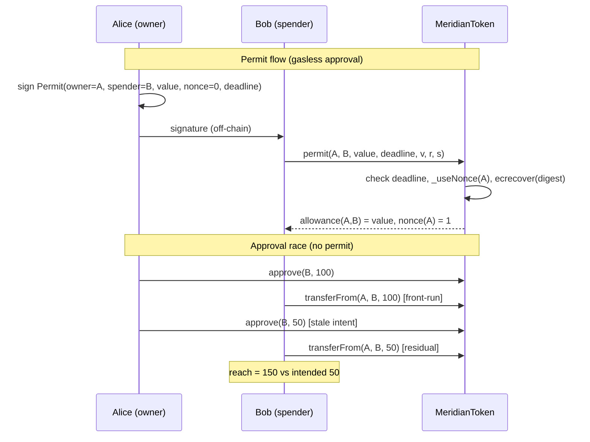

# 14. ERC20 Deep Dive

## Learning Objectives

By the end of this chapter you will be able to:

1. Read EIP-20 like a spec: which behaviors are MUST, which are SHOULD, and which are folklore — zero-value transfers, the `Transfer` event on mint/burn, `decimals()` as an optional field, and the race-condition note that lives *inside the EIP itself*.
2. Explain the allowance model precisely — including why the approval race exists, why OpenZeppelin v5 removed `increaseAllowance`/`decreaseAllowance` (verified in this chapter's lab), and what the canonical mitigations actually are: two-step `approve(0)→approve(N)` (wrapped by `SafeERC20.forceApprove` for non-compliant tokens), and ERC-2612 permit.
3. Implement and test ERC-2612 permit end-to-end: the EIP-712 digest construction, the per-owner nonce, deadline semantics, and why the domain separator's `chainId` term prevents replay across distinct chain IDs when the domain includes `chainId` and the correct `verifyingContract`.
4. Handle non-standard tokens correctly: missing return values (USDT), false-returning `approve`, fee-on-transfer and rebasing assets, and EIP-777's callback reentrancy — and know which layer of Meridian deals with each (the token layer never does; integration layers do, Ch 17).
5. Ship the first Meridian protocol contract: `MeridianToken.sol` (MER) on the OpenZeppelin v5 base (an established, widely reviewed lineage — verify the pinned release's own audit record before claiming it was audited), with a locked error catalog (the Ch 2 PROVISIONAL is resolved for tokens), role-gated minting, permissionless burn, and the design reasoning for what MER deliberately does *not* have (no transfer fee, no supply cap, no hooks).
6. Measure ERC-20 gas honestly across four representative SSTORE scenarios — cold write, warm clean write, warm receiver 0→1, and dirty rewrite — and explain why "a warm SSTORE costs 2,900" is only true for a clean first write of the slot in the same transaction.

## Prerequisites

- **Chapter 2** (Solidity Language Essentials) — custom errors over require strings (the OZ v5 `IERC20Errors` pattern locked there is *the* token error catalog), event conventions (past-tense, `indexed`), immutables, `external` over `public`.
- **Chapter 3** (ABI Encoding & Data Locations) — selectors, `abi.encodeCall`, and EIP-712 typed-data hashing as an ABI subset; the selector-collision evidence from 4byte.directory.
- **Chapter 9** (Yul & Inline Assembly) — the canonical returndata gates (`returndatasize()` checks) that `SafeERC20` implements and this chapter's integration tests exercise.

Supporting references: **Ch 7** (the EIP-2929/EIP-2200 SSTORE schedule this chapter's gas probes confirm), **Ch 8** (optimization hierarchy: no check may be traded), **Ch 12** (fuzz + invariant conventions, applied to the token), **Ch 13** (the `--sizes` and snapshot gates that watch this contract from day one). Locked conventions remain in force. The vault error catalog stays PROVISIONAL until Ch 20; the *token* catalog is finalized here.

## Theory

### EIP-20: the spec, not the folklore

EIP-20 (Buterin & Vogelsteller, Nov 2015) is a small document that the ecosystem has spent a decade discovering is smaller than its folklore. The mandatory surface is six functions and two events. What most people *think* it mandates, and what it actually says:

- **[SPEC] `transfer` and `transferFrom` MUST expose a `bool` return.** The EIP documents `true` for successful execution — and says a failed transfer SHOULD throw, so implementations may revert on failure rather than return `false`; OpenZeppelin and every major implementation follow the revert convention. That convention is the root of the USDT problem: USDT (deployed 2017, pre-convention) returns *nothing at all*, so integrators cannot distinguish "success with no return" from "failure with no return" without the returndata gates from Ch 9.
- **[SPEC] `Transfer` MUST fire on every transfer, including zero-value transfers.** The EIP is explicit: "Transfers of 0 values MUST be treated as normal transfers and fire the Transfer event." A surprising number of hand-rolled tokens skip this; the lab pins it.
- **[SPEC] Minting SHOULD emit `Transfer` with `_from = 0x0`; burning SHOULD emit `Transfer` with `_to = 0x0`.** Not MUST — but every indexer, subgraph (Ch 37), and accounting model assumes the creation/destruction events. OZ's `_mint`/`_burn` do it; MER's constructor mint emits the canonical creation event.
- **[SPEC] `decimals()` is NOT part of the required interface.** The EIP lists it under optional "Token" metadata (with `name()` and `symbol()`). Every real implementation includes it — OZ defaults to 18, and [MERIDIAN] MER uses 18 for WAD fixed-point consistency (Ch 4). USDC's 6 decimals is the famous counter-example that breaks every naive `1e18` assumption.
- **[SPEC] The approval race is documented IN the EIP.** The note says clients SHOULD set the allowance to 0 before setting it to another value — and explicitly says the contract itself shouldn't enforce it for backwards compatibility. The EIP knew in 2015; the ecosystem re-learns it every few years.

### The allowance model and the race, made concrete

**[SPEC]** `allowance(owner, spender)` is a single `uint256` slot. `approve` *overwrites* it — it does not accumulate. That overwrite is the entire race: Alice approves Bob 100, then decides the exposure should be 50 and sends `approve(50)`. Bob sees the pending transaction, front-runs it with `transferFrom(100)` (draining the old allowance), and then Alice's stale `approve(50)` lands — Bob can now take *another* 50. Alice intended a 50 exposure; Bob's reach is 150. The lab's `test_approvalRace_staleApprove_grantsMoreThanIntended` reproduces this exactly: Bob ends with 150 and a zero allowance.

The classic mitigation set, and how it changed in OZ v5:

- **[OZ] `increaseAllowance`/`decreaseAllowance` (v4 era) — removed in v5.** This chapter's lab hit this as a compile error (9582): OpenZeppelin v5 deleted the relative-allowance helpers. Their fail-safe property (a front-run of a `decreaseAllowance` underflows and reverts rather than granting the attacker the full old+new amount) is real, but the helpers were deemed too rarely used correctly to keep. Integrator libraries (`SafeERC20`) now carry the pattern.
- **[SPEC] Two-step `approve(0)` → `approve(N)`** — the EIP-20-recommended dance, still the baseline. Any front-run between the steps can only capture N.
- **[OZ] `SafeERC20.forceApprove`** — the integrator-side compatibility wrapper: it tries a plain `approve(N)` and only on a *false* return falls back to `approve(0)` → `approve(N)`. Two consequences, both verified in this chapter's lab: against a compliant token (like MER) `forceApprove` is a *single* approve — which is race-prone like any absolute `approve`; the two-step fires only as the fallback branch for tokens that reject or return `false` on a direct nonzero approval. It is a compatibility fallback, not a race primitive.
- **[EIP-2612] ERC-2612 permit** — the modern answer: the owner signs the exact allowance intent off-chain, so permit *mitigates the classic allowance-replacement race* — there is no stale `approve` to overwrite — and the signature carries a deadline so the intent expires. The signed permit itself remains publicly submit-able and can be front-run (the attacker consumes the nonce first); protocols combining permit with a consuming action should tolerate the permit call failing.

### ERC-2612: permit

ERC-2612 (Martin Lundfall, Aug 2020) standardized the permit design DAI had shipped in 2019: a signed EIP-712 message that, when submitted on-chain, sets an allowance without the owner paying for an `approve` transaction. The message is:

```
keccak256("Permit(address owner,address spender,uint256 value,uint256 nonce,uint256 deadline)")
```

hashed as an EIP-712 struct, prefixed with `0x19 0x01` and the domain separator, and signed. Three properties (per EIP-2612) make it safe:

1. **Nonce-per-owner.** Every permit consumes the owner's current nonce. A replayed signature rebuilds the struct hash with the *next* nonce, the recovered signer no longer matches, and the call reverts — `ERC2612InvalidSigner`. The lab demonstrates replay rejection with the exact recovered address.
2. **Deadline.** `block.timestamp > deadline` reverts (`ERC2612ExpiredSignature`) *before* any signature work. `type(uint256).max` is the "no expiry" convention (pinned in the lab).
3. **The domain separator binds `chainId` + `verifyingContract`** (+ name/version). A signature made for chain A is invalid on chain B — as long as the two chains have distinct chain IDs and the domain includes both `chainId` and the correct `verifyingContract`, cross-chain replay is prevented. The lab signs against a `chainId + 1` domain and watches the permit reject.

The EIP-712 domain also has a real fork story: when a chain forks, `chainId` changes and old signatures die — which is the *feature* (a forked chain cannot replay signatures meant for the original).

Permit is not magic: standard ERC-2612 implementations (OZ included) recover an EOA signer, so the owner must sign with an EOA key. Smart-contract wallets cannot produce a standard EOA permit signature — supporting them is an ERC-1271 (`isValidSignature`, magic value `0x1626ba7e`) integration/design concern, not part of ERC-2612 itself. OZ's `ERC20Permit` does not include ERC-1271 validation by default; integrations that need smart-account support add an ERC-1271-aware path (Permit2 and several wallet stacks implement it) or a separate authorization flow.

### Transfer edge cases: what "just an ERC20" hides

- **[OZ] Missing return values (USDT).** No bool returned; `SafeERC20`'s `returndatasize()` gates (Ch 9: `rds == 0` is success, `rds != 0x20` reverts, else decode) are the industry answer.
- **[OZ] False-returning `approve`.** Some tokens return `false` instead of reverting on failed approval; `forceApprove` exists for exactly this.
- **[MERIDIAN POLICY] Fee-on-transfer.** A token that deducts a fee changes `to`'s received amount vs the requested amount — so **exact-amount assumptions break**; an integrator can still support such tokens with balance-delta accounting, explicit received-amount semantics, or adapter logic. Meridian's answer: MER itself has no fee (fee capture is the lending spread accruing to sMER stakers, Ch 23), and FoT assets are excluded at the market-listing layer (Ch 17/20) where the protocol assumes exact balance conservation instead of implementing specialized adapters.
- **[MERIDIAN POLICY] Rebasing.** Balance changes without transfers (Ampleforth-class). Rebasing is not inherently unsafe — it requires accounting designed for changing balances. Meridian's conclusion: excluded from lending markets because the vault's accounting (Ch 20) assumes exact balance conservation rather than implementing a rebasing adapter.
- **[EIP-777] EIP-777 (2017).** The `tokensReceived` hook made token transfers *call back into the receiver mid-transfer* — and the imBTC/Uniswap v1 drain (2019, ~$8.5M) showed exactly how: reentrancy through the callback into a pool that didn't expect re-entry. EIP-777 is the cautionary tale for why token callbacks are a security surface, not a feature; nothing in Meridian uses them, and any integration must treat them as reentrancy (Ch 24).
- **Overflow.** Pre-0.8 unchecked arithmetic made balances overflowable — the 2018 batchOverflow incidents (BeautyChain BEC, SmartMesh SMT) destroyed the "we'll never overflow" assumption (Ch 2/4 recap). Solidity 0.8 checked arithmetic + OZ v5's explicit overflow comments are the modern baseline.

### [MERIDIAN] Meridian's token: what MER is (and deliberately isn't)

`MeridianToken.sol` is the first *protocol* contract in the repo — everything before it was a lab probe. It inherits OZ v5.7.0 `ERC20` + `ERC20Burnable` + `ERC20Permit` + `AccessControl`: an established, widely reviewed lineage rather than a hand-rolled token. That lineage is not the same as a per-release audit certificate — verify the exact pinned release (v5.7.0) and its published security/audit record (the PDFs in `lib/openzeppelin-contracts/audits/` cover specific releases, 2023-10 v5.0 through 2025-10 v5.5) before claiming this exact version was externally audited. An audited base is a strong starting point, not a substitute for auditing Meridian's own composition and configuration.

The design decisions, each with a reason:

- **[MERIDIAN] No transfer fee.** Fee capture happens off-token (lending spread → sMER share appreciation). A transfer tax would poison every downstream accounting model before the protocol even gets one.
- **[MERIDIAN] No supply cap.** `MINTER_ROLE` *is* the supply control surface. A numeric cap is a governance policy; the role is held by governance (Ch 25's timelock), so supply policy is a governance decision — and changing it is a role change, not an upgrade.
- **[MERIDIAN] Minting is the only privileged token-issuance operation.** `mint(to, value)` requires `MINTER_ROLE`. Burning is deliberately permissionless: `burn` (own tokens) is a user right, and `burnFrom` flows through the *allowance* surface — exactly one authorization model for moving other people's tokens, whether by transfer or by burn. No `BURNER_ROLE` needed. Role administration remains a privileged surface by design: whoever holds `DEFAULT_ADMIN_ROLE` can grant/revoke `MINTER_ROLE` — that is the governance control plane, not a token operation.
- **Constructor zero-address guards** on `defaultAdmin`, `minter`, and `initialRecipient` (`InvalidConstructorAddress`), and an initial supply minted to a named recipient — emitting the spec's creation `Transfer(0x0, recipient, supply)`.
- **The error catalog is the OZ interface catalog** (`IERC20Errors` per the ERC-6093 custom-error standard, ERC-2612 errors, `IAccessControl` errors) — no hand-rolled duplicates. This resolves the Ch 2 "PROVISIONAL" for tokens; the vault catalog stays provisional until Ch 20.

One real inheritance subtlety: `IMeridianToken` extends `IERC20Permit`, which `ERC20Permit` already inherits — a diamond. Solidity's C3 linearization then demands an explicit `nonces` override in `MeridianToken` (compiler errors 6480/4327/2353 until the override lists exactly the immediate bases: `override(ERC20Permit, IERC20Permit)`). `Nonces` must *not* be listed — it is already covered by `ERC20Permit`'s own override. Pinned in the lab; a classic example of why inheritance graphs are review surface.

## Mathematical Foundations

### The permit digest, term by term

```
structHash = keccak256(abi.encode(PERMIT_TYPEHASH, owner, spender, value, nonce, deadline))
domainSeparator = keccak256(abi.encode(DOMAIN_TYPEHASH,
    keccak256(bytes(name)), keccak256(bytes("1")), chainid, address(this)))
digest = keccak256(abi.encodePacked("\x19\x01", domainSeparator, structHash))
```

`0x19 0x01` is the EIP-712 version prefix that makes typed-data signatures unspoofable as raw `eth_sign` messages. The domain's `chainid` + `verifyingContract` terms are what bind a signature to one chain and one token: replaying a MER permit on another chain changes the domain separator, changes the digest, and the recovered signer no longer matches — replay across distinct chain IDs is prevented, provided the two chains keep distinct chain IDs and the domain carries the correct `verifyingContract`. The `nonce` term is what binds a signature to one use: after consumption, the same signature recovers against a different struct hash. Both properties are arithmetic, not policy.

### The approval race, quantified

Alice's intended exposure after the change is `N_new`. With a stale absolute `approve(N_new)` and an attacker front-running the old allowance `N_old`, the attacker's reach is `N_old + N_new` — the lab's 100 + 50 = 150. With the two-step, the reach is exactly `N_new` because `N_old` was zeroed first. (`forceApprove` is a *compatibility* wrapper, not a race primitive: on a compliant token it is a single `approve(N)` — as race-prone as any absolute approve — and only its fallback branch performs the two-step, for tokens that reject or return `false` on a direct nonzero approval.) With permit, the reach is exactly the signed `value` because the signature *is* the intent — there is no stale allowance to race against, only the deadline (a front-run permit just consumes the nonce first; the attacker's reach is still capped at the signed `value`). The arithmetic of the race is trivial; the discipline is not.

### [SPEC][LAB] SSTORE cost scenarios (lab-pinned, EIP-2929/2200 schedule)

A transfer touches two balance slots, so its cost is dominated by two SSTOREs. SSTORE pricing depends on two independent axes — access warmth (cold vs warm, EIP-2929) and the original/current/new value transition (EIP-2200) — so the lab measures four representative scenarios, not four universal "regimes":

| Scenario (value transition) | Sender slot | Receiver slot | Measured transfer |
|---|---|---|---|
| Cold 0 → nonzero (first touch in tx) | 20,000 SET + 2,100 cold surcharge = 22,100 | 20,000 + 2,100 = 22,100 | ~50–55K (published schedule; snapshot rows) |
| Warm clean write: nonzero → different nonzero (original value) | 2,900 (reset) | 2,900 (reset) | **9,554** |
| Warm clean set: receiver 0 → 1 (original value 0) | 2,900 | 20,000 (SET) | **27,380** (receiver slot cold) |
| Dirty rewrite: current ≠ original, new ≠ original | 100 | 100 | **3,989** (loop) |
| Dirty reset to original: current ≠ original, new == original | 100 + refund accounting | — | **3,954** (self-transfer) |

The exact transaction gas also includes loads, LOG2, calldata, branching, and other opcodes; the write components above are the SSTORE schedule's contribution.

The dirty rows are the ones that surprise everyone: **after a slot is written once in a transaction, a subsequent rewrite costs 100 gas, not 2,900** — and resetting a dirty slot to its original value costs 100 plus a refund. The lab's loop-amplified min-delta lands at 3,989/transfer (SSTOREs at 100 + LOG2 1,381 + calldata 1,088 + CALL 100 + checks). This is why "warm SSTORE = 2,900" is a half-truth: it holds only for a *clean* first write of a slot per transaction. Batch operations (Ch 8's write coalescing, Ch 12's handlers) that reuse already-accessed slots fall to the much cheaper 100-gas write charge — not free, but ~2,800/slot cheaper. The self-transfer case (3,954) is the dirty-reset class: the sender slot is written twice in one call, and the reset refund is what makes it cheap.

## Mermaid Diagram



## Code Walkthrough

**`meridian/src/IMeridianToken.sol`** — the protocol-facing surface: `IERC20` + `IERC20Permit` + `IAccessControl`, plus `MINTER_ROLE()`, `mint(address,uint256)`, and the protocol-specific `error InvalidConstructorAddress(address account)`. The token's error catalog is deliberately *not* re-declared here — it lives in the OZ interfaces (`IERC20Errors` from the ERC-6093 custom-error standard, ERC-2612 errors, `IAccessControl`), which is the Ch 2 convention ("errors in I-prefixed interfaces, OZ v5 `IERC20Errors` pattern") applied to its logical conclusion: one interface, one error source of truth.

**`meridian/src/MeridianToken.sol`** — the contract. The constructor takes `(defaultAdmin, minter, initialRecipient, initialSupply)`, rejects zero addresses, grants `DEFAULT_ADMIN_ROLE` and `MINTER_ROLE`, and `_mint`s the initial supply (emitting the creation `Transfer`). The only added function is `mint` (`onlyRole(MINTER_ROLE)`); everything else is inherited from OpenZeppelin's widely reviewed v5 lineage. The one explicit override is `nonces` — the C3 diamond resolution described above. The NatSpec documents every design decision as an audit trail, per the Ch 1/2 conventions.

**`meridian/test/MeridianToken.t.sol`** — 41 tests: EIP-20 semantics (zero-value transfer MUST emit, self-transfer, zero-address reverts with parameter-exact errors), allowance edge cases, the race demonstration, permit (set, replay, expiry, wrong signer, cross-chain domain, max-deadline, zero-value cancel, gasless permit+transferFrom), roles (mint positive/negative, burn/burnFrom, grant/revoke), constructor guards, four fuzz accounting pins, and the two gas probes. **`MeridianTokenHandler.sol` + `MeridianTokenInvariant.t.sol`** — a 3-op invariant handler (mint/transfer/burn, all revert edges pre-checked per Ch 12's `fail_on_revert` rule) with a conservation invariant over the complete holder set: 16,384 sequences, 0 reverts, green.

## Production Example

**MER in the Meridian protocol.** Users acquire MER on the open market and deposit it into `StakedMeridian` (sMER, the ERC4626 vault, Ch 16/23) to earn protocol revenue; gMER (Ch 15) wraps MER for checkpointed voting. Three properties of this chapter's design make that lifecycle safe:

1. The vault (Ch 20) and every integration uses `SafeERC20` — the Ch 9 returndata gates — so MER's compliant `true` returns are consumed safely and USDT-class tokens in *other* markets don't poison the shared code paths.
2. Permit-first UX: the sMER deposit flow accepts a permit signature so a user's first interaction with the protocol is one transaction, not two — and every permit carries a deadline, so stale signed approvals expire.
3. The role model matches the governance plan: `DEFAULT_ADMIN_ROLE` transfers to the timelock (Ch 25), `MINTER_ROLE` becomes the only remaining *operational* privileged key (the admin role itself sits in the timelock) — and per the 2026 trust-surface grounding (Kelp DAO/Drift, ~$285–292M, Apr 2026), a minting key is an admin key: it lives in the multisig/timelock, never in a deployer or CI (Ch 13).

## Foundry Lab

Materialized and **compile-verified in this run** (forge 1.7.1, solc 0.8.24, cancun, optimizer 200):

- **New artifacts:** `src/IMeridianToken.sol`, `src/MeridianToken.sol` (first PROTOCOL contract), `test/MeridianToken.t.sol` (41 tests), `test/MeridianTokenHandler.sol` + `test/MeridianTokenInvariant.t.sol` (conservation invariant, 256×64 = 16,384 calls, 0 reverts), `docs/erc20-spec.md` (weekly project). `.gas-snapshot` regenerated to **165 rows** under the pinned CI seed; `forge snapshot --check` green.
- **Full repo suite: 159 passed / 0 failed / 6 skipped (165 total) across 19 suites** (Ch 13 baseline 117/0/6 across 17; +42 tests, +2 suites). The 6 skips remain the Ch 11 fork tests.
- **Contract size:** `MeridianToken` 4,782 B runtime / 19,794 B margin — comfortably under EIP-170; Ch 13's `--sizes` gate is watching it from day one.
- **[FOUNDRY] Real findings, all kept:**
  1. *OZ v5 removed `increaseAllowance`/`decreaseAllowance`* — compile error 9582; the v4-era relative-allowance mitigation no longer exists on the token, and the race discussion had to be rewritten around two-step/`forceApprove`/permit (the chapter's theory reflects this).
  2. *The `IERC20Permit` diamond* — `IMeridianToken is IERC20Permit` collides with `ERC20Permit`'s own inheritance; C3 requires `nonces` to be re-overridden with exactly `override(ERC20Permit, IERC20Permit)` (errors 6480 → 4327/2353 as the list was iterated). `Nonces` must not be listed.
  3. *Cheatcodes are consumed by argument-evaluation calls.* `token.grantRole(token.MINTER_ROLE(), bob)` after `vm.prank(owner)` silently pranks the *wrong* call — the `MINTER_ROLE()` view call eats the prank (and `vm.expectRevert` the same way). Two tests failed exactly this way before the role reads were hoisted. This is a **test-environment-specific behavior** (forge-std cheatcode semantics), not an Ethereum execution rule — a new, sharp edge of the Ch 10 cheatcode discipline.
  4. *`forceApprove` is a single approve on compliant tokens* — the two-step only fires when the token returns `false`. The test originally expected two `Approval` events and got one (the lab's first version failed on `log != expected log`).
  5. *Four SSTORE scenarios measured, not assumed* — the loop-amplified "warm transfer" probe initially returned ~4K and looked like a bug until the EIP-2200 dirty-slot pricing explained it (a slot written earlier in the tx costs 100 to rewrite). The probe now pins all four scenarios (9,554 / 27,380 / 3,954 / 3,989) — see Gas Optimization.
- **Gas numbers (`.gas-snapshot`, test-level):** transfer 47,291; approve 41,330; transferFrom 73,655; permit 69,093; permit+transferFrom (the gasless flow) 82,992; mint 32,153; burn 27,487; self-transfer 19,255; stale-approve race demo 77,166. In this lab configuration, `permit` costs ~1.7× the measured `approve` call — the price of EIP-712 hashing + `ecrecover`, bought once per allowance instead of once per interaction. Treat that ratio as a benchmark for this build, not a universal constant.

## Security Analysis

**1. The approval race is still the default footgun.** The EIP warned in 2015; wallet-drainer kits (Inferno Drainer, Pink Drainer, 2023–2024) monetized unlimited approvals into hundreds of millions of dollars of losses — approve-phishing is the dominant wallet-drain vector of the current era. MER's posture: permits with deadlines for new integrations, `forceApprove`/two-step for contracts, and the standing rule that a hot wallet holding an infinite allowance on any token is a liability.

**2. Minting is the supply surface; the minting key is an admin key.** One `onlyRole(MINTER_ROLE)` function is the entire privileged *token-issuance* surface of MER — which is the point (small attack surface), but it concentrates power: the 2026 Kelp DAO/Drift incidents (~$285–292M, Apr 2026) were admin-key compromises. The role's home is the timelock/multisig (Ch 25), and `DEFAULT_ADMIN_ROLE` can rename or revoke it — so the real trust root is whoever holds the admin role, exactly like every protocol.

**3. Non-standard tokens are a compatibility attack surface, not a token problem.** MER is plain; but the *protocol* will touch other tokens in markets (Ch 20). The returndata gates (Ch 9), `forceApprove`, and the FoT/rebasing exclusion policy (Ch 17) are the defense. EIP-777's callback reentrancy (imBTC/Uniswap v1, 2019, ~$8.5M) is the historical proof that "compatible" is not "safe".

**4. Permit griefing is a DoS, not a theft.** A permit transaction can be front-run: the attacker submits it first, consuming the nonce and setting the allowance to exactly the signed value — the victim's transaction then reverts, and no funds move beyond what the owner signed. Annoying, bounded, and the reason deadline design matters (short deadlines limit the griefing window). Protocols that combine a permit with a consuming action should tolerate the permit call failing — fall back to `approve`, or retry with a fresh signature.

**5. Inheritance is security surface.** The C3 diamond resolved in this chapter is harmless here — but the same class of ambiguity in a hand-rolled inheritance graph has shipped real vulnerabilities (the classic delegatecall/storage-sharing failures, Parity 2017, Ch 6). The fix is the same discipline: explicit overrides, minimal graphs, and the widely reviewed OZ base instead of composition by hand.

## Common Pitfalls

1. **Treating "warm SSTORE = 2,900" as universal** — it holds only for a clean first write of a slot in a tx; a later rewrite is 100 (measured: 3,989/transfer in the dirty loop vs 9,554 warm clean write). Gas estimates for batched operations are wrong by ~2,800/slot if you use the wrong scenario.
2. **`approve` to reduce an allowance** — the race; use two-step or `forceApprove` or permit. OZ v5 removed the relative helpers, so there is no third option on the token itself.
3. **Ignoring the return value** — raw `token.transfer(...)` without checking the bool (or the returndata gates) is how USDT silently "succeeds". `SafeERC20` always.
4. **Reusing permits / no deadline** — `type(uint256).max` deadlines are convenient and a standing griefing/risk surface; prefer bounded deadlines for anything value-bearing.
5. **Missing the zero-value `Transfer` event** — indexers and accounting models depend on it; EIP-20 makes it a MUST.
6. **`decimals()` assumed 18** — USDC is 6; any protocol-level assumption must read `decimals()` or hardcode per-asset (MER is 18, locked).
7. **Cheatcode consumption by argument evaluation** — a test-environment-specific behavior: `vm.prank(x); c.f(c.ROLE())` pranks the view call, not the call you meant (verified in-run). Hoist reads.
8. **Inheritance diamonds** — double-inheriting an interface that a base contract also implements forces explicit overrides; read the compiler error before "fixing" it by dropping the interface.
9. **Hand-rolled tokens** — the OZ v5 lineage is widely reviewed, with audits published for specific releases; that record does not transfer to a bespoke ERC20 you write — a hand-rolled token is a bespoke audit surface for zero feature gain.
10. **Fee-on-transfer "just this one token"** — it breaks exact-amount assumptions globally; exclude at the listing layer (Ch 17) unless an adapter handles balance deltas.

## Gas Optimization

The token's hot paths are transfer/transferFrom (2 SSTOREs + LOG2 each) and permit (EIP-712 hashing + `ecrecover` + 2 SSTOREs). The optimization hierarchy from Ch 8 applies with one new lesson: **the cheapest write is the one that never happens.** The dirty-slot measurement (3,989 vs 9,554) quantifies why write coalescing (Ch 8) and batch amortization (Ch 8) work — once a slot is written, subsequent writes in the same transaction cost ~2,800 less each. The snapshot gate (Ch 13) now carries MER's rows: `transfer` 47,291 and `permit` 69,093 are the committed baselines, and any future optimization (e.g., a packed balances layout — rejected here because balances are a mapping, and packing a mapping is impossible without breaking the standard) must beat those rows by >20 gas to register. In this build, permit's ~1.7× approve premium is the deliberate purchase: one signature replaces one user transaction per allowance, and the protocol's own flows (sMER deposits, Ch 23) pay it once per user instead of per interaction.

## Reading Production Source Code

1. **OpenZeppelin `ERC20.sol`** — the canonical implementation: the `_update` single-chokepoint design, the overflow-comment discipline, and why every override point is virtual.
2. **OpenZeppelin `ERC20Permit.sol` + `EIP712.sol` + `Nonces.sol`** — the permit machinery: `_hashTypedDataV4`, the cached domain separator with the chainId fork check, and the nonce accounting.
3. **OpenZeppelin `SafeERC20.sol`** — the returndata gates and `forceApprove`; the library every Meridian integration uses.
4. **USDC (`FiatTokenV2_2`)** — a production permit implementation with a different EIP-712 structure (domain includes a salt), and the 6-decimal counter-example.
5. **DAI (`Dai.sol`)** — the original permit design ERC-2612 standardized; worth reading for how the pattern evolved.
6. **Uniswap `Permit2`** — the industry response to the infinite-allowance problem: signature-based transfers with per-pair allowance+expiration, and ERC-1271 support for smart wallets.

Ask of every token you read: *what does it return, what does it revert on, what hooks does it call, what does it do on zero-value and self-transfer, and what is its trust root?* That is the token audit in five questions.

## Exercises

1. Trace the race arithmetic: allowance 100, stale `approve(50)` — compute Bob's reach; then redo it with `forceApprove` and with a permit of 50. Which of the three can be front-run into a *larger* reach than intended?
2. Modify the permit replay test to use nonce 1 in the original signature — what error does the *second* replay produce, and why?
3. Add a fee-on-transfer mock (a token that deducts 1%) and show, with balances, why a naive `transferFrom`-based integrator breaks; then argue the Ch 17 exclusion policy from the numbers.
4. Write the C3 diamond from scratch: a minimal `Base` + `IBase` double-inheritance that forces an explicit override, and reproduce the 6480 error.
5. Measure the dirty regime yourself with a 100-transfer loop; explain why the first iteration costs ~2,800 more than the rest.
6. Read `SafeERC20.sol` and explain, line by line, how `rds == 0` and `rds != 0x20` map to the USDT convention (Ch 9 recap).
7. Design the sMER permit-first deposit flow (Ch 16/23 preview): which party signs, what deadline policy, and what happens when the permit is front-run.

## Weekly Project

**MER, the first protocol contract — materialized and verified in this run:**

1. `src/MeridianToken.sol` + `src/IMeridianToken.sol` — OZ v5.7.0 base, role-gated mint, permissionless burn, permit, locked error catalog, C3-resolved `nonces` override. **Verified in-run:** full suite green (159/0/6 across 19 suites), snapshot gate green under the pinned CI seed, EIP-170 margin 19,794 B.
2. `test/MeridianToken.t.sol` (41 tests: semantics, race, permit, roles, fuzz, gas probes) + `MeridianTokenHandler.sol` + `MeridianTokenInvariant.t.sol` (conservation invariant, 16,384 sequences, 0 reverts).
3. `docs/erc20-spec.md` — the token spec: semantics, error catalog, design decisions with rationale, gas profile, and integration guidance for Ch 20. **Second weekly-project doc materialized to disk** (precedent: Ch 13's `ci-cd-playbook.md`).
4. The token error catalog is now **canon** (resolves Ch 2's PROVISIONAL for tokens; vault errors remain provisional until Ch 20).

## Deliverables

1. `MeridianToken.sol` + `IMeridianToken.sol` — protocol contract #1, compile-verified, 4,782 B runtime / 19,794 B margin.
2. 41 tests + 1 invariant suite, all green; `.gas-snapshot` at 165 rows, `--check` passing under the pinned CI seed; repo suite **159 passed / 0 failed / 6 skipped across 19 suites**.
3. Conventions locked: token errors = OZ interface catalog; minting = the single privileged token-issuance surface (role administration = the governance surface), held by governance; burn = permissionless via allowance; no fee/cap/hooks by design; permit = the approval UX with bounded deadlines.
4. `docs/erc20-spec.md` materialized; gas probes pinning four SSTORE scenarios (9,554 / 27,380 / 3,954 / 3,989).

## Quiz

1. What does EIP-20 *require* for zero-value transfers, and what SHOULD happen on mint/burn?
2. Why did OZ v5 remove `increaseAllowance`/`decreaseAllowance`, and what are the three surviving race mitigations?
3. Write the EIP-712 permit digest formula; which term prevents replay across distinct chain IDs, and which prevents replay on the same chain?
4. A slot is written 10 times in one transaction: what does each write after the first cost, and why does the lab measure 3,989/transfer in the dirty loop?
5. Why is MER's `nonces` explicitly overridden, and what does C3 linearization have to do with it?
6. Name the three ways a non-standard token can break an integrator, and the corresponding defense for each.

**Answers:** (1) Zero-value transfers MUST fire `Transfer`; mint/burn SHOULD fire `Transfer` from/to `0x0` — OZ and MER do both. (2) v5 deleted them (compile error 9582 verified in-run); the survivors are two-step `approve(0)→approve(N)`, `SafeERC20.forceApprove` (two-step only on false-returning tokens — verified), and ERC-2612 permit with deadlines. (3) `digest = keccak256("\x19\x01" ‖ domainSeparator ‖ keccak256(abi.encode(PERMIT_TYPEHASH, owner, spender, value, nonce, deadline)))`; `chainId`+`verifyingContract` prevent replay across distinct chain IDs (given a correct domain), the per-owner `nonce` stops same-chain replay. (4) 100 each after the first write — EIP-2200 dirty-slot pricing; the first write paid 2,900 (reset) or 22,100 (cold set), subsequent rewrites of the same slot are 100, and the transfer's LOG2+calldata+CALL floor leaves 3,989. (5) `IMeridianToken is IERC20Permit` plus `ERC20Permit`'s own `IERC20Permit` inheritance create a diamond; C3 requires the derived contract to state the override with the immediate bases (`ERC20Permit, IERC20Permit` — errors 6480/4327/2353 otherwise). (6) Missing returns → `SafeERC20` returndata gates (Ch 9); false-returning `approve` → `forceApprove`; fee-on-transfer/rebasing → excluded at the listing layer (Ch 17), since MER itself is plain by design.

## Further Reading

- EIP-20 (Buterin, Vogelsteller, 2015) — the spec, including the race note and the zero-value MUST.
- ERC-2612 (Lundfall, 2020) — permit; the DAI permit design it standardized.
- EIP-712 (Weidauer, 2019) — typed structured data hashing; the domain separator.
- ERC-6093 — the published custom-errors-in-interfaces standard behind `IERC20Errors`.
- ERC-1271 (2018) — contract-signature validation (the smart-wallet permit gap); ERC-4494 (2021) — the NFT sibling of 2612.
- OpenZeppelin v5 `ERC20`/`ERC20Permit`/`SafeERC20` source + the audit PDFs in `lib/openzeppelin-contracts/audits/` (v5.0 2023-10 … v5.5 2025-10).
- Incident write-ups: imBTC/Uniswap v1 EIP-777 reentrancy (2019, ~$8.5M); batchOverflow 2018 (BEC/SMT); wallet-drainer era (Inferno/Pink Drainer, 2023–2024).
- 2026 security grounding: Kelp DAO/LayerZero and Drift admin-key incidents (~$285–292M, Apr 2026) — the minting-key-as-admin-key lesson.
- Ch 15 (gMER — the governance wrapper over this token) and Ch 16/23 (sMER — the ERC4626 vault this token feeds).

## Ledger Update

**Ch 14 — ERC20 Deep Dive (2026-08-13)** — full entry appended to `ledger/CONTINUITY_LEDGER.md`.

- **First PROTOCOL contract shipped:** `meridian/src/MeridianToken.sol` (MER) + `IMeridianToken.sol` on OZ v5.7.0 (`ERC20` + `ERC20Burnable` + `ERC20Permit` + `AccessControl`). Initial supply 10M MER to a named recipient; `MINTER_ROLE` is the single privileged token-issuance surface (`DEFAULT_ADMIN_ROLE` remains the role-administration/governance surface; supply policy = governance decision; no numeric cap); burning is permissionless (own tokens) or allowance-gated (`burnFrom` — one authorization model, no `BURNER_ROLE`); no transfer fee (fee capture = lending spread → sMER, Ch 23); constructor zero-address guards.
- **Error catalog FINAL for tokens** (Ch 2 PROVISIONAL resolved for tokens; vault catalog stays provisional to Ch 20): OZ interface errors only — `IERC20Errors` (ERC-6093 custom-error standard), `ERC2612ExpiredSignature`/`ERC2612InvalidSigner` (v5.7 names), `IAccessControl`, plus `InvalidConstructorAddress`.
- **Real findings, all kept:** (1) OZ v5 removed `increaseAllowance`/`decreaseAllowance` (compile 9582) — race mitigations are now two-step approve, `forceApprove`, or permit; (2) IERC20Permit diamond — `nonces` must be re-overridden with `override(ERC20Permit, IERC20Permit)` (errors 6480/4327/2353); (3) next-call cheatcodes (`vm.prank`, `vm.expectRevert`) are consumed by argument-evaluation calls (`c.f(c.ROLE())` pranks the view call) — hoist reads; (4) `forceApprove` is a single approve on true-returning tokens (two-step only on false); (5) four SSTORE cost scenarios lab-pinned: warm clean write 9,554, warm 0→1 set (cold receiver) 27,380, dirty reset (self-transfer) 3,954, dirty rewrite loop 3,989.
- Repo: `src/IMeridianToken.sol`, `src/MeridianToken.sol`, `test/MeridianToken.t.sol` (41 tests), `test/MeridianTokenHandler.sol`, `test/MeridianTokenInvariant.t.sol` (conservation invariant 16,384 calls / 0 reverts), `docs/erc20-spec.md` (2nd weekly doc on disk), `.gas-snapshot` regenerated to 165 rows under `FOUNDRY_PROFILE=ci FOUNDRY_FUZZ_SEED=1234`, `--check` green. **Suite: 159 passed / 0 failed / 6 skipped (165 total) across 19 suites** (Ch 13 baseline 117/0/6 across 17; +42 tests, +2 suites). Sizes: `MeridianToken` 4,782 B / 19,794 B margin.
- Gas (`.gas-snapshot`, test-level): transfer 47,291 · approve 41,330 · transferFrom 73,655 · permit 69,093 · permit+transferFrom 82,992 · mint 32,153 · burn 27,487 · self-transfer 19,255.
- Glossary additions: approval race, EIP-712 domain separator, permit nonce, ERC-6093, returndata gates (recap), dirty-slot SSTORE regime, fee-on-transfer, EIP-777 callback reentrancy.
- Grounding incidents: imBTC/Uniswap v1 (2019, ~$8.5M, EIP-777); batchOverflow 2018 recap; wallet-drainer kits 2023–2024 (approve phishing); Kelp DAO/Drift (Apr 2026, ~$285–292M) — minting key = admin key.
- Invariant note (deliberate scoping, not drift): the token's state machine is pure accounting with no hooks; conservation + allowance accounting are pinned by 4 fuzz tests + the conservation invariant handler. Sequence-exploration machinery beyond that is reserved for stateful modules (sMER/vault) where it adds signal.
- Drift: none. Module boundary: none (M4 ends Ch 17 — next boundary audit at Ch 17).
- **ERRATA APPLIED (2026-08-15, review `errata/14_ERC20_Deep_Dive_REVIEW.md`):** P0-1 EIP-20 failure semantics reframed (bool return; revert-on-failure is spec-compatible, not a divergence); P0-2 cross-chain replay "prevents across distinct chain IDs" (not "impossible"); P0-3 + P1-14 permit front-running made explicit (permit mitigates the classic allowance-replacement race, but the signed permit itself can be front-run; protocols tolerate permit failure); P0-5 ERC-6093 corrected from draft to published custom-error standard (all occurrences incl. Ledger); P0-6 OZ audit claim split into lineage vs pinned-release record; P0-7 SSTORE table rebuilt as a value-transition matrix (cold 0→nonzero 22,100 = 20,000+2,100; warm clean reset 2,900; warm 0→1 20,000; dirty rewrite 100; dirty reset 100+refund); P0-8 "dirty for free" → "much cheaper 100-gas write charge"; P0-10 minting = only privileged token-issuance op (`DEFAULT_ADMIN_ROLE` admin surface explicit); P1-4 ERC-1271 reframed as integration concern, not ERC-2612 scope; P1-9 "four regimes" → "four lab scenarios" (LO, table, pitfalls, deliverables, ledger); P1-11 FoT/rebasing = exact-amount assumptions break, not all accounting; P1-12 permit 1.7× labelled a local benchmark; P1-16 [SPEC]/[OZ]/[MERIDIAN]/[FOUNDRY] labels on highest-risk paragraphs; P2-13 forceApprove framed as compatibility fallback, not race primitive (race-reach claim corrected); P2-15 cheatcode finding labelled test-environment-specific (no literal tx.origin/default-sender lesson exists in this chapter version). Full Spec→Implementation→Design→Gas→Verification restructure skipped — owner decision.
