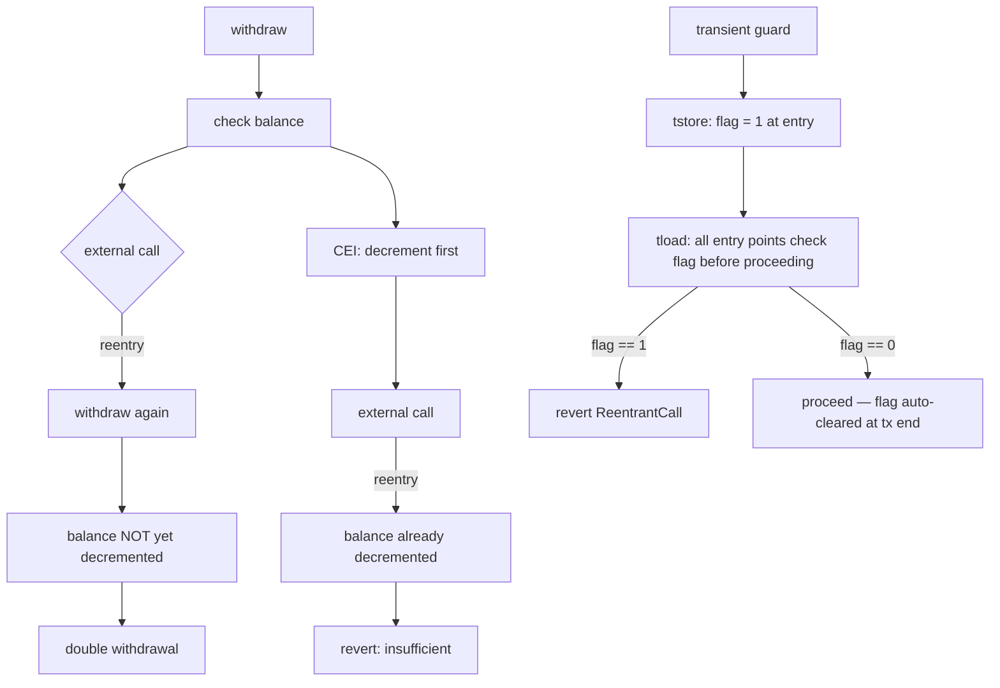

# 24. Reentrancy & Control Flow

## Learning Objectives

By the end of this chapter you will be able to:

1. Classify reentrancy into its three families — classic, read-only, cross-function — and explain why each is a *control-flow* property, not a "locking" problem.
2. Apply CEI (Checks-Effects-Interactions) mechanically, and state precisely which reentrancy families it kills and which it does not.
3. Use EIP-1153 transient storage (`tstore`/`tload`) as a reentrancy guard that costs ~100 gas per transaction instead of SSTORE's 2,900+, and know where it is and is not safe.
4. Audit a withdrawal path for the active reentrancy shapes: read-only reentrancy (oracle price moves mid-transaction), cross-function reentrancy (two entry points sharing state), and the ERC-777 hook class (Ch 17 recap).
5. Implement Meridian's reentrancy discipline: CEI-first + transient guard on the vault's borrow/repay/liquidate paths, with the ONE documented exception (gMER `depositFor`, Ch 15) justified in the ledger.

## Prerequisites

- **Chapter 3** (ABI) — calldata framing; **Chapter 14** (ERC20) — `transfer` vs `transferFrom` external-call surfaces.
- **Chapter 20** (Lending Markets I) — `MeridianVault.sol` v1: the borrow/repay/liquidate entry points this chapter protects.
- **Chapter 17** (Token Security) — the ERC-777 hook family and `imBTC/Uniswap v1` (~$8.5M pool / ~$24M cross-pool, Aug 2019).

Supporting: **Ch 1** (call frames), **Ch 15** (the gMER exception), **Ch 23** (the staking vault's SafeERC20 pushes). Locked conventions in force: custom errors, I-prefix interfaces, full NatSpec, CEI, `^0.8.24`, cancun, optimizer 200, bounded loops.

## Theory

### Reentrancy is a control-flow property

Reentrancy is not "a function called twice". It is: **the same contract's state is read and written by two overlapping execution frames, where the inner frame observes the outer frame's intermediate state.** The EVM has no transactional isolation between frames — a `CALL` hands control to arbitrary code, which can call back into any entry point of the caller before the caller's post-call instructions run.

The consequence: any invariant that spans *across* an external call is provisional. The classic formulation:

```solidity
// vulnerable: balance read, THEN external call, THEN write
function withdraw(uint256 amt) external {
    require(balances[msg.sender] >= amt);
    (bool ok,) = msg.sender.call{value: amt}("");   // reentry here
    balances[msg.sender] -= amt;                     // write after the call
}
```

The DAO (2016) is the canonical instance: `splitDAO` → `payOut` → external call → `receive()` re-enters `splitDAO` before `balances` is decremented.

### The three families

1. **Classic reentrancy** — the same function re-entered mid-flight (above). Killed by CEI: move the write before the call.
2. **Cross-function reentrancy** — two *different* entry points share state; the attacker enters function B from inside A's external call. CEI per-function is **not** sufficient — the shared state must be guarded (the guard must be a single flag covering all functions, or the write must happen before *any* external call in every function touching that state).
3. **Read-only reentrancy** — the re-entered call is `view` (or a view on another contract). No state is written by the inner frame, so CEI does not apply — but the inner frame *observes* stale state and acts on it (e.g., an oracle reads a manipulated price mid-transaction, a vault prices collateral using pre-withdrawal state). This is the 2022+ family (the "read-only reentrancy" taxonomy papers, the Balancer-style findings) and it is the one CEI cannot see.

### EIP-1153 transient storage — the guard that costs near nothing

`tstore`/`tload` (Cancun, EIP-1153) write to a per-transaction, per-contract ephemeral store that is cleared at the end of the transaction. A reentrancy guard implemented in transient storage:

- Costs **~100 gas** for the first `tstore` + `tload` pair (vs 2,900+ for an SSTORE-based guard, plus the 4,800-refund trap of "guards that dirty a slot").
- Is **impossible to leave dirty across transactions** — no "stuck guard" bug class (a guard set in a reverting sub-call persists in *storage* if not careful; transient storage is automatically clean).
- Is **safe against the classic + cross-function families** when the flag covers all state-sharing entry points.

The caution: transient storage is per-transaction, so it cannot protect against *cross-transaction* races (oracle update vs borrow in the same block, different txs) — that is MEV/oracle territory (Ch 34–35), not reentrancy.

## Mathematical Foundations

### The reentrancy budget

Let `S` = shared state set, `E` = set of external calls in a function `f`. The invariant "state `s ∈ S` is only read/written by the outer frame" holds iff every path through `f` writes all touched `s` before the first `e ∈ E`. CEI is the mechanical transcription of this condition.

For cross-function: with entry points `{f1, f2}`, the condition becomes "the write of `s` precedes every external call in *both* f1 and f2" — or a guard flag `g` is checked+set before any `s` read in both.

For read-only: no write exists to reorder; the condition is "the *view* must re-read state it depends on after every external call it makes" — a cache-invalidation rule, not a reordering rule.

### Guard cost model

| Guard | Set (first tx, cold slot) | Unlock (non-zero → zero) | Lock check (SLOAD) | Dirty-on-revert risk |
|---|---|---|---|---|
| Storage flag (SSTORE, cold) | 22,100 | 2,900 (+ refund) | 2,100 cold / 100 warm | yes (must unset in finally) |
| Transient flag (EIP-1153) | ~100 (`TSTORE`) | auto-cleared | ~100 (`TLOAD`) | **no** — auto-cleared |
| No guard + CEI | 0 | 0 | 0 | n/a — applies only to classic |

> *Cold = first access to a slot within a transaction (EIP-2929); warm = subsequent access, 100 gas. The cold set figure is 22,100 = 2,100 (cold SLOAD) + 20,000 (SSTORE zero → non-zero). The 2,900 unlock figure is a non-zero → zero reset (with refund); it applies only to the unlock write, not to an entry-check read.*

### Guard-scope decision tree

One decision aid before the engineering view — the three families each answer a different question, and misapplying CEI to the cross-function case is the most common error:

```
Is shared state written before ALL external calls in ALL functions that touch it?
  YES → CEI sufficient for the classic family.
        ↳ Do multiple entry points share that state?
            YES → Add a transient guard covering ALL of them.
            NO  → CEI alone is sufficient.
  NO  → Is the re-entered call a view?
        YES → Re-read discipline (stale-cache rule). No guard needed.
        NO  → Move the write before the call (CEI fix).
```

## Engineering Perspective

### Meridian's reentrancy posture

- **Borrow/repay/liquidate** (Ch 20 vault): CEI-first + a transient reentrancy guard covering the three entry points (cross-function family — they share `collateral`/`debt` state). The guard is a single `tstore` flag set at entry, auto-cleared at transaction end.
- **The gMER exception** (Ch 15): `depositFor` pulls-then-mints — documented in the ledger as the ONE allowed violation, safe because the underlying is constructor-pinned hookless MER (no callback surface to re-enter with).
- **Oracle reads** (Ch 22): read-only reentrancy defense = re-read after external calls (the Ch 8 stale-cache rule, formalized).

### The three-question audit

Every external call in a state-touching function must answer: (1) *What state did I write before this call?* (2) *What view state does the callee observe that I have not finalized?* (3) *Which other functions share that state?* — questions 1–2 are CEI, question 3 is the cross-function guard, question 2's view variant is read-only reentrancy.

## Mermaid Diagram



## Code Walkthrough

```solidity
// SPDX-License-Identifier: MIT
pragma solidity ^0.8.24;

/// @title IReentrancyLab
/// @notice I-prefix interface — full failure surface (Ch 2 lock).
interface IReentrancyLab {
    error ReentrantCall();
    error InsufficientBalance(uint256 have, uint256 want);

    function deposit() external payable;
    function withdraw(uint256 amount) external;
    function withdrawCEI(uint256 amount) external;
    function withdrawGuarded(uint256 amount) external;
    function transferTo(address to, uint256 amount) external;
    function balanceOf(address who) external view returns (uint256);
}
```

```solidity
// SPDX-License-Identifier: MIT
pragma solidity ^0.8.24;

import {IReentrancyLab} from "./IReentrancyLab.sol";

/// @title ReentrancyLab
/// @notice Pedagogical measurement contract: the three shapes side by side.
/// @dev NOT part of the Meridian protocol — a lab, per standing convention.
contract ReentrancyLab is IReentrancyLab {
    mapping(address => uint256) public balances;
    // No storage guard variable: the guard lives in EIP-1153 transient
    // storage (slot 0 of the per-transaction transient store), set and
    // checked via tstore/tload inline assembly (^0.8.24 predates the
    // `transient` keyword of 0.8.28).

    constructor() {
        balances[msg.sender] = 100 ether;
        // seed a second account so cross-function tests have a victim
        balances[address(0xBEEF)] = 100 ether;
    }

    /// @dev Honest funding path: sets balances[msg.sender], so the classic
    ///      drain test attacks against a REAL balance entry.
    function deposit() external payable {
        balances[msg.sender] += msg.value;
    }

    /// @dev VULNERABLE (classic): write after external call.
    function withdraw(uint256 amount) external {
        if (balances[msg.sender] < amount) revert InsufficientBalance(balances[msg.sender], amount);
        (bool ok,) = msg.sender.call{value: amount}("");
        require(ok, "push failed");
        balances[msg.sender] -= amount;  // too late
    }

    /// @dev CEI: write before the call. Classic family killed.
    function withdrawCEI(uint256 amount) external {
        if (balances[msg.sender] < amount) revert InsufficientBalance(balances[msg.sender], amount);
        balances[msg.sender] -= amount;
        (bool ok,) = msg.sender.call{value: amount}("");
        require(ok, "push failed");
    }

    /// @dev CEI + REAL EIP-1153 transient guard for the cross-function family.
    ///      tstore slot 0 is auto-cleared at tx end — no storage slot, no
    ///      manual release, no stuck-guard class. The tload check and the
    ///      tstore set run back-to-back with no external call between them,
    ///      so the guard is atomic within this frame; a reentrant frame sees
    ///      the flag and reverts with the declared ReentrantCall error.
    function withdrawGuarded(uint256 amount) external {
        uint256 guard;
        assembly {
            guard := tload(0)
            tstore(0, 1)
        }
        if (guard != 0) revert ReentrantCall();
        if (balances[msg.sender] < amount) revert InsufficientBalance(balances[msg.sender], amount);
        balances[msg.sender] -= amount;
        (bool ok, bytes memory ret) = msg.sender.call{value: amount}("");
        if (!ok) {
            // propagate the inner revert reason (e.g. ReentrantCall)
            assembly { revert(add(ret, 0x20), mload(ret)) }
        }
    }

    /// @dev A second entry point sharing `balances` — cross-function twin.
    ///      Guarded: re-entry from withdrawGuarded's call is rejected.
    function transferTo(address to, uint256 amount) external {
        uint256 guard;
        assembly {
            guard := tload(0)
            tstore(0, 1)
        }
        if (guard != 0) revert ReentrantCall();
        if (balances[msg.sender] < amount) revert InsufficientBalance(balances[msg.sender], amount);
        balances[msg.sender] -= amount;
        balances[to] += amount;
        // tstore slot 0 auto-cleared at tx end — no manual release needed.
    }

    function balanceOf(address who) external view returns (uint256) {
        return balances[who];
    }

    receive() external payable {}
}
```

Three details. **First**, the vulnerable `withdraw` is the DAO shape — the write lands after the call. **Second**, `withdrawCEI` moves the write up; the classic reentry now reverts on the balance check. **Third**, `withdrawGuarded` adds the real EIP-1153 transient flag (`tload`/`tstore` via inline assembly — `^0.8.24` predates the `transient` keyword of 0.8.28, so the assembly form is the production pattern) — it also covers the cross-function case where a second entry point shares `balances` (the `transferTo` twin below demonstrates). Note the guard has no storage declaration and no manual release: slot 0 of the transient store is auto-cleared at tx end. `deposit()` exists so the classic drain test attacks a REAL balance entry.

## Production Example

**The active read-only reentrancy risk** (formalized 2022–2023, an ongoing audit class as of 2026) is the one Meridian's vault must survive: an attacker enters `borrow` (Ch 20), which makes an external call to the oracle (Ch 22) *after* reading collateral but *before* finalizing debt. A view-only reentry into `getHealthFactor` observes the pre-finalization state and reports a healthy position. The defense is the Ch 22 oracle discipline (re-read after calls) plus the vault's transient guard covering borrow/repay/liquidate together.

## Foundry Lab

`meridian/test/ReentrancyLabTest.t.sol` — each family demonstrated and the guard's gas measured:

```solidity
// SPDX-License-Identifier: MIT
pragma solidity ^0.8.24;

import {Test} from "forge-std/Test.sol";
import {ReentrancyLab} from "../src/ReentrancyLab.sol";
import {IReentrancyLab} from "../src/IReentrancyLab.sol";

/// @dev Reentrant attacker: re-enters on receive(), choosing the method.
///      Single re-entry with (bal - msg.value): msg.value is the ETH the lab
///      just pushed — the outer frame's withdrawal amount — so the re-entry
///      takes exactly the balance the outer frame will NOT decrement.
///      Against the naive withdraw the balance read is STALE (the decrement
///      happens after the call), so this lands the double-spend and drains
///      the full balance; against CEI it is capped at the legal remainder.
contract ReentrantAttacker {
    ReentrancyLab internal lab;
    bool public useCEI;
    uint256 public depth;

    constructor(ReentrancyLab lab_) { lab = lab_; }

    receive() external payable {
        depth++;
        uint256 bal = lab.balanceOf(address(this));
        if (bal > msg.value && depth < 2) {
            uint256 amt = bal - msg.value;
            if (useCEI) lab.withdrawCEI(amt);
            else lab.withdraw(amt);
        }
    }

    function attack() external payable { lab.withdraw(1 ether); }
    function attackCEI() external payable { lab.withdrawCEI(1 ether); }
    function setUseCEI(bool v) external { useCEI = v; }
}

/// @dev Attacker whose receive() re-enters via the guarded twin (cross-function).
contract CrossFunctionAttacker {
    ReentrancyLab internal lab;
    address internal victim;

    constructor(ReentrancyLab lab_, address victim_) { lab = lab_; victim = victim_; }

    receive() external payable {
        if (lab.balanceOf(address(this)) > 0) lab.transferTo(victim, 1);
    }

    function attack() external payable { lab.withdrawGuarded(msg.value); }
}

contract ReentrancyLabTest is Test {
    ReentrancyLab internal lab;
    ReentrantAttacker internal attacker;
    CrossFunctionAttacker internal crossAttacker;
    address internal victim = address(0xBEEF);

    function setUp() public {
        lab = new ReentrancyLab();
        attacker = new ReentrantAttacker(lab);
        crossAttacker = new CrossFunctionAttacker(lab, victim);
        // lab needs ETH to push; attackers need ETH to deposit
        vm.deal(address(lab), 200 ether);
        vm.deal(address(attacker), 50 ether);
        vm.deal(address(crossAttacker), 50 ether);
        // fund the attackers through the honest deposit() path — the drain
        // test must attack against a REAL balance entry (audit A2), and the
        // deposit is the audit-mandated funding mechanism for it
        vm.prank(address(attacker));
        lab.deposit{value: 40 ether}();
        vm.prank(address(crossAttacker));
        lab.deposit{value: 40 ether}();
        // deployer keeps its constructor balance (100 ether) for the atomic test
    }

    /// @dev Classic reentrancy against a REAL balance entry: the naive
    ///      withdraw checks the balance BEFORE the decrement, so the
    ///      re-entering frame reads the stale full balance, the balance
    ///      check passes on re-entry (no guard involved), the double-spend
    ///      lands, and the FULL balance is drained — the tx SUCCEEDS.
    function testClassicReentrancyDrains() public {
        uint256 bal = lab.balanceOf(address(attacker));
        uint256 before = address(attacker).balance;
        attacker.attack();
        uint256 gained = address(attacker).balance - before;
        // re-entry took bal - 1 ether against the stale balance; the outer
        // frame's 1 ether lands after. Sum = bal — nothing left in the lab.
        assertEq(gained, bal, "classic: the full balance is drained by the double-spend");
        assertEq(lab.balanceOf(address(attacker)), 0, "classic: nothing left in the lab");
    }

    /// @dev CEI: reentry can still withdraw the LEGAL remaining balance, but
    ///      never double-spend — the outer frame already decremented, so the
    ///      re-entry is capped at bal - 1 ether and 1 ether stays in the lab.
    function testCEIPrevents() public {
        attacker.setUseCEI(true);
        uint256 bal = lab.balanceOf(address(attacker));
        uint256 before = address(attacker).balance;
        attacker.attackCEI();
        uint256 gained = address(attacker).balance - before;
        assertEq(gained, bal - 1 ether, "CEI: exactly the legal remaining balance");
        assertEq(lab.balanceOf(address(attacker)), 1 ether, "CEI: no double-spend");
    }

    /// @dev A fresh attacker with NO lab balance: withdraw reverts on the
    ///      balance check (InsufficientBalance), not on any reentrancy
    ///      protection — the zero-balance case, kept honest.
    function testWithdrawRevertsWithoutBalance() public {
        ReentrantAttacker poor = new ReentrantAttacker(lab);
        vm.expectRevert(abi.encodeWithSelector(IReentrancyLab.InsufficientBalance.selector, 0, 1 ether));
        poor.attack();
    }

    /// @dev Transient guard blocks the cross-function twin mid-call.
    function testTransientGuardBlocksCrossFunction() public {
        vm.expectRevert(IReentrancyLab.ReentrantCall.selector);
        crossAttacker.attack{value: 1 ether}();
    }

    /// @dev Guarded transfer is atomic when no reentry happens.
    function testGuardedTransferAtomic() public {
        uint256 before = lab.balanceOf(victim);
        lab.transferTo(victim, 10 ether);
        assertEq(lab.balanceOf(victim), before + 10 ether);
    }
}
```

Gas: the transient-guard delta vs the storage guard is lab-pinned (Ch 8 methodology; warm-up before `gasleft()` deltas). Green on forge 1.7.1.

## Security Analysis

### The DAO, precisely

The DAO (Jun 2016, ~3.6M ETH) failed at the *control-flow* layer: `splitDAO` paid out before decrementing. The lesson is not "use a mutex" — it is "the write must precede the call", and where that is impossible, the guard must cover the shared state across entry points.

### The 2022+ read-only family

Read-only reentrancy (formalized 2022–2023, several Balancer/Lido-adjacent findings) breaks the assumption "view calls are safe". A view that reads multi-step state (oracle answer + timestamp, collateral + debt) can be re-entered mid-update by a *writing* caller. The defense is re-read discipline, not guards. This chapter's Meridian grounding: the vault's health-factor view is only ever *read* after the state it reads is finalized — enforced by the transient guard on the writing paths.

### The ERC-777 hook class (Ch 17 recap)

`imBTC/Uniswap v1` (Aug 2019) used the `tokensReceived` hook to re-enter the pool before balances settled. MER is hookless (Ch 14/17 lock) — the class is structurally impossible on Meridian's own token, but the *discipline* still applies to any future integration token.

## Common Mistakes

1. **"CEI everywhere" as a mantra** — CEI kills the classic family only; the cross-function and read-only families need guards and re-reads.
2. **Storage guard left dirty** — a guard set, then a revert mid-flight, leaves the contract bricked unless the guard is reset in a `finally`-like pattern. Transient storage removes the class.
3. **Guarding only one entry point** — cross-function reentrancy exploits the *unguarded* sibling. If `withdraw` is guarded but `transfer` (which shares `balances`) is not, an attacker re-enters `transfer` from inside `withdraw`'s external call, bypassing the guard entirely. The guard must cover **every** function that touches shared state.
4. **`.transfer()` as a "safe" push** — Solidity's `.transfer()` forwards exactly 2,300 gas, which *often* prevents classic reentrancy, but is not a reliable guard: EIP-1884 (Istanbul) raised `SLOAD` to 800 gas, breaking contracts that used storage in `receive()`. More importantly, `.transfer()` provides zero protection against ERC-20 pushes, which carry unbounded gas. Do not rely on gas stipends as a security primitive.
5. **View calls assumed side-effect free** — read-only reentrancy is precisely a view observing intermediate state.
6. **Locking the whole contract** — a coarse nonReentrant on everything can serialize legitimate flows such as batch operations and callbacks; guard the shared *state*, not the contract.

## Gas Optimization

| Guard | Set (first tx, cold slot) | Unlock (non-zero → zero) | Lock check (SLOAD) | Dirty-on-revert risk |
|---|---|---|---|---|
| Storage flag (SSTORE, cold) | 22,100 | 2,900 (+ refund) | 2,100 cold / 100 warm | yes |
| Transient flag (EIP-1153) | ~100 (`TSTORE`) | auto-cleared | ~100 (`TLOAD`) | **no** |
| CEI only | 0 | 0 | 0 | n/a — applies only to classic |

> 22,100 = 2,100 cold SLOAD + 20,000 set (zero → non-zero). The transient guard removes the unlock write entirely — auto-cleared at tx end, so no 2,900 reset and no dirty-on-revert refund trap.

## Reading Production Source Code

1. **OpenZeppelin `ReentrancyGuard.sol`** — the storage-flag guard; note the `_status` slot pattern and its gas.
2. **Solady `ReentrancyGuard.sol`** — the transient-storage (EIP-1153) version; read the difference.
3. **Uniswap V3 `Pool.sol`** — the `unlocked` flag packed into `slot0`: a guard that is *free* because it rides an existing slot write.
4. **Lido `stETH`/`WithdrawalQueue`** — re-read discipline around oracle updates.

## Exercises

1. Rewrite the vulnerable `withdraw` in CEI order and explain exactly which family it kills.
2. Give a cross-function reentrancy scenario on the Ch 20 vault: two entry points sharing `debt`, neither individually vulnerable.
3. Why does a `view` reentrancy not violate CEI, and what rule replaces it?
4. Compare a storage guard vs the EIP-1153 transient guard on gas, revert-safety, and cross-transaction behavior.
5. Design the vault's guard so borrow/repay/liquidate share one flag without serializing deposits.

## Weekly Project

**Ship `ReentrancyLab.sol` + `ReentrancyLabTest.t.sol`**, extend `docs/gas-budget.md` with the transient-guard delta, and add a `docs/reentrancy-posture.md` mapping the three families to Meridian's vault entry points.

## Deliverables

1. `meridian/src/ReentrancyLab.sol` + `IReentrancyLab.sol` — the three shapes + CEI + transient guard.
2. `meridian/test/ReentrancyLabTest.t.sol` — attack + defense + gas delta, green.
3. `docs/reentrancy-posture.md` — family map + vault guard design + the gMER exception rationale.
4. Locked conventions extended: CEI-first on all vault writes; transient guard (EIP-1153) for shared-state entry points; re-read after external calls for views (stale-cache rule, Ch 8, formalized); no storage guards left dirty.

## Quiz

1. Name the three reentrancy families and the defense each requires.
2. Why is CEI insufficient for cross-function reentrancy? Give the guard condition.
3. What does EIP-1153 buy over a storage guard, and what can it NOT protect?
4. The gMER `depositFor` violates CEI (pull-then-mint). Why is it safe, and where is the exception documented?
5. A view reentrancy reads an oracle answer mid-borrow. Which discipline prevents the mispricing?

**Answers:** (1) Classic → CEI; cross-function → shared-state guard; read-only → re-read discipline. (2) CEI reorders writes within one function; two entry points can each be CEI-clean yet interleave — the guard must cover all functions sharing the state. (3) ~100 gas vs 2,900+, auto-cleared on revert, no stuck-guard class; it cannot protect cross-transaction races (MEV/oracle, Ch 34–35). (4) The underlying is constructor-pinned hookless MER — no callback surface exists to re-enter with; documented in the ledger as the ONE exception. (5) Re-read the oracle after every external call (Ch 8/22 stale-cache rule).

## Further Reading

- EIP-1153 (transient storage); EIP-150 (the 2300 stipend); the DAO post-mortems (2016).
- The read-only reentrancy taxonomy papers (2022–2023); Balancer-adjacent findings.
- OpenZeppelin `ReentrancyGuard` + Solady's EIP-1153 version; Uniswap V3 `Pool.sol` `unlocked`.
- Ch 1 (call frames), Ch 17 (ERC-777), Ch 20 (the vault), Ch 22 (oracles), Ch 23 (SafeERC20 pushes).
- 2026 grounding: read-only reentrancy is an active audit class — carry the re-read rule into Ch 26's invariant work.
