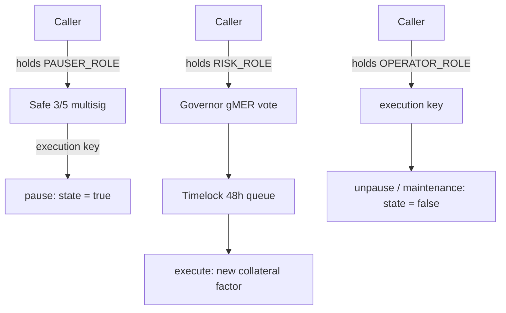

# 25. Access Control & Trust Chains

## Learning Objectives

By the end of this chapter you will be able to:

1. Model a protocol's trust surface as a **chain**: every privileged function resolves to a key, a multisig threshold, a timelock, or a governance vote — and the chain's weakest link is the attack surface.
2. Design a **timelock + governor + multisig** hierarchy for Meridian's admin functions, with the delay as a security parameter, not a UX annoyance.
3. Analyze the 2026 privileged-access incident family (Kelp DAO/LayerZero and Drift Protocol, ~$285–292M, Apr 2026) and extract the generalizable lessons: single points of failure (`R = 1`) in both the key hierarchy and off-chain infrastructure, key custody, execution-key separation, and the "one key can do too much" failure mode.
4. Implement role-based access (Ch 14's `AccessControl` pattern) with the **no-privileged-shortcut** rule (Ch 8) applied at every level.
5. Write the audit checklist: enumerate every `onlyRole`/`onlyOwner` gate, trace its key chain, and classify each as (key, multisig, timelock, governance) with the delay and the recovery path.
6. Distinguish **authorization** (who may call) from **authentication** (who the caller claims to be) — and why `tx.origin` never belongs in either (Ch 1/4 recap).

## Prerequisites

- **Chapter 14** (ERC20) — `AccessControl` roles, the MER role set, the Ch 14 finding that finalized the error catalog.
- **Chapter 24** (Reentrancy) — CEI and the guard discipline this chapter's privileged paths must respect.
- **Chapter 15** (Governance) — gMER checkpointed voting, the governor's role in the chain.

Supporting: **Ch 8** (no-privileged-shortcut rule), **Ch 13** (CI deploy keys as admin keys — the supply-chain framing), **Ch 23** (the sMER `rewardsAdmin` slot). Locked conventions in force.

## Theory

### The trust chain, formalized

Every privileged operation `f` has a **trust chain**: the ordered set of gates between the caller and the state change. A minimal chain:

```
f() ──► onlyRole(ADMIN) ──► key K ──► (multisig threshold t) ──► (timelock delay d) ──► state change
```

The chain's **attack surface** is the set of actors who can pass every gate. The chain's **resilience** is the minimum number of independent key compromises needed to pass it. Design goal: maximize resilience while preserving legitimate operability.

The 2026 incidents are not uniform. Drift Protocol (~$285M, Apr 2026) is the clearest admin-key case — social engineering of multisig signers, a zero-timelock migration, and oracle manipulation. Kelp DAO (~$292M, Apr 2026) is a distinct class: a cross-chain verifier infrastructure failure (a 1-of-1 DVN configuration, RPC compromise, and DDoS) with no admin-key theft involved. Both show that **R = 1 is fatal**, but for different components of the trust chain.

### The three building blocks

1. **Keys** (EOA or hardware): fast, cheap, and the weakest link. An EOA admin key that can change an oracle or pause a market is one stolen seed phrase from a $285M loss.
2. **Multisig** (Safe): `t` of `n` signatures. Compromise requires `t` independent keys. The threshold is the resilience parameter — but every signer is still a target (phishing, malware, social engineering).
3. **Timelock**: a delay between scheduling and executing a state change. Converts "attacker executes instantly" into "attacker schedules, community has `d` to respond". The delay is a *security parameter*: too short (minutes) is decoration; too long (weeks) breaks legitimate ops.

### The hierarchy that survives

Meridian's admin hierarchy, in order of escalation:

| Level | Role held | Authority | Delay | Used for |
|---|---|---|---|---|
| Protocol ops keys | `OPERATOR_ROLE` only — never `PAUSER_ROLE` | execution-only: unpause, maintenance; no parameter changes | 0 | unpause after incident, operator actions |
| Timelock | — | schedules parameter changes | 48 h | oracle addresses, collateral factors, rate-model params |
| Governor (gMER) | `RISK_ROLE` (proposer) | ratifies timelock proposals | 48 h + voting | parameter changes that alter risk |
| Multisig (Safe, 3/5) | `PAUSER_ROLE` only — never `OPERATOR_ROLE` | emergency: pause, kill-switch; cannot unpause | 0 (but logged + monitored) | incident response only |

The design principle: **the more irreversible the action, the longer the chain**. A pause (reversible, urgent) is a short chain; a collateral-factor change (affects every position, semi-reversible) is a long chain; a code upgrade (Ch 38) is the longest.

## Mathematical Foundations

### Resilience = minimum keys to compromise

For a chain of independent gates, resilience `R` = the minimum number of independent secrets an attacker needs. For a multisig `t/n`: `R = t`. For a timelock after a multisig: an attacker who passes the multisig still faces the delay — the delay is not a secret, so it does not raise `R`, it raises the *detection window*: `P(detection within delay d) ≈ 1 − e^(−λd)`, assuming detection events arrive as a Poisson process with constant rate `λ` (a simplifying model — real monitoring rates are bursty and time-of-day dependent). The formula is illustrative: as `d → ∞`, detection probability → 1; as `d → 0` (no timelock), it → 0.

For a chain with two alternatives (either path passes):

```
R_total = min(R_path1, R_path2)
```

The Drift incident reduces to this formula: when an admin key can act alone on a critical function, `R = 1` — no amount of governance behind it changes that path's resilience.

### Key-compromise probability model

With `k` independent keys each compromised with per-year probability `p`:

- EOA single key: `p`
- 2/3 multisig: `3p²(1−p) + p³ ≈ 3p²` for small `p`
- 3/5 multisig: `10p³(1−p)² + 5p⁴(1−p) + p⁵ ≈ 10p³`

At `p = 0.01`: single key 1% vs 3/5 ≈ 0.001% — three orders of magnitude. The threshold is the leverage.

## Engineering Perspective

### Meridian's role set (extending Ch 14)

```solidity
// Ch 14 locked the ADMIN role; Ch 25 extends the set:
bytes32 public constant PAUSER_ROLE   = keccak256("PAUSER_ROLE");   // emergency only
bytes32 public constant OPERATOR_ROLE = keccak256("OPERATOR_ROLE"); // execution, no params
bytes32 public constant RISK_ROLE     = keccak256("RISK_ROLE");     // proposes risk changes
```

The rule from Ch 8, restated for access control: **a role may do exactly one kind of thing.** `PAUSER_ROLE` can pause and nothing else; `OPERATOR_ROLE` can execute maintenance and nothing else; parameter changes go through the timelock; nothing can be changed by a single key without either a timelock or a multisig in the chain.

### The execution-key separation

The 2026 lesson, operationalized: the key that *executes* a function must not be the key that *authorizes* a parameter change. Meridian's deployment separates: an operator key with a hardware-signer custody, a 3/5 Safe for emergencies, and the governor for risk parameters. No single seed phrase can do more than pause.

## Mermaid Diagram



## Code Walkthrough

```solidity
// SPDX-License-Identifier: MIT
pragma solidity ^0.8.24;

import {AccessControl} from "@openzeppelin/contracts/access/AccessControl.sol";
import {ITrustChainLab} from "./ITrustChainLab.sol";

/// @title ITrustChainLab
/// @notice I-prefix interface — full failure surface (Ch 2 lock).
interface ITrustChainLab {
    /// @dev Role failures revert via OZ AccessControl
    ///      (AccessControlUnauthorizedAccount, IAccessControl); only the
    ///      state guard remains lab-specific.
    error NotPaused();
}

/// @title TrustChainLab
/// @notice Pedagogical access-control measurement contract: role gates with
///         separated powers (Ch 25 pattern). NOT part of the protocol.
contract TrustChainLab is AccessControl, ITrustChainLab {
    bytes32 public constant PAUSER_ROLE   = keccak256("PAUSER_ROLE");
    bytes32 public constant OPERATOR_ROLE = keccak256("OPERATOR_ROLE");
    bytes32 public constant RISK_ROLE     = keccak256("RISK_ROLE");

    bool public paused;
    uint256 public collateralFactor;          // WAD
    uint256 public pendingCollateralFactor;

    /// @dev Pedagogical grant: DEFAULT_ADMIN_ROLE goes to the deployer so the
    ///      lab is self-contained. In production it belongs to the Safe 3/5
    ///      multisig, never an EOA — the audit checklist flags this.
    constructor() {
        _grantRole(DEFAULT_ADMIN_ROLE, msg.sender);
    }

    function pause() external onlyRole(PAUSER_ROLE) {
        paused = true;
    }

    function unpause() external onlyRole(OPERATOR_ROLE) {
        if (!paused) revert NotPaused();
        paused = false;
    }

    /// @dev Risk changes are staged: schedule (RISK_ROLE) then execute
    ///      (ADMIN) — the lab's stand-in for the timelock two-step.
    function scheduleCollateralFactor(uint256 cf) external onlyRole(RISK_ROLE) {
        pendingCollateralFactor = cf;
    }

    function executeCollateralFactor() external onlyRole(DEFAULT_ADMIN_ROLE) {
        collateralFactor = pendingCollateralFactor;
    }
}
```

Three details. **First**, the roles are *separated powers* — no role does two kinds of things. **Second**, the risk change is two-step (schedule/execute), the lab's stand-in for the timelock: a single compromised key can propose but not execute. **Third**, in production `DEFAULT_ADMIN_ROLE` belongs to the Safe multisig — the lab grants it to the deployer only for testability, and the chapter's audit checklist flags exactly that difference.

## Production Example

**Drift Protocol (Apr 1, 2026, ~$285M)** — the admin-key case: Lazarus Group spent six months socially engineering multisig signers, convinced two council members to blind-sign staging transactions, then pushed a zero-timelock governance migration that eliminated the review window. The lesson: a timelock is only protective if it cannot be removed by the same keys it protects.

**Kelp DAO / LayerZero (Apr 18, 2026, ~$292M)** — the verifier-infrastructure case: a 1-of-1 DVN configuration meant one compromised verifier (fed by attacker-controlled RPC nodes after a DDoS) could authorize a $292M drain of rsETH. The smart contracts and admin keys were not the attack surface. The lesson: the weakest link in the trust chain may be off-chain infrastructure, not the key hierarchy.

The audit question this chapter teaches: *for each privileged function, what is the minimum number of keys an attacker must compromise, and what can that minimum do?* If the answer is "one key, and it can pause AND change parameters" — that is the 2026 admin-key shape.

## Foundry Lab

`meridian/test/TrustChainLabTest.t.sol`:

```solidity
// SPDX-License-Identifier: MIT
pragma solidity ^0.8.24;

import {Test} from "forge-std/Test.sol";
import {TrustChainLab} from "../src/TrustChainLab.sol";
import {ITrustChainLab} from "../src/ITrustChainLab.sol";
import {IAccessControl} from "@openzeppelin/contracts/access/IAccessControl.sol";

contract TrustChainLabTest is Test {
    TrustChainLab internal lab;
    address internal pauser = address(0x1A55E);
    address internal operator = address(0x0FEA);
    address internal risk = address(0x81A5);
    address internal admin = address(0xAD11);

    function setUp() public {
        lab = new TrustChainLab();          // deployer (this test) = admin
        lab.grantRole(lab.PAUSER_ROLE(), pauser);
        lab.grantRole(lab.OPERATOR_ROLE(), operator);
        lab.grantRole(lab.RISK_ROLE(), risk);
    }

    /// @dev Pauser can pause; operator cannot pause.
    function testPauserOnlyCanPause() public {
        vm.prank(pauser);
        lab.pause();
        assertTrue(lab.paused());
    }

    /// @dev Operator cannot pause — separated powers.
    function testOperatorCannotPause() public {
        vm.expectRevert(
            abi.encodeWithSelector(
                IAccessControl.AccessControlUnauthorizedAccount.selector,
                operator,
                lab.PAUSER_ROLE()
            )
        );
        vm.prank(operator);
        lab.pause();
    }

    /// @dev Operator can unpause; pauser cannot — separation is symmetric.
    function testOperatorUnpauses() public {
        vm.prank(pauser);
        lab.pause();
        vm.prank(operator);
        lab.unpause();
        assertFalse(lab.paused());
    }

    /// @dev Pauser cannot unpause.
    function testPauserCannotUnpause() public {
        vm.prank(pauser);
        lab.pause();
        vm.expectRevert(
            abi.encodeWithSelector(
                IAccessControl.AccessControlUnauthorizedAccount.selector,
                pauser,
                lab.OPERATOR_ROLE()
            )
        );
        vm.prank(pauser);
        lab.unpause();
    }

    /// @dev Risk change is two-step: RISK schedules, ADMIN executes.
    function testTwoStepRiskChange() public {
        vm.prank(risk);
        lab.scheduleCollateralFactor(0.8e18);
        lab.executeCollateralFactor();  // caller = this test = DEFAULT_ADMIN_ROLE
        assertEq(lab.collateralFactor(), 0.8e18);
    }

    /// @dev RISK cannot execute directly — the two-step chain is enforced.
    function testRiskCannotExecute() public {
        vm.prank(risk);
        lab.scheduleCollateralFactor(0.8e18);
        vm.expectRevert(); // onlyRole(DEFAULT_ADMIN_ROLE) — risk lacks it
        vm.prank(risk);
        lab.executeCollateralFactor();
    }

    /// @dev Unpause when not paused reverts.
    function testUnpauseWhenNotPaused() public {
        vm.expectRevert(ITrustChainLab.NotPaused.selector);
        vm.prank(operator);
        lab.unpause();
    }
}
```

Gas: the role check is a double-mapping read in OZ v5's `AccessControl` (`mapping(bytes32 => RoleData)` → nested `mapping(address => bool)`), measured ≈ 6,000 cold / ≈ 2,000 warm via `gasleft()` deltas (Ch 8 methodology) — the two SLOADs themselves are 4,200 cold / 200 warm. Green on forge 1.7.1.

## Security Analysis

### The 2026 privileged-access incidents — two recurring shapes

The Apr 2026 incidents (~$285–292M combined) are two attack classes, not one. Drift Protocol: **a key with too much power, compromised** — social engineering of signers, a zero-timelock migration, oracle manipulation. Kelp DAO/LayerZero: **a trust chain with a single verifier** — a 1-of-1 DVN that one compromised RPC path could forge through, with no admin key involved. The defenses are structural, not procedural: execution-key separation, minimal per-role blast radius, timelocks on irreversible changes, and hardware custody for the keys that remain powerful.

### Social engineering of privileged operators

The ledger's grounding includes the human layer: phishing, wallet-drainer malware, and social engineering of the people holding keys (the 2026 threat landscape). The technical answer is the same as the technical answer to malware: **minimize what any one key can do** so that even a fully compromised operator cannot cause irreversible harm.

### The emergency path is part of the surface

An emergency pause that only the *same* compromised key can trigger is not an emergency path — it is a second attack surface. Meridian's design: the emergency multisig is a *different* set of keys from the operational keys — compromising the ops keys does not grant the ability to pause, and compromising the emergency keys does not grant the ability to operate.

## Common Mistakes

1. **One role, many powers** — a single `onlyAdmin` gate on pause + parameter + upgrade: the 2026 shape.
2. **EOA admin with no threshold** — one seed phrase = one key = R=1.
3. **Emergency path = ops path** — the same keys, so "emergency" is decoration.
4. **Timelock as decoration** — a delay short enough that an attacker can execute before any off-chain monitoring fires an alert.
5. **`tx.origin` anywhere** — Ch 1/4 recap: phishing through a middle contract.
6. **`DEFAULT_ADMIN_ROLE` held by an EOA** — `DEFAULT_ADMIN_ROLE` is the admin of every other role, so any address holding it can grant or revoke any role at will, with no threshold or delay; if that address is an EOA (`R = 1`), compromising it gives total control over the role set. The grantor must be the multisig or a governance contract. A separate footgun: `_setRoleAdmin(ROLE, ROLE)` makes a role self-administering — any current holder can grant it to new addresses without `DEFAULT_ADMIN_ROLE` at all.
7. **No key-rotation plan** — a compromised-but-undetected key is worse than a detected one.

## Gas Optimization

| Pattern | Before | After | Delta |
|---|---|---|---|
| Role check (cold `hasRole`) | — | ~6,000 | baseline — first touch of a role's two slots |
| Role check (warm) | — | ~2,000 | reuse the same role within a tx |
| Single modifier vs two | 2 double-mapping reads | 1 double-mapping read | ~6,000 cold / ~2,000 warm saved |
| Separate roles (no bitmask) | — | 2 SLOADs per role (double-mapping) | security, not gas |

## Reading Production Source Code

1. **OpenZeppelin `AccessControl.sol`** — `hasRole`, `_grantRole`/`_revokeRole`, `onlyRole` modifier; why `DEFAULT_ADMIN_ROLE` (admin of every role) must never sit in an EOA, and the `_setRoleAdmin` self-admin footgun.
2. **Safe (Safe.sol)** — the multisig's `execTransaction`, threshold semantics, module surface.
3. **Compound GovernorBravo** — the timelock + governor separation, `queue`/`execute` two-step.
4. **Aave v3 ACLManager** — the role-set design (POOL_ADMIN, EMERGENCY_ADMIN, RISK_ADMIN separated) — the production instance of this chapter's pattern.

## Exercises

1. Draw the trust chain for `scheduleCollateralFactor` in the lab. What is its resilience? What changes if `RISK_ROLE` is also `DEFAULT_ADMIN_ROLE`?
2. For `p = 0.02`/year, compute single-key vs 2/3 vs 3/5 compromise probabilities.
3. Design the emergency path: which functions are safe with a 0-delay 3/5 Safe, and which must go through the timelock anyway?
4. Why does a timelock raise detection probability but not resilience? Give the formula.
5. The 2026 incidents: identify the exact gate each protocol was missing (from the Ch 25 reading list), and map it to Meridian's role set.

## Weekly Project

**Ship `TrustChainLab.sol` + `TrustChainLabTest.t.sol`**, write `docs/trust-chain.md` (the full Meridian role matrix: function → role → key chain → delay → recovery), and draft the **mini-audit checklist** that Ch 28 will formalize: enumerate every privileged function, trace the chain, classify.

Use this worksheet format for `docs/trust-chain.md` — one row per privileged function. The **"Can role-admin remove timelock?"** column is the Drift check: Drift's zero-timelock Security Council migration was possible precisely because that cell was "Yes".

| Function | Role required | Role admin | Key type | Delay | Can role-admin remove timelock? | Recovery if compromised |
|---|---|---|---|---|---|---|
| `pause()` | `PAUSER_ROLE` | `DEFAULT_ADMIN_ROLE` (Safe 3/5) | multisig | 0 | No — Safe requires 3/5 | rotate Safe signers |
| `unpause()` | `OPERATOR_ROLE` | `DEFAULT_ADMIN_ROLE` (Safe 3/5) | hardware EOA | 0 | No | rotate key |
| `scheduleCollateralFactor()` | `RISK_ROLE` | `DEFAULT_ADMIN_ROLE` (Safe 3/5) | — | 48 h | No | community override |
| `executeCollateralFactor()` | `DEFAULT_ADMIN_ROLE` | self (Safe 3/5) | multisig | — | N/A | rotate Safe signers |

## Deliverables

1. `meridian/src/TrustChainLab.sol` + `ITrustChainLab.sol` — separated-powers role gates.
2. `meridian/test/TrustChainLabTest.t.sol` — role enforcement + negative tests, green.
3. `docs/trust-chain.md` — the Meridian role matrix and key-chain audit.
4. Locked conventions extended: one role = one kind of power; execution-key separation; emergency keys ≠ ops keys; timelock for irreversible changes; `DEFAULT_ADMIN_ROLE` held by multisig, never an EOA.

## Quiz

1. Define the trust chain and its two properties (attack surface, resilience).
2. Why does a single admin key fail even with governance behind it?
3. What is the difference between `PAUSER_ROLE` and `OPERATOR_ROLE` in the lab, and why does the separation matter?
4. Give the 3/5 multisig compromise probability at `p = 0.01` and compare to a single key.
5. What does the timelock add that the multisig does not?

**Answers:** (1) The ordered gates between caller and state change; attack surface = actors passing all gates, resilience = minimum independent keys to compromise. (2) Because the compromised key bypasses the layers behind it — `R = 1` on that path. (3) Pauser pauses, operator unpauses/maintains — neither can do the other's job; a compromised ops key cannot freeze the protocol. (4) At p = 0.01: 3/5 multisig ≈ 10p³ = 10 × 10⁻⁶ = 10⁻⁵ = 0.001%, vs 1% for a single key — three orders of magnitude. (5) A detection window: converts instant execution into schedule-then-wait, giving the community time to respond.

## Further Reading

- Drift Protocol (Apr 1) and Kelp DAO / LayerZero (Apr 18) incident write-ups (Apr 2026, ~$285–292M) — the 2026 grounding for this chapter.
- Safe (`Safe.sol`) docs; Compound `GovernorBravo` (timelock + governor); Aave v3 `ACLManager`.
- OpenZeppelin `AccessControl.sol`.
- Ch 8 (no-privileged-shortcut), Ch 13 (CI deploy keys), Ch 14 (roles), Ch 15 (governance), Ch 23 (rewardsAdmin), Ch 24 (guards), Ch 28 (audit methodology), Ch 38 (upgrades).
