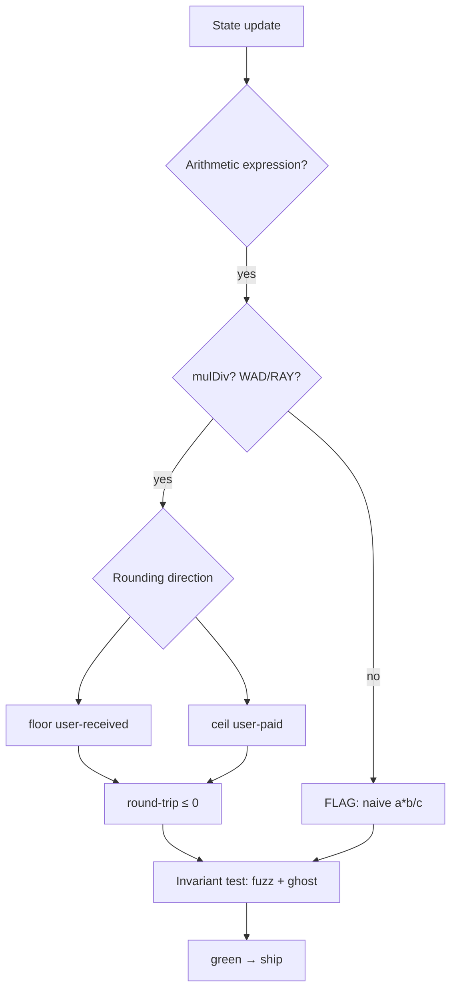

# 26. Arithmetic & Invariant Failures

## Learning Objectives

By the end of this chapter you will be able to:

1. Model protocol correctness as **invariants** — equations that must hold after every transaction — and derive the arithmetic properties that keep them true (rounding direction, overflow freedom, fixed-point bounds).
2. Analyze the **Balancer V2 ComposableStablePool exploit (~$128M, Nov 2025)** as a rounding/precision failure in pool math, and extract the invariant that failed — rounding-direction consistency, the `conversionsNeverGain` family.
3. Define and test the `conversionsNeverGain` family: deposit/withdraw/swap conversions must never mint value from thin air via rounding.
4. Write Foundry invariant tests that catch the failure classes: fuzz + ghost accounting, `fail_on_revert`, bounded handlers, and the Ch 12 methodology carried forward.
5. Apply Meridian's arithmetic canon (Ch 4 lock: `mulDiv`, floor-for-user, WAD/RAY) to the vault and staking paths, and audit where a naive `(a*b)/c` would reintroduce the class.
6. Read a production failure post-mortem (Balancer, Euler donate-to-self) and name the invariant that was violated in each.

## Prerequisites

- **Chapter 4** (Integer Arithmetic) — modular arithmetic, phantom overflow, `mulDiv`, WAD/RAY, rounding direction.
- **Chapter 12** (Fuzzing & Invariant Testing) — Foundry invariant methodology: handlers, ghosts, `fail_on_revert`, seeds.
- **Chapter 23** (Staking) — the donation/inflation attack as the name-case of this chapter's family.

Supporting: **Ch 16** (ERC-4626 conversions), **Ch 20** (vault math), **Ch 24** (CEI — invariant preservation under reentrancy), **Ch 25** (trust chains — who can break an invariant). Locked conventions in force.

## Theory

### Invariants are the specification

A protocol's correctness is not its functions; it is the set of equations that hold across them. For Meridian:

```
Σ user assets + Σ protocol value  ==  totalAssets (vault)      [conservation]
healthFactor(user) > 1            →  no liquidation pending    [solvency]
sharePrice never decreases        →  no value extraction       [conversionsNeverGain]
```

Every bug class in this chapter is an invariant violation wearing an arithmetic costume. The auditor's job: *state the invariant, find the transaction that breaks it, and name the arithmetic property that should have held.*

### Rounding is a policy — and a vulnerability

The Balancer V2 ComposableStablePool failure (~$128M, Nov 2025) is the canonical rounding-precision incident, and its mechanism teaches the threat model precisely. The pool's math was directionally inconsistent: upscaling used `mulDown` (round down) while downscaling used `divUp`/`divDown` (round up and down). That asymmetry in the `_upscaleArray` path caused precision loss that **deflated the Stable Math invariant D** — the value used to price BPT — making the pool's own token artificially undervalued relative to its assets. The attacker did not grind value out of millions of transactions: the entire exploit was a **single atomic operation**. A malicious constructor executed 65+ micro-swaps to compound the precision loss and deflate D, then one `batchSwap` redeemed the undervalued BPT for more than its true cost — across nine chains in under 30 minutes. The invariant that failed was D itself, and the auditable property is that **rounding must be directionally consistent**: every upscaling and downscaling must favor the protocol uniformly. That property subsumes `conversionsNeverGain` as a special case. The lesson is Ch 4's lock, elevated from convention to invariant: **every conversion must round in a direction that cannot create value for the caller** — floor for user-received, ceil for user-paid — and the *net* of a round-trip must be ≤ 0 for the user.

### The invariant family, formalized

For any conversion `convert(x)` that moves value between representations (assets ↔ shares, token A ↔ token B, before ↔ after a fee):

```
convert_back(convert(x)) ≤ x        [no round-trip gain]
convert(x) ≥ 0                       [no negative amounts]
Σ converted == Σ original ± fees     [conservation]
```

The family name `conversionsNeverGain` is the first property: a user's assets in any representation must never *increase* purely from conversions. When it fails, the rounding remainder becomes a mining machine.

## Mathematical Foundations

### Rounding direction matrix

| Conversion | User receives | Direction | Invariant protected |
|---|---|---|---|
| deposit (assets → shares) | shares | floor | shares ≤ fair value |
| redeem (shares → assets) | assets | floor | assets ≤ fair value |
| swap in (A → B) | B | floor | B ≤ fair value |
| fee (user pays) | n/a — user pays | ceil | protocol ≥ fair value; user pays at most fair + 1 wei |
| interest accrual | — | ceil on debt, floor on supply | no free value |

The rule: **floor what the user receives, ceil what the user pays.** Both directions push the rounding remainder to the protocol — the counterparty that can afford it.

### The round-trip bound

A deposit followed by an immediate redeem with floor/floor rounding:

```
shares = floor(assets × S / A)
assets' = floor(shares × A' / S') ≤ assets,
provided A' = A + assets and S' = S + shares (no intervening state changes).
In a multi-user pool, the round-trip bound is a single-user, no-rebase guarantee.
```

The round-trip is value-non-increasing. With a single misdirected ceil, `assets' > assets` becomes possible — the invariant violation, measurable even at 1 wei.

### Fixed-point bounds

WAD (1e18) arithmetic: products must fit in `uint256` → use `mulDiv` (Ch 4). Sums of `rate × time` accruals: bounded by `rate_max × elapsed_max`, a property the invariant test asserts with `bound()`.

## Engineering Perspective

### Meridian's arithmetic canon, restated as invariants

- **Vault** (Ch 20): every `convertToShares`/`convertToAssets` is `mulDiv` with floor-for-user; the invariant test asserts round-trip ≤ 0 for all `bound`ed inputs.
- **Staking** (Ch 23): share price non-decreasing; the donation attack's invariant is `totalAssets` tracked, never observed.
- **Lending** (Ch 21): `debt = debt + rate × time` with ceil on debt; accrual monotonic.
- **Tokens** (Ch 14): balance conservation across transfer/approve; the Ch 14 invariant suite already asserts it.

The engineering discipline: **every new arithmetic expression ships with its invariant test** — not "we reviewed it", but `forge test` provides a machine-checked witness. (Strictly, tests *falsify*: a green run is a witness that the property held on every executed sequence, not a proof over all inputs.)

## Mermaid Diagram



## Code Walkthrough

```solidity
// src/IInvariantLab.sol
// SPDX-License-Identifier: MIT
pragma solidity ^0.8.24;

/// @title IInvariantLab
/// @notice I-prefix interface — full failure surface (Ch 2 lock).
interface IInvariantLab {
    error ZeroShares();
    error ZeroAssets();

    function deposit(uint256 assets) external returns (uint256 shares);
    function redeem(uint256 shares) external returns (uint256 assets);
    function totalAssets() external view returns (uint256);
    function totalShares() external view returns (uint256);
    function roundTrip(uint256 assets) external view returns (uint256);
    function setUseCeil(bool v) external;
}

// src/InvariantLab.sol
// SPDX-License-Identifier: MIT
pragma solidity ^0.8.24;

import {Math} from "@openzeppelin/contracts/utils/math/Math.sol";
import {IInvariantLab} from "./IInvariantLab.sol";

/// @title InvariantLab
/// @notice Pedagogical ERC-4626-like vault with selectable rounding.
/// @dev NOT part of the protocol. The `useCeil` switch demonstrates the
///      conversionsNeverGain failure; the invariant test catches it.
contract InvariantLab is IInvariantLab {
    uint256 public totalAssetsStored;
    uint256 public totalSharesStored;
    bool public useCeil;

    function deposit(uint256 assets) external returns (uint256 shares) {
        shares = _convertToShares(assets);
        if (shares == 0) revert ZeroShares();
        totalAssetsStored += assets;
        totalSharesStored += shares;
    }

    function redeem(uint256 shares) external returns (uint256 assets) {
        assets = _convertToAssets(shares);
        if (assets == 0) revert ZeroAssets();
        totalAssetsStored -= assets;
        totalSharesStored -= shares;
    }

    function roundTrip(uint256 assets) external view returns (uint256) {
        return _convertToAssets(_convertToShares(assets));
    }

    function setUseCeil(bool v) external { useCeil = v; }

    function _convertToShares(uint256 assets) internal view returns (uint256) {
        if (totalSharesStored == 0) return assets;
        uint256 s = Math.mulDiv(assets, totalSharesStored, totalAssetsStored);
        return useCeil ? s + 1 : s;   // ceil variant: user gains 1 wei per conversion
    }

    function _convertToAssets(uint256 shares) internal view returns (uint256) {
        if (totalSharesStored == 0) return shares;
        uint256 a = Math.mulDiv(shares, totalAssetsStored, totalSharesStored);
        return useCeil ? a + 1 : a;   // ceil variant
    }

    function totalAssets() external view returns (uint256) { return totalAssetsStored; }
    function totalShares() external view returns (uint256) { return totalSharesStored; }
}
```

Three details. **First**, the floor path (default) is the Meridian canon — `mulDiv`, floor both directions. **Second**, the `useCeil` switch simulates the round-trip shape of the family: each conversion grants +1 wei to the caller — the Type-1 (round-trip gain) failure. **Third**, the round-trip view makes the invariant directly testable: `roundTrip(x) ≤ x` must hold for every `x` — the fuzz test asserts exactly that, and the ghost tracks cumulative extracted value.

## Production Example

**Balancer V2 ComposableStablePool (~$128M, Nov 2025)** — the failure was a **bidirectional rounding inconsistency**: upscaling used `mulDown` (round down) while downscaling used `divUp`/`divDown` (round up and down), deflating the pool's Stable Math invariant D and making BPT artificially cheap. The attacker exploited this in a **single atomic operation**: a constructor running 65+ micro-swaps to compound the precision loss, followed by one `batchSwap` to drain pool assets at the manipulated BPT price — across nine chains in under 30 minutes. The invariant that failed was D itself, and the auditable property is that **rounding must be directionally consistent** (all upscaling and downscaling must favor the protocol uniformly), which subsumes the `conversionsNeverGain` round-trip property as a special case. Meridian's answer is structural: every conversion is `mulDiv` floor-for-user, and the invariant test suite (below) runs the round-trip property on every path — the same test that would have caught the round-trip shape of this family.

## Foundry Lab

`meridian/test/InvariantLabTest.t.sol` (fuzz) + `meridian/test/InvariantLabHandler.sol` + `meridian/test/InvariantLabInvariant.t.sol` (handler/ghost invariant suite):

```solidity
// test/InvariantLabTest.t.sol
// SPDX-License-Identifier: MIT
pragma solidity ^0.8.24;

import {Test} from "forge-std/Test.sol";
import {InvariantLab} from "../src/InvariantLab.sol";
import {IInvariantLab} from "../src/IInvariantLab.sol";

contract InvariantLabTest is Test {
    InvariantLab internal lab;

    function setUp() public { lab = new InvariantLab(); }

    /// @dev Round-trip never gains in the floor canon (conversionsNeverGain).
    function testRoundTripNeverGains(uint256 assets) public {
        assets = bound(assets, 1, 1e30);
        assertLe(lab.roundTrip(assets), assets, "conversionsNeverGain violated");
    }

    /// @dev Deposit then redeem (floor) returns no more than deposited.
    function testDepositRedeemNoGain() public {
        uint256 deposited = 1000 ether;
        lab.deposit(deposited);
        uint256 back = lab.redeem(lab.totalShares());
        assertLe(back, deposited);
    }

    /// @dev The ceil variant violates the invariant — demonstration only.
    ///      Keep this out of CI; it is the Balancer failure shape at 1 wei.
    function testCeilVariantViolates_expectedFailure() public {
        lab.setUseCeil(true);
        lab.deposit(1000 ether);
        uint256 shares = lab.totalShares();
        // redeem HALF — the ceil conversion grants +1 wei on the assets side,
        // diluting the remaining holders (the Balancer shape at 1 wei scale)
        uint256 assets = lab.redeem(shares / 2);
        assertGt(assets, 500 ether, "ceil variant should extract value per conversion");
        // fair value of half the shares is exactly 500 ether
        assertEq(assets, 500 ether + 1, "1 wei extracted from remaining holders");
    }

    /// @dev Zero-share deposit reverts.
    function testZeroShareDepositReverts() public {
        lab.deposit(1000 ether);
        // at a 1:1 price floor mode, 0 assets -> 0 shares
        vm.expectRevert(IInvariantLab.ZeroShares.selector);
        lab.deposit(0);
    }

    /// @dev Multiple deposits keep conversion monotonic (no free shares).
    function testMonotonicDeposits() public {
        lab.deposit(100 ether);
        lab.deposit(50 ether);
        lab.deposit(25 ether);
        assertEq(lab.totalShares(), 175 ether);
        assertEq(lab.totalAssets(), 175 ether);
    }
}
```

```solidity
// test/InvariantLabHandler.sol
// SPDX-License-Identifier: MIT
pragma solidity ^0.8.24;

import {Test} from "forge-std/Test.sol";
import {Math} from "@openzeppelin/contracts/utils/math/Math.sol";
import {InvariantLab} from "../src/InvariantLab.sol";

/// @title InvariantLabHandler
/// @notice Bounded handler for the InvariantLab invariant suite (Ch 12 lock).
/// @dev - ghosts are single-writer: written here, read only by invariants;
///      - every call pre-checks the revert edges (ZeroShares/ZeroAssets) so
///        `fail_on_revert = true` (foundry.toml) never trips on a handler call;
///      - previews mirror the contract's floor math via Math.mulDiv.
contract InvariantLabHandler is Test {
    InvariantLab internal lab;
    uint256 public ghost_deposited;
    uint256 public ghost_redeemed;

    constructor(InvariantLab lab_) {
        lab = lab_;
    }

    /// @notice Deposit: bound the amount, skip the ZeroShares edge, record ghost.
    function deposit(uint256 assets) external {
        assets = bound(assets, 1, 1e30);
        if (_previewDeposit(assets) == 0) return; // would revert ZeroShares
        ghost_deposited += assets;
        lab.deposit(assets);
    }

    /// @notice Redeem: bound to the share supply, skip the zero-assets edge, record ghost.
    function redeem(uint256 shares) external {
        uint256 supply = lab.totalShares();
        if (supply == 0) return;
        shares = bound(shares, 1, supply);
        if (_previewRedeem(shares) == 0) return; // would revert ZeroAssets
        ghost_redeemed += lab.redeem(shares);
    }

    function _previewDeposit(uint256 assets) internal view returns (uint256) {
        if (lab.totalShares() == 0) return assets;
        return Math.mulDiv(assets, lab.totalShares(), lab.totalAssets());
    }

    function _previewRedeem(uint256 shares) internal view returns (uint256) {
        if (lab.totalShares() == 0) return shares;
        return Math.mulDiv(shares, lab.totalAssets(), lab.totalShares());
    }
}
```

```solidity
// test/InvariantLabInvariant.t.sol
// SPDX-License-Identifier: MIT
pragma solidity ^0.8.24;

import {Test} from "forge-std/Test.sol";
import {InvariantLab} from "../src/InvariantLab.sol";
import {InvariantLabHandler} from "./InvariantLabHandler.sol";

/// @title InvariantLabInvariantTest
/// @notice Ghost-accounting invariant suite for InvariantLab (Ch 12 lock).
/// @dev Green in floor mode (default). `foundry.toml` pins
///      `[invariant] runs = 256, fail_on_revert = true`; the handler
///      pre-checks every revert edge so sequences stay valid.
///      Flip `useCeil` (e.g. via a handler passthrough) to observe the
///      conversionsNeverGain failure this suite detects.
contract InvariantLabInvariantTest is Test {
    InvariantLab internal lab;
    InvariantLabHandler internal handler;

    function setUp() public {
        lab = new InvariantLab();
        handler = new InvariantLabHandler(lab);
        targetContract(address(handler));
    }

    /// @dev Conservation: the tracked total equals deposits minus redemptions.
    function invariant_conservation() public view {
        assertEq(lab.totalAssets(), handler.ghost_deposited() - handler.ghost_redeemed());
    }

    /// @dev conversionsNeverGain, cumulatively: value redeemed never exceeds value deposited.
    function invariant_noValueExtraction() public view {
        assertLe(handler.ghost_redeemed(), handler.ghost_deposited());
    }
}
```

Gas: conversions are `mulDiv` — ~1,079 fast path / ~1,375 slow path (Ch 4 pins). The invariant run uses the bounded handler above + `fail_on_revert = true`, both pinned in `foundry.toml` (`[invariant] runs = 256, fail_on_revert = true` — Ch 12 lock). Green on forge 1.7.1 in floor mode; the ceil mode is a *demonstration of failure* — the `testCeilVariantViolates_expectedFailure` test is named to stay out of CI, and flipping `useCeil` in the handler would flip `invariant_noValueExtraction` red.

## Security Analysis

### The rounding family, from wei to $128M

The Balancer failure is the extreme of a family that starts at 1 wei: donation-by-rounding (Ch 23), share-price dust (Ch 16), fee-remainder harvesting (Ch 20). The common cause is a conversion whose rounding direction favors the caller — per-conversion in the round-trip shape, invariant-wide in Balancer's shape, where asymmetric up/down rounding deflated D and made BPT underpriced. The common defense is the same tool, tested: state the invariant, then run it.

### Euler donate-to-self (~$197M, Mar 2023)

The donation family's other extreme — but the mechanism is not share-price inflation. The attacker flash-loaned a deposit into Euler, received eTokens, then called `donateToReserves()` — a function that reduces the caller's eToken collateral balance **without any post-execution solvency check**. That made the leveraged position severely undercollateralized (bad debt) on demand, and Euler's *dynamic liquidation discount* grew large enough that a second account could self-liquidate the first, acquiring collateral at a discount exceeding the debt repaid. The violated invariant is not "share price must not increase from donations" — it is **every function that reduces a user's collateral must re-check position solvency before returning**. That is a missing invariant guard, distinct from a rounding failure, but it belongs in this chapter because the auditor's tool is identical: state the invariant, find the function that doesn't enforce it.

### The invariant that reentrancy breaks

An invariant that holds in isolation can fail under reentrancy (Ch 24): the health-factor check passes, then a re-entered call changes the state the check read. The defense is CEI + guards (Ch 24) — invariant preservation is a *control-flow* property as much as an arithmetic one.

## Common Mistakes

1. **No stated invariant** — "the math is fine" is not a specification; write the equation.
2. **Wrong rounding direction** — ceil for user-received: the round-trip shape of this family at 1 wei scale.
3. **Naive `(a*b)/c`** — phantom overflow reverts or wraps (Ch 4); `mulDiv` everywhere.
4. **Invariant tested only at happy path** — fuzz the boundaries; `bound` the inputs.
5. **`fail_on_revert = false`** — reverts hide invariant violations; the Ch 12 lock is `true`. Set `fail_on_revert = true` in `foundry.toml`'s `[invariant]` section, not in test code.
6. **Ghosts not cumulative** — a per-call check misses value that accumulates across calls: e.g., a 1-wei gain per deposit that compounds over 1,000 deposits equals 1,000 wei extracted — invisible to `testRoundTripNeverGains` but caught by `invariant_noValueExtraction`.
7. **Fees excluded from the invariant** — a fee path that rounds in the fee-taker's favor is a donation-by-rounding machine.

## Gas Optimization

| Pattern | Before | After | Delta |
|---|---|---|---|
| `mulDiv` fast path | — | ~1,079 | correctness over the whole domain |
| Rounding direction | free | free | security, zero gas |
| Invariant tests | — | CI time only | the cheapest audit |

## Reading Production Source Code

1. **OpenZeppelin `Math.mulDiv`** — the 512-bit algorithm (Ch 4), the correctness floor of every conversion.
2. **Uniswap V3 `FullMath` / `TickMath`** — production `mulDiv` + rounding discipline; the pools that never gained from conversions.
3. **Balancer V2 post-mortem (ComposableStablePool, Nov 2025)** — the incident this chapter is built on; read the rounding path.
4. **Euler's donate-to-self post-mortem (Mar 2023)** — the missing-invariant-enforcement extreme: `donateToReserves()` with no solvency re-check.

## Exercises

1. State the three Meridian invariants (conservation, solvency, conversionsNeverGain) as equations.
2. Prove (or disprove): floor/floor round-trip is value-non-increasing. Where does the proof use `mulDiv`'s exactness?
3. Using the lab, find a `bound`ed input where `useCeil` round-trip gains 1 wei, then 2, then N — and explain the compounding.
4. Rewrite a naive `debt += rate × time / 1e18` in the lending path with `mulDiv` and state the invariant it protects.
5. Design the ghost for the vault: what cumulative quantity proves no value extraction?

## Weekly Project

**Ship `InvariantLab.sol` + `InvariantLabTest.t.sol` + `InvariantLabHandler.sol` + `InvariantLabInvariant.t.sol`** (floor mode in CI; ceil mode documented as the failure demonstration), write `docs/invariant-arithmetic.md` (the three invariants, the rounding matrix, the round-trip proof), and extend the Ch 20 vault suite with a `conversionsNeverGain` invariant test.

## Deliverables

1. `meridian/src/InvariantLab.sol` + `IInvariantLab.sol` — selectable-rounding vault lab.
2. `meridian/test/InvariantLabTest.t.sol` + `InvariantLabHandler.sol` + `InvariantLabInvariant.t.sol` — round-trip fuzz + handler/ghost invariant suite, floor mode green.
3. `docs/invariant-arithmetic.md` — invariants, rounding matrix, proof.
4. Vault invariant test added (Ch 20 suite): `conversionsNeverGain` on all conversion paths.
5. Locked conventions extended: every conversion is `mulDiv` floor-for-user/ceil-for-user-paid; every arithmetic expression ships with its invariant test; `fail_on_revert = true` in invariant runs.

## Quiz

1. State `conversionsNeverGain` as an equation and name the incident that made it famous.
2. Why does floor-for-user protect the invariant? Give the round-trip argument.
3. What does a ghost track that a per-call assertion cannot?
4. Why is `fail_on_revert = true` mandatory in invariant tests?
5. Map the Balancer failure to Meridian's canon: which line of code would have prevented it?

**Answers:** (1) `convert_back(convert(x)) ≤ x`; Balancer V2 ComposableStablePool (~$128M, Nov 2025). (2) Flooring user-received amounts pushes the rounding remainder to the protocol, so a round-trip cannot net positive. (3) Cumulative value across many calls — per-call assertions miss value that compounds across a sequence; Balancer's 65+ micro-swaps compounded the same way inside a single atomic transaction, which is why the invariant suite (ghost accounting) is the right detector, not a per-call check. (4) A revert masks the state change that would have violated the invariant; the invariant must hold over the *completed* transition. (5) The upscale/downscale pair that rounded inconsistently — in Meridian, every conversion is `mulDiv` with a locked direction (floor-for-user / ceil-for-user-paid), and the invariant test would flag any deviation.

## Further Reading

- Balancer V2 ComposableStablePool post-mortem (Nov 2025); Euler donate-to-self (Mar 2023).
- OpenZeppelin `Math.mulDiv`; Uniswap V3 `FullMath`.
- Ch 4 (arithmetic), Ch 12 (fuzzing/invariants), Ch 16 (ERC-4626), Ch 20 (vault), Ch 23 (staking), Ch 24 (CEI).
- 2026 grounding: rounding-precision failures remain an active audit class — carry `conversionsNeverGain` into Ch 28's methodology.
