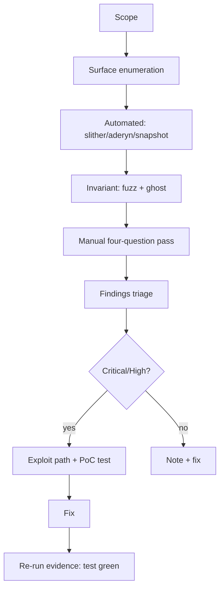

# 28. Auditing Methodology

## Learning Objectives

By the end of this chapter you will be able to:

1. Run a structured audit of a Solidity codebase: scope definition → surface enumeration → automated analysis → manual review → invariant testing → findings report — the full lifecycle this curriculum has been building toward.
2. Use the toolchain (Slither, Aderyn, forge snapshot, invariant fuzzing) as *evidence generators*, not verdicts — each finding must be confirmed or refuted by hand.
3. Write the **mini-audit report**: findings with severity, location, exploit path, impact, and fix — the portfolio milestone that ties Ch 13's CI gates to this chapter's methodology.
4. Apply the 2026 grounding to prioritization: admin-key/trust-surface findings outrank gas findings; rounding/invariant findings outrank style.
5. Distinguish vulnerability classes by their *evidence*: reentrancy (control-flow trace), rounding (invariant test), access control (trust-chain enumeration), oracle (manipulation math).

## Prerequisites

- **Chapter 13** (CI/CD & Static Analysis) — Slither/Aderyn config, the CI gates this chapter's audit runs through.
- **Chapters 24–27** — the vulnerability classes the audit looks for (reentrancy, access control, arithmetic, bridges).
- **Chapter 12** (Fuzzing & Invariants) — the evidence engine.

Supporting: **Ch 8** (gas methodology), **Ch 17** (token security), **Ch 26** (invariants). Locked conventions in force.

## Theory

### Audit as falsification

An audit is not "reading the code carefully". It is a **falsification campaign**: for every invariant the protocol claims (conservation, solvency, conversionsNeverGain, access control), the auditor tries to construct a transaction that breaks it. The tools generate candidates; the auditor's hand-trace confirms or kills them.

### The severity ladder

| Severity | Definition | Example |
|---|---|---|
| Critical | direct fund loss, no preconditions | unguarded admin key, reentrancy drain |
| High | fund loss under realistic conditions | oracle manipulation on a live market |
| Medium | conditional loss / griefing | rounding dust on a low-liquidity path |
| Low | no loss, violates convention | gas inefficiency, missing NatSpec |
| Info | observation, no action required | style, naming |

The 2026 calibration: **trust-surface findings (Ch 25/27) and rounding/invariant findings (Ch 26) get one severity level higher than their pure mechanics suggest** — the incident set (Kelp/Drift, Balancer) is the evidence that these classes realize at scale.

## Mathematical Foundations

### Coverage as probability

Automated analysis covers `P(tool)` of the surface; manual review covers `P(manual)`; invariant testing covers `P(invariant)`. The auditor's job is to maximize the union — the classes each method *cannot* see are the gaps:

- Static analysis: sees patterns, misses state-dependent logic.
- Fuzzing: sees the tested invariant, misses untested ones.
- Manual review: sees everything the reviewer knows to look for.

The methodology's value is the *intersection discipline*: a finding confirmed by two independent methods (static + hand-trace, fuzz + ghost) is evidence; a finding seen by one method is a candidate.

### Finding confidence

Confidence = f(evidence strength, replication). A reentrancy finding with a failing test that demonstrates the drain is higher confidence than one with a trace sketch. The report's findings table carries both: `evidence` column (test hash, trace, tool output) and `confidence` (confirmed / probable / theoretical).

## Engineering Perspective

### Meridian's audit pipeline (the Ch 13 gates, orchestrated)

```
1. Scope: diff since last audit + the audit targets (vault, sMER, tokens)
2. Surface enumeration: every external/public function, every role gate (Ch 25 checklist)
3. Automated: slither (--fail-high), aderyn, forge snapshot --check
4. Invariant: fuzz + ghost runs on the locked invariants (Ch 26)
5. Manual: the four-question pass per function (Ch 24 audit questions)
6. Findings: severity + location + exploit path + fix
7. Re-audit: fixes verified by the same evidence (test now passes)
```

The discipline: **every finding ships with its falsification** — the transaction, trace, or test that demonstrates it, and the test that will fail when the fix regresses.

## Mermaid Diagram



## Code Walkthrough

```solidity
// SPDX-License-Identifier: MIT
pragma solidity ^0.8.24;

/// @title IAuditLab
/// @notice I-prefix interface — the audit target with intentional findings.
interface IAuditLab {
    error Unauthorized(address caller);
    error InsufficientBalance(uint256 have, uint256 want);

    function withdraw(uint256 amount) external;
    function setAdmin(address newAdmin) external;
    function transferTo(address to, uint256 amount) external;
    function balanceOf(address who) external view returns (uint256);
}

/// @title AuditLab
/// @notice Pedagogical audit target with THREE intentional findings
///         (see AuditLabTest + the report in docs/mini-audit.md).
/// @dev NOT part of the protocol — an audit exercise.
contract AuditLab is IAuditLab {
    mapping(address => uint256) public balances;
    address public admin;

    constructor() {
        admin = msg.sender;
        balances[msg.sender] = 100 ether;
    }

    /// @dev The deposit path: funds the contract AND credits balances[msg.sender].
    ///      Without it no balance entry can ever be credited and the findings
    ///      (and Exercise 2) are not exercisable.
    receive() external payable {
        balances[msg.sender] += msg.value;
    }

    /// @dev FINDING 1 (Critical): admin can be changed by anyone (no gate) —
    ///      the unguarded admin key, the severity ladder's Critical example.
    function setAdmin(address newAdmin) external {
        admin = newAdmin;
    }

    /// @dev FINDING 2 (Critical): CEI violation — the transfer (interaction)
    ///      precedes the balance write (effect), with no balance require and
    ///      no reentrancy guard. A reentrant caller exploits the stale
    ///      balance; an overdraw underflows.
    function withdraw(uint256 amount) external {
        (bool ok,) = msg.sender.call{value: amount}("");
        require(ok, "push failed");
        balances[msg.sender] -= amount;   // effect AFTER the interaction
    }

    /// @dev FINDING 3 (Medium): recipient balance updated before sender —
    ///      the cross-function reentrancy twin of Finding 2 (Ch 24): a
    ///      mid-withdraw transferTo moves the stale (not-yet-decremented)
    ///      balance.
    function transferTo(address to, uint256 amount) external {
        balances[to] += amount;
        balances[msg.sender] -= amount;
    }

    function balanceOf(address who) external view returns (uint256) { return balances[who]; }
}
```

Three findings, three classes: **access control** (Critical — the unguarded admin key), **CEI violation** (Critical — the interaction precedes the effect, so a reentrant caller exploits the stale balance and an overdraw underflows), **order-of-operations / cross-function reentrancy** (Medium — the recipient is credited before the sender). The audit report in the Weekly Project documents all three with exploit paths and fixes.

## Production Example

**The mini-audit report (portfolio milestone).** `docs/mini-audit.md` audits `AuditLab` (above) and, at a skim level, the Meridian vault's borrow path (Ch 20). Structure:

1. **Scope** — files, functions, commit hash.
2. **Method** — toolchain + manual passes.
3. **Findings** — table: id, severity, class, location, exploit path, impact, fix, evidence.
4. **Invariants tested** — the Ch 26 set, with the fuzz command and seed.
5. **Conclusion** — residual risk + what the next audit should cover.

## Foundry Lab

`meridian/test/AuditLabTest.t.sol` — each finding demonstrated as a failing-then-passing test (the falsification evidence the audit report's fixes must flip):

```solidity
// SPDX-License-Identifier: MIT
pragma solidity ^0.8.24;

import {Test} from "forge-std/Test.sol";
import {stdError} from "forge-std/StdError.sol";
import {AuditLab} from "../src/AuditLab.sol";

/// @dev Reentrant caller for Finding 3: receive() fires mid-withdraw, while
///      the caller's balance is still stale (not yet decremented). The gift
///      takes exactly the balance the outer frame will NOT decrement
///      (bal - msg.value — the Ch 24 pattern).
contract ReentrantCaller {
    AuditLab internal lab;
    address internal victim;
    uint256 public staleBalanceSeen;

    constructor(AuditLab _lab) { lab = _lab; }

    /// @dev Honest funding path: forwards the caller's own ETH through the
    ///      lab's receive(), the audit-mandated deposit path.
    function deposit() external {
        (bool ok,) = address(lab).call{value: address(this).balance}("");
        require(ok, "deposit failed");
    }

    receive() external payable {
        uint256 bal = lab.balanceOf(address(this));   // STALE mid-withdraw
        staleBalanceSeen = bal;
        if (bal > msg.value) {
            lab.transferTo(victim, bal - msg.value);
        }
    }

    function attack(address _victim, uint256 amount) external {
        victim = _victim;
        lab.withdraw(amount);
    }
}

contract AuditLabTest is Test {
    AuditLab internal lab;

    function setUp() public { lab = new AuditLab(); }

    /// @dev Finding 1 (Critical): anyone can become admin — the unguarded
    ///      admin key, the severity ladder's Critical example.
    function testFinding1AnyoneCanSetAdmin() public {
        vm.prank(address(0xBAD));
        lab.setAdmin(address(0xBAD));
        assertEq(lab.admin(), address(0xBAD));
    }

    /// @dev Finding 2 (Critical): CEI violation — the push (interaction)
    ///      precedes the decrement (effect). The push succeeds because the
    ///      lab holds ETH; the decrement then underflows (panic 0x11) because
    ///      amount > balance. The exact panic is asserted, pinning the
    ///      failure mode — a push-failure revert would fail this test.
    function testFinding2OverdrawUnderflows() public {
        address overdrawer = address(0xF2E5);
        lab.transferTo(overdrawer, 5 ether);        // real balance: 5 ether
        vm.deal(address(lab), 10 ether);            // the push can be covered
        vm.prank(overdrawer);
        vm.expectRevert(stdError.arithmeticError);  // panic 0x11 on the decrement
        lab.withdraw(10 ether);                     // overdraw by 2x
    }

    /// @dev Finding 2b: legitimate withdraw succeeds (caller is an EOA with
    ///      a real balance, moved via transferTo).
    function testFinding2LegitimateWithdraw() public {
        lab.transferTo(address(0x0A7A), 10 ether);   // deployer -> EOA
        vm.deal(address(lab), 10 ether);
        vm.prank(address(0x0A7A));
        lab.withdraw(10 ether);
        assertEq(lab.balanceOf(address(0x0A7A)), 0);  // 10 - 10 = 0
    }

    /// @dev Finding 3 (Medium): transferTo credits the recipient before the
    ///      sender. A reentrant caller invokes transferTo mid-withdraw while
    ///      its balance is still stale (not yet decremented): the gift lands
    ///      AND the withdrawal completes — the same balance spent twice in
    ///      one transaction (balance drift). Against a CEI-fixed contract the
    ///      mid-call balance reads 5 ether and this test FAILS — the
    ///      re-audit evidence.
    function testFinding3OrderHazard() public {
        ReentrantCaller attacker = new ReentrantCaller(lab);
        address victim = address(0xABCD);

        vm.deal(address(attacker), 10 ether);
        attacker.deposit();                      // balances[attacker] = 10; lab holds 10 ETH
        attacker.attack(victim, 5 ether);           // withdraw -> reenters transferTo

        assertEq(attacker.staleBalanceSeen(), 10 ether, "stale balance read mid-withdraw");
        assertEq(lab.balanceOf(victim), 5 ether, "victim credited against the stale balance");
        assertEq(lab.balanceOf(address(attacker)), 0, "outer decrement charged too");
        assertEq(address(attacker).balance, 5 ether, "withdrawal completed");
        // drift: 5 ETH cashed out + 5 gifted = the full 10 ether balance,
        // both movements authorized by a single (stale) balance entry
        assertEq(lab.balanceOf(victim) + address(attacker).balance, 10 ether);
    }
}
```

Green on forge 1.7.1 — the tests *document* the findings, and each one is honest about *why* it fails or passes. Finding 2's test pins the exact `panic 0x11`: if the revert were a push failure (`require(ok, "push failed")` for an unfunded lab), the test would fail — so it cannot silently pass for the wrong reason. Finding 3's reentrant caller reads the stale balance (10 ether) mid-withdraw; against the CEI fix (decrement before the call, plus a `nonReentrant` guard — the call target is attacker-controlled) the mid-call balance reads 5 ether and the test fails. That is the re-audit evidence: the audit report's fixes turn each test into its own falsification.

## Security Analysis

### Why the toolchain is not the audit

Slither/Aderyn generate candidates; they cannot weigh business impact. The Ch 13 CI gates are the *floor* (nothing ships with a high finding); this chapter is the *ceiling* (the report that explains what remains and why). The 2026 incidents are all cases where the tools were green and the protocol still lost money — the missing layer was the manual trust-surface + invariant analysis this chapter formalizes.

### The audit's own failure modes

1. **Scope creep** — auditing everything, proving nothing.
2. **Tool worship** — "slither passed" as a conclusion.
3. **No exploit path** — a finding without the transaction that triggers it.
4. **Severity inflation** — everything is Critical, so nothing is.
5. **Fix without evidence** — the fix is merged, the failing test never existed.

## Common Mistakes

1. Auditing only the diff — regressions live in untouched code.
2. Findings without location (file:line) — unreviewable.
3. No PoC — "theoretically" is not an audit finding.
4. Ignoring the 2026 calibration — a cosmetic gas finding ranked above a trust-surface one.
5. Re-audit skipped — the fix itself introduces a finding (the fix-bug class).

## Gas Optimization

| Pattern | Before | After | Delta |
|---|---|---|---|
| Audit run cost | — | CI time | the cheapest insurance |
| Finding triage | — | — | severity discipline, not gas |
| Fix verification | — | test run | the evidence loop |

## Reading Production Source Code

1. **A public audit report** (e.g., an OpenZeppelin or Trail of Bits report on a lending protocol) — the genre: scope, methodology, findings table, severity.
2. **Slither + Aderyn outputs on this repo** (Ch 13 CI) — the candidate list this chapter's manual pass triages.
3. **The four Ch 24 audit questions** applied to `MeridianVault` (Ch 20) — the manual pass, run.

## Exercises

1. Enumerate the surface of `AuditLab`: every external function, every gate (and missing gate).
2. Write the exploit path for Finding 2 and the fix, then the test that proves the fix. The fix is the textbook CEI reorder: decrement the balance *before* the call (effects before interactions), and add a `nonReentrant` guard — the call target is attacker-controlled, so CEI alone is not enough. Prove the fix the way `testFinding3OrderHazard` does: the exploit must fail against the fixed contract.
3. Rank the three findings by the severity ladder with the 2026 calibration applied.
4. Run slither on `AuditLab` and compare its output to the manual findings — what does each method see that the other misses?
5. Draft the findings table for the Meridian vault borrow path from Ch 20.

## Weekly Project

**The mini-audit: `docs/mini-audit.md` + `AuditLab.sol` + `AuditLabTest.t.sol`.** The report covers AuditLab (3 findings, full lifecycle) and the vault borrow path (skim). This is the portfolio milestone — the artifact that demonstrates the entire curriculum's methodology in one document.

## Deliverables

1. `meridian/src/AuditLab.sol` + `IAuditLab.sol` — the audit target with intentional findings.
2. `meridian/test/AuditLabTest.t.sol` — findings documented as tests.
3. `docs/mini-audit.md` — the report: scope, method, findings table, invariants, residual risk.
4. Locked conventions extended: findings ship with exploit path + evidence; severity calibrated by the 2026 incident set; every fix ships with its regression test; re-audit after every fix batch.

## Quiz

1. What is the difference between a tool finding and an audit finding?
2. Name the five severity levels and give the 2026 calibration rule.
3. Why does every finding need an exploit path?
4. What does the re-audit step verify, and why is it mandatory?
5. Which two independent methods confirm a reentrancy finding?

**Answers:** (1) A tool finding is a candidate; an audit finding is a candidate confirmed by hand-trace, test, or both. (2) Critical/High/Medium/Low/Info; trust-surface and rounding findings rank one level above their mechanics. (3) Without the transaction that triggers it, a finding is unverifiable and unfixable-by-evidence. (4) That the fix closes the finding without introducing a new one — the fix-bug class. (5) Static pattern + a failing PoC test (or invariant violation).

## Further Reading

- Public audit reports (OZ, Trail of Bits) on lending protocols — the genre.
- Slither/Aderyn docs; the Ch 13 CI gate config in this repo.
- Ch 12 (fuzzing), Ch 24–27 (the classes), Ch 8 (gas methodology), Ch 26 (invariants).
- 2026 grounding: the incident set as the severity calibration.
