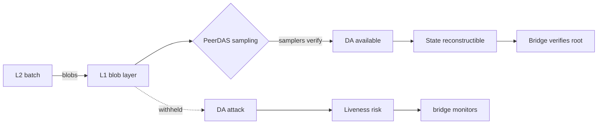

# 30. Post-Fusaka Data Availability

## Learning Objectives

By the end of this chapter you will be able to:

1. Explain the data-availability (DA) problem — *can a new node reconstruct the chain state?* — and why it is the liveness/safety boundary for rollups.
2. Describe **PeerDAS (EIP-7594)** — peer data availability sampling over the post-Fusaka blob layer — and the **blob-parameter-only (BPO)** scaling model, with Glamsterdam as roadmap only.
3. Compute the post-Fusaka L2 cost structure: blob fees (target/elasticity-based), the blob-count ceiling, and the resulting per-transaction economics vs calldata.
4. Position Meridian's L2 deployment (Ch 31) inside the new cost regime: what gets cheaper, what does not, and what the DA layer's trust model implies for the bridge (Ch 27).
5. Distinguish the DA layers that exist (L1 blobs, PeerDAS-sampled) from the roadmap (Glamsterdam's data-availability committee/whitepaper ideas) — the TOC lock, stated precisely.

## Prerequisites

- **Chapter 29** (Rollups) — the cost model this chapter's DA economics complete.
- **Chapter 27** (Bridges) — the DA layer's role in the bridge's trust model.

Supporting: **Ch 5** (blob opcodes), **Ch 7** (gas mechanics — blob base fee), **Ch 31** (L2 deployment). Locked conventions in force.

## Theory

### The DA problem, precisely

A rollup's state is valid only if a new node can *reconstruct* it from posted data. DA is the property: **the data needed to reconstruct the state is available to anyone who wants it.** If a sequencer withholds data (the classic DA attack), the chain's liveness breaks — funds are stuck, and a malicious sequencer could later equivocate. DA is not "storage" (keeping data forever) — it is *availability at the moment it is needed to verify*.

### Blobs (EIP-4844) → PeerDAS (EIP-7594)

EIP-4844 (Cancun) introduced **blobs**: large, cheap, *temporary* (≈18-day) data blobs attached to blocks, priced by a target-based blob fee. Post-Fusaka, **PeerDAS (EIP-7594)** upgrades the DA sampling: nodes verify blob availability by **sampling** a few random chunks rather than downloading everything — the "data availability sampling" (DAS) property that lets the blob layer scale without every node downloading all blobs.

The TOC lock: **post-Fusaka = PeerDAS/EIP-7594 live, blob-parameter-only (BPO) scaling.** The *parameters* of the blob layer scale (more blobs, cheaper per blob via sampling); the *architecture* does not change — that is Glamsterdam (roadmap only).

## Mathematical Foundations

### The blob fee model

The blob base fee follows the EIP-1559 mechanism on a separate axis: `excess_blobs` drives the fee up when the target (`TARGET_BLOB_COUNT` per block) is exceeded:

```
blob_fee = MIN_BASE_FEE × e^(excess_blobs / BLOB_BASE_FEE_UPDATE_FRACTION)
```

For a batch posting `B` blobs of `D` bytes each: `C_blob = B × blob_fee × D`. Under BPO, the *ceiling* on `B` per block scales (the "parameters"), so a data-heavy batch can post more blobs — the per-byte cost drops as the layer scales. The DALab contract below implements a *linearized fixed-point approximation* of the exponential (`MIN_BASE_FEE + excess/UPDATE_FRACTION`); the live fee uses the exact EIP-4844 curve — deltas-not-absolutes, Ch 8.

### DAS security: the sampling bound

With DAS, an adversarial sequencer that withholds `f` fraction of a blob's chunks is caught by a sampler with probability:

```
P(catch) = 1 − (1 − f)^k
```

for `k` samples. At `k = 20` samples and `f = 0.5`: `P ≈ 0.999999`. The security argument is *probabilistic* — the blob is "available" if enough independent samplers saw enough chunks. This is why the honest-node assumption in the DA layer is a *threshold* argument, not an absolute one.

## Engineering Perspective

### What gets cheaper for Meridian on L2

- **Data-heavy operations** (batch settlements, cross-L2 message proofs, event-heavy integrations): blob pricing replaces calldata's 16 gas/byte — order-of-magnitude drop.
- **Per-transaction L2 fees**: dominated by execution (cheap) + a *share* of blob cost — amortized across the batch, tiny per tx.
- **What does NOT get cheaper**: the L1 verification (the rollup's fixed arbiter cost), the bridge's message overhead, and any path that still uses calldata.

### The DA trust model for the bridge

The bridge (Ch 27) verifies the rollup's *state root* — which is valid only if the DA layer actually made the data available. Post-Fusaka, the bridge inherits the DAS threshold argument: the security rests on *enough independent samplers*, not on a single honest node. The Meridian posture: the L2 bridge contract trusts the rollup's DA layer as configured by the rollup's security council — documented, monitored, and covered by the Ch 25 trust-chain audit.

## Mermaid Diagram



## Code Walkthrough

`meridian/src/IDALab.sol`:

```solidity
// SPDX-License-Identifier: MIT
pragma solidity ^0.8.24;

/// @title IDALab
/// @notice I-prefix interface — the blob-fee and sampling model.
interface IDALab {
    function blobFee(uint256 excessBlobs) external pure returns (uint256);
    function batchBlobCost(uint256 blobs, uint256 bytesPerBlob, uint256 fee) external pure returns (uint256);
    function samplingCatchProbability(uint256 samples, uint256 withheldFractionBps) external pure returns (uint256);
}
```

`meridian/src/DALab.sol`:

```solidity
// SPDX-License-Identifier: MIT
pragma solidity ^0.8.24;

import {IDALab} from "./IDALab.sol";

/// @title DALab
/// @notice Pedagogical post-Fusaka DA model: blob fee, batch cost, DAS bound.
/// @dev NOT part of the protocol — an economics lab.
contract DALab is IDALab {
    uint256 public constant MIN_BASE_FEE = 1;          // wei
    uint256 public constant UPDATE_FRACTION = 3338477; // ~2^21.67, EIP-4844
    uint256 public constant TARGET_BLOBS = 14;         // per-block target post-BPO2 (EIP-7892); BPO1 (Dec 9, 2025): 10; pre-BPO Fusaka: 6

    /// @dev EIP-1559-style blob base fee from excess blobs.
    function blobFee(uint256 excessBlobs) public pure returns (uint256) {
        // MIN_BASE_FEE * (1 + excess/UPDATE_FRACTION) — linearized fixed-point
        // approximation of the exponential for the lab (the live fee uses the
        // exact EIP-4844 exponential; deltas-not-absolutes, Ch 8).
        return MIN_BASE_FEE + excessBlobs / UPDATE_FRACTION;
    }

    /// @dev Total blob cost for a batch.
    function batchBlobCost(uint256 blobs, uint256 bytesPerBlob, uint256 fee) public pure returns (uint256) {
        return blobs * bytesPerBlob * fee;
    }

    /// @dev DAS catch probability: 1 − (1 − f)^k, f in basis points (bps), result in 1e18 fixed-point.
    function samplingCatchProbability(uint256 samples, uint256 withheldFractionBps) public pure returns (uint256) {
        // 1e18 scale keeps 20 sequential halvings (k = 20, f = 50%) well above
        // the integer floor — (1/2)^20 × 1e18 ≈ 9.5e14 — so the lab returns a
        // strict probability (≈ 0.9999990), never a rounded 100%.
        uint256 p = 1e18 - withheldFractionBps * 1e14; // (1 - f) in 1e18 scale
        uint256 acc = 1e18;
        for (uint256 i; i < samples; ++i) {
            acc = acc * p / 1e18;
        }
        return 1e18 - acc;                              // catch prob, 1e18 scale
    }
}
```

Three details. **First**, the lab's blob fee is a *linearized fixed-point approximation* of the EIP-1559 exponential — the live fee uses the exact EIP-4844 curve on the same excess-blobs axis as L1's base fee (deltas-not-absolutes, Ch 8). **Second**, the batch cost is linear in blobs × bytes × fee; the BPO parameter is `TARGET_BLOBS`, raised from 6 (pre-BPO Fusaka) to 10 (BPO1, Dec 9, 2025) and 14 (BPO2, Jan 7, 2026) — more blob space per block, cheaper per byte. **Third**, the sampling bound is the DAS security argument in 1e18-scaled fixed-point — fine enough that 20 sequential halvings never underflow — and the lab pins `k = 20, f = 50% → ≈ 0.9999990 (99.99990%)`, strictly below 100%: probabilistic, never absolute.

## Production Example

**A Meridian L2 batch, post-Fusaka.** A settlement batch (Ch 31) posting 100 KB of state data: as calldata at 16 gas/byte ≈ 1.6M gas; as blobs under BPO at a representative blob fee ≈ a few hundred thousand gas — with the exact number pinned by the live blob fee at deployment time (Ch 8 methodology: deltas-not-absolutes; re-pin per chain). The DA trust model: the rollup's blobs are PeerDAS-sampled; the bridge inherits the threshold argument; Glamsterdam's committee ideas are NOT part of the deployed model.

## Foundry Lab

`meridian/test/DALabTest.t.sol`:

```solidity
// SPDX-License-Identifier: MIT
pragma solidity ^0.8.24;

import {Test} from "forge-std/Test.sol";
import {DALab} from "../src/DALab.sol";

contract DALabTest is Test {
    DALab internal lab;

    function setUp() public { lab = new DALab(); }

    /// @dev Zero excess blobs → minimum blob fee.
    function testMinFee() public {
        assertEq(lab.blobFee(0), 1);
    }

    /// @dev More excess blobs → higher fee (monotonic).
    function testFeeMonotonic(uint256 a, uint256 b) public {
        a = bound(a, 0, 1e7); b = bound(b, 0, 1e7);
        if (a > b) (a, b) = (b, a);
        assertLe(lab.blobFee(a), lab.blobFee(b));
    }

    /// @dev DAS: 20 samples, 50% withheld → catch prob ≈ 99.9999% (1e18 scale, strictly < 100%).
    function testSamplingBound() public {
        uint256 p = lab.samplingCatchProbability(20, 5000); // f = 50%
        assertGt(p, 999_999e12); // > 99.9999% in 1e18 scale (0.999999 × 1e18)
        assertLt(p, 1e18);       // probabilistic — strictly below 100%
    }

    /// @dev More samples always improve the catch probability.
    function testMoreSamplesBetter(uint256 k1, uint256 k2) public {
        k1 = bound(k1, 1, 100); k2 = bound(k2, 1, 100);
        if (k1 > k2) (k1, k2) = (k2, k1);
        assertGe(lab.samplingCatchProbability(k2, 5000), lab.samplingCatchProbability(k1, 5000));
    }
}
```

Green on forge 1.7.1.

## Security Analysis

### The DA attack and its post-Fusaka shape

The classic DA attack: a sequencer posts a state root but withholds the batch data — the state is unverifiable, and the sequencer could later equivocate. Post-Fusaka, PeerDAS's sampling makes *full* withholding detectable with near-certainty (the threshold argument), but the residual risk is *partial* withholding tuned below the sampling sensitivity, and *liveness* pressure during high blob-fee periods (a sequencer may delay batches to wait out fees — an availability, not correctness, risk).

### The security council remains

The DA layer's probabilistic guarantees are complemented by the rollup's security council (veto power over upgrades, emergency finality). This is the Ch 25 trust-surface framing: the DA layer is a *threshold* trust anchor, the council is the *override* — both documented in the bridge's trust model (Ch 27).

## Common Mistakes

1. **"DA = storage"** — DA is availability at verification time; blobs are explicitly temporary.
2. **Glamsterdam as live** — roadmap only (TOC lock); PeerDAS/BPO is the deployed model.
3. **Calldata economics post-Fusaka** — data-heavy batches use blobs; calldata is legacy for bulk data.
4. **Absolute DA security** — the DAS argument is probabilistic (threshold), not absolute.
5. **Ignoring liveness** — a sequencer can delay batches during fee spikes; that is an availability risk.
6. **Bridge without DA awareness** — the bridge verifies roots; it must also monitor the DA layer's health.

## Gas Optimization

| Pattern | Before | After | Delta |
|---|---|---|---|
| Batch data on L1 | 16 gas/byte calldata | blob fee (BPO) | order-of-magnitude |
| Blob fee model | — | EIP-1559 exponential | market-priced |
| DAS verification | full download | k samples | sampling bound |

## Reading Production Source Code

1. **EIP-4844 / EIP-7594 (PeerDAS)** — the blob layer and the sampling upgrade.
2. **Rollup DA docs** (Arbitrum/OP) — how each family uses blobs, the DA committee fallback (where applicable).
3. **The Fusaka upgrade notes** — what shipped (PeerDAS, BPO) vs what is roadmap (Glamsterdam).

## Exercises

1. Derive the blob fee at `excessBlobs = 0` and at `excessBlobs = UPDATE_FRACTION` — in the lab (`blobFee(0) = 1`, `blobFee(UPDATE_FRACTION) = 2` wei) and in the exact exponential the lab approximates (`e^0 = 1`, `e^1 ≈ 2.718`).
2. Compute the batch cost for 100 KB at the minimum fee vs a representative elevated fee.
3. Verify the DAS bound in the lab: `samplingCatchProbability(20, 5000)` returns `≈ 0.9999990` on the 1e18 scale — strictly below 100%, the probabilistic point from the theory section; what about `k=5` (`0.96875`)?
4. Why is the DA attack a liveness risk and not a correctness risk?
5. Map the post-Fusaka trust model onto Meridian's L2 bridge (Ch 27/31).

## Weekly Project

**Ship `DALab.sol` + `DALabTest.t.sol`**, write `docs/da-notes.md` (the DA problem, PeerDAS/BPO, the cost model, the bridge trust model), and extend `docs/rollup-notes.md` (Ch 29) with the post-Fusaka cost structure.

## Deliverables

1. `meridian/src/DALab.sol` + `IDALab.sol` — blob-fee, batch-cost, DAS-bound model.
2. `meridian/test/DALabTest.t.sol` — fee monotonicity, sampling bound, sample scaling; green.
3. `docs/da-notes.md` — DA problem, PeerDAS/BPO, cost model, trust model.
4. Locked conventions extended: post-Fusaka = PeerDAS/EIP-7594 + BPO (never Glamsterdam-as-live); DA is availability-not-storage; blob economics ground all L2 cost claims; the bridge monitors the DA layer.

## Quiz

1. What is the DA problem, and why is it a liveness boundary?
2. What does PeerDAS (EIP-7594) change, and what does BPO mean?
3. Derive the DAS catch probability at `k=20, f=50%`.
4. What gets cheaper for Meridian on L2 post-Fusaka — and what does not?
5. Why is Glamsterdam roadmap-only, and how does the TOC lock enforce the claim?

**Answers:** (1) New nodes must be able to reconstruct state from posted data; withheld data breaks liveness and enables equivocation. (2) PeerDAS adds sampling-based DA verification (EIP-7594); BPO means the blob layer's *parameters* scale (more blobs, cheaper per blob) without an architectural change. (3) `1 − (1−0.5)^20 ≈ 0.999999`. (4) Data-heavy batch costs (blob vs calldata 16 gas/byte) and per-tx amortized DA; not cheaper: L1 verification, bridge overhead, calldata-only paths. (5) It is a roadmap proposal for the DA layer's next architectural step; the TOC lock grounds every claim in PeerDAS/BPO and never cites Glamsterdam as deployed.

## Further Reading

- EIP-4844, EIP-7594 (PeerDAS); the Fusaka upgrade notes; the Glamsterdam proposal (roadmap).
- Ch 29 (rollups), Ch 27 (bridges), Ch 31 (L2 deployment), Ch 7 (blob base fee).
- 2026 grounding: DA-layer liveness debates as trust-surface material (Ch 25 framing).
