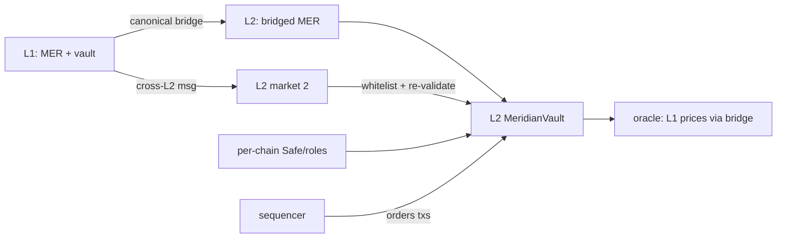

# 31. Deploying on L2

## Learning Objectives

By the end of this chapter you will be able to:

1. Plan a Meridian L2 deployment end-to-end: token bridge, vault deployment, oracle wiring, cross-L2 messaging, and the admin/trust-chain layout (Ch 25) per chain.
2. Compute the L2 cost structure from the Ch 29/30 model: what the deployment pays (execution, blob share, bridge) and where the savings land.
3. Design the L1↔L2 asset flow with canonical-bridge-first (Ch 27), including the withdrawal-latency handling (optimistic window or fast-bridge trade-offs).
4. Handle **sequencer concerns**: ordering, censorship, and the MEV surface (Ch 34 preview) — what Meridian accepts, what it mitigates.
5. Write the deployment checklist: verified source, per-chain roles, cross-L2 message whitelists, oracle freshness, and the Ch 28 audit pass on the L2 diff.

## Prerequisites

- **Chapter 29** (Rollups) — the architecture family and trust model.
- **Chapter 30** (Post-Fusaka DA) — the cost structure.
- **Chapter 27** (Bridges) — the canonical-bridge discipline.

Supporting: **Ch 20** (the vault), **Ch 22** (oracles), **Ch 25** (trust chains), **Ch 5** (deployment). Locked conventions in force.

## Theory

### L2 deployment is a fork with a bridge

Deploying Meridian on an L2 is not "the same contracts on a cheaper chain". The deployment *inherits* three new things: (1) the bridge's trust model (Ch 27), (2) the sequencer's ordering/censorship properties, (3) the DA layer's availability profile (Ch 30). The contracts are mostly unchanged — the *operating context* is new.

### The canonical-bridge-first rule, applied

MER moves L1 → L2 via the rollup's native bridge: L1 deposits are fast (included in a batch), L2 → L1 withdrawals wait the challenge window (optimistic) or the proof (validity). Meridian's L2 market accepts **canonically bridged MER only** — a third-party bridge (opt-in per market, Ch 27) is vetted with the bridge-security checklist before any collateral is accepted.

### Sequencer concerns

The L2 sequencer orders transactions and produces batches. The concerns, in severity order:

1. **Censorship** — a sequencer can exclude a transaction (e.g., a liquidation) for a period. Mitigation: force-inclusion (L1 inbox), monitoring, and the emergency path (Ch 25) on the L2 side.
2. **MEV extraction** — the sequencer sees the order flow (Ch 34); liquidations and oracle updates are the extractable surface. Mitigation: MEV-aware liquidation design (Ch 35), OEV capture.
3. **Batch withholding** — a liveness risk (Ch 30). Mitigation: DA monitoring, the bridge's state-root verification.

None of these break *correctness* — they are availability/value-extraction risks that the deployment must document and monitor.

## Mathematical Foundations

### The deployment cost model

```
C_deploy_L2 = C_exec + C_blob_share + C_bridge_setup + C_verified_source
```

- `C_exec`: L2 execution gas (cheap — the L2's own fee market).
- `C_blob_share`: the batch's share of blob fees (Ch 30) — amortized, tiny per tx.
- `C_bridge_setup`: the canonical bridge's deposit/withdraw setup (one-time).
- `C_verified_source`: source verification on the L2 explorer (one-time, small).

The per-user cost (a borrow): `C_tx_L2 ≈ C_exec_tx + C_blob_share_tx` — vs L1's `21,000 + cold touches + calldata`. The order-of-magnitude claim is *data* savings (Ch 30), not execution savings.

### The withdrawal-latency trade-off

Optimistic L2: `t_withdraw = window (7d)`. Meridian's options:

1. **Wait the window** — trustless, slow; capital inefficient for users.
2. **Fast-bridge service** — a third party fronts the withdrawal for a fee; the user gets L1 assets instantly, the service assumes the window risk (Ch 27 vetted).
3. **Hybrid** — small withdrawals fast via service, large withdrawals wait the window.

The choice is documented per market (Ch 25 risk review).

## Engineering Perspective

### The L2 role layout (Ch 25, per chain)

Every chain gets its own role set: `PAUSER_ROLE`, `OPERATOR_ROLE`, `RISK_ROLE` per L2, each held by the *per-chain* Safe/execution keys — never shared with L1 (the Ch 27 per-chain custody rule). The L2 deployment's `DEFAULT_ADMIN_ROLE` is the L2 Safe multisig; the cross-L2 message senders are whitelisted per destination.

### The cross-L2 messaging design

Meridian L2 markets (multiple L2s) communicate via the canonical bridges: each chain's vault accepts only whitelisted cross-chain messages (Ch 27 `BridgeLab` shape), with destination-side re-validation of sender, payload selector, and amount bounds.

## Mermaid Diagram



## Code Walkthrough

```solidity
// SPDX-License-Identifier: MIT
pragma solidity ^0.8.24;

/// @title IL2DeployLab
/// @notice I-prefix interface — the L2 deployment's cross-chain market.
interface IL2DeployLab {
    error UnauthorizedSender(address sender);
    error UnauthorizedPayload(bytes4 selector);
    error OracleStale(uint256 timestamp, uint256 maxAge);

    function executeCrossMessage(address sourceSender, bytes calldata payload) external;
    function setOraclePrice(uint256 price, uint256 timestamp) external;
    function healthOf(address user) external view returns (uint256);
}

/// @title L2DeployLab
/// @notice Pedagogical L2 market: whitelisted cross-chain messages, stale
///         oracle guard, per-chain admin. NOT part of the protocol.
contract L2DeployLab is IL2DeployLab {
    /// @dev Arbitrum's L1→L2 alias offset (AddressAliasHelper): canonical
    ///      delivery presents the aliased address, never the raw L1 one.
    uint160 internal constant L1_TO_L2_ALIAS_OFFSET =
        uint160(0x1111000000000000000000000000000000001111);

    address public immutable l1Vault; // the canonical source on L1
    address public admin; // per-chain Safe (Ch 25)
    uint256 public oraclePrice;
    uint256 public oracleTimestamp;
    uint256 public constant MAX_ORACLE_AGE = 1 hours;

    constructor(address l1Vault_, address admin_) {
        l1Vault = l1Vault_;
        admin = admin_;
    }

    /// @dev Cross-L2 message: only the L1 vault, whitelisted payloads.
    ///      Canonical L1→L2 delivery never presents the raw L1 address as
    ///      msg.sender — Arbitrum aliases it (checked below, AddressAliasHelper
    ///      style) and OP Stack routes via the L2CrossDomainMessenger, where
    ///      sourceSender is the recovered xDomainMessageSender. Verify both the
    ///      delivery path and the declared L1 source.
    function executeCrossMessage(address sourceSender, bytes calldata payload) external {
        if (msg.sender != _applyL1ToL2Alias(l1Vault)) revert UnauthorizedSender(msg.sender);
        if (sourceSender != l1Vault) revert UnauthorizedSender(sourceSender);
        bytes4 sel = bytes4(payload[:4]);
        if (sel != this.applyMarketState.selector) revert UnauthorizedPayload(sel);
        (bool ok, bytes memory ret) = address(this).call(payload);
        if (!ok) {
            // Bubble the inner revert reason instead of flattening it.
            assembly { revert(add(ret, 0x20), mload(ret)) }
        }
    }

    /// @dev Arbitrum-style L1→L2 aliasing (AddressAliasHelper.applyL1ToL2Alias),
    ///      inlined so the lab needs no extra dependency.
    function _applyL1ToL2Alias(address l1Address) internal pure returns (address l2Address) {
        unchecked {
            l2Address = address(uint160(l1Address) + L1_TO_L2_ALIAS_OFFSET);
        }
    }

    /// @dev Pedagogical stub: a real market re-validates sender, payload
    ///      selector, AND amount bounds here. The whitelist gate above is only
    ///      the entry check — amount bounds are deliberately NOT enforced, so
    ///      do not copy this stub as a complete destination-side validation.
    function applyMarketState(uint256 newCollateralFactor) external {}

    /// @dev Oracle update with a staleness guard (Ch 22).
    function setOraclePrice(uint256 price, uint256 timestamp) external {
        if (msg.sender != admin) revert UnauthorizedSender(msg.sender);
        if (block.timestamp > timestamp + MAX_ORACLE_AGE) {
            revert OracleStale(timestamp, MAX_ORACLE_AGE);
        }
        oraclePrice = price;
        oracleTimestamp = timestamp;
    }

    function healthOf(address) external pure returns (uint256) {
        return 1e18;
    }
}
```

Four details. **First**, the cross-chain message is whitelisted by selector and source — the Ch 27 `BridgeLab` shape on L2. **Second**, the sender check is aliasing-aware: canonical L1→L2 delivery never presents the raw L1 address as `msg.sender` — Arbitrum aliases it (`AddressAliasHelper`, `L2Alias = L1Address + 0x1111…1111`), OP Stack routes via the `L2CrossDomainMessenger` — so the lab checks the aliased form and validates the declared `sourceSender`. Checking `msg.sender == l1Vault` directly — the natural first attempt — fails closed on every legitimate message; it is the first bug students hit moving this lab to a real L2 fork. **Third**, the oracle update carries a staleness guard — the L2 oracle inherits L1 prices *via the bridge*, so freshness is the manipulation surface (Ch 22/35). **Fourth**, the admin is the per-chain Safe — never shared with L1.

## Production Example

**Meridian on an optimistic L2** (the Ch 29 default): canonical bridge for MER, the L2 vault deployed with verified source, per-chain Safe roles, oracle wired to the L1-price feed via the bridge with the staleness guard, cross-L2 messaging whitelisted. Withdrawals: hybrid (small fast-bridged, large window-waiting). The deployment checklist (Weekly Project) is the Ch 28 audit pass applied to the L2 diff.

## Foundry Lab

`meridian/test/L2DeployLabTest.t.sol`:

```solidity
// SPDX-License-Identifier: MIT
pragma solidity ^0.8.24;

import {Test} from "forge-std/Test.sol";
import {L2DeployLab} from "../src/L2DeployLab.sol";
import {IL2DeployLab} from "../src/IL2DeployLab.sol";

contract L2DeployLabTest is Test {
    /// @dev Arbitrum L1→L2 alias offset (AddressAliasHelper): canonical
    ///      delivery presents l1Vault's aliased form, not the raw address.
    uint160 internal constant L1_TO_L2_ALIAS_OFFSET =
        uint160(0x1111000000000000000000000000000000001111);

    L2DeployLab internal lab;
    address internal l1Vault = address(0x11);
    address internal aliasedL1Vault = address(uint160(l1Vault) + L1_TO_L2_ALIAS_OFFSET);
    address internal admin = address(0xA11);

    function setUp() public {
        lab = new L2DeployLab(l1Vault, admin);
        vm.warp(30 days); // realistic clock — staleness math must not underflow
    }

    /// @dev Only the L1 vault may submit cross-chain messages: canonical
    ///      delivery is aliased/messenger-routed, so the raw L1 address is
    ///      rejected as msg.sender.
    function testUnauthorizedCrossMessage() public {
        vm.expectRevert(
            abi.encodeWithSelector(IL2DeployLab.UnauthorizedSender.selector, address(0xBAD))
        );
        vm.prank(address(0xBAD));
        lab.executeCrossMessage(l1Vault, abi.encodeCall(lab.applyMarketState, (0.8e18)));
    }

    /// @dev A canonical (aliased) delivery declaring the wrong L1 source is rejected.
    function testCrossMessageWrongSource() public {
        vm.expectRevert(
            abi.encodeWithSelector(IL2DeployLab.UnauthorizedSender.selector, address(0xBAD))
        );
        vm.prank(aliasedL1Vault);
        lab.executeCrossMessage(address(0xBAD), abi.encodeCall(lab.applyMarketState, (0.8e18)));
    }

    /// @dev Canonical L1→L2 delivery (aliased sender + correct source) lands.
    function testAuthorizedCrossMessage() public {
        vm.prank(aliasedL1Vault);
        lab.executeCrossMessage(l1Vault, abi.encodeCall(lab.applyMarketState, (0.8e18)));
    }

    /// @dev Stale oracle updates are rejected.
    function testStaleOracleRejected() public {
        vm.expectRevert(
            abi.encodeWithSelector(
                IL2DeployLab.OracleStale.selector, block.timestamp - 2 hours, lab.MAX_ORACLE_AGE()
            )
        );
        vm.prank(admin);
        lab.setOraclePrice(1000e8, block.timestamp - 2 hours);
    }

    /// @dev Fresh oracle updates land.
    function testFreshOracleAccepted() public {
        vm.prank(admin);
        lab.setOraclePrice(1000e8, block.timestamp);
        assertEq(lab.oraclePrice(), 1000e8);
    }

    /// @dev Non-whitelisted payload rejected.
    function testNonWhitelistedPayload() public {
        bytes memory bad = abi.encodeWithSignature("setAdmin(address)", address(1));
        vm.expectRevert(
            abi.encodeWithSelector(IL2DeployLab.UnauthorizedPayload.selector, bytes4(bad))
        );
        vm.prank(aliasedL1Vault);
        lab.executeCrossMessage(l1Vault, bad);
    }
}
```

Green on forge 1.7.1.

## Security Analysis

### The L2-specific surface

The L2 deployment's incremental attack surface, in the Ch 28 severity frame:

1. **Bridge trust** (Ch 27) — the canonical bridge is the asset's custody path; its security model *is* the rollup's (watcher/prover).
2. **Sequencer** — censorship (liquidation exclusion) and MEV (Ch 34). Mitigations: force-inclusion, MEV-aware design (Ch 35).
3. **Oracle freshness** — L2 prices via bridge can lag; the staleness guard (Ch 22) is the manipulation defense.
4. **Per-chain admin** — a shared L1/L2 key set would be the 2026 shape (Ch 25/27); per-chain custody is mandatory.

## Common Mistakes

1. **"Same contracts, cheaper chain"** — the bridge, sequencer, and DA are new trust anchors.
2. **Shared admin keys across chains** — the 2026 cross-chain compromise shape.
3. **Oracle without staleness guard** — L2 price lag is the manipulation surface.
4. **Third-party bridge accepted by default** — canonical-first (Ch 27) or vetted opt-in.
5. **Withdrawal latency ignored** — a UX path that assumes instant L1 settlement.
6. **No per-chain audit pass** — the L2 diff needs its own Ch 28 review.

## Gas Optimization

| Pattern | Before | After | Delta |
|---|---|---|---|
| Data on L2 | L1 calldata pricing | blob-share (Ch 30) | order-of-magnitude |
| Cross-chain message | unbounded payload | whitelisted selector | security, not gas |
| Oracle update | no guard | staleness check | ~100 gas, security |

## Reading Production Source Code

1. **The canonical bridge contracts** (Arbitrum/OP) — deposit/withdraw, message passing.
2. **A deployed lending protocol on L2** (Aave v3's L2 deployments) — the per-chain role layout and oracle wiring.
3. **Ch 29/30** — the trust and cost model this deployment inherits.

## Exercises

1. Plan the Meridian L2 deployment: token path, vault, oracle, admin — per chain.
2. Compute a borrow's L2 cost from the Ch 30 model and compare to L1.
3. Design the withdrawal UX with the hybrid fast-bridge option.
4. Map the sequencer risks onto the Ch 25 trust-chain audit.
5. Write the L2 diff checklist for the Ch 28 audit pass.

## Weekly Project

**Ship `L2DeployLab.sol` + `L2DeployLabTest.t.sol`**, write `docs/l2-deployment.md` (the deployment plan, cost model, withdrawal UX, per-chain roles, checklist), and extend `docs/trust-chain.md` (Ch 25) with the per-chain role matrix.

## Deliverables

1. `meridian/src/L2DeployLab.sol` + `IL2DeployLab.sol` — cross-chain market with whitelist + staleness guard.
2. `meridian/test/L2DeployLabTest.t.sol` — unauthorized sender, stale oracle, fresh oracle; green.
3. `docs/l2-deployment.md` — the plan, cost, withdrawal UX, roles, checklist.
4. Locked conventions extended: canonical-bridge-first per market; per-chain admin keys; oracle staleness guard on L2; withdrawal latency handled (hybrid fast-bridge or documented window); per-chain audit pass.

## Quiz

1. What three things does an L2 deployment inherit?
2. Why per-chain admin keys? Give the incident shape.
3. What does the staleness guard protect, and where does L2 price lag come from?
4. Name the three sequencer concerns in severity order.
5. How does the withdrawal-latency hybrid work?

**Answers:** (1) The bridge's trust model, the sequencer's ordering/censorship properties, the DA layer's availability profile. (2) A shared key set across chains is the Kelp/LayerZero/Drift shape (Ch 27) — one compromise spans chains; per-chain custody limits blast radius. (3) The manipulation surface when L2 prices (via bridge) lag L1; the guard rejects updates older than MAX_ORACLE_AGE. (4) Censorship, MEV extraction, batch withholding. (5) Small withdrawals use a vetted fast-bridge service (instant L1 assets, service takes window risk); large withdrawals wait the challenge window — trustless for the big money.

## Further Reading

- Canonical bridge docs (Arbitrum/OP); Aave v3 L2 deployments.
- Ch 29 (rollups), Ch 30 (DA), Ch 27 (bridges), Ch 22 (oracles), Ch 25 (trust chains), Ch 35 (MEV-aware design), Ch 34 (MEV fundamentals).
