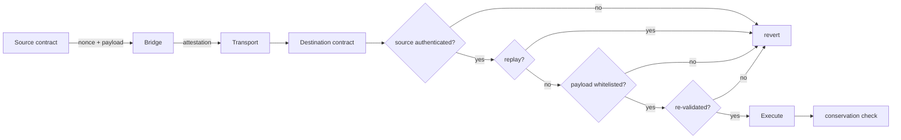

# 32. Bridges & Messaging Protocols

## Learning Objectives

By the end of this chapter you will be able to:

1. Build the bridge-failure taxonomy in full: validator compromise, empty-root spoofing, key-share theft, admin-key cross-chain, relayer griefing, and message-replay — with a named incident and defense per class.
2. Compare canonical vs third-party bridges on the axes Meridian prices: custody, liveness, latency, and trust surface (Ch 25/27 extension).
3. Design a message-passing protocol: source-side nonce + destination-side replay guard + payload whitelist + destination re-validation (the Ch 27 `BridgeLab` shape, generalized).
4. Evaluate the 2026 cross-chain landscape (Kelp DAO/LayerZero, Drift, and the bridge-incident set) and derive the *audit checklist* for any bridge Meridian integrates.
5. Decide per-asset bridge policy: canonical-first, opt-in third-party with the full checklist, or no-bridge (isolated L1-only markets).

## Prerequisites

- **Chapter 27** (Cross-Chain & Bridge Security) — the trust models and incident set.
- **Chapter 29–31** (M7) — the rollup context the bridges serve.
- **Chapter 25** (Trust Chains) — the per-chain custody rule.

Supporting: **Ch 26** (conservation invariants across chains), **Ch 24** (destination execution discipline). Locked conventions in force.

## Theory

### The message lifecycle, end to end

Every bridge message passes through six stages, and every known failure inserted itself at one of them:

```
source state → attestation → transport → destination check → authorization → execution
```

| Stage | Failure class | Incident |
|---|---|---|
| Attestation | validator/key-share compromise | Ronin, Wormhole, Kelp/LayerZero |
| Attestation | empty-root spoof | Nomad |
| Transport | relayer griefing (drop/delay) | liveness failures |
| Destination check | replay | — (defended) |
| Authorization | any-payload execution | Nomad (same root) |
| Authorization | admin-key cross-chain | Drift |

### Canonical vs third-party

| Axis | Canonical (native) | Third-party (validator/MPC) |
|---|---|---|
| Custody | rollup's own bridge contract | bridge's contracts/validators |
| Trust surface | the rollup's security model | the bridge's validator/key set |
| Latency | window-bound (optimistic) | often faster |
| Liveness | tied to the rollup | operator-dependent |
| Meridian policy | default | opt-in, full checklist |

## Mathematical Foundations

### The bridge invariant set

For a message `m` from source to destination:

```
1. source_authenticated(m)        — attestation valid
2. executed[hash(m)] == false      — no replay (Ch 27)
3. payload ∈ whitelist            — authorized shape
4. destination_revalidates(m)      — bounds, sender, market exist
5. Σ value_in == Σ value_out ± fees — conservation (Ch 26)
```

The audit checklist (this chapter's deliverable) is the operational transcription of these five invariants: for each bridge, verify each invariant holds *on the destination contract*, not in the bridge's documentation.

### The compromise probability, per class

For a validator bridge with `n` validators and threshold `t`: `P(compromise) = Σ_{i=t}^{n} C(n,i) p^i (1−p)^{n−i}` (Ch 25 model). For an MPC bridge with `m` key shares, `t`-of-`m` signing: the same form. The *difference* between classes is not the formula — it is the custody and monitoring of the key material (hardware, geographic spread, rotation).

## Engineering Perspective

### Meridian's bridge policy matrix

| Asset | Policy | Rationale |
|---|---|---|
| MER (L1 → L2) | canonical bridge only | the protocol's own asset; custody matters most |
| Collateral (WBTC, USDC…) | canonical-first; third-party opt-in per market | market risk review (Ch 25) per listing |
| L2 → L2 | canonical messaging only | Ch 31 cross-L2 whitelist |
| Experimental assets | no bridge | isolated L1-only market |

The policy is a *per-asset* decision, reviewed by the risk role (Ch 25), documented in the market's listing record.

## Mermaid Diagram



## Code Walkthrough

```solidity
// SPDX-License-Identifier: MIT
pragma solidity ^0.8.24;

/// @title IMessagingLab
/// @notice I-prefix interface — a generalized message-passing receiver.
interface IMessagingLab {
    error UnauthorizedSource(address sender);
    error Replay(bytes32 hash);
    error UnauthorizedPayload(bytes4 selector);
    error InvalidAmount(uint256 amount, uint256 max);

    function receiveMessage(address sourceSender, bytes calldata payload) external;
}

/// @title MessagingLab
/// @notice Pedagogical generalized bridge receiver: the five invariants as
///         code. NOT part of the protocol.
contract MessagingLab is IMessagingLab {
    /// @dev Arbitrum aliases L1 senders on L2: L2Alias = L1 + 0x1111...1111
    ///      (AddressAliasHelper). OP Stack instead delivers from its
    ///      L2CrossDomainMessenger, exposing the true sender via
    ///      xDomainMessageSender(). Same L1→L2 aliasing trap as Ch 31's
    ///      L2DeployLab: a raw msg.sender == canonicalSource check never
    ///      matches a genuine cross-chain call.
    uint160 internal constant L1_TO_L2_ALIAS_OFFSET =
        uint160(0x1111000000000000000000000000000000001111);

    address public immutable canonicalSource;
    uint256 public immutable maxMessageAmount;
    mapping(bytes32 => bool) public executed;

    constructor(address canonicalSource_, uint256 maxMessageAmount_) {
        canonicalSource = canonicalSource_;
        maxMessageAmount = maxMessageAmount_;
    }

    /// @dev The five invariants, in order (Ch 32 theory).
    function receiveMessage(address sourceSender, bytes calldata payload) external {
        // 1. source authenticated — canonical L1→L2 delivery never hands this
        //    contract the raw L1 address as msg.sender; compare against the
        //    aliased address (Arbitrum) / messenger-recovered sender (OP).
        address aliasedSource;
        unchecked {
            aliasedSource = address(uint160(canonicalSource) + L1_TO_L2_ALIAS_OFFSET);
        }
        if (msg.sender != aliasedSource) revert UnauthorizedSource(msg.sender);

        // 2. no replay
        bytes32 h = keccak256(abi.encode(sourceSender, payload));
        if (executed[h]) revert Replay(h);

        // 3. payload whitelisted
        bytes4 sel = bytes4(payload[:4]);
        if (sel != this.applyTransfer.selector) revert UnauthorizedPayload(sel);

        // 4. destination re-validation (amount bounds)
        (address to, uint256 amount) = abi.decode(payload[4:], (address, uint256));
        if (amount > maxMessageAmount) revert InvalidAmount(amount, maxMessageAmount);

        // 5. conservation enforced by the accounting (invariant 5)
        executed[h] = true;
        _applyTransfer(to, amount);
    }

    function applyTransfer(address to, uint256 amount) external {}
    function _applyTransfer(address to, uint256 amount) internal {}
}
```

Three details. **First**, the five invariants are *code*, in order — no documentation dependency. **Second**, the replay guard keys on the full message (source + payload), so identical payloads from different sources are distinct. **Third**, the amount bound is the destination-side re-validation — an authorized selector with an unbounded argument (the Ch 27 "amount = max" shape) reverts here. One trap worth naming: invariant 1 compares `msg.sender` against the *aliased* source address, not the raw L1 address — Arbitrum delivers L1 calls from `L1 + 0x1111…1111` (`AddressAliasHelper`), and OP Stack from its `L2CrossDomainMessenger` (true sender via `xDomainMessageSender()`). The same L1→L2 aliasing trap bit Ch 31's `L2DeployLab`; a raw `msg.sender == canonicalSource` check fails closed on every legitimate message.

## Production Example

**The bridge-vetting audit (the deliverable).** For any bridge Meridian integrates (Ch 31's canonical default, or a vetted third-party), the audit answers five questions — one per invariant:

1. Where is the attestation, and what exactly can compromise it?
2. Where is the replay guard — destination-side, keyed on the full message?
3. What payloads can execute — is there a whitelist?
4. What does the destination re-validate — sender, bounds, market existence?
5. Where is conservation enforced — can a message mint value?

The 2026 incident set (Kelp/LayerZero, Drift) is the calibration: a bridge that passes questions 1–3 but fails 4–5 is the 2026 shape.

## Foundry Lab

`meridian/test/MessagingLabTest.t.sol`:

```solidity
// SPDX-License-Identifier: MIT
pragma solidity ^0.8.24;

import {Test} from "forge-std/Test.sol";
import {MessagingLab} from "../src/MessagingLab.sol";
import {IMessagingLab} from "../src/IMessagingLab.sol";

contract MessagingLabTest is Test {
    MessagingLab internal lab;
    address internal source = address(0x50C);
    uint256 internal constant MAX = 1000 ether;

    /// @dev Arbitrum L1→L2 alias offset (Ch 31/32 aliasing note).
    uint160 internal constant L1_TO_L2_ALIAS_OFFSET =
        uint160(0x1111000000000000000000000000000000001111);

    /// @dev The address canonical L1→L2 delivery actually calls from.
    function aliased(address a) internal pure returns (address) {
        unchecked {
            return address(uint160(a) + L1_TO_L2_ALIAS_OFFSET);
        }
    }

    function setUp() public {
        lab = new MessagingLab(source, MAX);
    }

    /// @dev Unauthorized source rejected.
    function testUnauthorizedSource() public {
        bytes memory p = abi.encodeCall(lab.applyTransfer, (address(1), 1 ether));
        vm.expectRevert(
            abi.encodeWithSelector(IMessagingLab.UnauthorizedSource.selector, address(0xBAD))
        );
        vm.prank(address(0xBAD));
        lab.receiveMessage(source, p);
    }

    /// @dev The raw L1 address never matches — only the aliased sender passes.
    function testRawSourceRejected() public {
        bytes memory p = abi.encodeCall(lab.applyTransfer, (address(1), 1 ether));
        vm.expectRevert(abi.encodeWithSelector(IMessagingLab.UnauthorizedSource.selector, source));
        vm.prank(source);
        lab.receiveMessage(source, p);
    }

    /// @dev Replay rejected.
    function testReplay() public {
        bytes memory p = abi.encodeCall(lab.applyTransfer, (address(1), 1 ether));
        vm.prank(aliased(source));
        lab.receiveMessage(source, p);

        bytes32 h = keccak256(abi.encode(source, p));
        vm.expectRevert(abi.encodeWithSelector(IMessagingLab.Replay.selector, h));
        vm.prank(aliased(source));
        lab.receiveMessage(source, p);
    }

    /// @dev Over-limit amount rejected (destination re-validation).
    function testAmountBound() public {
        bytes memory p = abi.encodeCall(lab.applyTransfer, (address(1), MAX + 1));
        vm.expectRevert(abi.encodeWithSelector(IMessagingLab.InvalidAmount.selector, MAX + 1, MAX));
        vm.prank(aliased(source));
        lab.receiveMessage(source, p);
    }

    /// @dev Valid message accepted.
    function testValidMessage() public {
        bytes memory p = abi.encodeCall(lab.applyTransfer, (address(1), 1 ether));
        vm.prank(aliased(source));
        lab.receiveMessage(source, p);
    }
}
```

Green on forge 1.7.1.

## Security Analysis

### The 2026 landscape, as this chapter's checklist

Kelp DAO/LayerZero and Drift (~$285–292M, Apr 2026) are the calibration set: each failed a *different* class on this chapter's taxonomy, and neither failure was a code bug — each was a trust decision made in documentation instead of in code. Kelp's decision was "a single verifier is safe": attackers compromised the RPC feed of a 1-of-1 DVN and handed it a forged cross-chain message — the attestation class, alongside Ronin and Wormhole. Drift's decision was "the admin key is safe": a six-month social-engineering campaign ended in a multisig key compromise — the admin-key cross-chain class. The two do not share one root cause; they share a shape. The checklist's value: it moves every trust decision into a verifiable, testable form.

### The residual risks

Even a bridge that passes all five invariants has residual risks: the attestation layer's own security (the rollup's watcher/prover, Ch 29), the transport's liveness, and the operational risk of the key holders (Ch 25's human layer). The audit report (Ch 28) states these residuals explicitly — no bridge is "safe", only "vetted to a stated threshold".

## Common Mistakes

1. **Documentation as the security model** — "the bridge validates" is not code; the five invariants must be on-chain.
2. **Replay guard on the source** — the destination is the only place it can work (Ch 27).
3. **Whitelist by contract, not selector** — any function on a whitelisted contract is the Nomad shape again.
4. **No amount bounds** — an authorized selector with unbounded arguments.
5. **One bridge policy for all assets** — per-asset risk review (Ch 25).
6. **Conservation assumed** — a message that can mint value is a bridge bug, not a feature.

## Gas Optimization

| Pattern | Before | After | Delta |
|---|---|---|---|
| Replay guard | — | 22,100 first (cold SLOAD + SSTORE_SET) / 20,000 same-tx warm (SSTORE_SET, no cold surcharge) | mandatory |
| Selector whitelist | — | ~100 | free |
| Amount bound | — | ~100 | free |

Costs are per first execution of a given message hash: the slot is written 0 → true exactly once (cold SLOAD 2,100 + SSTORE_SET 20,000). A replay attempt is cheaper than the write — a fresh transaction pays only the cold SLOAD (~2,100) and reverts on the `Replay` check before any SSTORE.

## Reading Production Source Code

1. **Canonical bridge receivers** (Arbitrum/OP) — where the invariants live in production.
2. **A third-party bridge's destination contract** — audit it against the five questions.
3. **Ch 27's incident set** — Ronin, Wormhole, Nomad, Kelp/LayerZero, Drift — as the checklist's calibration.

## Exercises

1. Map the five invariants onto `MessagingLab`'s code — line by line.
2. Audit a real bridge's destination contract against the five questions (from the reading list).
3. Design the per-asset bridge policy matrix for a WBTC market.
4. Why is the replay guard keyed on source + payload, not payload alone?
5. Give the 2026 shape: which invariant does a "documented-safe admin key" bridge violate?

## Weekly Project

**Ship `MessagingLab.sol` + `MessagingLabTest.t.sol`**, write `docs/bridge-policy.md` (the per-asset policy matrix + the five-question vetting checklist + the 2026 calibration), and merge with `docs/bridge-security.md` (Ch 27) into the final bridge dossier.

## Deliverables

1. `meridian/src/MessagingLab.sol` + `IMessagingLab.sol` — the five invariants as code.
2. `meridian/test/MessagingLabTest.t.sol` — unauthorized source (raw L1 sender rejected; only the aliased sender passes), replay, amount bound; green.
3. `docs/bridge-policy.md` — policy matrix + vetting checklist.
4. Locked conventions extended: the five bridge invariants are code, not documentation; per-asset bridge policy; amount bounds on every cross-chain message; conservation enforced on-chain.

## Quiz

1. Name the five bridge invariants.
2. Where must the replay guard live, and what does it key on?
3. What is the Nomad shape, and which invariant kills it?
4. Why per-asset bridge policy?
5. Which invariant did the 2026 incidents violate, and what is the lesson?

**Answers:** (1) Source authentication, no-replay, payload whitelist, destination re-validation, conservation. (2) Destination-side, keyed on the full message (source + payload). (3) Any-message execution from an empty trusted root; the payload whitelist kills it. (4) Different assets have different custody/latency/trust requirements — a one-policy-fits-all is a risk decision made by default. (5) The trust decision lived in documentation, not code — the lesson is to move every trust decision into a verifiable on-chain form.

## Further Reading

- Ronin, Wormhole, Nomad post-mortems; Kelp DAO/LayerZero, Drift (Apr 2026).
- Canonical bridge docs (Arbitrum/OP); Ch 27 (bridge security), Ch 25 (trust chains), Ch 26 (conservation), Ch 29–31 (M7).
