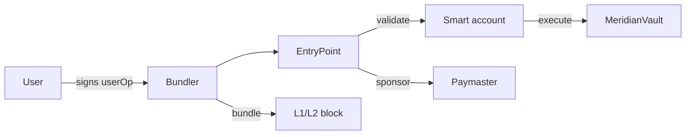

# 33. Account Abstraction

## Learning Objectives

By the end of this chapter you will be able to:

1. Explain ERC-4337's architecture — userOps, the EntryPoint, bundlers, paymasters — and why it moves account logic from the protocol layer to the account layer.
2. Describe EIP-7702 (delegated EOAs) and how it complements ERC-4337: EOA code delegation without a separate account contract.
3. Analyze the security surface of smart accounts: signature validation, replay across chains, recovery, and the bundler/paymaster trust models.
4. Design Meridian's wallet integration: a smart-account flow for borrow/repay with session keys, gas sponsorship, and the Ch 25 trust-chain framing for the account's owners.
5. Evaluate the UX economics: sponsored gas, batch userOps, and the deterministic gas estimation the Ch 20 access-list work (Ch 7/8) enables.

## Prerequisites

- **Chapter 5** (Contract Lifecycle) — deployment; **Chapter 14** (ERC20) — token flows.
- **Chapter 20** (Vault) — the functions a wallet integration wraps.
- **Chapter 25** (Trust Chains) — account ownership as a trust chain.

Supporting: **Ch 7** (gas estimation — the determinism property), **Ch 8** (gas patterns), **Ch 31** (L2 — ERC-4337 is L2-native). Locked conventions in force.

## Theory

### What account abstraction actually abstracts

An EOA's authority is "the key that signed the transaction". A smart account's authority is *whatever its code decides*: multiple keys, session keys, social recovery, sponsored gas. ERC-4337 makes this a standard: a **userOperation** (userOp) describes an action; the **EntryPoint** contract validates and executes it; **bundlers** package userOps into bundles; **paymasters** sponsor or price them.

The key shift: **the protocol (Meridian) does not need to know the account's rules** — it sees a normal call from the EntryPoint. Account logic is encapsulated, composable, and upgradeable *per user*.

### EIP-7702 — delegated EOAs

EIP-7702 lets an EOA point its code at a smart-account implementation via a signed authorization, without deploying a new contract. The delegation is a persistent state change — it applies to every future call to that address, from anyone, until the EOA signs a new authorization that replaces or revokes it (pointing to the zero address clears it). This is the "EOA with account-abstraction superpowers" path — no deployment, and the delegation persists until revoked.

The comparison:

| | ERC-4337 | EIP-7702 |
|---|---|---|
| Account | deployed smart contract | EOA with persistent delegation (until revoked) |
| Entry point | EntryPoint contract | native transaction |
| Composability | full (modules, paymasters) | per-delegation |
| UX | gas sponsorship, batching | lighter, EOA-native |

## Mathematical Foundations

### The userOp lifecycle cost

A sponsored userOp's cost: `C_userOp = C_validation + C_execution + C_bundler_fee (+ C_paymaster)`.

- `C_validation`: EntryPoint checks (signature, nonce, paymaster) — kept cheap by design (the EntryPoint's gas limits).
- `C_execution`: the wrapped call (e.g., a Meridian borrow).
- `C_bundler_fee`: the bundler's cut — the market price of inclusion.
- `C_paymaster`: the sponsor's terms (or zero for self-sponsored).

The Ch 7/8 determinism work pays here: **the bundler must estimate the userOp's gas before inclusion** — a borrow whose gas is deterministic (access-list-stabilized, Ch 20) is a borrow a bundler will happily include. The MEV/OEV framing (Ch 34–35) applies to the paymaster's and bundler's incentives.

### Replay across chains

A userOp signed on chain A must not execute on chain B. The standard defenses: chain-id in the signature domain, a per-chain nonce. The invariant: `valid(sig, userOp, chainId)` — the signature binds the chain.

## Engineering Perspective

### Meridian's smart-account integration

- **The wrapped surface**: `borrow`, `repay`, `depositCollateral`, `withdraw` (Ch 20 vault) — exposed through the EntryPoint like any call.
- **Session keys**: a user grants a session key limited authority (e.g., "repay this debt up to X per day") — a per-account trust chain (Ch 25) with explicit scope.
- **Gas sponsorship**: Meridian (or a partner) runs a paymaster for sponsored flows — the paymaster's rules are the Ch 25 risk review surface.
- **Recovery**: the account's recovery path is the user's own account design — Meridian documents it, never controls it.

## Mermaid Diagram



## Code Walkthrough

```solidity
// src/IWalletLab.sol
// SPDX-License-Identifier: MIT
pragma solidity ^0.8.24;

/// @title IWalletLab
/// @notice I-prefix interface — a minimal smart-account validator.
interface IWalletLab {
    error InvalidSignature();
    error InvalidNonce(uint256 expected, uint256 got);
    error WrongChain(uint256 expected, uint256 got);

    function validateUserOp(bytes32 hash, uint256 nonce, uint256 chainId, bytes calldata sig) external view returns (bool);
    function consumeNonce() external;
}
```

```solidity
// src/WalletLab.sol
// SPDX-License-Identifier: MIT
pragma solidity ^0.8.24;

import {IWalletLab} from "./IWalletLab.sol";

/// @title WalletLab
/// @notice Pedagogical smart-account validation: signature + nonce + chain.
/// @dev NOT part of the protocol — an account-abstraction lab.
contract WalletLab is IWalletLab {
    address public immutable owner;
    uint256 public nonce;

    /// @dev secp256k1 curve order / 2 — the low-s bound (malleability guard).
    uint256 private constant _SECP256K1N_HALF = 0x7FFFFFFFFFFFFFFFFFFFFFFFFFFFFFFF5D576E7357A4501DDFE92F46681B20A0;

    constructor(address owner_) { owner = owner_; }

    /// @dev Validate a userOp hash: correct signer, fresh nonce, right chain.
    function validateUserOp(bytes32 hash, uint256 expectedNonce, uint256 chainId, bytes calldata sig)
        external view returns (bool)
    {
        if (chainId != block.chainid) revert WrongChain(block.chainid, chainId);
        if (expectedNonce != nonce) revert InvalidNonce(nonce, expectedNonce);

        bytes32 ethHash = keccak256(abi.encodePacked("\x19Ethereum Signed Message:\n32", hash));
        (bytes32 r, bytes32 s, uint8 v) = _split(sig);
        // Reject malleable (high-s) signatures — s must be in the lower half of the curve order.
        if (uint256(s) > _SECP256K1N_HALF) revert InvalidSignature();
        address signer = ecrecover(ethHash, v, r, s);
        if (signer != owner) revert InvalidSignature();
        return true;
    }

    function consumeNonce() external { nonce += 1; }

    function _split(bytes calldata sig) internal pure returns (bytes32 r, bytes32 s, uint8 v) {
        r = bytes32(sig[0:32]);
        s = bytes32(sig[32:64]);
        v = uint8(sig[64]);
    }
}
```

Three details. **First**, the validation binds the chain — the replay-across-chains invariant. **Second**, the nonce is the replay-within-chain guard — one userOp per nonce. **Third**, `ecrecover` is the signer check — the lab's stand-in for the EntryPoint's validation loop. One caveat: raw `ecrecover` accepts malleable (high-s) signatures, so the lab — like OpenZeppelin's `ECDSA.recover` — enforces low-s before recovery. The nonce already gates replay here, but a production account treats low-s as mandatory: a high-s variant is a valid signature for the same digest and signer, and malleability can break signature-based bookkeeping.

## Production Example

**A sponsored Meridian borrow.** A user (smart account) signs a userOp wrapping `vault.borrow(...)`; a bundler includes it; Meridian's paymaster sponsors the gas (or the user self-sponsors). The vault sees a normal call from the EntryPoint. The Ch 7/8 gas-determinism work makes the bundler's estimation exact — the access-list-stabilized borrow (Ch 20) is bundleable. The paymaster's rules (who gets sponsored, how much) are a Ch 25 risk-review artifact.

## Foundry Lab

`meridian/test/WalletLabTest.t.sol`:

```solidity
// test/WalletLabTest.t.sol
// SPDX-License-Identifier: MIT
pragma solidity ^0.8.24;

import {Test} from "forge-std/Test.sol";
import {WalletLab} from "../src/WalletLab.sol";
import {IWalletLab} from "../src/IWalletLab.sol";

contract WalletLabTest is Test {
    WalletLab internal lab;
    uint256 internal ownerKey = 0xA11CE;
    address internal owner;

    function setUp() public {
        owner = vm.addr(ownerKey);
        lab = new WalletLab(owner);
    }

    function _sign(bytes32 hash, uint256 key) internal pure returns (bytes memory) {
        (uint8 v, bytes32 r, bytes32 s) = vm.sign(key, hash);
        return abi.encodePacked(r, s, v);
    }

    function _ethHash(bytes32 hash) internal pure returns (bytes32) {
        return keccak256(abi.encodePacked("\x19Ethereum Signed Message:\n32", hash));
    }

    /// @dev Valid signature + nonce + chain passes.
    function testValidUserOp() public {
        bytes32 hash = keccak256("borrow");
        bytes memory sig = _sign(_ethHash(hash), ownerKey);
        assertTrue(lab.validateUserOp(hash, 0, block.chainid, sig));
    }

    /// @dev Wrong chain rejects — the cross-chain replay invariant.
    function testWrongChainRejected() public {
        bytes32 hash = keccak256("borrow");
        bytes memory sig = _sign(_ethHash(hash), ownerKey);
        vm.expectRevert(); // WrongChain
        lab.validateUserOp(hash, 0, block.chainid + 1, sig);
    }

    /// @dev Wrong nonce rejects.
    function testWrongNonceRejected() public {
        bytes32 hash = keccak256("borrow");
        bytes memory sig = _sign(_ethHash(hash), ownerKey);
        vm.expectRevert(); // InvalidNonce
        lab.validateUserOp(hash, 1, block.chainid, sig);
    }

    /// @dev Wrong signer rejects.
    function testWrongSignerRejected() public {
        bytes32 hash = keccak256("borrow");
        bytes memory sig = _sign(_ethHash(hash), 0xBAD);
        vm.expectRevert(); // InvalidSignature
        lab.validateUserOp(hash, 0, block.chainid, sig);
    }

    /// @dev High-s (malleable) mirror of a valid signature rejects — low-s enforced.
    function testMalleableSignatureRejected() public {
        bytes32 hash = keccak256("borrow");
        (uint8 v, bytes32 r, bytes32 s) = vm.sign(ownerKey, _ethHash(hash));
        // (r, n - s, v ^ 1) is the same signer for the same digest — must be rejected.
        uint256 n = 0xFFFFFFFFFFFFFFFFFFFFFFFFFFFFFFFEBAAEDCE6AF48A03BBFD25E8CD0364141;
        bytes memory malleated = abi.encodePacked(r, bytes32(n - uint256(s)), v == 27 ? 28 : 27);
        vm.expectRevert(); // InvalidSignature (low-s)
        lab.validateUserOp(hash, 0, block.chainid, malleated);
    }
}
```

Green on forge 1.7.1.

## Security Analysis

### The account's trust chain (Ch 25, per user)

A smart account is a trust chain: owner key(s), session keys, recovery path, paymaster sponsorship. The 2026 trust-surface grounding applies at the *user* level: a session key that can do too much (e.g., unlimited borrow authority) is the user's own admin-key incident. The wallet integration's design rule: **session keys carry the smallest scope that works** — amount bounds, time bounds, function bounds.

A 7702 delegation is a standing state, not a per-transaction effect: delegating to a buggy or malicious implementation compromises the EOA until a revocation authorization is sent — it does not quietly expire. The same standing-compromise framing as an admin key applies.

### The bundler/paymaster surface

A malicious bundler can censor userOps (liveness) or extract MEV (Ch 34); a malicious paymaster can sponsor-then-revert (griefing). The EntryPoint's design (gas limits, reputation rules) mitigates the first two; the paymaster's own rules are a Ch 25 review artifact. The residual: bundler centralization — the same sequencer-decentralization debate as Ch 29.

## Common Mistakes

1. **Signature without chain binding** — replay across chains.
2. **Nonce omitted or per-function** — replay within a chain.
3. **Session key with owner scope** — the user-level admin-key incident.
4. **Gas estimation assumed** — a non-deterministic userOp is unbundleable (Ch 7/8).
5. **Paymaster rules ungoverned** — sponsorship as an un-reviewed trust surface (Ch 25).
6. **Recovery path unplanned** — a lost key with no recovery is a locked-out user, not a protocol bug — but the protocol's UX inherits it.

## Gas Optimization

| Pattern | Before | After | Delta |
|---|---|---|---|
| userOp validation | — | EntryPoint-bounded | the price of AA |
| Gas determinism | estimation variance | access-list-stabilized | bundleable (Ch 7/8/20) |
| Batching | N userOps | 1 bundle | amortized |

## Reading Production Source Code

1. **ERC-4337 EntryPoint** — the validation loop, the gas limits, the reputation rules.
2. **EIP-7702** — the delegation mechanics.
3. **A production smart account** (e.g., a 4337-compatible account implementation) — the signature/nonce/recovery surface.
4. **A paymaster implementation** — the sponsorship rules as a trust surface.

## Exercises

1. Trace a sponsored userOp through the EntryPoint: who pays what, and where can it fail?
2. Derive the cross-chain replay invariant and show the signature-domain fix.
3. Design a session key for "repay my debt, max 100 MER/day, 30 days" — the scope, the revocation.
4. Compare ERC-4337 vs EIP-7702 for Meridian's wallet flow — which wraps a borrow better?
5. Why does the Ch 20 gas-determinism work make a borrow bundleable?

## Weekly Project

**Ship `WalletLab.sol` + `WalletLabTest.t.sol`**, write `docs/aa-wallet.md` (the integration design: wrapped surface, session keys, paymaster rules, recovery), and extend `docs/trust-chain.md` (Ch 25) with the per-account chain.

## Deliverables

1. `meridian/src/WalletLab.sol` + `IWalletLab.sol` — signature + nonce + chain validation.
2. `meridian/test/WalletLabTest.t.sol` — valid, wrong-chain, wrong-nonce, wrong-signer, malleable-sig; green.
3. `docs/aa-wallet.md` — the integration design.
4. Locked conventions extended: signatures bind chain-id; nonce per userOp; session keys carry smallest scope; paymaster rules are a Ch 25 review artifact; gas determinism is a bundleability requirement.

## Quiz

1. What does ERC-4337 abstract, and where does the logic live?
2. How does EIP-7702 differ from ERC-4337?
3. What is the cross-chain replay invariant, and how is it enforced?
4. Why must a userOp's gas be deterministic?
5. What is a session key, and what scope should it carry?

**Answers:** (1) Account authority — the userOp/EntryPoint/bundler/paymaster stack; account logic lives in the account, not the protocol. (2) 7702 delegates an EOA's execution to a contract via a persistent, revocable authorization (no separate account contract); 4337 uses a deployed account + EntryPoint. (3) A userOp signed on chain A must not execute on B — enforced by chain-id in the signature domain and a per-chain nonce. (4) The bundler must estimate gas before inclusion; a non-deterministic userOp is unbundleable (Ch 7/8/20). (5) A limited-authority key granted by the owner — smallest scope that works: function, amount, and time bounds.

## Further Reading

- ERC-4337 spec + EntryPoint; EIP-7702.
- A production account + paymaster implementation.
- Ch 5 (deployment), Ch 14 (ERC20), Ch 20 (vault), Ch 25 (trust chains), Ch 34–35 (MEV/OEV), Ch 7/8 (gas determinism).
