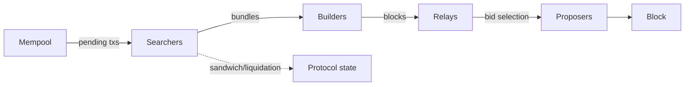

# 34. MEV Fundamentals

## Learning Objectives

By the end of this chapter you will be able to:

1. Define MEV precisely — the value extractable by *reordering, inserting, or censoring* transactions within a block — and distinguish its forms: arbitrage, sandwich, liquidation, and backrunning.
2. Explain the PBS (proposer-builder separation) pipeline and where MEV is captured in the modern stack: builders, relays, proposers.
3. Derive the sandwich attack's math: the price-impact model, the attacker's profit condition, and the victim's loss.
4. Derive the liquidation-arbitrage math for Meridian: the incentive, the race, and the design levers (Ch 35 preview) that reduce extractable value.
5. Position MEV in the protocol's risk register: it is not a bug — it is a property of the transaction order — and the protocol's job is to *minimize the extractable surface* (Ch 35) and *monitor* the residual.

## Prerequisites

- **Chapter 1** (EVM) — transaction ordering, the mempool.
- **Chapter 7** (Gas) — the fee market MEV rides on.
- **Chapter 20** (Vault) — the liquidation path this chapter's math prices.

Supporting: **Ch 30** (DA — blob order), **Ch 31** (L2 sequencers — the L2 MEV surface). Locked conventions in force.

## Theory

### MEV is a property of ordering

The protocol's state transitions are order-dependent: `A then B` and `B then A` are different worlds. MEV is the value an *order-setter* can capture by choosing the order. The forms:

| Form | Mechanism | Who profits |
|---|---|---|
| Arbitrage | price discrepancy between venues | the trader with the fastest inclusion |
| Sandwich | buy → victim buy → sell | the attacker around the victim |
| Liquidation | unhealthy position → liquidate | the liquidator who wins the race |
| Backrunning | observe tx → follow it | the follower |

The mempool is the raw material: pending transactions are visible (and reorderable) before inclusion.

### PBS — where MEV is captured now

Pre-PBS, miners/validators captured MEV directly. Post-PBS (proposer-builder separation), the flow is: **searchers** submit bundles → **builders** assemble blocks → **relays** mediate → **proposers** (validators) choose the highest-bid block. MEV is now captured *inside the builder market* — the proposer sells block space to the builder who pays the most. The consequence for protocols: MEV is *more professionalized and more extractable*, and the competition is *off-chain*.

## Mathematical Foundations

### Sandwich profit condition

A sandwich on a constant-product pool (Ch 18): attacker buys `a` before the victim's trade `v`, then sells after. With pool reserves `(X, Y)`, the victim's price impact is the attacker's edge. Fee-less, the sandwich is profitable for *any* `a, v > 0` — the front buy always captures a slice of the victim's price impact:

```
profit_attacker > 0  for any a, v > 0  (fee-less)  — no minimum front-run size
```

A size threshold only emerges once a per-swap fee is charged: the front buy must move price enough to clear the fee on its own two legs.

The victim's loss is the slippage they accept; the attacker's profit is bounded by the pool's depth and the victim's tolerance. Deep pools (high `X`) and low-slippage expectations shrink the sandwich.

### Liquidation race math (Meridian)

A position with `collateral C`, `debt D`, `price P`, `liquidation threshold τ`:

```
liquidatable ⟺ D > C × P × τ     (Ch 20 health factor < 1)
```

The liquidator repays `D`, seizes `C × P × (1 + bonus)`. The race: the first liquidator to include their transaction captures the bonus. The *extractable* value is the bonus itself — the design lever (Ch 35) is choosing the bonus and the auction shape to minimize the race's social cost.

## Engineering Perspective

### MEV in Meridian's risk register

MEV is not a vulnerability class like reentrancy — it is an *economic property* of the ordering. Meridian's posture:

1. **Measure** the extractable surface: the liquidation bonus, the oracle-update window (Ch 22), the borrow/repay fee structure.
2. **Minimize** it by design (Ch 35: OEV capture, auction shapes, MEV-aware liquidation).
3. **Monitor** the residual: liquidation races, sandwich volume around the vault's swaps.

The Ch 25 trust-chain framing applies: the *builder* and the *sequencer* are trust anchors of the ordering — documented, monitored, never assumed benign.

## Mermaid Diagram



## Code Walkthrough

`meridian/src/IMeVLab.sol`:

```solidity
// SPDX-License-Identifier: MIT
pragma solidity ^0.8.24;

/// @title IMeVLab
/// @notice I-prefix interface — the liquidation-race model.
interface IMeVLab {
    error Healthy(uint256 healthFactor);
    error NotLiquidator(address caller);

    function isLiquidatable(uint256 collateral, uint256 debt, uint256 price, uint256 thresholdBps)
        external
        pure
        returns (bool);
    function liquidationBonus(uint256 debt, uint256 bonusBps) external pure returns (uint256);
    function tryLiquidate(uint256 collateral, uint256 debt, uint256 price) external;
}
```

`meridian/src/MeVLab.sol`:

```solidity
// SPDX-License-Identifier: MIT
pragma solidity ^0.8.24;

import {Math} from "@openzeppelin/contracts/utils/math/Math.sol";
import {IMeVLab} from "./IMeVLab.sol";

/// @title MeVLab
/// @notice Pedagogical liquidation-race model: the health check and the bonus
///         that MEV searchers race for. NOT part of the protocol.
contract MeVLab is IMeVLab {
    address public liquidator;

    constructor(address liquidator_) {
        liquidator = liquidator_;
    }

    /// @dev Ch 20 health-factor check: D > C·P·τ ⟹ liquidatable.
    function isLiquidatable(uint256 collateral, uint256 debt, uint256 price, uint256 thresholdBps)
        public
        pure
        returns (bool)
    {
        // D × 10000 > C × P × τ  (all WAD-scaled)
        uint256 rhs = Math.mulDiv(collateral, price, 1e18); // C × P in WAD
        rhs = Math.mulDiv(rhs, thresholdBps, 10000); // × τ
        return debt > rhs;
    }

    /// @dev The bonus the liquidator captures (the MEV surface).
    function liquidationBonus(uint256 debt, uint256 bonusBps) public pure returns (uint256) {
        return Math.mulDiv(debt, bonusBps, 10000);
    }

    /// @dev The race entry — permissionless in production; the lab pins the
    ///      check with a registered liquidator for testability.
    function tryLiquidate(uint256 collateral, uint256 debt, uint256 price) external {
        if (msg.sender != liquidator) revert NotLiquidator(msg.sender);
        if (!isLiquidatable(collateral, debt, price, 8000)) revert Healthy(1e18);
    }
}
```

Three details. **First**, the liquidatable check is the Ch 20 health factor in arithmetic form. **Second**, the bonus is the extractable value — the number Ch 35's auction design will tune. **Third**, the lab's `liquidator` restriction is pedagogical (production is permissionless — the race is open, which is the point).

## Production Example

**A Meridian liquidation race, quantified.** A position at `D = 110,000 MER`, `C = 50 ETH`, `P = 2,500`, `τ = 80%`: `D = 110,000` vs `C×P×τ = 50×2500×0.8 = 100,000` — liquidatable: debt is 10% above the threshold. At a 5% bonus, the winner captures 5,500 MER. The race: searchers monitor the mempool, bid in the builder market, and the fastest inclusion wins. The Ch 35 design question: *is 5% the right bonus, and is a first-come auction the right shape?*

## Foundry Lab

`meridian/test/MeVLabTest.t.sol`:

```solidity
// SPDX-License-Identifier: MIT
pragma solidity ^0.8.24;

import {Test} from "forge-std/Test.sol";
import {MeVLab} from "../src/MeVLab.sol";
import {IMeVLab} from "../src/IMeVLab.sol";

contract MeVLabTest is Test {
    MeVLab internal lab;

    function setUp() public {
        lab = new MeVLab(address(this));
    }

    /// @dev The health-factor arithmetic: liquidatable when D > C·P·τ.
    ///      Price is WAD-scaled (2500e18) to match collateral/debt WAD.
    ///      D=100_001 > C·P·τ = 100_000 exactly (strict >).
    function testLiquidatable() public {
        assertTrue(lab.isLiquidatable(50 ether, 100_001 ether, 2500e18, 8000));
    }

    /// @dev Healthy when the position is above the threshold.
    function testHealthy() public {
        assertFalse(lab.isLiquidatable(50 ether, 50_000 ether, 2500e18, 8000));
    }

    /// @dev Bonus is the extractable value.
    function testBonus() public {
        assertEq(lab.liquidationBonus(100_000 ether, 500), 5_000 ether); // 5%
    }

    /// @dev Only the liquidator may enter the (lab) race.
    function testLiquidatorOnly() public {
        vm.expectRevert(abi.encodeWithSelector(IMeVLab.NotLiquidator.selector, address(0xBAD)));
        vm.prank(address(0xBAD));
        lab.tryLiquidate(50 ether, 100_000 ether, 2500e18);
    }
}
```

Green on forge 1.7.1.

## Security Analysis

### MEV is not a bug — but its shape is a design decision

The protocol cannot eliminate MEV (ordering is inherent); it can shape *what* is extractable. The 2026 framing: a protocol that ignores its MEV surface is leaving value (and user losses) to searchers by default. Ch 35 turns this chapter's math into design: oracle-update auctions (OEV), liquidation auction shapes, and MEV-aware parameter choices.

### The trust anchors of the ordering

PBS adds two off-chain trust anchors: the **builder** (who sees bundles) and the **relay** (who mediates). Both are Ch 25-style trust surfaces — documented, monitored, and (for critical paths) diversified. On L2 (Ch 31), the **sequencer** is the equivalent anchor. The residual risk is centralization: a single dominant builder or sequencer concentrates the ordering power — the same debate as Ch 29.

## Common Mistakes

1. **Treating MEV as a bug** — it is a property of ordering; the design task is shaping it.
2. **Ignoring the liquidation race** — an un-designed liquidation path is a searcher's jackpot (Ch 35).
3. **Naive sandwich math** — forgetting price impact and fees; the profit condition is the model.
4. **Mempool as a given** — on L2 the sequencer IS the mempool; the surface differs (Ch 31).
5. **No monitoring** — MEV that isn't measured is MEV that isn't managed.

## Gas Optimization

| Pattern | Before | After | Delta |
|---|---|---|---|
| Liquidation entry | — | — | the race is gas-competitive by design |
| Health check | naive `a*b/c` | mulDiv (Ch 4) | correctness |
| Bonus math | — | mulDiv | exact |

## Reading Production Source Code

1. **The PBS specs (ePBS / MEV-Boost)** — the builder/relay/proposer flow.
2. **A liquidation bot's design** — the monitoring + bidding loop (the adversary's playbook).
3. **Ch 35** — the MEV-aware design this chapter's math feeds.

## Exercises

1. Derive the sandwich profit condition for a pool with reserves (X, Y) and a fee.
2. Compute the liquidation bonus at 3% vs 8% for the Production Example position — and the race's social cost.
3. Map the PBS flow onto Meridian: where do searchers touch the vault?
4. Why is the L2 sequencer the L2 mempool? (Ch 31 recap)
5. Design a monitoring metric for liquidation-race frequency.

## Weekly Project

**Ship `MeVLab.sol` + `MeVLabTest.t.sol`**, write `docs/mev-notes.md` (the MEV taxonomy, the sandwich/liquidation math, the PBS flow, the monitoring plan), and extend `docs/gas-budget.md` with the liquidation-race cost model.

## Deliverables

1. `meridian/src/MeVLab.sol` + `IMeVLab.sol` — health-factor + bonus + race model.
2. `meridian/test/MeVLabTest.t.sol` — liquidatable/healthy, bonus, liquidator-only; green.
3. `docs/mev-notes.md` — taxonomy, math, PBS, monitoring.
4. Locked conventions extended: MEV is a property of ordering, not a bug; the extractable surface is measured and minimized (Ch 35); builders/relays/sequencers are documented trust anchors; liquidation races are monitored.

## Quiz

1. Define MEV and its four forms.
2. Where is MEV captured post-PBS?
3. Derive the sandwich profit condition.
4. What is the liquidation race, and what is its extractable value?
5. Why can't a protocol eliminate MEV — and what can it do?

**Answers:** (1) Value from reordering/inserting/censoring txs; arbitrage, sandwich, liquidation, backrunning. (2) Inside the builder market — builders assemble blocks, proposers sell block space to the highest bidder. (3) `profit > 0 ⟺` the front buy's price impact exceeds costs — bounded by pool depth and victim tolerance. (4) The first liquidator to include their tx captures the bonus; the extractable value is the bonus itself. (5) Ordering is inherent to the chain; the protocol can shape the extractable surface (bonuses, auction shapes, OEV — Ch 35) and monitor the residual.

## Further Reading

- The MEV-Boost/ePBS specs; Flashbots research.
- Ch 1 (ordering), Ch 7 (fees), Ch 18 (pools), Ch 20 (vault), Ch 22 (oracles), Ch 31 (sequencers), Ch 35 (MEV-aware design).
