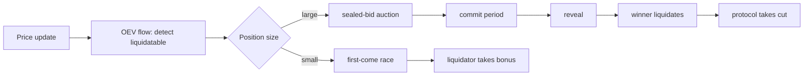

# 35. MEV-Aware Protocol Design

## Learning Objectives

By the end of this chapter you will be able to:

1. Design the liquidation mechanism to **reduce extractable value**: auction shapes (first-come vs sealed-bid vs English), bonus curves, and the social-cost trade-offs.
2. Implement **oracle-update auctions (OEV capture)** — turning the oracle-update MEV (Ch 22/34) from a searcher tax into a protocol revenue stream.
3. Apply the design principles to Meridian: liquidation auction shape, oracle update design, and the parameter choices (bonus, window, fee) that Ch 34's math prices.
4. Evaluate the trade-off between MEV reduction and protocol complexity — and the 2026 lesson that complexity is itself a risk surface (Ch 28).
5. Write the MEV-aware design review: for each extractable surface, the chosen mechanism, the residual MEV, and the monitoring metric.

## Prerequisites

- **Chapter 34** (MEV Fundamentals) — the taxonomy, the sandwich/liquidation math, PBS.
- **Chapter 22** (Oracles) — the oracle-update surface OEV captures.
- **Chapter 20** (Vault) — the liquidation path being redesigned.

Supporting: **Ch 25** (trust chains), **Ch 28** (audit — complexity as risk), **Ch 7/8** (gas). Locked conventions in force.

## Theory

### The design goal: minimize extractable value, not eliminate it

MEV cannot be eliminated (Ch 34) — ordering is inherent. The design goal is to **minimize the extractable surface and redirect what remains** to the protocol's benefit (OEV) or to the parties who bear the risk (liquidators). Three levers:

1. **Auction shape** — who competes, how, and what they win.
2. **Bonus/parameter choice** — the size of the prize the race is for.
3. **Ordering design** — what the protocol itself can control about when state changes happen.

### Liquidation auction shapes

| Shape | How it works | MEV profile |
|---|---|---|
| First-come (open race) | first tx wins the bonus | maximal race, gas wars (Ch 34) |
| Sealed-bid | bids committed, revealed, highest wins | less race, needs commit-reveal (complexity) |
| English (escalating) | successive rounds; bidders raise the bid | captures more value for the protocol |
| Proportional | everyone gets a slice of the bonus | no race, but diluted incentive |

Meridian's v1 (Ch 20) is first-come — the simplest and the most extractable. This chapter designs the v2 upgrade path.

### OEV — oracle extractable value

When a price update (Ch 22) makes positions liquidatable, the *order* of the update and the liquidations determines who captures the value. **OEV capture**: run the oracle update *and* the resulting liquidations in one controlled flow — a keeper/auction system that captures the MEV for the protocol instead of leaving it to searchers. The design:

```
oracle update → detect newly-liquidatable → auction the liquidation right → winner executes → protocol takes a cut
```

The 2026 landscape (Chainlink's OEV network, the MEV-capture debates) makes this a live design question — and the Ch 28 lesson applies: OEV infrastructure is *new trust surface* (keepers, auction contracts) that must be audited like any other.

## Mathematical Foundations

### The auction value model

For a liquidation with bonus `b` on debt `D`, the extractable value `V = b × D`. The auction's goal: capture `V` for the protocol (or minimize the social cost of racing for it). A sealed-bid auction with `n` bidders captures more of `V` as `n` grows; a first-come race dissipates `V` into gas (the winner's net ≈ 0 — the Ch 34 race math).

### The bonus curve

A flat bonus `b` invites races. A **curve** that scales with urgency:

```
b(health) = b_min + (b_max − b_min) × (1 − health) / (1 − health_min)    for health ∈ [health_min, 1]
```

where `health_min` is the health-factor floor at which a position becomes liquidatable — Ch 34's liquidation threshold `τ`, expressed here as a bound on the health factor's range rather than as a collateral ratio. Deeper-unhealthy positions pay a higher bonus — the incentive to liquidate *early* and *fast* rises exactly when it matters, and the marginal race value shrinks as health approaches the threshold.

## Engineering Perspective

### Meridian's v2 design (this chapter's deliverable)

1. **Liquidation**: escalate from first-come (v1) to a **sealed-bid, commit-reveal auction** for large positions (threshold-gated), keeping first-come for small positions where the auction overhead exceeds the value (the complexity trade-off, Ch 28).
2. **Oracle updates**: integrate an **OEV-aware keeper flow** — the update and the resulting liquidations in one controlled sequence, with the protocol capturing a share.
3. **Parameters**: bonus curve (above), liquidation threshold, and the auction's commit/reveal windows — each pinned by the Ch 34 math and reviewed by the risk role (Ch 25).

## Mermaid Diagram



## Code Walkthrough

```solidity
// SPDX-License-Identifier: MIT
pragma solidity ^0.8.24;

import {IMeVDesignLab} from "./IMeVDesignLab.sol";

/// @title IMeVDesignLab
/// @notice I-prefix interface — the auction-shaped liquidation.
interface IMeVDesignLab {
    error AuctionClosed(uint256 now, uint256 deadline);
    error NotWinner(address bidder);
    error NoBids();
    error RevealTooEarly(uint256 now, uint256 revealAt);

    function commitBid(bytes32 commitment) external;
    function revealBid(uint256 amount, bytes32 salt) external;
    function settleAuction() external;
    function auctionState()
        external
        view
        returns (uint256 deadline, uint256 revealAt, address winner, uint256 winningBid);
}

/// @title MeVDesignLab
/// @notice Pedagogical sealed-bid liquidation auction (commit-reveal).
/// @dev NOT part of the protocol — the Ch 35 design lab.
contract MeVDesignLab is IMeVDesignLab {
    uint256 public constant COMMIT_WINDOW = 1 hours;
    uint256 public constant REVEAL_WINDOW = 1 hours;

    uint256 public deadline;
    uint256 public revealAt;
    address public winner;
    uint256 public winningBid;
    bool public settled;

    mapping(address => bytes32) public commitments;

    constructor() {
        deadline = block.timestamp + COMMIT_WINDOW;
        revealAt = deadline; // reveal opens the moment commit closes — no dead hour
    }

    function commitBid(bytes32 commitment) external {
        if (block.timestamp > deadline) revert AuctionClosed(block.timestamp, deadline);
        commitments[msg.sender] = commitment;
    }

    function revealBid(uint256 amount, bytes32 salt) external {
        if (block.timestamp < revealAt) revert RevealTooEarly(block.timestamp, revealAt);
        if (block.timestamp > revealAt + REVEAL_WINDOW) {
            revert AuctionClosed(block.timestamp, revealAt);
        }
        bytes32 expected = keccak256(abi.encode(msg.sender, amount, salt));
        if (commitments[msg.sender] != expected) revert NotWinner(msg.sender);
        if (amount > winningBid) {
            winningBid = amount;
            winner = msg.sender;
        }
    }

    function settleAuction() external {
        if (block.timestamp < revealAt + REVEAL_WINDOW) {
            revert AuctionClosed(block.timestamp, revealAt);
        }
        if (winner == address(0)) revert NoBids();
        settled = true;
    }

    function auctionState() external view returns (uint256, uint256, address, uint256) {
        return (deadline, revealAt, winner, winningBid);
    }
}
```

Three details. **First**, the commit-reveal separates commitment from revelation — bidders cannot copy each other's bids (the first-come race's information advantage is gone). **Second**, the reveal window enforces the timing — bids are revealed together, no sniping. **Third**, the winner is the highest *committed-and-revealed* bid — the auction captures more of the extractable value for the protocol than a race dissipating it into gas.

## Production Example

**Chainlink OEV and the 2026 landscape.** The oracle-update MEV that OEV capture targets is real and growing (the 2026 debates around OEV networks, auction-based oracle updates). Meridian's design: rather than build custom OEV infra (complexity, Ch 28), integrate a vetted OEV network's auction where available, keep the bonus curve as the fallback, and document the residual MEV (what the design does NOT capture) in the risk register.

## Foundry Lab

`meridian/test/MeVDesignLabTest.t.sol`:

```solidity
// SPDX-License-Identifier: MIT
pragma solidity ^0.8.24;

import {Test} from "forge-std/Test.sol";
import {MeVDesignLab} from "../src/MeVDesignLab.sol";
import {IMeVDesignLab} from "../src/IMeVDesignLab.sol";

contract MeVDesignLabTest is Test {
    MeVDesignLab internal lab;

    function setUp() public {
        lab = new MeVDesignLab();
        // default timestamp is 1; deadlines: commit=3601, reveal=3601, settle=7201
        // (reveal opens the moment commit closes — no dead hour)
    }

    function _afterSettle() internal {
        vm.warp(block.timestamp + 4 hours + 1);
    }

    /// @dev Commit, wait, reveal — the highest bid wins.
    function testAuctionFlow() public {
        bytes32 c1 = keccak256(abi.encode(address(0xA), 100 ether, bytes32("s1")));
        bytes32 c2 = keccak256(abi.encode(address(0xB), 200 ether, bytes32("s2")));
        vm.prank(address(0xA));
        lab.commitBid(c1);
        vm.prank(address(0xB));
        lab.commitBid(c2);
        vm.warp(block.timestamp + 1 hours + 30 minutes); // past commit deadline, inside reveal window

        vm.prank(address(0xA));
        lab.revealBid(100 ether, bytes32("s1"));
        vm.prank(address(0xB));
        lab.revealBid(200 ether, bytes32("s2"));
        _afterSettle(); // past reveal window
        lab.settleAuction();
        (,, address winner, uint256 bid) = lab.auctionState();
        assertEq(winner, address(0xB));
        assertEq(bid, 200 ether);
    }

    /// @dev A bidder who commits but never reveals loses — the auction has no
    ///      winner and settlement reverts with NoBids.
    function testNoRevealLoses() public {
        bytes32 c1 = keccak256(abi.encode(address(0xA), 100 ether, bytes32("s1")));
        vm.prank(address(0xA));
        lab.commitBid(c1);
        _afterSettle();
        vm.expectRevert(IMeVDesignLab.NoBids.selector);
        lab.settleAuction();
    }

    /// @dev Bids cannot be revealed before the reveal window opens.
    function testRevealTooEarly() public {
        bytes32 c1 = keccak256(abi.encode(address(0xA), 100 ether, bytes32("s1")));
        vm.prank(address(0xA));
        lab.commitBid(c1);
        vm.warp(block.timestamp + 30 minutes);
        vm.expectRevert(); // RevealTooEarly
        vm.prank(address(0xA));
        lab.revealBid(100 ether, bytes32("s1"));
    }

    /// @dev A wrong salt fails the commitment check.
    function testWrongSaltRejected() public {
        bytes32 c1 = keccak256(abi.encode(address(0xA), 100 ether, bytes32("s1")));
        vm.prank(address(0xA));
        lab.commitBid(c1);
        vm.warp(block.timestamp + 1 hours + 30 minutes); // inside reveal window, before settle
        vm.expectRevert(); // NotWinner (commitment mismatch)
        vm.prank(address(0xA));
        lab.revealBid(100 ether, bytes32("WRONG"));
    }
}
```

Green on forge 1.7.1.

## Security Analysis

### Complexity is the 2026 risk surface

The Ch 28 lesson, applied: every auction mechanism adds code, trust, and failure modes (commit-reveal griefing, timing manipulation, reveal-sniping). The design rule: **the mechanism's complexity must be justified by the value it protects** — a sealed-bid auction for a $50 liquidation is a bug, not an improvement. The threshold-gated design (small = first-come, large = auction) is the complexity/value balance.

### The keeper/auction trust surface

OEV capture adds a keeper (or auction) trust anchor — the Ch 25 framing applies: the keeper's authority must be minimal (can trigger, cannot steal), the auction contract audited (Ch 28), and the residual MEV monitored.

## Common Mistakes

1. **Over-engineering the auction** — complexity for a small position is a net loss (Ch 28).
2. **Flat bonus** — no urgency curve, maximal race value (Ch 34).
3. **Reveal without commitment** — bids copyable, the race returns.
4. **OEV infra as new trust surface** — the keeper can extract if not constrained.
5. **Residual MEV unmeasured** — the design review must state what remains extractable.

## Gas Optimization

| Pattern | Before | After | Delta |
|---|---|---|---|
| Auction (commit+reveal) | — | 2 SSTOREs + reveal | the price of MEV reduction |
| Bonus curve | — | ~100 (view math) | free |
| Threshold gate | — | ~100 | free |

## Reading Production Source Code

1. **An OEV network's auction contract** (e.g., Chainlink OEV) — the auction shape, the keeper constraints.
2. **A liquidation auction implementation** (e.g., a protocol's English-auction liquidations) — the escalating-bid mechanics.
3. **Ch 34's math** — the race value this chapter's mechanisms reduce.

## Exercises

1. Compute the race dissipation for a 5% bonus on the Ch 34 example — what does the winner actually net after gas?
2. Design the bonus curve for `health_min = 80%`: plot `b(health)` at health 0.85, 0.9, 0.99.
3. Why does commit-reveal remove the information advantage? Give the copy-attack it prevents.
4. When is first-come the right choice over a sealed-bid auction?
5. Write the design review for the oracle-update path: mechanism, residual MEV, monitoring metric.

## Weekly Project

**Ship `MeVDesignLab.sol` + `MeVDesignLabTest.t.sol`**, write `docs/mev-design.md` (auction shapes, bonus curve, OEV integration plan, residual-MEV register), and extend `docs/mev-notes.md` (Ch 34) with the design decisions.

## Deliverables

1. `meridian/src/MeVDesignLab.sol` + `IMeVDesignLab.sol` — sealed-bid commit-reveal auction.
2. `meridian/test/MeVDesignLabTest.t.sol` — auction flow, no-reveal-loses; green.
3. `docs/mev-design.md` — shapes, curve, OEV plan, residual register.
4. Locked conventions extended: MEV reduction is threshold-gated (complexity justified by value); bonus curves over flat bonuses; commit-reveal for large positions; OEV integration is a vetted trust surface (Ch 25/28); residual MEV is documented and monitored.

## Quiz

1. What is the design goal for MEV, precisely?
2. Compare first-come vs sealed-bid liquidation auctions.
3. What is OEV, and how does capture work?
4. Why a bonus curve instead of a flat bonus?
5. When does auction complexity become a bug?

**Answers:** (1) Minimize the extractable surface and redirect what remains — to the protocol (OEV) or the risk-bearers (liquidators). (2) First-come dissipates value into gas wars; sealed-bid captures more for the protocol via commitment without copyability. (3) The value from ordering an oracle update before the liquidations it triggers; capture = controlled update+auction flow with the protocol taking a cut. (4) It raises the incentive exactly when positions are deepest-unhealthy, shrinking the marginal race value near the threshold. (5) When the value it protects is smaller than its code/trust/failure-mode cost — the Ch 28 complexity-is-risk rule.

## Further Reading

- OEV network docs (Chainlink OEV, 2026 landscape); liquidation-auction implementations.
- Ch 34 (MEV math), Ch 22 (oracles), Ch 20 (vault), Ch 25 (trust chains), Ch 28 (complexity as risk), Ch 7/8 (gas).
