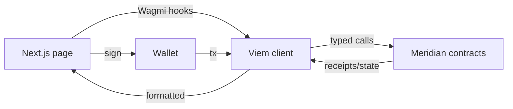

# 36. Frontend Stack: Viem + Wagmi + Next.js

## Learning Objectives

By the end of this chapter you will be able to:

1. Architect a dApp frontend: Next.js app shell, Viem for low-level chain access, Wagmi for hooks, and the typed-contract boundary (Ch 3 ABI).
2. Handle wallet flows correctly: connect, chain switching, transaction lifecycle (pending → confirmed → reorged), and the error surface (user rejection, gas, revert reasons).
3. Read and display protocol state through typed contracts — the ABI as the contract between the dApp and the vault (Ch 20).
4. Build the borrow/repay flow against MeridianVault with correct gas estimation, access-list awareness (Ch 7/8), and failure handling.
5. Apply the security conventions to the frontend: never trust the UI (the contract is the source of truth), validate display math, and keep private keys out of the browser.

## Prerequisites

- **Chapter 3** (ABI) — the encoding the typed-contract layer wraps.
- **Chapter 14** (ERC20) — the token flows the UI drives.
- **Chapter 20** (Vault) — the functions the UI wraps.

Supporting: **Ch 7/8** (gas estimation), **Ch 33** (AA — the wallet flow's future), **Ch 37** (the data layer). Locked conventions in force.

## Theory

### The dApp's trust boundary

A frontend is **presentation over a contract interface**. The contract is the source of truth; the UI is a view + a transaction builder. The security rule: *the UI can lie, the contract cannot be lied to* — every displayed balance, price, and health factor must be *read from the chain*, never from the UI's local state, and every action must be a correctly-encoded call the contract itself validates.

### The stack, layer by layer

| Layer | Tool | Role |
|---|---|---|
| App shell | Next.js (App Router) | routing, SSR, environment |
| Chain access | Viem | RPC client, encoding, transaction building |
| React hooks | Wagmi | connect, account, chain, write/read hooks |
| Typed contracts | wagmi CLI (ABI → TS) | the Ch 3 ABI as TypeScript types |

The typed-contract boundary is the chapter's core: **the ABI (Ch 3) compiled to TypeScript means a wrong selector, wrong arg order, or wrong type fails at compile time** — the frontend equivalent of the custom-error convention (Ch 2).

## Mathematical Foundations

### Transaction lifecycle states

A user transaction passes: `pending` → `mined` → `confirmed` (N confirmations) — and can fail at each step (rejected, replaced, reorged). The UI's state machine:

```
idle → signing → submitted(pending) → mined(hash) → confirmed(deep) → done
                ↘ rejected        ↘ reverted(reason)   ↘ reorged (back to pending)
```

Note: this chapter's code example tracks the single-confirmation path (`isSuccess` on the first receipt); the `confirmed(deep)` and `reorged (back to pending)` branches are the production extensions (`confirmations` threshold, `onReplaced` handler) of the same machine.

The displayed state must track *chain truth* (via receipt + confirmations), not the wallet's local optimism.

### Gas estimation correctness

The UI estimates gas (Ch 7/8): the estimate is a *prediction*, not a promise — a reverted estimate wastes nothing (the tx fails safely), but an underestimate reverts the real tx. The access-list-stabilized borrow (Ch 20) makes estimation deterministic — the UI's estimate and the mined gas converge.

## Engineering Perspective

### The Meridian dashboard layout

- **Markets page**: each market's utilization, rates (Ch 21), collateral factor — read from the contracts.
- **Position page**: collateral, debt, health factor (Ch 20) — live from the chain.
- **Action flows**: deposit, borrow, repay, withdraw — typed calls with gas estimation + revert-reason surfacing.
- **Staking page**: sMER (Ch 23) deposit/redeem, the share price.

### The display-math rule

All display math (APR → APY, WAD → human units, price formatting) runs through a single formatting module with Ch 4's rounding discipline — the UI never re-derives protocol math, it formats the chain's numbers.

## Mermaid Diagram



## Code Walkthrough

```typescript
// The typed-contract boundary: wagmi CLI generates this from the ABI.
// A wrong argument type fails here — at compile time (the Ch 3 ABI as TS).

import { useEffect } from "react";
import { useBlockNumber, useReadContract, useWriteContract, useWaitForTransactionReceipt } from "wagmi";
import { meridianVaultAbi } from "./generated";           // wagmi CLI output

// Read: health factor, re-read on every new block — never from UI state.
function useHealthFactor(user: Address) {
  const { data: blockNumber } = useBlockNumber({ watch: true });
  const query = useReadContract({
    abi: meridianVaultAbi,
    address: vaultAddress,
    functionName: "healthFactorOf",
    args: [user],
  });

  // useReadContract is a cached TanStack Query (refetch on window focus/reconnect
  // by default); the block watcher above is the explicit opt-in for per-block
  // freshness — each new blockNumber triggers a refetch.
  useEffect(() => {
    query.refetch();
  }, [blockNumber]);

  return query;
}

// Write: the borrow flow with the full lifecycle.
function useBorrow() {
  const { writeContract, data: hash } = useWriteContract();
  const { isLoading, isSuccess } = useWaitForTransactionReceipt({ hash });

  const borrow = (amount: bigint) =>
    writeContract({
      abi: meridianVaultAbi,
      address: vaultAddress,
      functionName: "borrow",
      args: [amount],
    });

  return { borrow, hash, isLoading, isSuccess };
}
```

Three details. **First**, `useReadContract` is a cached query — it re-fetches on window focus/reconnect by default, and the `useBlockNumber({ watch: true })` wiring in `useHealthFactor` is the explicit opt-in that re-reads on every block, keeping the UI a view of chain truth. **Second**, `useWriteContract` + `useWaitForTransactionReceipt` implement the lifecycle state machine (pending → mined → confirmed). **Third**, `bigint` args are the typed-contract discipline — no number/string coercion of 256-bit values (Ch 4).

## Production Example

**The Meridian borrow flow.** A user on the dashboard clicks Borrow: the UI reads the current health factor, collateral, and rate (typed reads), builds the `borrow(uint256)` call (typed ABI), estimates gas (the access-list-stabilized path, Ch 20), the wallet signs, and the UI tracks pending → mined → confirmed. On revert, the custom error (Ch 2) is decoded and displayed ("InsufficientCollateral", not "transaction failed"). The whole flow is ~100 lines of typed code — the ABI boundary does the heavy lifting.

## Foundry Lab

The frontend lab is the **generated-ABI contract** itself — the `meridian/out/` artifacts (forge) are the input to wagmi CLI. The lab verifies the boundary: the generated types round-trip against the deployed vault's ABI (a compile-time check in CI, Ch 13). No contract code is written this chapter — the deliverable is the typed-client pipeline.

## Security Analysis

### The frontend is not a trust anchor

The 2026 grounding applies: **a compromised frontend (DNS, CDN, supply chain — Ch 13) is a phishing vector** — the UI can show a fake contract address or a fake approval. The defenses: the UI is *read-only by default* (contract is truth), the contract address is pinned and verified (Ch 5), approvals are minimal and reviewed (Ch 17), and the private key never leaves the wallet (Ch 33's account layer).

### The revert-reason surface

A UI that swallows revert reasons hides the protocol's custom errors (Ch 2) — the user sees "failed" instead of "InsufficientCollateral". The typed error catalog (I-prefix interfaces) is the decoder: the UI maps error selectors to human text.

## Common Mistakes

1. **UI state as truth** — displayed balances from local state drift from chain truth.
2. **Untyped calls** — `contract.methods["borrow"](...)` strings: the Ch 3 selector bugs return.
3. **BigInt coercion** — numbers for 256-bit values lose precision (Ch 4).
4. **Swallowed reverts** — no custom-error decoding.
5. **Key in the browser** — localStorage keys are Ch 25 trust-surface failures.
6. **Estimation assumed** — no fallback for estimation failure.

## Gas Optimization

| Pattern | Before | After | Delta |
|---|---|---|---|
| Typed calls | runtime selector errors | compile-time | free |
| Gas estimation | variance | access-list-stabilized (Ch 20) | bundleable |
| Display formatting | re-derived math | single module | correctness |

## Reading Production Source Code

1. **A production dApp's generated ABI types** — the wagmi CLI output, the boundary.
2. **Wagmi/Viem docs** — the hooks, the lifecycle.
3. **Ch 37** — the data layer the dashboard consumes.

## Exercises

1. Trace a borrow through the lifecycle state machine — mark every failure point.
2. Why does the UI need `bigint`? Give the Ch 4 precision failure.
3. Design the revert-reason decoder from the vault's I-prefix error catalog (Ch 20).
4. Why is the UI read-only-by-default? Give the 2026 compromise vector.
5. Map the Ch 33 AA flow onto the UI — where does the session key enter?

## Weekly Project

**Ship the typed-client pipeline**: wagmi CLI config, generated ABI types, the `useHealthFactor`/`useBorrow` hooks, and a minimal Next.js dashboard page. Write `docs/frontend-notes.md` (the trust boundary, the lifecycle, the display-math rule).

## Deliverables

1. `frontend/` (new): Next.js shell + wagmi config + generated ABI types.
2. The typed hooks (`useHealthFactor`, `useBorrow`).
3. `docs/frontend-notes.md` — boundary, lifecycle, display math.
4. Locked conventions extended: UI is read-only-by-default; chain is truth; typed ABI boundary (compile-time); bigint discipline; custom-error decoding in the UI; keys never in the browser.

## Quiz

1. What is the dApp's trust boundary?
2. Why does the typed ABI matter at compile time?
3. Walk the transaction lifecycle and its failure points.
4. Why must display math be centralized?
5. What is the 2026 frontend compromise vector, and the defense?

**Answers:** (1) Presentation over a contract interface — the contract is truth, the UI is view + transaction builder. (2) A wrong selector/arg/type fails compilation — the Ch 3 encoding rules enforced by the type system. (3) idle → signing → pending → mined → confirmed, failing at rejection, revert (decoded reason), or reorg. (4) Re-derived math drifts from the chain's numbers; one formatting module with Ch 4 rounding keeps displays truthful. (5) A compromised frontend (DNS/CDN/supply chain) faking addresses/approvals — the defenses are read-only UI, pinned verified addresses, minimal approvals, keys out of the browser.

## Further Reading

- Viem/Wagmi docs; wagmi CLI ABI generation; Next.js App Router.
- Ch 3 (ABI), Ch 4 (arithmetic), Ch 14 (ERC20), Ch 20 (vault), Ch 37 (data layer), Ch 13 (supply chain), Ch 33 (AA).
