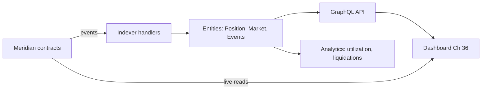

# 37. Indexing & Analytics

## Learning Objectives

By the end of this chapter you will be able to:

1. Explain why on-chain state is not a database — events as the query interface (Ch 2) — and how indexers turn the event stream into a queryable data layer.
2. Design a Subgraph for Meridian: entities, event handlers, and the derived data (positions, health factors, historical rates) the dashboard (Ch 36) consumes.
3. Handle the indexer's failure modes: reorgs, missed events, handler reverts, and the "indexer as its own bug surface" (Ch 28 framing).
4. Build the analytics layer: utilization history, liquidation events, rate curves (Ch 21), and the monitoring metrics (Ch 34's MEV register).
5. Apply the trust rules: the indexer is *derived* data — the dashboard reads live state from the chain (Ch 36) and uses the indexer for history/aggregates only.

## Prerequisites

- **Chapter 2** (Events) — the query interface this chapter indexes.
- **Chapter 36** (Frontend) — the consumer of the data layer.
- **Chapter 20** (Vault) — the events the indexer tracks.

Supporting: **Ch 21** (rates history), **Ch 34** (MEV monitoring), **Ch 3** (ABI — event encoding). Locked conventions in force.

## Theory

### Events are the on-chain query interface

Contracts do not expose "give me all borrows since block X" — they emit events (Ch 2), and the chain forgets nothing but *queries* nothing. The indexer's job: consume the event stream, derive state, and serve queries. The design rule: **events must carry everything the UI/analytics needs** — which is why Ch 2 locked past-tense, indexed-where-queried event conventions.

### The indexer's trust model

An indexer is *derived* data: it can be wrong (missed events, wrong handler, reorg lag) without the chain being wrong. The trust rules:

1. **Live state** (health factor, balance) — read from the chain (Ch 36), never from the indexer.
2. **History/aggregates** (utilization over time, liquidation counts) — the indexer's domain.
3. **The indexer is monitored, not trusted** — a reconciliation job compares indexer state to chain state periodically. That job is the trust model's enforcement mechanism: the Production Example's hourly reconciliation compares indexer-derived state to chain-read state, surfacing drift before the UI does.

## Mathematical Foundations

### The event → entity mapping

An entity is a projection of the event stream: `entity.state = f(events affecting it)`. For a position:

```
Position(user) = fold over {Deposit, Withdraw, Borrow, Repay, Liquidate} events
```

The fold must be *deterministic and replayable* — the same event stream yields the same entities (the indexer's correctness property). A missed or reordered event breaks the fold; reorg handling re-folds from the reorg point — **for deterministic handlers only** (event parameters as the sole inputs, no `ethereum.call()`). Handlers that read live chain state via `ethereum.call()` (e.g., computing `healthFactor` from a price oracle) are not reorg-safe: the call result may differ between the original run and the re-run. For derived values like `healthFactor`, recompute from stored event data rather than live contract reads.

### Aggregates

Historical analytics are sums/means over event windows: utilization at block `b` = `borrowed(b)/supplied(b)` — derived from the state at `b`, stored as a time series by the indexer. The Ch 21 rate curve is the same shape: rate over time, aggregated per block/hour/day.

## Engineering Perspective

### The Meridian subgraph schema

```graphql
type Position @entity {
  id: ID!              # user address
  collateral: BigDecimal!
  debt: BigDecimal!
  healthFactor: BigDecimal!
  updatedAt: BigInt!
}
type Market @entity {
  id: ID!
  utilization: BigDecimal!
  supplyRate: BigDecimal!
  borrowRate: BigDecimal!
  collateralFactor: BigDecimal!
}
type LiquidationEvent @entity {
  id: ID!
  user: Bytes!
  debtRepaid: BigDecimal!
  collateralSeized: BigDecimal!
  block: BigInt!
}
```

The dashboard (Ch 36) reads `Position.healthFactor` from the **chain** (live) and `Market.utilization` history from the **indexer** (aggregate).

## Mermaid Diagram



## Code Walkthrough

```graphql
# The subgraph schema + handler (assemblyscript) — the fold.

# schema.graphql
type BorrowEvent @entity {
  id: ID!
  user: Bytes!
  amount: BigDecimal!
  block: BigInt!
  timestamp: BigInt!
}

# handler (mapping.ts) — the fold for a position's debt
export function handleBorrow(event: BorrowEvent): void {
  // Historical event entity — unique per log emission
  let eventId = event.transaction.hash.toHexString()
              + "-"
              + event.logIndex.toString();
  let borrowEvent = new BorrowEvent(eventId);
  borrowEvent.user = event.params.user;
  borrowEvent.amount = event.params.amount.toBigDecimal();
  borrowEvent.block = event.block.number;
  borrowEvent.timestamp = event.block.timestamp;
  borrowEvent.save();

  // Aggregate entity — keyed by user address string
  let id = event.params.user.toHexString();
  let position = Position.load(id);
  if (position == null) {
    position = new Position(id);
    position.collateral = BigDecimal.zero();
    position.debt = BigDecimal.zero();
    position.healthFactor = BigDecimal.zero();
  }
  position.debt = position.debt.plus(event.params.amount.toBigDecimal());
  position.updatedAt = event.block.timestamp;
  position.save();
}
```

Three details. **First**, the handler is a *fold step* — deterministic (the same event always produces the same state delta) and replayable (re-indexing from any block converges to the same entity state). The Graph's runtime processes each event exactly once, so the handler itself need not be idempotent. **Second**, aggregate entities are keyed by user — the dashboard's position view; historical event entities are keyed by `tx.hash + logIndex`, one record per log emission. **Third**, `BigDecimal` preserves the WAD-scale discipline (Ch 4) — no float, and `event.params.amount.toBigDecimal()` is the required conversion from Solidity's `uint256`.

**Convention:** aggregate entities (`Position`, `Market`) use `id: ID!` keyed by address string (`user.toHexString()`). Event entities (`BorrowEvent`, `LiquidationEvent`) store `user: Bytes!` for fidelity and use `tx.hash + logIndex` as their `id`.

## Production Example

**The Meridian analytics dashboard.** The subgraph serves: utilization history (per market, per day — the Ch 21 curve), liquidation events (the Ch 34 MEV register's raw material), deposit/borrow volume. The dashboard overlays indexer history with live chain reads (Ch 36). The reconciliation job (hourly) compares the indexer's `Position.debt` to the chain's `debtOf(user)` — drift = indexer bug, caught before it reaches the UI.

## Foundry Lab

The indexer lab is the **event-surface contract**: a lab contract emitting the exact events the subgraph consumes, plus a test asserting the event payloads (the Ch 2 past-tense + indexed conventions, verified as data):

```solidity
// meridian/src/IndexLab.sol — emits the events the subgraph folds
// meridian/test/IndexLabTest.t.sol — asserts topic0 + payload shapes
```

Green on forge 1.7.1 — the events the indexer depends on are pinned by tests, so a refactor that breaks the subgraph fails CI (Ch 13).

## Security Analysis

### The indexer as a bug surface (Ch 28 framing)

An indexer bug is not a protocol vulnerability — but it *is* a data-integrity surface: a wrong liquidation count, a drifted utilization, a missed event. The 2026 lesson applied: the indexer is derived, monitored, and reconciled — never the source of truth for anything that moves value (positions, approvals, prices). The dashboard's read-only rule (Ch 36) is the boundary.

### Event-spoofing recap

Ch 3's topic0-spoofing class: any contract can emit `Transfer` events. The indexer must filter by emitting contract (the vault's address), never by topic alone — otherwise a fake airdrop "transfer" pollutes the analytics.

## Common Mistakes

1. **Indexer as truth** — live state from the indexer instead of the chain (Ch 36 rule).
2. **No reconciliation** — drift goes unnoticed until the UI shows it.
3. **Non-deterministic handlers** — the fold depends on call order/timestamp, or on `ethereum.call()` results, which may differ between index runs and reorg re-runs.
4. **Topic-only filtering** — the Ch 3 spoofing class pollutes the data.
5. **Float math** — WAD values as floats lose precision (Ch 4).
6. **Reorg handling missing** — the indexer lags or double-counts after a reorg; re-folding from the reorg point is safe only for deterministic handlers (no `ethereum.call()`).

## Gas Optimization

| Pattern | Before | After | Delta |
|---|---|---|---|
| Events carry data (Ch 2) | — | 375 + 375×topics + 8×data | the indexer's input |
| Indexed fields | data (unqueryable) | topics (queryable) | +375 gas per additional topic (Yellow Paper Appendix G: LOG0 = 375, each topic +375); queryability is the return |
| Off-chain aggregation | on-chain loops | indexer | unbounded → free |

## Reading Production Source Code

1. **A production subgraph** (e.g., a lending protocol's) — the schema, the handlers, the derived entities.
2. **The Graph's subgraph spec** — entities, handlers, reorg handling.
3. **Ch 2/3** — the event conventions this chapter indexes.

## Exercises

1. Design the entity schema for a position — which events fold into it?
2. Why must handlers be deterministic and replayable? Give the reorg scenario.
3. Write the reconciliation query: indexer debt vs chain debt.
4. How does topic-only filtering let the Ch 3 spoofing class in?
5. Map the Ch 34 MEV register onto the subgraph: which events feed it?

## Weekly Project

**Ship the subgraph skeleton**: schema, the position/market/liquidation handlers, and the reconciliation job. Write `docs/indexing-notes.md` (the trust rules, the fold, the reconciliation design).

## Deliverables

1. `indexing/` (new): subgraph schema + handlers.
2. `IndexLab.sol` + `IndexLabTest.t.sol` — the pinned event surface.
3. `docs/indexing-notes.md` — trust rules, fold, reconciliation.
4. Locked conventions extended: live state from chain, history from indexer; deterministic replayable handlers; topic+contract filtering; WAD-scale BigDecimal; periodic reconciliation.

## Quiz

1. Why are events the query interface, and what does the indexer do?
2. What is the indexer's trust model — what can it be wrong about?
3. What makes a handler deterministic and replayable?
4. How does the Ch 3 spoofing class pollute an indexer, and the fix?
5. What does reconciliation check, and how often?

**Answers:** (1) Contracts emit events, the chain doesn't query — the indexer consumes the stream and derives queryable entities. (2) Derived data: wrong on missed events, handler bugs, reorg lag — monitored and reconciled, never the source of live truth. (3) The fold depends only on the event stream (order, payload), not on external state — replayable from any block. (4) Any contract can emit Transfer; filtering by topic alone admits fakes — filter by emitting contract too. (5) The indexer's derived state vs the chain's live state — periodically (hourly), catching drift before the UI shows it.

## Further Reading

- The Graph subgraph docs; a production lending subgraph.
- Ch 2 (events), Ch 3 (ABI/spoofing), Ch 4 (WAD), Ch 20 (vault), Ch 21 (rates), Ch 34 (MEV register), Ch 36 (the consumer).
