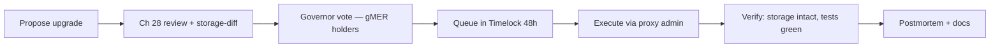

# 38. Upgradeability & Operations

## Learning Objectives

By the end of this chapter you will be able to:

1. Design Meridian's upgrade path: EIP-1967 transparent proxies, the storage-discipline rules (Ch 6 recap), and the upgrade lifecycle (propose → timelock → execute → verify).
2. Wire the sMER `rewardsAdmin` (Ch 23) and the vault's admin path through the Ch 25 hierarchy: governor → timelock → multisig, with the proxy's admin slot held by the Safe.
3. Write the **incident response runbook**: detection → triage → pause → diagnose → fix → upgrade → resume → postmortem, with the 2026 grounding (Kelp DAO verifier infra + Drift, as separate lessons) as the calibration.
4. Run the operational playbook: monitoring, alerting, the reconciliation job (Ch 37), and the MEV register (Ch 34).
5. Apply the Ch 28 audit discipline to the upgrade itself: the upgrade is a state change like any other — reviewed, tested, and evidence-backed before it ships.

## Prerequisites

- **Chapter 6** (Storage Layout) — EIP-1967/ERC-7201 namespaced storage.
- **Chapter 25** (Trust Chains) — the admin hierarchy the proxy slots into.
- **Chapter 23** (Staking) — the `rewardsAdmin` slot being wired.

Supporting: **Ch 20** (vault), **Ch 28** (audit), **Ch 37** (monitoring). Locked conventions in force.

## Theory

### Why upgradeable

Meridian is educational but *operationally realistic*: a lending protocol must fix bugs and ship improvements. The upgrade path is EIP-1967 transparent proxies: the implementation contains the logic, the proxy holds the storage — `delegatecall` makes the implementation execute against the proxy's storage — and the admin slot is the Ch 25 Safe. The discipline (Ch 6): **the implementation's storage layout is a contract with the proxy** — reordering a variable in an upgrade corrupts every existing position. The rule: append-only storage, namespaced slots (ERC-7201), and a storage-diff check in CI (Ch 13).

### The upgrade as a state change

An upgrade is not "deployment" — it is a *state change to a live system*, with the same risk profile as a parameter change (Ch 25) and worse blast radius. The lifecycle must therefore be the longest chain in the protocol: propose → review (Ch 28) → timelock → execute → verify. The 2026 grounding is explicit: an upgrade that bypasses the chain (an admin key with proxy-admin power) is single-key risk — one compromised address replaces the entire implementation. Drift Protocol ($285M, Apr 2026) is the closest 2026 example: compromised multisig signers removed the timelock protecting the governance structure, reducing the effective key threshold to whatever the signers controlled. The lesson: the proxy admin slot must be held by the Safe multisig (Ch 25 threshold), gated by the timelock + governor chain, so no single key — and no single compromised signer — can push an implementation change.

## Mathematical Foundations

### The storage-compat invariant

For an upgrade `impl_old → impl_new` with proxy storage `S`:

```
layout(impl_old) ∩ layout(impl_new) must agree on every slot in both type and semantics.
Append-only rule: impl_new may add new slots (append only) but must never:
  (a) change the type of an existing slot,
  (b) change the semantic unit/scale of an existing slot (e.g., raw → WAD),
  (c) remove or reorder existing slots.
```

The check: a storage-diff tool compares the two layouts and flags reorders, retypes, and rescales. The invariant: **every slot old code wrote is read and written by new code with the same type and meaning** — otherwise the upgrade corrupts state silently (no revert, no event).

### The upgrade gas model

The proxy indirection costs: `delegatecall` overhead (~5,400 gas cold on the first call in a transaction — opcode 700 + cold impl-slot SLOAD 2,100 + cold account 2,600; ~900 warm) + the admin-slot SLOAD (2,100 cold / 100 warm). For a hot path (borrow), the Ch 8 methodology prices it: the proxy's ~5,400 cold gas is the price of upgradeability — acceptable on a cold-ish path, worth documenting on the hot path (and why Meridian keeps the vault's hot math in the implementation, not the proxy).

## Engineering Perspective

### Meridian's upgrade hierarchy (wired)

| Component | Role | Holder |
|---|---|---|
| Proxy admin slot (EIP-1967) | who may change the implementation | Safe multisig (Ch 25) |
| Governor (gMER) | ratifies first — vote | vote |
| Timelock | queues the ratified upgrade | 48 h (Ch 25) |
| `rewardsAdmin` (sMER, Ch 23) | notifier path | timelock-governed |
| Vault admin | parameters | per-chain Safe (Ch 31) |

The wiring closes Ch 23's open slot: `StakedMeridian.rewardsAdmin` is set to the timelock, and the timelock's admin is the governor — the full chain, no EOA shortcuts.

## Mermaid Diagram



## Code Walkthrough

```solidity
// SPDX-License-Identifier: MIT
pragma solidity ^0.8.24;

/// @title IUpgradeLab
/// @notice I-prefix interface — a minimal EIP-1967 implementation-switching proxy.
interface IUpgradeLab {
    error NotAdmin(address caller);
    error InvalidImplementation(address impl);

    function upgradeTo(address newImplementation) external;
    function admin() external view returns (address);
}

/// @title UpgradeLab
/// @notice Pedagogical EIP-1967 implementation-switching proxy (admin slot +
///         delegatecall fallback).
/// @dev NOT part of the protocol — the pattern lab. The fallback forwards
///      unrecognized calls to the implementation; the admin-path routing of a
///      full transparent proxy (OZ TransparentUpgradeableProxy) is absent:
///      admin() answers directly and every caller, admin or not, is routed.
contract UpgradeLab is IUpgradeLab {
    bytes32 private constant ADMIN_SLOT =
        0xb53127684a568b3173ae13b9f8a6016e243e63b6e8ee1178d6a717850b5d6103;
    bytes32 private constant IMPL_SLOT =
        0x360894a13ba1a3210667c828492db98dca3e2076cc3735a920a3ca505d382bbc;

    constructor() {
        _setAdmin(msg.sender);
    }

    function upgradeTo(address newImplementation) external {
        if (msg.sender != admin()) revert NotAdmin(msg.sender);
        if (newImplementation.code.length == 0) revert InvalidImplementation(newImplementation);
        _setImplementation(newImplementation);
    }

    function admin() public view returns (address) {
        return _getSlot(ADMIN_SLOT);
    }

    /// @dev Routes unrecognized calls to the implementation via delegatecall.
    ///      Caller-based admin routing is not implemented (pattern lab only).
    fallback() external payable {
        address impl = _getSlot(IMPL_SLOT);
        assembly {
            calldatacopy(0, 0, calldatasize())
            let result := delegatecall(gas(), impl, 0, calldatasize(), 0, 0)
            returndatacopy(0, 0, returndatasize())
            switch result
            case 0 { revert(0, returndatasize()) }
            default { return(0, returndatasize()) }
        }
    }

    function _getSlot(bytes32 slot) internal view returns (address value) {
        assembly { value := sload(slot) }
    }

    function _setAdmin(address a) internal {
        assembly { sstore(ADMIN_SLOT, a) }
    }

    function _setImplementation(address i) internal {
        assembly { sstore(IMPL_SLOT, i) }
    }
}
```

Three details. **First**, the admin slot is EIP-1967's canonical slot — any tooling (etherscan, proxies readers) recognizes the proxy. **Second**, `upgradeTo` is admin-gated and validates the target has code. **Third**, the fallback forwards every unrecognized call to the implementation via assembly `delegatecall`, bubbling reverts — the routing layer of the pattern, exercised by `testDelegatecallRoutesCorrectly`.

> **What's missing for a full transparent proxy:** (1) caller-based routing — in a transparent proxy, calls from the admin address execute proxy functions while every non-admin call is forwarded; `UpgradeLab` forwards all calls regardless of caller, and `admin()` answers directly instead of routing to the implementation. (2) `changeAdmin` and the `Upgraded`/`AdminChanged` events. The production version (OpenZeppelin `TransparentUpgradeableProxy`) adds both.

## Production Example

**The sMER rewardsAdmin wiring (Ch 23's open slot, closed).** `StakedMeridian.rewardsAdmin` is constructor-pinned in v1 to the vault; Ch 38 upgrades it to the timelock: the proxy's implementation v2 exposes `setRewardsAdmin(address)` gated by the proxy admin (Safe); the change is ratified by the governor, then queued in the timelock (48 h) before execution. The upgrade's storage-diff shows only the new slot (append-only) — no corruption. The incident runbook (below) documents the operational path.

## Foundry Lab

`meridian/test/UpgradeLabTest.t.sol`:

```solidity
// SPDX-License-Identifier: MIT
pragma solidity ^0.8.24;

import {Test} from "forge-std/Test.sol";
import {UpgradeLab} from "../src/UpgradeLab.sol";
import {IUpgradeLab} from "../src/IUpgradeLab.sol";

contract ImplV2 {
    function version() external pure returns (uint256) {
        return 2;
    }
}

contract UpgradeLabTest is Test {
    UpgradeLab internal proxy;

    function setUp() public {
        proxy = new UpgradeLab();
    }

    /// @dev Only the admin may upgrade. (ImplV2 created OUTSIDE the call —
    ///      the create would consume the vm.prank otherwise.)
    function testOnlyAdminUpgrades() public {
        ImplV2 v2 = new ImplV2();
        vm.expectRevert(abi.encodeWithSelector(IUpgradeLab.NotAdmin.selector, address(0xBAD)));
        vm.prank(address(0xBAD));
        proxy.upgradeTo(address(v2));
    }

    /// @dev Admin upgrades to a code-bearing implementation.
    function testAdminUpgrades() public {
        proxy.upgradeTo(address(new ImplV2()));
        bytes32 slot = 0x360894a13ba1a3210667c828492db98dca3e2076cc3735a920a3ca505d382bbc;
        address impl = address(uint160(uint256(vm.load(address(proxy), slot))));
        assertTrue(impl.code.length > 0);
    }

    /// @dev Calls route through the proxy to the implementation (fallback →
    ///      delegatecall), proving routing, not just slot state.
    function testDelegatecallRoutesCorrectly() public {
        proxy.upgradeTo(address(new ImplV2()));
        (bool ok, bytes memory data) = address(proxy).call(abi.encodeWithSignature("version()"));
        assertTrue(ok);
        assertEq(abi.decode(data, (uint256)), 2);
    }

    /// @dev Upgrading to an EOA (no code) reverts.
    function testNoCodeTargetRejected() public {
        vm.expectRevert(
            abi.encodeWithSelector(IUpgradeLab.InvalidImplementation.selector, address(0x1234))
        );
        proxy.upgradeTo(address(0x1234));
    }
}
```

Green on forge 1.7.1.

## Security Analysis

### The upgrade as the 2026 trust surface

The 2026 grounding, applied to operations: **the proxy admin key is the highest-value key in the protocol** — it can replace the implementation (total control). The defenses: the admin slot held by the Safe (not an EOA), the upgrade lifecycle through the timelock + governor (no single-key upgrades), the storage-diff CI gate (no accidental corruption), and the Ch 28 review before every upgrade. A protocol whose proxy admin is an EOA is single-key risk: one compromised address replaces the entire implementation. Drift Protocol ($285M, Apr 2026) is the closest 2026 example — attackers removed the timelock protecting the governance structure, reducing the effective key threshold to whatever the compromised signers controlled. The proxy admin slot must be held by the Safe multisig (Ch 25 threshold), gated by the timelock + governor chain, so no single key — and no single compromised signer — can push an implementation change.

### The incident runbook

```
1. DETECT   — monitoring alert (health factor spike, abnormal liquidations, Ch 37 reconciliation drift)
2. TRIAGE   — severity: is value at risk? pause if yes (PAUSER_ROLE, Ch 25)
3. DIAGNOSE — read the chain state, the events, the diff (Ch 37/28)
4. FIX      — prepare the upgrade, review (Ch 28), storage-diff, test
5. UPGRADE  — propose → governor vote → queue in timelock → execute → verify
6. RESUME   — unpause, monitor closely
7. POSTMORTEM — what happened, why, what ships (Ch 28 report)
```

The runbook's rule: **pause before diagnose** — the 2026 incidents' losses compound because the pause path was slow or absent.

## Common Mistakes

1. **Proxy admin on an EOA** — single-key risk: one compromised key replaces the implementation. Drift's 2026 timelock removal shows the blast radius; Safe (Ch 25 threshold) + timelock + governor only.
2. **Storage reorder in an upgrade** — corruption; append-only + storage-diff CI.
3. **Single-key upgrades** — no timelock/governor; the Ch 25 chain bypassed.
4. **Upgrade without review** — the Ch 28 discipline skipped.
5. **No pause path** — slow incident response compounds losses.
6. **Implementation that uses sequential storage layout instead of ERC-7201 namespaced slots** — collides with the proxy admin/impl slots or between versions.

## Gas Optimization

| Pattern | Cold (first tx access) | Warm (same tx) | Notes |
|---|---|---|---|
| Proxy `delegatecall` overhead | ~5,400 | ~900 | EIP-2929: cold impl-slot SLOAD + cold account + opcode |
| Admin-slot `SLOAD` | 2,100 | 100 | warm if already read earlier in the tx |
| Hot path in implementation | — | — | per-call proxy overhead documented, not eliminated |

## Reading Production Source Code

1. **OpenZeppelin `TransparentUpgradeableProxy`** — the admin/fallback split, the canonical slots.
2. **A production proxy upgrade's storage-diff output** — the compatibility check in action.
3. **Ch 6** — the storage discipline this chapter operationalizes.

## Exercises

1. Why is the proxy admin the highest-value key? Trace the blast radius.
2. Write the storage-diff check for an upgrade that adds a field — and one that reorders.
3. Walk the incident runbook for a hypothetical liquidation-engine bug.
4. Why does the hot path's proxy overhead matter (Ch 8 methodology)?
5. Wire the sMER rewardsAdmin through the Ch 25 hierarchy — the full chain.

## Weekly Project

**Ship `UpgradeLab.sol` + `UpgradeLabTest.t.sol`**, write `docs/upgrade-ops.md` (the upgrade lifecycle, the storage-compat invariant, the incident runbook, the monitoring plan), and wire `StakedMeridian.rewardsAdmin` in the design docs.

## Deliverables

1. `meridian/src/UpgradeLab.sol` + `IUpgradeLab.sol` — EIP-1967 proxy pattern.
2. `meridian/test/UpgradeLabTest.t.sol` — admin-gated, no-code rejected, delegatecall routing tested; green.
3. `docs/upgrade-ops.md` — lifecycle, storage invariant, runbook, monitoring.
4. Locked conventions extended: proxy admin = Safe only; upgrades through timelock + governor; append-only storage + storage-diff CI; pause-before-diagnose; every upgrade ships with its Ch 28 review.

## Quiz

1. Why is the upgrade a state change, not a deployment?
2. What does the storage-compat invariant require?
3. Who holds the proxy admin slot, and why?
4. What is the runbook's first rule?
5. How does Ch 23's rewardsAdmin slot get wired?

**Answers:** (1) It changes a live system with worse blast radius than a parameter change. A parameter change adjusts one value; an upgrade replaces the entire logic contract — all execution paths, all security assumptions, simultaneously. The longest trust chain applies. (2) Every slot old code wrote is read and written by new code with the same type and meaning — append-only, namespaced, storage-diff checked. (3) The Safe multisig — an EOA proxy admin is single-key risk (the Drift shape). (4) Pause before diagnose — slow pauses compound losses. (5) Via the upgrade: v2 exposes a rewardsAdmin setter gated by the proxy admin (Safe), ratified by the governor, then queued in the timelock (48 h) before execution.

## Further Reading

- EIP-1967, ERC-7201; OpenZeppelin TransparentUpgradeableProxy.
- Drift Protocol post-mortem (Apr 2026) — compromised signers removed the timelock: the proxy-admin custody lesson.
- Kelp DAO/LayerZero post-mortem (Apr 2026) — the off-chain verifier infrastructure attack; Ch 27's category, not the admin-key lesson.
- Ch 6 (storage), Ch 23 (sMER), Ch 25 (trust chains), Ch 28 (audit), Ch 37 (monitoring).

> **UUPS vs transparent (OZ v5):** OZ v5 recommends UUPS (EIP-1822) over transparent proxies for gas efficiency — the upgrade function lives in the implementation rather than a separate ProxyAdmin contract — but the tradeoff is the upgrade lock: an implementation bug that makes `upgradeTo()` uncallable permanently bricks the proxy. ERC-7201 namespaced storage applies to both patterns; Meridian stays with the transparent pattern for auditability, keeping upgrade authority unambiguously in the proxy admin slot, independent of implementation correctness.
