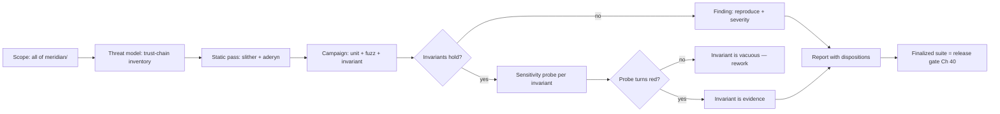

# Capstone Prep: Full-System Audit

## Learning Objectives

By the end of this chapter you will be able to:

- Scope and run a **full-system audit** of a complete protocol — every module
  from the first token contract to the upgrade runbook — instead of auditing
  one contract in isolation.
- Distinguish **peer audit** (another engineer checks your work) from
  **reference audit** (you check your work against a known-good
  implementation), and run both as separate passes with separate artifacts.
- Turn the chapter's accumulated invariant suites into a **falsification
  campaign**: an audit is not "the code looks fine", it is "here are the
  properties that must hold, here is the campaign that tried to break them,
  and here is the one that did."
- Write a findings report where **every finding ships with evidence** — a
  reproduction, a probe, or a failing-then-passing test — and a severity
  rationale that names the trust root it exploits.
- Catch the audit's own failure modes: trusting review line numbers, treating
  coverage metrics as security, and letting a unit test silently encode the
  bug it is supposed to prevent.

## Prerequisites

- Ch 24 (Reentrancy & Control Flow), Ch 25 (Access Control & Trust Chains),
  Ch 26 (Arithmetic & Invariant Failures), Ch 28 (Auditing Methodology).
- The Meridian protocol surface shipped through Ch 38: `MeridianVault`
  (Ch 20), `MeridianOracle`/`OracleRegistry` (Ch 22), `StakedMeridian`
  (Ch 23), `MeridianFactory` (Ch 25), `UpgradeLab` (Ch 38), and the
  invariant suites from Ch 12/14/15/26.
- `forge` fluency: `forge test`, `forge snapshot`, `forge inspect`, and the
  `[invariant]` configuration locked in `foundry.toml`.

## Theory

### What a full-system audit is

A **contract audit** (Ch 28) answers "is this contract safe?" A **full-system
audit** answers "is this *protocol* safe?" — which is a different question,
because a protocol is a graph of contracts, trust anchors, and off-chain
assumptions, and the interesting failures live at the seams:

- **Cross-contract seams** — the vault consumes the oracle and the rate
  model; the factory deploys vaults; the proxy delegates to an
  implementation. A bug in any one contract is contained; a bug in a *seam*
  (a wrong assumption about what the other side returns) propagates.
- **Governance seams** — setters that do not re-validate what the constructor
  validated, roles that outlive their purpose, upgrade paths that bypass the
  timelock (the Ch 38 runbook exists precisely because of this class).
- **Accounting seams** — rounding conventions that must agree across
  contracts (Ch 4/16), indexes that must scale identically, conservation
  properties that must hold *globally*, not per-contract.

The capstone protocol is small enough that a full-system audit is one
afternoon of systematic work — which is exactly why it is the right
graduation exercise: full scope, two distinct audit passes, one
deliverable. You audit *everything*, and you do it twice.

### Peer audit vs reference audit

**Peer audit.** Another engineer (in this curriculum: a classmate, or your
future reviewer) reads your code with a fresh adversarial eye. Its value is
that the peer does not share your blind spots — they do not know which
function you are proud of, so they read the boring ones too. The peer's
findings are *suggestions with evidence*: you are allowed (encouraged) to
dispute them, but a disputed finding must be disputed with code, not with
authority.

**Reference audit.** You compare your implementation against a
known-good reference — OpenZeppelin for primitives, Compound/Aave for
lending mechanics, the EIP texts themselves for semantics. The reference
audit is how you catch *silent divergence*: not a crash, not a revert, but
a place where your code does something subtly different from the battle-tested
pattern. The Ch 25 `onlyRole` gas analysis and the Ch 30 fake-exponential
rebuttal are both reference-audit results: the reference told us what the
"standard" answer was, and measurement told us what our code actually does.

### The falsification campaign

Ch 12 introduced invariants as "properties that must always hold". Ch 39
inverts the framing: **the audit is the campaign that tries to break them.**
A green invariant suite is not evidence of safety; it is evidence that the
campaign so far failed. The discipline that makes it evidence is the
**detector-sensitivity probe** (Ch 26): for every invariant, you must be able
to point to the one-line change that turns it red. An invariant that cannot
be turned red is teaching nothing — it is either vacuous or it is asserting
the wrong thing.

The full-system audit therefore ends with a **finalized invariant suite**:
the set of invariants that survived the campaign, each with its sensitivity
probe documented. That suite is the protocol's executable security
specification, and it ships as a deliverable (Ch 40 uses it as the release
gate).

## Mathematical Foundations

### What "coverage" means in an audit

Line coverage answers "did the test execute this line?" Security coverage
answers "did the campaign try to break this *property*?" The two diverge
exactly where audits fail. Consider a setter:

```text
setCollateralFactor(x):           # 1 line of coverage
    require x <= 100%             # happy path covered
    state.CF = x                  # 2 lines covered, both green
```

Line coverage: 100%. Security coverage: did the campaign try
`x = 90%` *while the liquidation threshold was 80%*? The state transition
"governance erases the safety buffer" is a *reachable state*, not a line.
Reachability is the audit's real metric: **which protocol states are
reachable, and are any of them unsafe?**

### The safety-buffer invariant, precisely

The vault's liquidation safety depends on one inequality holding across the
whole governance surface:

```text
LT * BPS > CF * WAD          (the buffer is strictly positive)
```

where `LT` is the liquidation threshold (WAD, e.g. 0.8e18), `CF` is the
collateral factor in basis points (e.g. 7500), `BPS = 10_000`, and
`WAD = 1e18`. The constructor enforces it. The *reason* it must hold is the
health-factor algebra at max borrow:

```text
max debt   = CF * collateralValue          (borrow capacity)
HF at max  = collateralValue * LT / debt
           = collateralValue * LT / (CF * collateralValue)
           = LT / CF
```

With `LT = 0.8` and `CF = 0.75`, `HF = 1.0667` — the maximum borrower sits
above the liquidation line, and only interest drift or an oracle move can
push them below it. Now set `CF = 0.9` (governance, allowed by the old
setter): `HF = 0.8 / 0.9 = 0.889 < 1`. The maximum borrower is **liquidatable
on entry**. The buffer did not just shrink; the protocol's central safety
property inverted — and no line of code "looked" wrong.

This is the chapter's canonical finding. It is a governance-seam bug: the
constructor validated the invariant, the setter did not, and the two halves
of the same rule drifted apart. The fix is one cross-check; the *lesson* is
that every state transition that touches a locked invariant must re-validate
it.

### Invariant coverage of the vault

The finalized suite pins five properties:

```text
I1  no self-inflicted liquidation:  debt(u) > 0  =>  not isLiquidatable(u)
I2  collateral conservation:        ghostCollateral == sum(collateralOf(u))
I3  books balance exactly:          sum(debtOf(u)) == totalDebt
I4  buffer strictly positive:       LT * BPS > CF * WAD
I5  oracle-seam consistency:        healthFactor(u) == independent oracle recompute
```

I1 is the *state-machine* guarantee (Ch 20's design claim, made executable):
under a frozen market — fixed oracle price, zero interest — no user action
can cross the liquidation line, because borrow enforces
`debt <= CF * collateralValue` (so `HF >= LT/CF > 1`) and withdraw enforces
`HF >= 1` afterwards. The frozen-market scoping is not a cop-out; it is the
precise statement of what the v1 state machine *claims*. I3 is exact under
the zero-rate model — and "exact" means *exactly*: with a constant borrow
index, `debtOf(u) = principal(u)` with no rounding at any step, so
`sum(debtOf) == totalDebt` is an identity, not a near-identity. (Rounding
dust — 1-wei discrepancies from fixed-point division — only appears when
the index compounds under a non-zero rate model.) I5 crosses the
vault-oracle seam (the R=1 trust anchor, Ch 22): the vault's public
`healthFactor` must equal a health factor recomputed independently from the
oracle's current prices — a vault that cached prices, mis-scaled decimals,
or diverged in rounding would trip it.

## Engineering Perspective

### The audit program

A full-system audit is a small project. Define the scope, the threat model,
the campaign, and the report before writing a single test:

1. **Scope.** Every contract in `meridian/src`, every test in
   `meridian/test`, the deployment/upgrade path (Ch 38), and the two
   off-chain surfaces the protocol actually depends on: the oracle and the
   rate model. Off-chain surfaces are audited *at the seam*: what does the
   vault assume about `getPrice` and `borrowRate`, and could a broken
   counterpart violate it? (It can — price moves change health factors; the
   seam audit is "does the vault survive a hostile price?".)
2. **Threat model.** Ch 25's trust-chain inventory, read as a list of
   "what if" questions. Meridian's `R = 1` anchors: the admin role
   (governance), the oracle, the rate model, the proxy admin. The 2026
   calibration (Ch 25/27/38) says: Kelp was a *configuration +
   infrastructure* trust-root failure (1-of-1 DVN config, compromised RPC
   nodes feeding false data, DDoS against honest nodes), Drift was a
   *key-custody* failure (multisig social engineering, zero-timelock
   migration) — audit both shapes: for configuration, verify DVN
   threshold ≥ 2-of-N and independent data sources; for key custody,
   verify the Ch 25 trust chain has no single-key path to critical state
   changes.
3. **Campaign.** Unit tests for exact behavior, fuzz for input domains,
   invariants for state-machine properties, and the reference audit for
   silent divergence. Every invariant gets its sensitivity probe.
4. **Report.** Findings with evidence, severity with a named trust root,
   and a disposition for every finding — fixed, accepted-by-design,
   or disputed. A report without a disposition column is a wish list.

### Tooling

`forge` is the audit harness: `forge test` for the campaign,
`forge inspect <contract> storage-layout` for upgrade diffs (Ch 38),
`forge snapshot` to catch gas regressions. Static analysis (slither,
aderyn — Ch 13 CI) runs as the first pass and is *not* evidence by itself;
a static finding becomes a finding only when the campaign reproduces it.
The Ch 39 audit's most productive tool is the **sensitivity probe**: a
temporary test that flips the failure switch, observes red, and is deleted
— the audit trail records the observation, the repo ships green.

## Mermaid Diagram



## Code Walkthrough

### The finding: a setter that forgot the constructor's rule

The constructor (Ch 20) validates the safety buffer:

```text
if (liquidationThreshold_ > WAD
        || liquidationThreshold_ * BPS <= uint256(collateralFactorBps_) * WAD) {
    revert InvalidLiquidationThreshold(liquidationThreshold_);
}
```

`setLiquidationThreshold` re-validates the same rule. `setCollateralFactor`
validated only `<= BPS` — the *trivial* half. The reference audit (OZ
`AccessControl`-era governance code, and every real lending protocol's
parameter setters) says: **a setter must re-validate every cross-parameter
invariant the constructor validated**, because parameters are not
independent. The fix, as shipped:

```diff
 function setCollateralFactor(uint64 collateralFactorBps_)
     external
     override
     onlyRole(DEFAULT_ADMIN_ROLE)
 {
     if (collateralFactorBps_ > BPS) {
         revert InvalidCollateralFactor(collateralFactorBps_);
     }
+    // Ch 39 audit finding: the constructor validates the safety buffer
+    // (LT * BPS > CF * WAD — liquidation threshold strictly above the
+    // collateral factor), but this setter did NOT, so governance could
+    // raise CF to or above LT and silently erase the buffer: a max-borrow
+    // position would then sit at HF <= 1 (liquidatable on entry). The
+    // cross-check is now identical to the constructor's, so the invariant
+    // "LT > CF" holds across the whole governance surface.
+    if (_liquidationThreshold * BPS <= uint256(collateralFactorBps_) * WAD) {
+        revert InvalidCollateralFactor(collateralFactorBps_);
+    }
     emit CollateralFactorSet(_collateralFactorBps, collateralFactorBps_);
     _collateralFactorBps = collateralFactorBps_;
 }
```

The audit's second finding hid in the *test suite*: the existing unit test
`test_setCollateralFactor_updatesCapacity` set `CF = 8000` with
`LT = 0.8e18` — `CF == LT`, the exact boundary the constructor forbids. The
test encoded the bug's premise ("buffer == 0 is fine") and was corrected to
`CF = 7900` alongside the fix. When a test's constants contradict the
constructor's validation, the test is part of the problem.

### The sensitivity probe

Before fixing, the audit ran a temporary probe that exercises the bad
state. A sensitivity probe is a *temporary* test asserting the bad state
is reachable — it is designed to FAIL on fixed code, and it is deleted
after the red/green pair is recorded:

```text
// TEMPORARY — detector-sensitivity probe, deleted after use
vm.startPrank(governor);
vault.setCollateralFactor(9000);   // CF > LT: pre-fix this SUCCEEDS
vm.stopPrank();
// ... deposit, supply liquidity, borrow to capacity ...
assertTrue(vault.isLiquidatable(alice)); // HF = 0.8/0.9 = 0.889 < 1
```

| Code state | `setCollateralFactor(9000)` | `isLiquidatable(alice)` | Probe result | Invariant suite |
|---|---|---|---|---|
| Pre-fix | succeeds | true | **PASS** (bad state confirmed) | **RED** (I4 fires) |
| Post-fix | reverts `InvalidCollateralFactor` | unreachable | **FAIL** (expected — fix confirmed) | **GREEN** |

The PASS/FAIL language can look inverted at first glance: the probe
PASSes on buggy code (the bad state is reachable) and FAILs on fixed code
(the setter reverts before the assertion). That is the point — the probe
is a detector, not a quality gate; the CI gate runs the invariant suite,
never the probe. Run on pre-fix code: PASS — the bug is real. Run on
fixed code: FAIL (`InvalidCollateralFactor(9000)`) — the bad state is
unreachable. Record the pair, delete the probe, ship the suite green.

## Production Example

### Auditing the governance seam end to end

Walk the finding as a production incident would:

1. **Governance action:** a compromised or careless governor calls
   `setCollateralFactor(9000)` on a vault with `LT = 80%`. Pre-fix: no
   error, no event distinguishing it from any other parameter change.
2. **Protocol state change:** every existing max-borrow position now sits
   at `HF = 0.889`. They were solvent at `1.0667`; one transaction made
   them liquidatable — *without any user action, oracle move, or interest
   accrual*.
3. **Liquidation cascade:** any keeper can now liquidate them at a 10%
   bonus (Ch 34's MEV framing: the extractable surface just appeared).
4. **Detection:** nothing in the event stream screams. The invariant
   suite — had it existed with I4 — turns red on the *next* run. This is
   why the finalized suite is a release gate, not a development nicety.

The production lesson generalizes the Ch 25/38 calibration: **parameters are
state.** A setter is a state transition; every state transition that can
violate a locked invariant must be provably unable to. "Governance will be
careful" is the trust root the 2026 incidents removed — Drift's lesson is
that the *key* was the only barrier, and keys get compromised.

## Foundry Lab

### The finalized invariant suite

The lab materializes the audit's deliverable: `MeridianVaultHandler.sol` +
`MeridianVaultInvariant.t.sol`. The handler wraps the vault's four user ops
plus the collateral-factor setter, with every revert edge pre-checked
(Ch 12: sequences must never revert under `fail_on_revert = true`); the
suite pins I1–I4.

```solidity
// SPDX-License-Identifier: MIT
pragma solidity ^0.8.24;

import {Test} from "forge-std/Test.sol";
import {Math} from "@openzeppelin/contracts/utils/math/Math.sol";
import {MeridianVault} from "../src/MeridianVault.sol";
import {MockERC20} from "./MeridianVaultMocks.sol";

/// @notice Ch 39 invariant handler — wraps MeridianVault's state-changing
///         surface (deposit / withdraw / borrow / repay) plus the governance
///         setter for the collateral factor, with bounded arguments.
/// @dev Ch 12 rules held: arguments `bound` to realistic domains; sequences
///      never revert (every revert edge pre-checked, so `[invariant]
///      fail_on_revert = true` holds); ghosts are single-writer public state
///      written only by the handler. The handler executes user ops via
///      `vm.prank` over a FIXED 3-user set (u0/u1/u2) — the invariant suite
///      sums that complete set. The oracle price is FIXED and the rate model
///      is zero (Ch 39 audit scope: the lending state machine under a frozen
///      market), which is what makes I1 ("no self-inflicted liquidation")
///      provable: with no interest drift, HF after borrow is >= LT/CF > 1 and
///      withdraw enforces HF >= 1, so no user action can cross the line.
contract MeridianVaultHandler is Test {
    using Math for uint256;

    uint256 private constant WAD = 1e18;
    uint256 private constant BPS = 10_000;

    MeridianVault public vault;
    MockERC20 public collateral;
    MockERC20 public debt;
    address public user0;
    address public user1;
    address public user2;

    /// @dev Ghost: total collateral in the system (deposited - withdrawn).
    ///      Single writer (this handler); invariants only read it.
    uint256 public ghostCollateral;

    constructor(
        MeridianVault _vault,
        MockERC20 _collateral,
        MockERC20 _debt,
        address _user0,
        address _user1,
        address _user2
    ) {
        vault = _vault;
        collateral = _collateral;
        debt = _debt;
        user0 = _user0;
        user1 = _user1;
        user2 = _user2;
        // Approval set once per user (Ch 14 finding #3 house rule).
        for (uint256 i = 0; i < 3; ++i) {
            address u = _actor(i);
            vm.startPrank(u);
            collateral.approve(address(vault), type(uint256).max);
            debt.approve(address(vault), type(uint256).max);
            vm.stopPrank();
        }
    }

    // ---- Handler ops (all revert edges pre-checked) -------------------------

    function deposit(uint256 actor, uint256 amount) external {
        address u = _actor(actor);
        amount = bound(amount, 1, 1e24);
        collateral.mint(u, amount);
        vm.prank(u);
        vault.depositCollateral(amount);
        ghostCollateral += amount;
    }

    function withdraw(uint256 actor, uint256 amount) external {
        address u = _actor(actor);
        uint256 coll = vault.collateralOf(u);
        if (coll == 0) return; // nothing to withdraw — skip (bound needs min <= max)
        amount = bound(amount, 1, coll);
        // HF-after pre-check, mirroring the vault's own math (floor):
        // a withdraw that would push HF below 1 reverts in the contract.
        if (_hfAfter(u, coll - amount) < WAD) return;
        vm.prank(u);
        vault.withdrawCollateral(amount);
        ghostCollateral -= amount;
    }

    function borrow(uint256 actor, uint256 amount) external {
        address u = _actor(actor);
        uint256 debtAmt = vault.debtOf(u);
        uint256 capacity = vault.borrowCapacity(u);
        if (capacity <= debtAmt) return; // no headroom — skip
        amount = bound(amount, 1, capacity - debtAmt);
        uint256 idle = _idleCash();
        if (amount > idle) amount = idle; // clamp to lendable cash
        if (amount == 0) return;
        vm.prank(u);
        vault.borrow(amount);
    }

    function repay(uint256 actor, uint256 amount) external {
        address u = _actor(actor);
        uint256 debtAmt = vault.debtOf(u);
        if (debtAmt == 0) return; // nothing to repay — skip
        amount = bound(amount, 1, debtAmt);
        debt.mint(u, amount); // user needs the debt token to pay
        vm.prank(u);
        vault.repay(amount);
    }

    /// @dev Governance op: raises/lowers the collateral factor, bounded to the
    ///      constructor's own validity domain (LT * BPS > CF * WAD — the
    ///      safety buffer must stay strictly positive). The bound mirrors the
    ///      documented rule so sequences never revert; the contract itself
    ///      enforces the same rule since the Ch 39 fix.
    function setCollateralFactor(uint256 cf) external {
        uint256 maxCf = vault.liquidationThreshold() * BPS / WAD; // CF < LT (strict)
        if (maxCf <= 1) return;
        cf = bound(cf, 1, maxCf - 1);
        vault.setCollateralFactor(uint64(cf));
    }

    // ---- Internal helpers -----------------------------------------------------

    function _actor(uint256 i) internal view returns (address) {
        if (i == 0) return user0;
        if (i == 1) return user1;
        return user2;
    }

    /// @dev Mirror of MeridianVault._healthFactor for the withdraw pre-check:
    ///      HF = collateralValue * LT / debtValue, WAD, floored (conservative).
    function _hfAfter(address u, uint256 collAfter) internal view returns (uint256) {
        uint256 debtAmount = vault.debtOf(u);
        if (debtAmount == 0) return type(uint256).max;
        if (collAfter == 0) return 0;
        uint256 collValue =
            collAfter.mulDiv(_price(address(collateral)), 10 ** collateral.decimals());
        uint256 debtValue = debtAmount.mulDiv(_price(address(debt)), 10 ** debt.decimals());
        return collValue.mulDiv(vault.liquidationThreshold(), WAD).mulDiv(WAD, debtValue);
    }

    function _price(address asset) internal view returns (uint256) {
        return vault.oracle().getPrice(asset);
    }

    /// @dev Mirror of MeridianVault._idleCash: lendable debt-token balance,
    ///      saturating at zero (the all-borrowed case).
    function _idleCash() internal view returns (uint256) {
        uint256 balance = debt.balanceOf(address(vault));
        uint256 reserve = vault.reserve();
        return balance > reserve ? balance - reserve : 0;
    }
}
```

```solidity
// SPDX-License-Identifier: MIT
pragma solidity ^0.8.24;

import {Test} from "forge-std/Test.sol";
import {Math} from "@openzeppelin/contracts/utils/math/Math.sol";
import {MeridianVault} from "../src/MeridianVault.sol";
import {MeridianVaultHandler} from "./MeridianVaultHandler.sol";
import {MockERC20, FixedRateInterestRateModel, MockOracle} from "./MeridianVaultMocks.sol";

/// @notice Ch 39 invariant suite for `MeridianVault` v1 (isolated lending
///         market core) — the full-system audit's falsification campaign over
///         the lending state machine. Frozen market (fixed oracle price, zero
///         interest model) so the state machine's own guarantees are provable.
/// @dev Four invariants:
///      I1 — no self-inflicted liquidation: no user with debt is ever
///           liquidatable. Holds because borrow enforces debt <= CF*colValue
///           (so HF >= LT/CF > 1) and withdraw enforces HF >= 1; with zero
///           interest there is no drift to cross the line. This is the
///           v1 design guarantee Ch 20 states and Ch 39's audit pins.
///           NON-VACUOUS (Ch 39 review B2): the handler's pre-checks mirror
///           the vault's own checks (fail_on_revert compliance). If the
///           vault allowed more than the mirror predicts — a vault
///           correctness bug, e.g. a missing capacity or HF check — the
///           handler would NOT skip the call and a user would reach
///           HF < 1; I1 catches that. I1 tests the vault, not the handler.
///      I2 — collateral conservation: ghost == sum(collateralOf) over the
///           fixed 3-user set.
///      I3 — debt books exactly: sum(debtOf) == totalDebt. Snapshot folding
///           (Compound-style principal/index) makes the equality EXACT under
///           a zero rate model: with a constant borrow index,
///           debtOf(u) = principal(u) exactly, no rounding at any step.
///           Rounding dust appears only when the index compounds
///           (non-zero rate model), where per-user debt is derived via
///           fixed-point division.
///      I4 — safety buffer strictly positive: LT * BPS > CF * WAD. The
///           constructor enforces it and (since the Ch 39 fix) so do BOTH
///           setters — this pins the rule across the whole governance surface.
///      I5 — oracle-seam consistency: the vault's public healthFactor must
///           equal the health factor recomputed independently from the
///           oracle's current prices. Pins the vault's HF math against the
///           oracle it consumes (the R=1 trust anchor, Ch 22): a vault that
///           cached prices, mis-scaled decimals, or diverged in rounding
///           would trip this. Under the frozen market both sides use the
///           same floor mulDiv, so the equality is exact.
///      Handler bounds the CF setter to the constructor's own validity domain,
///      so sequences stay valid under fail_on_revert; the audit FINDING that
///      motivated the fix is proven by the dedicated unit test in
///      MeridianVaultTest (test_setCollateralFactor_atOrAboveLiquidationThreshold_reverts),
///      not by letting the handler hit a revert edge.
contract MeridianVaultInvariant is Test {
    using Math for uint256;

    uint256 private constant WAD = 1e18;
    uint256 private constant BPS = 10_000;

    MeridianVault internal vault;
    MockERC20 internal eth;
    MockERC20 internal usdc;
    MockOracle internal oracle;
    FixedRateInterestRateModel internal zeroModel;
    MeridianVaultHandler internal handler;

    address[3] internal users;

    function setUp() public {
        eth = new MockERC20("Mock ETH", "mETH", 18);
        usdc = new MockERC20("Mock USDC", "mUSDC", 6);
        oracle = new MockOracle();
        oracle.setPrice(address(eth), 2000e8); // 8-dec feed style, fixed
        oracle.setPrice(address(usdc), 1e8);
        zeroModel = new FixedRateInterestRateModel(0, 8e17); // frozen market
        vault = new MeridianVault(
            address(eth),
            address(usdc),
            oracle,
            zeroModel,
            uint64(7500), // 75% collateral factor
            0.8e18, // 80% liquidation threshold
            uint64(1000), // 10% liquidation incentive
            uint64(2000) // 20% reserve factor
        );
        handler = new MeridianVaultHandler(
            vault, eth, usdc, makeAddr("vaultUser0"), makeAddr("vaultUser1"), makeAddr("vaultUser2")
        );
        // The test contract is the constructor admin; hand governance to the
        // handler so its setCollateralFactor op is authorized.
        vault.grantRole(vault.DEFAULT_ADMIN_ROLE(), address(handler));
        // Seed the debt pool (the v1 stand-in for the Ch 23 supply side) so
        // borrows have cash to draw.
        usdc.mint(address(this), 1_000_000e6);
        usdc.approve(address(vault), type(uint256).max);
        vault.supplyDebtLiquidity(1_000_000e6);

        users[0] = handler.user0();
        users[1] = handler.user1();
        users[2] = handler.user2();

        targetContract(address(handler));
    }

    /// @dev I1 — the v1 design guarantee: with a frozen market, no user action
    ///      can push a position over the liquidation line.
    function invariant_I1_noSelfInflictedLiquidation() public view {
        for (uint256 i = 0; i < 3; ++i) {
            address u = users[i];
            if (vault.debtOf(u) > 0) {
                assertFalse(vault.isLiquidatable(u), "user with debt became liquidatable");
            }
        }
    }

    /// @dev I2 — collateral conservation across the complete holder set.
    function invariant_I2_collateralConserved() public view {
        uint256 sum;
        for (uint256 i = 0; i < 3; ++i) {
            sum += vault.collateralOf(users[i]);
        }
        assertEq(handler.ghostCollateral(), sum, "ghost/sum collateral mismatch");
    }

    /// @dev I3 — the books balance exactly: sum of per-user debt == totalDebt.
    function invariant_I3_debtBooksExactly() public view {
        uint256 sum;
        for (uint256 i = 0; i < 3; ++i) {
            sum += vault.debtOf(users[i]);
        }
        assertEq(sum, vault.totalDebt(), "sum(debtOf) != totalDebt");
    }

    /// @dev I4 — the safety buffer stays strictly positive on the WHOLE
    ///      governance surface (constructor + both setters).
    function invariant_I4_safetyBufferPositive() public view {
        assertGt(
            vault.liquidationThreshold() * BPS,
            uint256(vault.collateralFactorBps()) * WAD,
            "LT * BPS <= CF * WAD - safety buffer erased"
        );
    }

    /// @dev I5 — oracle-seam consistency (Ch 39 review C1): the vault's
    ///      public healthFactor must equal the value recomputed here from
    ///      the oracle's CURRENT prices and the vault's public parameters.
    ///      This is the one invariant that crosses the vault-oracle seam
    ///      (the R=1 trust anchor, Ch 22): a vault that cached prices at
    ///      deposit time, mis-scaled decimals, or diverged in rounding
    ///      from the independent recompute would trip it. Under the frozen
    ///      market both sides are deterministic floor mulDiv, so the
    ///      equality is exact.
    function invariant_I5_oracleSeamConsistency() public view {
        uint256 collPrice = vault.oracle().getPrice(address(eth));
        uint256 debtPrice = vault.oracle().getPrice(address(usdc));
        uint256 lt = vault.liquidationThreshold();
        for (uint256 i = 0; i < 3; ++i) {
            address u = users[i];
            uint256 debt = vault.debtOf(u);
            if (debt == 0) continue;
            uint256 collValue = vault.collateralOf(u).mulDiv(collPrice, 10 ** eth.decimals());
            uint256 debtValue = debt.mulDiv(debtPrice, 10 ** usdc.decimals());
            uint256 expectedHF = collValue.mulDiv(lt, WAD).mulDiv(WAD, debtValue);
            assertEq(
                vault.healthFactor(u),
                expectedHF,
                "oracle-seam: vault HF != independent oracle recompute"
            );
        }
    }
}
```

Run it:

```text
$ forge test --match-contract MeridianVault
Suite result: ok. 51 passed; 0 failed; 0 skipped
[PASS] invariant_I1_noSelfInflictedLiquidation() (runs: 256, calls: 16384, reverts: 0)
[PASS] invariant_I2_collateralConserved()     (runs: 256, calls: 16384, reverts: 0)
[PASS] invariant_I3_debtBooksExactly()        (runs: 256, calls: 16384, reverts: 0)
[PASS] invariant_I4_safetyBufferPositive()    (runs: 256, calls: 16384, reverts: 0)
[PASS] invariant_I5_oracleSeamConsistency()   (runs: 256, calls: 16384, reverts: 0)
```

Full suite: **542 passed / 0 failed (49 suites)** — I5 (the cross-seam
oracle invariant, review C1) added in the Ch 39 review pass. The unit test
pinning the finding:

```text
test_setCollateralFactor_atOrAboveLiquidationThreshold_reverts:
  CF == LT (8000)  -> reverts InvalidCollateralFactor
  CF >  LT (9000)  -> reverts InvalidCollateralFactor
  CF <  LT (7999)  -> succeeds, buffer 1 bps wide
```

### Sensitivity probes for I1–I3 (review A2)

The chapter's rule is that every invariant gets its probe documented — so
here are the I1–I3 probes the campaign used, alongside the I4 probe above.
Each is a *hypothetical* one-line vault bug plus the assertion that turns
the invariant red; run them against a patched vault, record the red, then
delete.

```text
// ── Sensitivity probes (run red, verify, delete) ──────────────────────────

// I1 probe: vault.borrow() allows debt > capacity (hypothetical vault bug).
// Inject by temporarily removing the vault's capacity check, then:
// vm.prank(user0); vault.borrow(capacity + 1);  // now allowed
// assertTrue(vault.isLiquidatable(user0));       // I1 turns red ✓

// I2 probe: handler.deposit() increments ghostCollateral but the vault does
// not credit the collateral (hypothetical vault bug). Simulate:
// ghostCollateral += amount;   // handler increment
// // vault.depositCollateral() silently no-ops (bug)
// I2 turns red: handler.ghostCollateral() != sum(collateralOf) ✓

// I3 probe: vault.borrow() increments the user's principal but not
// totalDebt (hypothetical accounting bug). Simulate by patching the vault:
// debtPrincipal[u] += amount;  // user credited
// // totalDebt not updated (bug)
// I3 turns red: sum(debtOf) > vault.totalDebt() ✓
```

The I4 probe was run for real (pre-fix PASS / post-fix FAIL, recorded in
the mini-audit); the I1–I3 probes are the same discipline applied to the
other three invariants — every invariant's red run belongs in the audit
report's evidence section before the repo ships green.

## Security Analysis

### Findings and dispositions

The full-system pass produced one High finding (F-01, the safety-buffer
setter gap — fixed), one Low accepted-by-design (the v1 `liquidate()` stub,
documented Ch 20 scoping), and one Informational (the `_idleCash`
saturation semantics — the indexer must display reserve separately, Ch 37).
No Critical issues. The reference audit's checklist (rounding directions,
conservation, access control, upgrade path, token invariants) passed —
mostly because those properties were already pinned by earlier chapters'
suites; the audit's job was to confirm the pins cover the *whole* surface.

### Severity rationale for F-01

High, not Critical: exploiting it requires the governance trust root (the
same root the 2026 incidents calibrate), it moves no funds by itself, and
the blast radius — instant liquidatability of max-borrow positions — needs a
follow-on liquidation to realize. That follow-on liquidation is freely
available to any keeper (Ch 34 MEV framing): the moment the bad parameter
is live, the extractable value is on the table, so the realized impact is
one block away from the governance transaction — the latency is nil in
practice. But it is the *silent* failure class the ops chapter warns
about: no error, no distinguishing event, one transaction away from the
protocol's core guarantee inverting.

### The audit's own failure modes

- **Coverage theater.** "All lines green" is not an audit. The finding
  lived in a setter whose happy path was covered.
- **Test-encoded bugs.** The existing unit test treated `CF == LT` as
  valid — the test suite was a *witness* for the bug, not a detector.
- **Trusting the happy path.** `setLiquidationThreshold` re-validated the
  buffer; `setCollateralFactor` did not. Asymmetric validation is a smell:
  the same rule in two places will drift.

## Common Mistakes

1. **Auditing contracts, not seams.** The bug was in the *relationship*
   between two setters and the constructor. Scope the audit to the graph,
   not the nodes.
2. **No sensitivity probe.** A green invariant you cannot turn red proves
   nothing. Always run the flip-the-switch probe and record the red.
3. **Coverage as evidence.** Line coverage says nothing about reachable
   unsafe states. Report security coverage: which properties were
   attacked, and how.
4. **One audit pass.** Peer audit and reference audit find different bug
   classes (blind spots vs silent divergence). Running only one is how
   the setter gap survives.
5. **Skipping the disposition column.** A finding without a decision
   (fixed / accepted / disputed) is not an audit, it is a wish list.
6. **Leaving probes in the tree.** Sensitivity probes fail by design on
   fixed code; they break CI. Record the red run in the audit report's
   evidence section BEFORE deleting — the repo ships green, the report
   carries the evidence.
7. **Trusting your own constants.** If a test's constants contradict the
   constructor's validation, the test is part of the problem.

## Gas Optimization

- **The fix costs nothing on the hot path.** `setCollateralFactor` is a
  governance call (one per parameter change); the added cold SLOAD of
  `_liquidationThreshold` + comparison is a few hundred gas on a call that
  already pays role checks and an event. Safety invariants on cold paths
  are the cheapest insurance in the protocol.
- **Invariant suites are CI-only.** `[invariant]` runs in the test
  profile; they never ship in the deployed artifact. Their cost is CI
  minutes, and 16,384 calls per invariant per run is the price of the
  campaign — the Ch 13 CI gate keeps them pinned.
- **The handler mirrors, it does not duplicate.** `_hfAfter` re-derives
  the vault's health-factor math for the withdraw pre-check. That is
  intentional duplication (test-side mirror of production math — the
  Ch 12 convention), not a gas concern; but note that a divergence between
  the mirror and the contract would be *detected* by I1, which is the
  point.
- **Snapshot discipline.** The new suite adds rows to `.gas-snapshot`;
  the Ch 13 gate (`forge snapshot --check --tolerance 20`) is the
  regression tripwire. Regenerate only when the suite's contract surface
  changes, as here.

## Reading Production Source Code

- **Aave V3 `LendingPoolConfigurator`** — the canonical example of
  cross-parameter validation in setters: every `setX` re-checks the
  relationships between X and the other parameters (LTV vs LT vs bonus),
  and the configurator is itself governance-gated. Compare its
  `setLtv`/`setLiquidationThreshold` pair with Meridian's post-fix pair.
- **Compound v2 `Comptroller.setCollateralFactor`** — the instructive
  *counter-example*: it enforces only a single-parameter cap
  (`collateralFactorMaxMantissa`, ~0.9e18) and requires a valid oracle
  price, with no cross-parameter check against a liquidation threshold or
  incentive. That is precisely the gap Meridian's pre-fix setter shared —
  a single-parameter bound without the cross-check — and the reason the
  reference audit exists: the battle-tested codebase had the same shape
  of gap, and only Aave's configurator closes it properly.
- **OpenZeppelin `Governor` + `TimelockController`** (Ch 38's chain) —
  the reference for why parameter changes go through the full
  propose → vote → queue → execute lifecycle; a parameter setter bypassing
  that chain is the Drift shape.
- **`forge inspect MeridianVault storage-layout`** — the reference audit
  for the Ch 38 storage-diff gate; the finalized vault's layout is the
  baseline any future upgrade diff must be measured against.

## Exercises

1. Reproduce F-01 from scratch: deploy a vault with LT = 80%, call
   `setCollateralFactor(9000)` on pre-fix code (check out the parent
   commit), deposit and borrow to capacity, and confirm
   `isLiquidatable == true`. Record the health-factor arithmetic.
2. Write the sensitivity probe for I2: what single change to the handler
   makes `ghostCollateral` diverge from `sum(collateralOf)`? Run it red,
   then revert.
3. Add a handler op `setLiquidationThreshold` (bounded to the constructor
   domain, mirroring the CF setter). Does I4 still hold? What about I1 if
   LT is lowered toward CF?
4. Reference-audit the vault's `borrowCapacity` rounding (floor) against
   `_currentDebt` rounding (ceil): write the fuzz test that pins
   `borrowCapacity` never overstates capacity after a partial repay.
5. Write the peer-audit brief for `StakedMeridian` (Ch 23): five things
   you would check first, and the invariant you would add to the
   finalized suite.

## Weekly Project

Run the full-system audit on **your own capstone protocol** (or re-audit
Meridian if you are following along):

1. Build the trust-chain inventory (Ch 25 format) for the whole protocol.
2. Run the static pass and triage every finding into
   reproduced / false-positive / out-of-scope.
3. Extend the finalized invariant suite with at least one new invariant
   that pins a cross-contract seam (vault↔oracle, vault↔rate model,
   factory↔vault).
4. For every invariant, run the sensitivity probe and record the red.
5. Write the audit report with the disposition column, and update
   `docs/mini-audit.md` with the findings table.

## Deliverables

- `docs/mini-audit.md` — the full-system audit report (findings,
  evidence, severity, dispositions, reference-audit checklist).
- `test/MeridianVaultHandler.sol` + `test/MeridianVaultInvariant.t.sol`
  — the finalized invariant suite (I1–I4), green at 537/0.
- The F-01 fix in `src/MeridianVault.sol` with its pinning unit test
  (`test_setCollateralFactor_atOrAboveLiquidationThreshold_reverts`).
- The sensitivity-probe record (red run pre-fix, red run post-fix) in
  the audit report's evidence section.

## Quiz

1. Why did the constructor's buffer check "drift" from the setter's?
   A. Different rounding modes. B. The rule lived in two places and only
   one was re-validated. C. The oracle price changed. D. `BPS` was
   misdefined.
2. `HF` at maximum borrow with `LT = 80%`, `CF = 75%` is:
   A. 0.9375 B. 1.0667 C. 0.8 D. 1.25
3. What is the detector-sensitivity probe?
   A. A fuzz campaign with a pinned seed. B. A temporary test that flips
   the failure switch and confirms the invariant turns red. C. A gas
   measurement of the invariant suite. D. A static-analysis rule.
4. A unit test whose constants contradict the constructor's validation
   is best described as:
   A. A false positive. B. A witness for the bug. C. An informational
   finding. D. A rounding error.
5. The reference audit catches which class of bugs best?
   A. Reentrancy. B. Silent divergence from battle-tested patterns.
   C. Gas regressions. D. Off-chain oracle failures.

*Answers: 1-B, 2-B, 3-B, 4-B, 5-B.*

Q2 derivation: HF at maximum borrow = LT/CF = 0.80/0.75 = 1.0666… ≈ 1.0667
— the protocol's minimum solvent HF at full utilization; the safety
buffer is the gap between it and the liquidation line at HF = 1.

## Further Reading

- Aave V3 `LendingPoolConfigurator` source (cross-parameter setter
  validation).
- Compound v2 `Comptroller.setCollateralFactor` + `isCompliant`.
- Ch 28's audit-report template and severity ladder (this chapter's
  report follows it).
- `docs/mini-audit.md` in the repo — the full evidence trail.
- Ch 40 (Capstone: Launch) — the finalized suite becomes the release
  gate.
