# Capstone: Launch

## Learning Objectives

By the end of this chapter you will be able to:

- Run a **deployment pipeline** end to end: write a `forge script`,
  broadcast it against a testnet RPC, verify the source, and record the
  deployment as a **tagged release**.
- Explain the **tag-as-a-claim** trust model: a `v*` tag is not a label,
  it is a statement — "this exact source, at this exact commit, passed
  this exact gate" — and the CI gate that re-runs on the tag is what makes
  the claim checkable.
- Write a **deploy smoke test** that runs the deployment script inside a
  test and proves the deployed system is coherent and operational —
  roles wired, oracle path live, and a full deposit → borrow → repay round
  trip.
- Separate **deployment concerns** that beginners fuse: secrets, RPC
  trust, deterministic addressing, verified bytecode, and the difference
  between "it deployed" and "it works".
- Produce the capstone's final artifacts: deploy script, smoke test,
  whitepaper, consolidated docs, green CI, and a tagged release.

## Prerequisites

- Ch 39 (Capstone Prep: Full-System Audit) — the finalized invariant
  suite is the release gate.
- Ch 13 (CI/CD & Static Analysis) — the tag gate reuses the CI pipeline.
- Ch 14/15/20/22/23/25 — the protocol surface the script deploys
  (MER, gMER, sMER, vault, oracle registry, rate model, factory).
- Ch 38 (Upgradeability & Operations) — the deployment's operations
  counterpart.

## Theory

### What a launch actually is

A launch is not "the code runs on a chain". A launch is a **claim that can
be checked**:

```text
"bytecode B, deployed at address A, was produced from source S,
 at commit C, which passed gate G."
```

Every production deployment is an unbroken chain of these claims, and each
link is a trust decision. The contract source is compiled to bytecode
(compiler trust). The bytecode is deployed (RPC/relayer trust). The address
is published (frontend/DNS trust — Ch 36). The deployment is recorded in a
tag (CI trust — Ch 13). The capstone's job is to make each link *auditable*
rather than assumed: verified source (S → B checkable on the block
explorer), a deterministic script (anyone can re-derive A), and a CI gate
that re-runs on the tag (C → G checkable).

> **The launch's central invariant:** a successful *transaction* proves
> deployment; a successful *smoke test* proves system coherence; *verified
> source* proves bytecode provenance. **None of the three proves security
> by itself.** Keep this one sentence in front of the whole chapter — it is
> the claim ladder every later section hangs on.

The honest framing matters as much as the mechanics: Meridian is an
educational protocol, so the launch is a **testnet launch** — the full
production *process* (script, broadcast, verify, tag, smoke) with
zero-value stand-in assets. The process is the deliverable; the testnet is
where it is safe to run it.

### Deterministic deployment

`forge script` gives you two addressing tools. **CREATE** derives the
address from the deployer's nonce: `keccak256(rlp([sender, nonce]))[12:]`
(Ch 25's `DeployerProbe`). It is simple and it is the default — but the
address depends on *who deploys, in what order, with what prior nonce*.
CREATE is replayable across chains only when the deployer address **and
the relevant nonce sequence** are identical; a deployer that has sent any
other transaction on chain B before the deploy will derive different
addresses there. **CREATE2** derives from `keccak256(0xff ++ sender ++ salt ++
keccak256(init_code))[12:]` — addressable by salt, independent of nonce
order (still dependent on the exact deployer, salt, and init code).
Meridian's `MeridianFactory.deployMarket` uses CREATE2 for markets
(Ch 25), which means a market's address is a pure function of its salt and
implementation — a *derivable, verifiable* address. The capstone deploy
script uses CREATE (plain `new`) for the core, and the factory for
subsequent markets: the addressing choice is part of the design, not an
accident.

### The tag-as-a-claim model

Ch 13's `release.yml` only triggers on `v*` tags and re-runs the full gate
on the tagged commit. That design encodes a specific trust model: **a tag
is a claim, and the CI run is the claim's verification.** The workflow
also records an artifact hash, so the deployed bytecode can be traced back
to the verified source (`forge inspect`/`cast keccak` of creation code vs
the explorer's verified bytecode). This is why the release chapter
*requires* a green suite before tagging: tagging a red tree is not a
mistake, it is a broken claim.

### The three-layer launch model

Separate the launch into three layers, each producing its own artifact and
its own claim:

```text
BUILD    Source -> Bytecode -> Tests        (the compiler + suite claims)
DEPLOY   Bytecode -> Address -> Config -> Verification
                                             (the deployment claims)
RELEASE  Smoke -> Security handoff -> Docs -> Tag
                                             (the operational claims)
```

Keeping the layers separate is what makes each claim checkable. "It
compiles" (BUILD), "it's on-chain" (DEPLOY), and "it's released" (RELEASE)
are three different statements; fusing them is how launch post-mortems
start ("we thought the deploy was the release").

## Mathematical Foundations

### Address derivation, precisely

The CREATE address (Ch 25, `DeployerProbe`):

```text
address = keccak256(rlp([sender, nonce]))[12:]
```

The CREATE2 address (`MeridianFactory.deployMarket`):

```text
address = keccak256(0xff ++ sender ++ salt ++ keccak256(init_code))[12:]
```

Two properties matter for launch: **replayability** (same inputs, same
address, on any chain) and **independence** (CREATE2 does not depend on
the deployer's transaction count). A launch script that deploys in a
fixed order gives you replayable addresses for free; a factory gives you
*addressable* markets — the frontend (Ch 36) can derive the market address
instead of asking the indexer (Ch 37) for it.

### Verification math

"Verified source" means the explorer's compiler reproduced your bytecode:

```text
bytecode(explorer) == bytecode(local)   ⟺   source verified   (simplified)
```

The equation is a useful mental model, but it is a **simplified model**.
Real verification also depends on matching compiler version and build
settings, constructor arguments, libraries, and metadata — the explorer
must be able to *reproduce* the deployed bytecode from the submitted
source plus the matching configuration. The relevant `foundry.toml`
setting is:

```toml
[profile.default]
bytecode_hash = "ipfs"   # ties bytecode to source via IPFS metadata hash
```

For fully deterministic bytecode (e.g., factory deployments where address
predictability is critical), use `bytecode_hash = "none"`, which strips
the metadata hash entirely. Note that `cbor_metadata` is NOT a valid
`foundry.toml` key — Foundry does not expose CBOR metadata toggling;
`metadata.appendCBOR` exists only in raw solc JSON input, and a stray
`cbor_metadata = true` in your config is silently ignored. The equality
holds exactly when both sides compile the same source with the same
settings.

The gas cost of deployment is not one number — it is several mechanisms:
the **runtime code-size limit** (EIP-170: 24,576 bytes — bytecode that
large cannot be deployed at all), the **calldata cost** of the creation
transaction (4 gas per zero byte, 16 per nonzero), the **initcode** itself,
and the **optimizer trade-off** between deploy and runtime gas (Ch 8).
The full protocol deploy costs a few million gas; on a testnet that is
free, on mainnet it is a line item that shapes *when* you deploy (Ch 8's
gas-economics lens).

## Engineering Perspective

### The deployment pipeline

The launch is a pipeline with explicit stages, each producing a verifiable
artifact:

1. **Build** — `forge build`; the artifact (ABI + bytecode) is the
   compiler's claim S → B.
2. **Test** — the full suite, including the deploy smoke test; green is
   the precondition for everything after.
3. **Script** — `script/Deploy.s.sol` is a *single source of truth* for
   the whole protocol: one `run()` that deploys, wires, and returns a
   `Deployment` struct. Writing it as one script (not ten ad-hoc
   commands) makes the order, the arguments, and the wiring reviewable.
4. **Broadcast** — `forge script --broadcast --rpc-url $RPC`; the
   `broadcast/` transcript records every transaction and its result —
   the launch's receipt book.
5. **Verify** — `--verify` (or `forge verify-contract`) submits each
   contract to the explorer; verification is the public, checkable S → B.
6. **Smoke** — after broadcast, run the smoke suite against the
   *deployed* addresses (the test version runs the same `run()` in-EVM;
   the post-broadcast version queries the live deployment).
7. **Tag** — `git tag v1.0.0 && git push origin v1.0.0`; `release.yml`
   re-runs the gate on the tag and records the artifact hash.
8. **Document** — the whitepaper, deployment addresses, and runbook
   (Ch 38) complete the launch record.

### The deployment manifest

Addresses drift — between the deploy script, the frontend config (Ch 36),
the indexer (Ch 37), and the docs. The fix is a machine-readable
**deployment manifest** written by the launch and consumed by everything
else:

```json
{
  "chainId": 11155111,
  "commit": "902287b",
  "deployer": "0x...",
  "contracts": {
    "oracleRegistry": "0x...",
    "ethUsdcVault": "0x...",
    "mer": "0x...",
    "gmer": "0x...",
    "smer": "0x...",
    "factory": "0x..."
  }
}
```

Human-readable deployment docs are then *generated* from the manifest, not
hand-maintained. This is the concrete answer to the runbook's "record the
deployment" step: the record is a file, it is parseable, and the release
gate (runbook step 4) can check it for completeness (every expected
contract present and verified) before the tag moves.

### Secrets and environment

The script reads nothing secret; the *deployer* is the environment:
`forge script ... --private-key $DEPLOYER_KEY` (or an environment-protected
secret, per the `release.yml` comment). The rule from Ch 13/36 applies at
the CLI level: **keys never in the repo, never in the script, never in
logs.** A `broadcast/` transcript contains addresses and tx hashes — it
must never contain a key (it does not; forge keeps keys out of
transcripts).

## Mermaid Diagram

```mermaid
flowchart LR
    A[forge build] --> B[forge test - 540 green]
    B --> C[forge script Deploy.s.sol]
    C --> D[--broadcast --rpc-url testnet]
    D --> E[broadcast/ transcript]
    E --> F[--verify: explorer S-to-B check]
    F --> G[DeploySmoke against deployed addrs]
    G --> H[git tag v1.0.0]
    H --> I[release.yml re-runs gate on tag]
    I --> J[Artifact hash recorded]
    J --> K[Whitepaper + docs + runbook]
```



## Code Walkthrough

### The deploy script

`script/Deploy.s.sol` is the protocol's single source of truth for
deployment. Note the structure: a `Deployment` struct as the return value
(the script *is* a function from environment to deployed system), a single
`_deploy(deployer)` sequence, two thin entry points, and constants that
make the market parameters reviewable at a glance.

```solidity
// SPDX-License-Identifier: MIT
pragma solidity ^0.8.24;

import {Script} from "forge-std/Script.sol";
import {MeridianToken} from "../src/MeridianToken.sol";
import {MeridianGovernanceToken} from "../src/MeridianGovernanceToken.sol";
import {StakedMeridian} from "../src/StakedMeridian.sol";
import {InterestRateModel} from "../src/InterestRateModel.sol";
import {SimplePriceFeed} from "../src/SimplePriceFeed.sol";
import {OracleRegistry} from "../src/OracleRegistry.sol";
import {MeridianVault} from "../src/MeridianVault.sol";
import {MeridianFactory} from "../src/MeridianFactory.sol";
import {TestnetToken} from "../src/TestnetToken.sol";

/// @title Deploy
/// @notice Ch 40 capstone deployment script — the full Meridian protocol in
///         one `forge script` run: testnet asset stand-ins, price feeds +
///         registry, rate model, the ETH/USDC lending market (vault), the
///         token trio (MER / gMER / sMER), and the factory.
/// @dev Usage (testnet):
///      forge script script/Deploy.s.sol:Deploy --rpc-url $SEPOLIA_RPC \
///          --broadcast --verify
///      The deployment SEQUENCE lives in `_deploy(deployer)` — one function,
///      attributed to the deployer in BOTH contexts (the signing key under
///      `forge script --broadcast`, the test contract in DeploySmoke).
///      `deploy()` and `run()` are thin entries: same sequence, two entry
///      points.
contract Deploy is Script {
    struct Deployment {
        TestnetToken weth;
        TestnetToken usdc;
        SimplePriceFeed wethFeed;
        SimplePriceFeed usdcFeed;
        OracleRegistry oracleRegistry;
        InterestRateModel rateModel;
        MeridianVault ethUsdcVault;
        MeridianToken mer;
        MeridianGovernanceToken gmer;
        StakedMeridian smer;
        MeridianFactory factory;
        address deployer;
    }

    /// @notice Chain constants for the ETH/USDC market (Ch 20/22 grounding).
    uint256 private constant CF_BPS = 7500; // 75% collateral factor
    uint256 private constant LT = 0.8e18; // 80% liquidation threshold
    uint256 private constant LI_BPS = 1000; // 10% liquidation incentive
    uint256 private constant RF_BPS = 2000; // 20% reserve factor
    uint256 private constant FEED_DECIMALS = 8; // example mock USD-feed precision
    uint256 private constant MAX_STALENESS = 1 hours;
    uint256 private constant MER_INITIAL_SUPPLY = 10_000_000e18; // 10M MER

    /// @notice Public entry for the test context: executes the deployment
    ///         sequence attributed to the caller (`msg.sender` = the test
    ///         contract in DeploySmoke).
    function deploy() public returns (Deployment memory d) {
        return _deploy(msg.sender);
    }

    /// @notice Executes the deployment sequence: deploys, wires, and returns
    ///         the full `Deployment`. Sender attribution is part of the
    ///         sequence — the wiring calls are deployer-gated (feed setters,
    ///         registry `setFeed`, constructor admin roles), and the broadcast
    ///         cheatcode is what attributes every creation and call to
    ///         `deployer` in BOTH execution contexts: under
    ///         `forge script --broadcast` (deployer = the signing key) and
    ///         inside DeploySmoke (deployer = the test contract).
    /// @param deployer The address every privileged wiring step is
    ///        attributed to.
    function _deploy(address deployer) internal returns (Deployment memory d) {
        d.deployer = deployer;

        vm.startBroadcast(deployer);

        // 1. Testnet asset stand-ins (Ch 17 listing: plain ERC-20, mintable
        //    only on testnet).
        d.weth = new TestnetToken("Testnet WETH", "tWETH", 18);
        d.usdc = new TestnetToken("Testnet USDC", "tUSDC", 6);

        // 2. Price feeds + registry (Ch 22 wiring: primary feed with
        //    staleness check; deviation guard + TWAP fallback off for
        //    testnet — set via setFeed args if desired).
        d.wethFeed = new SimplePriceFeed(uint8(FEED_DECIMALS));
        d.wethFeed.setPrice(2000e8); // ETH at $2,000
        d.usdcFeed = new SimplePriceFeed(uint8(FEED_DECIMALS));
        d.usdcFeed.setPrice(1e8); // USDC at $1
        d.oracleRegistry = new OracleRegistry(deployer);
        d.oracleRegistry.setFeed(address(d.weth), d.wethFeed, address(0), MAX_STALENESS, 0, 0);
        d.oracleRegistry.setFeed(address(d.usdc), d.usdcFeed, address(0), MAX_STALENESS, 0, 0);

        // 3. Rate model (Ch 21 params: 2% base, 10% multiplier, 100% jump,
        //    kink at 80%, 20% reserve).
        d.rateModel = new InterestRateModel(
            _aprToPerSecond(2e16),
            _aprToPerSecond(1e17),
            _aprToPerSecond(1e18),
            8e17,
            uint64(RF_BPS)
        );

        // 4. The isolated lending market (Ch 20) — oracle = registry, so the
        //    vault consumes the Ch 22 price-resolution path.
        d.ethUsdcVault = new MeridianVault(
            address(d.weth),
            address(d.usdc),
            d.oracleRegistry,
            d.rateModel,
            uint64(CF_BPS),
            LT,
            uint64(LI_BPS),
            uint64(RF_BPS)
        );

        // 5. Token trio: MER (Ch 14), gMER (Ch 15), sMER (Ch 23).
        d.mer = new MeridianToken(deployer, deployer, deployer, MER_INITIAL_SUPPLY);
        d.gmer = new MeridianGovernanceToken(address(d.mer), "Meridian Governance", "gMER");
        d.smer = new StakedMeridian(address(d.mer), deployer, address(d.ethUsdcVault));

        // 6. Factory (Ch 25) — further markets via deployMarket.
        d.factory = new MeridianFactory();

        vm.stopBroadcast();
    }

    /// @notice Thin entry for `forge script --broadcast`: delegates to the
    ///         same sequence with `msg.sender` (the signing key) as deployer.
    function run() external returns (Deployment memory d) {
        return _deploy(msg.sender);
    }

    /// @dev APR (WAD) -> per-second rate, the InterestRateModel convention.
    function _aprToPerSecond(uint256 apr) internal pure returns (uint256) {
        return apr / 365 days;
    }
}
```

Two details reward attention. First, the **sequence is shared; the entry
points are context-specific** — `_deploy(deployer)` runs identically under
`forge script --broadcast` (where `deployer` is the signing key) and inside
`DeploySmoke` (where it is the test contract). Sender attribution is part
of the sequence because the wiring is deployer-gated (feed setters,
registry `setFeed`, constructor admin roles); `run()` and `deploy()` are
thin entries over the same `_deploy`. Second, the **oracle is the
registry, not a feed**: the vault consumes the Ch 22 price-resolution path
(staleness, normalization, fallback), which is the production shape — the
testnet stand-ins slot in behind the real logic.

> **The dual-context pattern.** `deploy()` (and `run()`, its `forge
> script` entry) executes the *same* `_deploy(deployer)` sequence in both
> contexts. Under `forge script --broadcast`, `deployer` is the signing
> key and the broadcast cheatcode routes every creation and privileged
> wiring call on-chain. Inside `DeploySmoke`, `deployer` is the test
> contract and the same calls stay in the EVM. Same order, same
> arguments, same roles — the smoke test is not a *simulation* of the
> deploy, it is the deploy, in a sandbox. That is why a green smoke test
> is strong evidence that the broadcast will produce a working system,
> and why this design decision is worth replicating in your own projects:
> the deployment is a function of the environment, not a parallel
> codebase.

## Production Example

### The testnet launch runbook

```text
# 0. Preconditions: suite green, no uncommitted changes.
forge test && git status --porcelain | wc -l   # expect 0

# 1. Deploy + verify on Sepolia (TESTNET REHEARSAL).
forge script script/Deploy.s.sol:Deploy \
    --rpc-url $SEPOLIA_RPC \
    --private-key $DEPLOYER_KEY \
    --broadcast --verify -vv

# 2. Read the transcript: every contract's address + tx hash.
ls broadcast/Deploy.s.sol/11155111/            # chain id = Sepolia

# 3. Smoke: the in-EVM rehearsal gate (DeploySmoke) already ran the same
#    sequence in CI. A PRODUCTION launch adds a live smoke that queries the
#    deployed addresses from the manifest (below) instead of re-deploying.

# 4. Record + gate: write the deployment manifest (chainId, commit,
#    deployer, every contract address) and CHECK verification status per
#    address — the release fails if any expected contract is unverified.

# 5. Security handoff (PRODUCTION ONLY): transfer bootstrap authority to
#    the Safe multisig (Ch 38 chain) and assert the old admin is revoked.
#    The testnet rehearsal intentionally retains the deployer as admin.

# 6. Tag the release — the claim.
git tag -a v1.0.0 -m "Meridian v1.0.0 — capstone launch"
git push origin v1.0.0        # release.yml re-runs the gate on the tag

# 7. Publish: whitepaper + docs + release notes (Ch 13 artifacts).
```

The runbook is deliberately boring. Every step produces a checkable
artifact; the only "interesting" parts are the two trust decisions — the
RPC you point at and the key you sign with — which is why they are
environment variables, not script constants. Note the **testnet/production
split**: steps 3–5 draw the line. A rehearsal proves the sequence works; a
production launch adds the live smoke, the verification-completeness gate,
and the admin handoff — the three claims (provenance, deployment,
operational coherence) each get their own check.

## Foundry Lab

### The lab contracts

Two small src contracts make the testnet deploy honest. `TestnetToken` is
a mintable ERC-20 that passes the Ch 17 listing gate shape (plain
transfer, no fee/rebase/hooks) — mintable only because it is testnet-only.
`SimplePriceFeed` is a minimal mock implementing the subset of the
Chainlink AggregatorV3-style interface that `OracleRegistry` consumes —
rounds advance and the staleness clock ticks, so the deploy exercises the
real registry path (primary feed + staleness check + normalization)
instead of bypassing it. Do not treat it as a real Chainlink aggregator:
it implements only the two functions the registry reads. Both contracts
are explicitly documented as NOT production-grade — their job is to make
the *process* real, not to fake a product.

Oracle configuration note: the deploy passes zero/empty fallback and
deviation-guard settings (`setFeed(..., address(0), MAX_STALENESS, 0, 0)`).
The registry path is exercised, but the secondary oracle protections
(TWAP fallback, deviation guard) are intentionally disabled for this
testnet configuration — this is NOT equivalent to production oracle
security (Ch 22/27 calibration).

```solidity
// SPDX-License-Identifier: MIT
pragma solidity ^0.8.24;

import {ERC20} from "@openzeppelin/contracts/token/ERC20/ERC20.sol";
import {Ownable} from "@openzeppelin/contracts/access/Ownable.sol";

/// @title TestnetToken
/// @notice Ch 40 testnet-only mintable ERC-20. Exists so the capstone deploy
///         script has an honest, controllable asset to stand in for real
///         collateral/debt tokens on a testnet (e.g. WETH/USDC stand-ins).
/// @dev TESTNET ONLY — do not use in production: the owner can mint
///      unlimited supply, which is exactly the Ch 17 listing gate a real
///      asset must pass. A production deployment wires the real token
///      addresses as constructor args instead.
contract TestnetToken is ERC20, Ownable {
    uint8 private immutable _decimals;

    constructor(string memory name_, string memory symbol_, uint8 decimals_)
        ERC20(name_, symbol_)
        Ownable(msg.sender)
    {
        _decimals = decimals_;
    }

    function decimals() public view override returns (uint8) {
        return _decimals;
    }

    /// @notice Mints testnet supply to `to`.
    function mint(address to, uint256 amount) external onlyOwner {
        _mint(to, amount);
    }
}
```

```solidity
// SPDX-License-Identifier: MIT
pragma solidity ^0.8.24;

import {IChainlinkFeed} from "./IChainlinkFeed.sol";
import {Ownable} from "@openzeppelin/contracts/access/Ownable.sol";

/// @title SimplePriceFeed
/// @notice Ch 40 testnet price feed — a minimal mock implementing the subset
///         of the Chainlink AggregatorV3-style interface consumed by
///         `OracleRegistry` (Ch 22), for use on a testnet where no real
///         aggregator proxy exists.
/// @dev NOT production-grade: a single admin can set any price. It exists
///      so the capstone deploy exercises the REAL registry path (primary
///      feed + staleness check + normalization) instead of bypassing it.
///      Do not treat this mock as a real Chainlink aggregator — it
///      implements only the two functions the registry reads, and nothing
///      else (no description/version/getRoundData, no medianization, no
///      heartbeat network). Each deployment is one feed = one asset
///      (Chainlink proxy shape).
contract SimplePriceFeed is IChainlinkFeed, Ownable {
    uint8 private immutable _decimals;

    uint80 private _roundId;
    int256 private _answer;
    uint256 private _startedAt;
    uint256 private _updatedAt;

    constructor(uint8 decimals_) Ownable(msg.sender) {
        _decimals = decimals_;
    }

    /// @notice Pokes a new price, advancing the round (Chainlink shape).
    /// @param answer The new price in the feed's base unit (e.g. 2000e8).
    function setPrice(int256 answer) external onlyOwner {
        if (answer <= 0) revert InvalidAnswer(answer);
        _roundId += 1;
        _startedAt = block.timestamp;
        _updatedAt = block.timestamp;
        _answer = answer;
    }

    function latestRoundData()
        external
        view
        returns (
            uint80 roundId,
            int256 answer,
            uint256 startedAt,
            uint256 updatedAt,
            uint80 answeredInRound
        )
    {
        return (_roundId, _answer, _startedAt, _updatedAt, _roundId);
    }

    function decimals() external view returns (uint8) {
        return _decimals;
    }

    error InvalidAnswer(int256 answer);
}
```

### The smoke test

`DeploySmoke.t.sol` runs the *exact* deploy sequence inside a test and
then proves the system is not merely deployed but **operational**: roles
are wired (admin/minter on MER, factory ownership, sMER `rewardsAdmin`),
the oracle path is live through the registry (WAD-normalized prices), the
testnet tokens are owner-mintable-only (Ch 17 negative), and a user can
deposit, borrow to collateral-factor capacity (`HF = LT/CF = 16/15 =
1.0667` — asserted exactly, so a wrong oracle price that merely keeps
`HF > 1` is still caught), repay fully, and withdraw everything.

```solidity
// SPDX-License-Identifier: MIT
pragma solidity ^0.8.24;

import {Test} from "forge-std/Test.sol";
import {Ownable} from "@openzeppelin/contracts/access/Ownable.sol";
import {Deploy} from "../script/Deploy.s.sol";
import {MeridianVault} from "../src/MeridianVault.sol";
import {MeridianToken} from "../src/MeridianToken.sol";
import {OracleRegistry} from "../src/OracleRegistry.sol";

/// @notice Ch 40 smoke test — runs the capstone deploy SEQUENCE (`deploy()`)
///         directly in a test and asserts the deployed system is coherent and
///         operational: roles, oracle wiring, market math, and a full
///         deposit->borrow->repay round trip. The deployer in this context is
///         the test contract (`msg.sender`), exactly as the broadcast sender
///         under `forge script --broadcast` — the sequence is shared, only
///         the broadcast wrapper (`run()`) is environment-specific.
contract DeploySmoke is Test {
    Deploy.Deployment internal d;

    function setUp() public {
        d = new Deploy().deploy();
    }

    function test_deploy_wiresTokensAndRoles() public view {
        assertEq(d.mer.totalSupply(), 10_000_000e18);
        assertEq(d.gmer.name(), "Meridian Governance");
        assertEq(address(d.smer.underlying()), address(d.mer));
        assertEq(d.smer.rewardsAdmin(), address(this)); // testnet: deployer; production: timelock
        // The deployer (this test contract) holds every bootstrap role.
        assertTrue(d.mer.hasRole(d.mer.DEFAULT_ADMIN_ROLE(), address(this)));
        assertTrue(d.mer.hasRole(d.mer.MINTER_ROLE(), address(this)));
        assertEq(d.factory.owner(), address(this));
    }

    function test_deploy_wiresOracleThroughRegistry() public view {
        // The vault consumes the Ch 22 registry path, not a raw feed.
        assertEq(
            address(MeridianVault(address(d.ethUsdcVault)).oracle()), address(d.oracleRegistry)
        );
        // Registry normalizes to its canonical 18-dec WAD USD per token
        // (PRICE_DECIMALS = 18); the vault's health-factor/capacity math is
        // price-convention-agnostic because both assets scale together.
        assertEq(d.oracleRegistry.getPrice(address(d.weth)), 2000e18);
        assertEq(d.oracleRegistry.getPrice(address(d.usdc)), 1e18);
    }

    function test_deploy_testnetTokens_areOwnerMintableOnly() public {
        // Ch 17 listing-gate negative: the testnet stand-ins must NOT be
        // mintable by arbitrary accounts (owner-only, OZ Ownable v5).
        address alice = makeAddr("alice");
        vm.prank(alice);
        vm.expectRevert(abi.encodeWithSelector(Ownable.OwnableUnauthorizedAccount.selector, alice));
        d.usdc.mint(alice, 1e6);
    }

    function test_deploy_marketOperational_roundTrip() public {
        address alice = makeAddr("alice");

        // Fund alice with testnet assets.
        d.weth.mint(alice, 10e18);
        d.usdc.mint(alice, 1_000_000e6);
        vm.startPrank(alice);
        d.weth.approve(address(d.ethUsdcVault), type(uint256).max);
        d.usdc.approve(address(d.ethUsdcVault), type(uint256).max);
        d.ethUsdcVault.depositCollateral(10e18);
        vm.stopPrank();

        // Seed the debt pool (the test contract is the vault admin).
        d.usdc.mint(address(this), 1_000_000e6);
        d.usdc.approve(address(d.ethUsdcVault), type(uint256).max);
        d.ethUsdcVault.supplyDebtLiquidity(1_000_000e6);

        // Borrow to collateral-factor capacity (75% CF, not the liquidation
        // line): HF = LT / CF = 0.8 / 0.75 = 16/15, floored by mulDiv.
        vm.prank(alice);
        d.ethUsdcVault.borrow(15_000e6);
        assertEq(d.ethUsdcVault.debtOf(alice), 15_000e6);
        assertEq(d.ethUsdcVault.healthFactor(alice), 1.066666666666666666e18); // 16/15 floor

        // Repay fully, then withdraw all collateral.
        vm.startPrank(alice);
        d.ethUsdcVault.repay(15_000e6);
        d.ethUsdcVault.withdrawCollateral(10e18);
        vm.stopPrank();
        assertEq(d.ethUsdcVault.debtOf(alice), 0);
        assertEq(d.ethUsdcVault.collateralOf(alice), 0);
    }
}
```

Run it:

```text
$ forge test --match-contract DeploySmoke
[PASS] test_deploy_wiresTokensAndRoles()
[PASS] test_deploy_wiresOracleThroughRegistry()
[PASS] test_deploy_testnetTokens_areOwnerMintableOnly()
[PASS] test_deploy_marketOperational_roundTrip()
Suite result: ok. 4 passed; 0 failed; 0 skipped
```

Full suite: **541 passed / 0 failed (49 suites)** — the Ch 39 invariant
suite and the Ch 40 deploy smoke both green, the precondition for the tag.

## Security Analysis

### Launch-time trust decisions

- **Key custody is the launch's critical path.** The deployer key is the
  bootstrap admin of every contract. Ch 25's lesson (Drift: compromised
  signers) applies on day one: the deployer should be a fresh key held in
  a hardware wallet, and the *first* post-deploy action in production is
  transferring admin to the Safe multisig (Ch 38 chain). The testnet
  launch keeps the deployer as admin because it is a rehearsal; the
  runbook's "transfer to Safe" step is the difference between rehearsal
  and production.
- **Verified source is a claim, not a charm.** A verified contract proves
  bytecode matches source — it does not prove the source is safe. The
  Ch 39 audit and the 540-test suite are the *safety* claims; verification
  is the *integrity* claim. Both are needed; neither substitutes.
- **RPC trust.** The RPC you broadcast through can **observe, delay,
  censor, or fail to relay** your transactions; canonical ordering is
  determined by block production and protocol rules, not by the RPC. For a
  testnet rehearsal a public RPC is fine; for production, the RPC choice is
  a documented trust anchor (Ch 25 framing).
- **Verification completeness is a gate, not a mood.** `--verify` reports
  per-contract; "the deploy is verified" is only true when *every* expected
  contract has a verified status recorded. The runbook's manifest step
  (step 4) exists to make that checkable: the release fails if any
  expected contract is unverified.
- **The bootstrap key is a liability, not a feature.** Testnet rehearsal
  intentionally retains the deployer as admin; a production launch must
  transfer bootstrap authority to the Safe multisig (Ch 38 chain) and
  assert the old admin is revoked — a release gate, not an exercise.
- **Honest positioning.** The stand-in assets (mintable, owner-pokeable
  prices) are *by design* insecure — that is what makes them testnet
  stand-ins. Shipping them to mainnet would be the Ch 17 listing-gate
  failure and a fake product. The whitepaper says so explicitly.

## Common Mistakes

1. **Committing the private key.** The single most common launch
   catastrophe. Keys are environment variables or protected secrets, never
   repo content, never script constants, never logs.
2. **Tagging a dirty or red tree.** A tag is a claim; tagging before the
   gate is green makes the claim false. `git status` must be clean and
   `forge test` green *at the tagged commit* — CI re-checks this on the
   tag.
3. **Skipping the smoke test.** "It deployed" (transactions succeeded)
   is not "it works" (roles, oracle, round trip). The smoke test is what
   turns a transcript into a working system.
4. **Testing the wrong thing with `--verify`.** Verification checks
   bytecode equality. It will pass for a contract with a critical bug.
   Pair verification with the audit and the suite. Verification is an
   *integrity* claim (source matches binary); safety claims come from the
   audit (Ch 39) and the invariant suite (the Ch 40 release gate).
5. **Fusing deployment and operations.** The script deploys; the runbook
   (Ch 38) operates. A deploy script that tries to *also* be the upgrade
   tool, the monitoring tool, and the key vault is none of them well.
6. **Forgetting the transcript can be public.** If `broadcast/` is
   committed or published, treat it as public — it must never contain
   secrets. Review it before pushing.
7. **Deploying stand-ins to mainnet.** Mintable tokens and pokeable
   feeds are testnet instruments. The listing gate (Ch 17) and the
   honest-positioning rule are what keep the capstone a demonstration and
   not a scam.
8. **Retaining the bootstrap key in production.** The deployer is the
   admin of every contract on day one. A launch that ends with the
   deployer still in charge is the Drift shape (Ch 25/38): the key IS the
   security, and keys get compromised. The admin handoff is a release
   gate in production.

## Gas Optimization

- **Deploy gas is not one number — separate the mechanisms.** The
  **runtime code-size limit** (EIP-170: 24,576 bytes — over it, the
  contract cannot be deployed at all) is distinct from the **creation
  transaction's calldata cost** (4 gas per zero byte, 16 per nonzero), from
  the **initcode** itself (which also pays **EIP-3860**'s 2 gas per
  32-byte word — roughly 640 gas per 10 KB, Shanghai Apr 2023), and from
  **storage initialization** (SSTORE costs during the constructor). The
  optimizer's `runs` parameter then trades deploy size against runtime
  gas (Ch 8): `optimizer_runs = 200` (Foundry's default) balances the two
  — higher `runs` produces more compact call paths but larger bytecode
  and a costlier deploy; lower `runs` shrinks bytecode but leaves more
  runtime gas on the table. For a lending protocol whose per-user
  operations dominate lifetime cost, 200 is the standard starting point,
  adjustable upward for hot paths if profiling (Ch 8) shows material
  savings.
- **The script's cost is one-time; the wiring is what matters.** The
  deploy's real "optimization" is not gas — it is *not deploying twice*
  because a constructor argument was wrong. The `Deployment` struct and
  the smoke test are the optimization that saves the most gas: the gas of
  a re-deploy. (A re-deploy on Sepolia is free; on mainnet, deploying the
  full Meridian suite costs several million gas — the smoke test's value
  is measured in ETH.)
- **Snapshot discipline.** The smoke tests add rows to `.gas-snapshot`;
  the Ch 13 gate (`forge snapshot --check --tolerance 20`) catches
  regressions in the *deployed* surface. Regenerate the snapshot when the
  deploy surface changes — exactly once, as part of the launch commit.
- **CREATE2 for markets, CREATE for core.** The factory's CREATE2 market
  addresses are derivable by the frontend (no indexer round-trip to find
  a market); the core's CREATE addresses are replayable given the same
  deployer. Both choices are gas-adjacent but really about *address
  economics*: who can derive the address without a lookup.

## Reading Production Source Code

- **`forge script` reference (Foundry Book)** — the `--broadcast`,
  `--verify`, and `--private-key` semantics, and the `broadcast/`
  transcript format. The tool's docs are the deployment contract's spec.
- **OpenZeppelin `Script`-era deploy patterns** (e.g. their governance
  deploy scripts) — how production teams structure `run()` functions,
  environment handling, and post-deploy role transfers.
- **Uniswap V3 deploy scripts** — the canonical example of deterministic
  factory deployment (`CREATE2` with a known salt) and permissionless
  pool creation; the reason "the factory address is a constant" is a
  security property.
- **`release.yml` in this repo (Ch 13)** — the tag gate the capstone
  triggers: re-run the full suite on the tag, record the artifact hash.
- **`docs/whitepaper.md` and `docs/mini-audit.md`** — the launch's
  published claims, written to be checkable against the repo.

## Exercises

1. Replay the deployment: run `Deploy.run()` in a scratch test and record
   the resulting addresses; run it again from a different sender and
   confirm the CREATE addresses differ while the wiring is identical.
2. Derive a CREATE2 market address by hand for a salt of your choice
   using `MeridianFactory.deployMarket`, then confirm with
   `cast create2` or an equivalent tool.
3. Write a post-deploy role-transfer step: after `run()`, transfer the
   vault's `DEFAULT_ADMIN_ROLE` to a `Safe`-shaped multisig address and
   assert the old admin no longer holds it.
4. Add a second market (e.g. tBTC/tUSDC) to the deploy script: new feed,
   new rate model, new vault. What changes in the `Deployment` struct?
   Does the smoke test need a new case?
5. Audit the `broadcast/` transcript convention: what fields must never
   appear, and how would you enforce that in CI?

## Weekly Project

Finish the launch for your capstone (or Meridian):

1. Run the full suite + the deploy smoke; confirm the snapshot gate.
2. (Optional, if you have a testnet RPC and a throwaway key) broadcast
   the deploy for real and verify the contracts on the explorer.
3. Update `docs/deployment-addresses.md` with the deployed addresses and
   chain id, or with "rehearsal only — no broadcast" if you did not
   broadcast.
4. Write the release notes (Ch 13 artifact format) and the whitepaper
   executive summary.
5. Tag `v1.0.0`, push, and confirm `release.yml` runs green on the tag.
6. Complete the M10 module-boundary audit: re-read the ledger against
   the chapters and record the drift report (see the ledger's
   `MODULE BOUNDARY AUDIT — M10` entry for the format).

## Deliverables

- `script/Deploy.s.sol` — the single-source-of-truth deployment script.
- `src/TestnetToken.sol` + `src/SimplePriceFeed.sol` — honest testnet
  stand-ins (documented as non-production).
- `test/DeploySmoke.t.sol` — the deploy smoke suite (roles, oracle
  wiring, round trip).
- `docs/whitepaper.md` — the launch's published claims.
- `docs/deployment-addresses.md` — deployment record (rehearsal or real).
- Green CI at **540/0**, `v1.0.0` tag, and the M10 boundary audit in
  the ledger.

## Quiz

1. Verification succeeds on every contract, but the vault points directly
   at a feed instead of the registry. Which launch claim failed?
   A. Provenance (source matches bytecode). B. Deployment coherence (the
   wiring is wrong). C. Compilation. D. None — verification is enough.
2. Two chains use the same deployer, but on chain B the deployer has
   already sent one transaction before running the deploy script. Can the
   CREATE addresses be assumed identical?
   A. Yes — CREATE depends only on the deployer. B. No — the nonce
   sequence differs, so the derived addresses differ. C. Only with
   CREATE2. D. Yes, if the chain ids are different.
3. The deployer remains admin after a mainnet launch. Which release gate
   is incomplete?
   A. The smoke gate. B. The verification gate. C. The security handoff
   (admin transfer to the Safe + revocation assertion). D. The tag gate.
4. What does "verified source" prove?
   A. The source is secure. B. The explorer can reproduce the deployed
   bytecode from the submitted source and matching build configuration.
   C. The contract passed an audit. D. The deployer is reputable.
5. A successful smoke test proves:
   A. The deploy transactions were broadcast. B. The system is
   operationally coherent (roles, oracle wiring, round trip). C. The
   bytecode is verified. D. The tag is green.

*Answers: 1-B, 2-B, 3-C, 4-B, 5-B.*

## Further Reading

- Foundry Book — `forge script`, `--broadcast`, `--verify`, transcripts.
- Uniswap V3 core deploy scripts (CREATE2 factory + permissionless
  pools).
- OpenZeppelin deploy/role-transfer patterns.
- This repo: `script/Deploy.s.sol`, `test/DeploySmoke.t.sol`,
  `docs/whitepaper.md`, `docs/mini-audit.md`, `.github/workflows/release.yml`.
- Ch 39 — the audit whose findings this launch ships.
